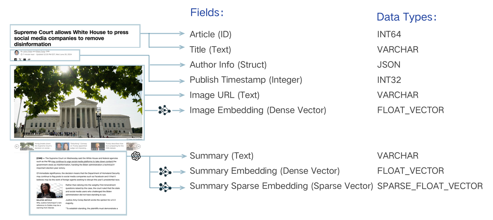

# Schema Design Hands-On​

Information Retrieval (IR) systems, also known as search, are essential for various AI applications such as Retrieval-augmented generation (RAG), image search, and product recommendation. The first step in developing an IR system is designing the data model, which involves analyzing business requirements, determining how to organize information, and indexing data to make it semantically searchable.​

Milvus supports defining the data model through a collection schema. A collection organizes unstructured data like text and images, along with their vector representations, including dense and sparse vectors in various precision used for semantic search. Additionally, Milvus supports storing and filtering non-vector data types called "Scalar". Scalar types include BOOL, INT8/16/32/64, FLOAT/DOUBLE, VARCHAR, JSON, and Array.​



The data model design of a search system involves analyzing business needs and abstracting information into a schema-expressed data model. For instance, to search a piece of text, it must be "indexed" by converting the literal string into a vector through "embedding", enabling vector search. Beyond this basic requirement, it may be necessary to store other properties such as publication timestamp and author. This metadata allows for semantic searches to be refined through filtering, returning only texts published after a specific date or by a particular author. They may also need to be retrieved together with the main text, for rendering the search result in the application. To organize these text pieces, each should be assigned a unique identifier, expressed as an integer or string. These elements are essential for achieving sophisticated search logic.​

A well-designed schema is important as it abstracts the data model and decides if the business objectives can be achieved through search. Furthermore, since every row of data inserted into the collection needs to follow the schema, it greatly helps to maintain data consistency and long-term quality. From a technical perspective, a well-defined schema leads to well-organized column data storage and a cleaner index structure, which can boost search performance.​

# An Example: News Search​

Let's say we want to build search for a news website and we have a corpus of news with text, thumbnail images, and other metadata. First, we need to analyze how we want to utilize the data to support the business requirement of search. Imagine the requirement is to retrieve the news based the thumbnail image and the summary of the content, and taking the metadata such as author info and publishing time as criteria to filter the search result. These requirements can be further broken down into:​

- To search images via text, we can embed images into vectors via multimodal embedding model that can map text and image data into the same latent space.​

- The summary text of an article is embedded into vectors via text embedding model.​

- To filter based on the publish time, the dates are stored as a scalar field and an index is needed for the scalar field for efficient filtering. Other more complex data structures such a JSON can be stored in a scalar and a filtered search performed on their contents (indexing JSON is an upcoming feature).​

- To retrieve the image thumbnail bytes and render it on the search result page, the image url is also stored. Similarly, for the summary text and title. (Alternatively, we could store the raw text and image file data as scalar fields if required.)​

- To improve the search result on the summary text, we design a hybrid search approach. For one retrieval path, we use regular embedding model to generate dense vector from the text, such as OpenAI's `text-embedding-3-large` or the open-source `bge-large-en-v1.5`. These models are good at representing the overall semantic of the text. The other path is to use sparse embedding models such as BM25 or SPLADE to generate a sparse vector, resembling the full-text search which is good at grasping the details and individual concepts in the text. Milvus supports using both in the same data collection thanks to its multi-vector feature. The search on multiple vectors can be done in a single `hybrid_search()` operation.​

- Finally, we also need an ID field to identify each individual news page, formally referred to as an "entity" in Milvus terminology. This field is used as the primary key (or "pk" for short).​

<table data-block-token="EOxnd1GqhoODuWx4UyucOMahn0e"><thead><tr><th data-block-token="P2g0djnY5oRKT7xw7aSceiaQnRb" colspan="1" rowspan="1"><p data-block-token="TrIsdjxzooLqxUxiqkTcfN5pnHd">Field Name​</p>

</th><th data-block-token="KVq4dDr4BovOHSxtWd5cZBnnnn5" colspan="1" rowspan="1"><p data-block-token="D9uYdwp8ToHqXmxqueVcBAi2n6b">article_id (Primary Key)​</p>

</th><th data-block-token="O6jTdN4rBouwtQxFNgpcM7GFnyp" colspan="1" rowspan="1"><p data-block-token="IJuldjRIeoNHRgx0ix5c2eBSn6f">title​</p>

</th><th data-block-token="V4EKdYzLqoENTTxXuOwcVTIGnLg" colspan="1" rowspan="1"><p data-block-token="Tldydg7BboZeSUxiaTfcUnsfnqd">author_info​</p>

</th><th data-block-token="GHF6dqGRVoQ6Kpxv9tUcijFXnVc" colspan="1" rowspan="1"><p data-block-token="Ih0jdg4yToRJOkxyriwcKJ39nVd">publish_ts​</p>

</th><th data-block-token="Ui3ldA2BwovU8LxMHcIcrmVvnLg" colspan="1" rowspan="1"><p data-block-token="PJGJdX1efoo647xvgCDcuhkznye">image_url​</p>

</th><th data-block-token="VCskd6ySvocz8IxF5CVcpmF5n0b" colspan="1" rowspan="1"><p data-block-token="Cx7idKjgYoctpYxsnskc7OD0nxb">image_vector​</p>

</th><th data-block-token="WSbhdTqglocn3KxpvBscFOh2n6d" colspan="1" rowspan="1"><p data-block-token="Q16ods013oZUOQxk9vicK0JGn2e">summary​</p>

</th><th data-block-token="T5HAdXwado1qJpxCpf9cwDjmnhe" colspan="1" rowspan="1"><p data-block-token="ZG3odG5k2oMqFSxM8TFcE8kZnCh">summary_dense_vector​</p>

</th><th data-block-token="MWAHdYgIvogpIfxsRnscz5WWnOe" colspan="1" rowspan="1"><p data-block-token="MeU1dGziaodmTkxc5q9cvYR9ndd">summary_sparse_vector​</p>

</th></tr></thead><tbody><tr><td data-block-token="V1x7d7y15oxxNSxpvRJcoW7VnWh" colspan="1" rowspan="1"><p data-block-token="X9old4LgooPgrexElIBc2JgNnac">Type​</p>

</td><td data-block-token="EWlPdiRtBoqrOYxLoWDcnPUQn3f" colspan="1" rowspan="1"><p data-block-token="TtABd1mq0o2ShTxtXfncI8i9n8g">INT64​</p>

</td><td data-block-token="ZICad5qEYohcTvxo477cZIWInCh" colspan="1" rowspan="1"><p data-block-token="CBHWdVhLKo2wn1xR3Pocf43NnRs">VARCHAR​</p>

</td><td data-block-token="VTwJdpuQboqurJxXbQUctG8fnNc" colspan="1" rowspan="1"><p data-block-token="OI1ldgzbAoEIOUx7boRcooR0nvb">JSON​</p>

</td><td data-block-token="UVWKdd69Mo8hyyxOqLLcZn7kncc" colspan="1" rowspan="1"><p data-block-token="QJUZdxgzEora0PxAxf8c1axknbp">INT32​</p>

</td><td data-block-token="Wf8AdfYj1on0OkxjHkocPiqInYe" colspan="1" rowspan="1"><p data-block-token="KE0QdVg3doF05Exq3fmccqOcnvc">VARCHAR​</p>

</td><td data-block-token="JVHgd9P9aoSl9mxqoFfcM7ownXz" colspan="1" rowspan="1"><p data-block-token="TwotdcMshoE2TSxGIauclTZjnLh">FLOAT_VECTOR​</p>

</td><td data-block-token="MUwwdyV4co3V2QxOxc1cMuD9nbc" colspan="1" rowspan="1"><p data-block-token="RpfxdP0AHoW0xhx8sfBclJvtnyc">VARCHAR​</p>

</td><td data-block-token="P4bqdeIGOoV67FxhYmtclfBpn1d" colspan="1" rowspan="1"><p data-block-token="RyztdWGXzoP4IBxHd8Pcu0q2nbe">FLOAT_VECTOR​</p>

</td><td data-block-token="AtJldXTWUoT5FPxY6EncUqWsnrc" colspan="1" rowspan="1"><p data-block-token="FJMJdqKeFodc73xGlnpcYgJanWg">SPARSE_FLOAT_VECTOR​</p>

</td></tr><tr><td data-block-token="ZAKYdJAv6oj5IxxYUaUcLFOEnkh" colspan="1" rowspan="1"><p data-block-token="Frr0dWnzWo5UFDxLfqaceqvSnmg">Need Index​</p>

</td><td data-block-token="ONHadATa9ojiwAxEwUdcaJpOnbb" colspan="1" rowspan="1"><p data-block-token="ZGT8dgMGbo8r22xpFztcycKDn9c">N​</p>

</td><td data-block-token="E3Hod6CkXozMt4x0xF6cPkdin4e" colspan="1" rowspan="1"><p data-block-token="Ha0PdI0byocer9xXJGac8QYdnPg">N​</p>

</td><td data-block-token="NaJ5dcptooRPe8xk9VTcx6Amnld" colspan="1" rowspan="1"><p data-block-token="U57edD6zqoPY7LxQjPDcnNDVnxc">N (Support coming soon)​</p>

</td><td data-block-token="MqejdtkWboMHmZxWWCAcK7X0n1e" colspan="1" rowspan="1"><p data-block-token="NeNJdcEvloQ4E7xN9JeczCORnQX">Y​</p>

</td><td data-block-token="VKy3driI9owHhCx1l4Iczj8Hnkb" colspan="1" rowspan="1"><p data-block-token="QRWQdK0J3oWYc0x8xT6c4Me5nXb">N​</p>

</td><td data-block-token="EZR0dRNXpotMtdxAKG9cHj8zn2c" colspan="1" rowspan="1"><p data-block-token="LTyRduM2FoGmkVxa1HgceBFbnKf">Y​</p>

</td><td data-block-token="W3MydyW7bod6UaxdNURcqTnBnFb" colspan="1" rowspan="1"><p data-block-token="EwbCdu2ZZop4zJxbyhZcR2HunUh">N​</p>

</td><td data-block-token="XQdvd35mVov5cUxstzpcipmlni8" colspan="1" rowspan="1"><p data-block-token="SJoudzWmiouT20xXCCpcQR1Mnsz">Y​</p>

</td><td data-block-token="MXntdRmaUo91QoxGeNgc9goanee" colspan="1" rowspan="1"><p data-block-token="Sxfzdk7VoocU6kxAV63cI3ObnTe">Y​</p>

</td></tr></tbody></table>

# How to Implement the Example Schema​

## Create Schema​

First, we create a Milvus client instance, which can be used to connect to the Milvus server and manage collections and data. ​

To set up a schema, we use [`create_schema()`](https://milvus.io/api-reference/pymilvus/v2.4.x/MilvusClient/Collections/create_schema.md) to create a schema object and [`add_field()`](https://milvus.io/api-reference/pymilvus/v2.4.x/MilvusClient/CollectionSchema/add_field.md) to add fields to the schema.​

```python
from pymilvus import MilvusClient, DataType​
​
collection_name = "my_collection"​
​
# client = MilvusClient(uri="http://localhost:19530")​
client = MilvusClient(uri="./milvus_demo.db")​
​
schema = MilvusClient.create_schema(​
    auto_id=False,​
)​
​
schema.add_field(field_name="article_id", datatype=DataType.INT64, is_primary=True, description="article id")​
schema.add_field(field_name="title", datatype=DataType.VARCHAR, max_length=200, description="article title")​
schema.add_field(field_name="author_info", datatype=DataType.JSON, description="author information")​
schema.add_field(field_name="publish_ts", datatype=DataType.INT32, description="publish timestamp")​
schema.add_field(field_name="image_url", datatype=DataType.VARCHAR,  max_length=500, description="image URL")​
schema.add_field(field_name="image_vector", datatype=DataType.FLOAT_VECTOR, dim=768, description="image vector")​
schema.add_field(field_name="summary", datatype=DataType.VARCHAR, max_length=1000, description="article summary")​
schema.add_field(field_name="summary_dense_vector", datatype=DataType.FLOAT_VECTOR, dim=768, description="summary dense vector")​
schema.add_field(field_name="summary_sparse_vector", datatype=DataType.SPARSE_FLOAT_VECTOR, description="summary sparse vector")​

```

You might notice the argument `uri` in `MilvusClient`, which is used to connect to the Milvus server. You can set the arguments as follows:​

- If you only need a local vector database for small scale data or prototypeing, setting the uri as a local file, e.g.``./milvus.db``, is the most convenient method, as it automatically utilizes [Milvus Lite](https://milvus.io/docs/milvus_lite.md) to store all data in this file.​

- If you have large scale of data, say more than a million vectors, you can set up a more performant Milvus server on [Docker or Kubernetes](https://milvus.io/docs/quickstart.md). In this setup, please use the server address and port as your uri, e.g.``http://localhost:19530``. If you enable the authentication feature on Milvus, use "<your_username>:<your_password>" as the token, otherwise don't set the token.​

- If you use [Zilliz Cloud](https://zilliz.com/cloud), the fully managed cloud service for Milvus, adjust the ``uri`` and ``token``, which correspond to the [Public Endpoint and API key](https://docs.zilliz.com/docs/on-zilliz-cloud-console#free-cluster-details) in Zilliz Cloud.​

As for the `auto_id` in `MilvusClient.create_schema`, AutoID is an attribute of the primary field that determines whether to enable auto increment for the primary field.  Since we set the field`article_id` as the primary key and want to add article id manually, we set `auto_id` False to disable this feature.​

After adding all the fields to the schema object, our schema object agrees with the entries in the table above.​

## Define Index​

After defining the schema with various fields, including metadata and vector fields for image and summary data, the next step involves preparing the index parameters. Indexing is crucial for optimizing the search and retrieval of vectors, ensuring efficient query performance. In the following section, we will define the index parameters for the specified vector and scalar fields in the collection.​

```python
index_params = client.prepare_index_params()​
​
index_params.add_index(​
    field_name="image_vector",​
    index_type="AUTOINDEX",​
    metric_type="IP",​
)​
index_params.add_index(​
    field_name="summary_dense_vector",​
    index_type="AUTOINDEX",​
    metric_type="IP",​
)​
index_params.add_index(​
    field_name="summary_sparse_vector",​
    index_type="SPARSE_INVERTED_INDEX",​
    metric_type="IP",​
)​
index_params.add_index(​
    field_name="publish_ts",​
    index_type="INVERTED",​
)​

```

Once the index parameters are set up and applied, Milvus is optimized for handling complex queries on vector and scalar data. This indexing enhances the performance and accuracy of similarity searches within the collection, allowing for efficient retrieval of articles based on image vectors and summary vectors. By leveraging the [`AUTOINDEX`](https://milvus.io/docs/glossary.md#Auto-Index) for dense vectors, the [`SPARSE_INVERTED_INDEX`](https://milvus.io/docs/sparse_vector.md#Index-the-collection) for sparse vectors and the [`INVERTED_INDEX`](https://milvus.io/docs/scalar_index.md#Inverted-indexing) for scalars, Milvus can quickly identify and return the most relevant results, significantly improving the overall user experience and effectiveness of the data retrieval process.​

There are many types of indices and metrics. For more information about them, you can refer to [Milvus index type](https://milvus.io/docs/overview.md#Index-types) and [Milvus metric type](https://milvus.io/docs/glossary.md#Metric-type).​

## Create Collection​

With the schema and indexes defined, we create a "collection" with these parameters. Collection to Milvus is like a table to a relational DB.​

```python
client.create_collection(​
    collection_name=collection_name,​
    schema=schema,​
    index_params=index_params,​
)​

```

We can verify that the collection has been successfully created by describing the collection.​

```python
collection_desc = client.describe_collection(​
    collection_name=collection_name​
)​
print(collection_desc)​

```

# Other Considerations​

## Loading Index​

When creating a collection in Milvus, you can choose to load the index immediately or defer it until after bulk ingesting some data. Typically, you don't need to make an explicit choice about this, as the above examples show that the index is automatically built for any ingested data right after collection creation. This allows for immediate searchability of the ingested data. However, if you have a large bulk insert after collection creation and don't need to search for any data until a certain point, you can defer the index building by omitting index_params in the collection creation and build the index by calling load explicitly after ingesting all the data. This method is more efficient for building the index on a large collection, but no searches can be done until calling load().​

## How to Define Data Model For Multi-tenancy​

The concept of multiple tenants is commonly used in scenarios where a single software application or service needs to serve multiple independent users or organizations, each with their own isolated environment. This is frequently seen in cloud computing, SaaS (Software as a Service) applications, and database systems. For example, a cloud storage service may utilize multi-tenancy to allow different companies to store and manage their data separately while sharing the same underlying infrastructure. This approach maximizes resource utilization and efficiency while ensuring data security and privacy for each tenant.​

The easiest way to differentiate tenants is by isolating their data and resources from each other. Each tenant either has exclusive access to specific resources or shares resources with others to manage Milvus entities such as databases, collections, and partitions. There are specific methods aligned with these entities to implement Milvus multi-tenancy. You can refer to the [Milvus multi-tenancy page](https://milvus.io/docs/multi_tenancy.md#Multi-tenancy-strategies) for more information.​

