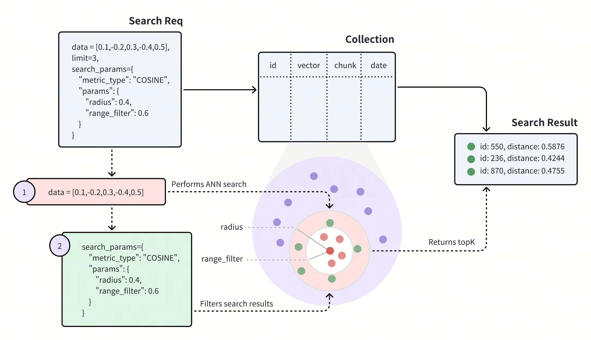

# Range Search​

A range search improves search result relevancy by restricting the distance or score of the returned entities within a specific range. This page helps you understand what range search is and the procedures to conduct a range search.​

## Overview​

When executing a Range Search request, Milvus uses the most similar vectors to the query vector from the ANN Search results as the center, with the radius specified in the Search request as the outer circle's radius, and the **range_filter** as the inner circle's radius to draw two concentric circles. All vectors with similarity scores that fall within the annular region formed by these two concentric circles will be returned. Here, the **range_filter** can be set to **0**, indicating that all entities within the specified similarity score (radius) will be returned.​



The above diagram shows that a range search request carries two parameters: radius and **range_filter**. Upon receiving a range search request, Milvus does the following:​

- Use the specified metric type (**COSINE**) to find all vector embeddings most similar to the query vector.​

- Filter the vector embeddings whose **distances** or **scores** to the query vector fall within the range specified by the **radius** and **range_filter** parameters.​

- Return the **top-K** entities from the filtered ones.​

The way to set radius and **range_filter** varies with the metric type of the search. The following table lists the requirements for setting these two parameters with different metric types.​

<table data-block-token="QZ8mdLSnAotxZKxSzvpcQkNNnhe"><thead><tr><th data-block-token="SpBZdGprzoEoaixW6EfcaIFqnDh" colspan="1" rowspan="1"><p data-block-token="FwxDd8logofNV2xVMdycwXUvnMg">Metric Type​</p>

</th><th data-block-token="NwWNdOvpHoOQF0xDvuHcFcHQnte" colspan="1" rowspan="1"><p data-block-token="MiqddcN2voEZUSxe8hCcW3g0nXc">Denotations​</p>

</th><th data-block-token="D1eedZmCjow2Whx7vIicOx4Enrc" colspan="1" rowspan="1"><p data-block-token="K7bldgyVFo2DmDxNamFcNddNnNb">Requirements for Setting radius and range_filter​</p>

</th></tr></thead><tbody><tr><td data-block-token="C3xxdZ0uHon6bWxACXkcOM0bnrf" colspan="1" rowspan="1"><p data-block-token="EoJSd1jo1oqt0pxhKElcLptwnJe"><code>L2</code>​</p>

</td><td data-block-token="AcRkdW156oOcQixJbXZchC8WnEd" colspan="1" rowspan="1"><p data-block-token="ATGrduoF1ownRSxJngycJ3NYnAe">A smaller L2 distance indicates a higher similarity.​</p>

</td><td data-block-token="Ja1hdVXtholWNfxCGKAcXzQ9nCc" colspan="1" rowspan="1"><p data-block-token="FqvMdDe6DocjQXxKHdvcp0hTnmb">To ignore the most similar vector embeddings, ensure that​</p>

<p data-block-token="Ctzxdq1bjoIqKOx5WOScosN3nUf"><code>range_filter</code> <= distance < <code>radius</code>​</p>

</td></tr><tr><td data-block-token="UIkGdxueEo9hNox7TMFcUTTUn6d" colspan="1" rowspan="1"><p data-block-token="IpGVd1lBrojv3uxxcv1c5ZcZnBh"><code>IP</code>​</p>

</td><td data-block-token="VcGrdY9X5o2I8Zxv1EYcgSiwngc" colspan="1" rowspan="1"><p data-block-token="WQs5dm4BrotLVhxSRpecH6wInUc">A greater IP distance indicates a higher similarity.​</p>

</td><td data-block-token="DETWdE7fWo21TzxH2FxcRoQZnwd" colspan="1" rowspan="1"><p data-block-token="Wy8jdWzhsoZUJhx98jLcNIKjnSb">To ignore the most similar vector embeddings, ensure that​</p>

<p data-block-token="TqYLdOaBzoVv2ZxXlwkc2UHln0d"><code>radius</code> < distance <= <code>range_filter</code>​</p>

</td></tr><tr><td data-block-token="NVeUd1byionhILxsXLRcTx32nbc" colspan="1" rowspan="1"><p data-block-token="ZvAcdO3b4oYibFxohwqcEIObnoh"><code>COSINE</code>​</p>

</td><td data-block-token="IdUKdAUIdoNllqxLiKncqQE0nbc" colspan="1" rowspan="1"><p data-block-token="UBiudQZVbopMjcx9mg6cSLQpnVh">A greater COSINE distance indicates a higher similarity.​</p>

</td><td data-block-token="JHc5dyljBogsOKxsPSfcb9qrnHh" colspan="1" rowspan="1"><p data-block-token="CLWEd89pQoUTeZxYOJFczlu2nwh">To ignore the most similar vector embeddings, ensure that​</p>

<p data-block-token="Zx9TdYxu5ouObNxhZjvcS95wnMd"><code>radius</code> < distance <= <code>range_filter</code>​</p>

</td></tr><tr><td data-block-token="WsI8dAHxxobNtBxkYCmcFFtFn4c" colspan="1" rowspan="1"><p data-block-token="XvsMdyuLEoLR2wx0KdXcUmOcnlf"><code>JACCARD</code> ​</p>

</td><td data-block-token="YC1MdSNIwoYPg2xUXAZcL74AnZd" colspan="1" rowspan="1"><p data-block-token="JaCGdLjCKonfQsxe5pecj5uQn7g">A smaller Jaccard distance indicates a higher similarity.​</p>

<p data-block-token="QAFVdSmNEonNSxxb65Xc4zAYnYc">​</p>

</td><td data-block-token="JOfSdPDQmopx3exh68zctrUCnJc" colspan="1" rowspan="1"><p data-block-token="YoZzdQw3CoUKcfx60roc0DuKnze">To ignore the most similar vector embeddings, ensure that​</p>

<p data-block-token="AURId9AadouFaLxI8esczMpgnrf"><code>range_filter</code> <= distance < <code>radius</code>​</p>

</td></tr><tr><td data-block-token="BVuOdQPiKoJBYoxwBgQcqugqnmh" colspan="1" rowspan="1"><p data-block-token="R96ldn7iHoUj2Gxrf65c2TmAnmf"><code>HAMMING</code> ​</p>

</td><td data-block-token="OnAOdCFC8oyQwrx4XTRcMik1nbg" colspan="1" rowspan="1"><p data-block-token="LDT4dk5ygoAFKtxF12WctkFRnfb">A smaller Hamming distance indicates a higher similarity.​</p>

</td><td data-block-token="VBaIdrQOOokaBvxlegWcTKDvnkc" colspan="1" rowspan="1"><p data-block-token="Z2ridFRhBoS64vxBiTrcfOagnIh">To ignore the most similar vector embeddings, ensure that​</p>

<p data-block-token="UOf2do2U8oGdDNxMzqlcYdMVnie"><code>range_filter</code> <= distance < <code>radius</code>​</p>

</td></tr></tbody></table>

## Examples​

This section demonstrates how to conduct a range search. The search requests in the following code snippets do not carry a metric type, indicating the default metric type **COSINE** applies. In this case, ensure that the radius value is smaller than the **range_filter** value.​

In the following code snippets, set `radius` to `0.4` and `range_filter` to `0.6` so that Milvus returns all entities whose distances or scores to the query vector fall within **0.4** to **0.6**.​

<div class="multipleCode">
    <a href="#python">Python </a>
    <a href="#java">Java</a>
    <a href="#javascript">Node.js</a>
    <a href="#curl">cURL</a>
</div>

```python
from pymilvus import MilvusClient​
​
client = MilvusClient(​
    uri="http://localhost:19530",​
    token="root:Milvus"​
)​
​
query_vector = [0.3580376395471989, -0.6023495712049978, 0.18414012509913835, -0.26286205330961354, 0.9029438446296592]​
​
res = client.search(​
    collection_name="my_collection",​
    data=[query_vector],​
    limit=3,​
    search_params={​
        # highlight-start​
        "params": {​
            "radius": 0.4,​
            "range_filter": 0.6​
        }​
        # highlight-end​
    }​
)​
​
for hits in res:​
    print("TopK results:")​
    for hit in hits:​
        print(hit)​

```

```java
import io.milvus.v2.client.ConnectConfig;​
import io.milvus.v2.client.MilvusClientV2;​
 io.milvus.v2.service.vector.request.SearchReq​
import io.milvus.v2.service.vector.request.data.FloatVec;​
import io.milvus.v2.service.vector.response.SearchResp​
​
​
MilvusClientV2 client = new MilvusClientV2(ConnectConfig.builder()​
        .uri("http://localhost:19530")​
        .token("root:Milvus")​
        .build());​
​
FloatVec queryVector = new FloatVec(new float[]{0.3580376395471989f, -0.6023495712049978f, 0.18414012509913835f, -0.26286205330961354f, 0.9029438446296592f});​
Map<String,Object> extraParams = new HashMap<>();​
extraParams.put("radius", 0.4);​
extraParams.put("range_filter", 0.6);​
SearchReq searchReq = SearchReq.builder()​
        .collectionName("range_search_collection")​
        .data(Collections.singletonList(queryVector))​
        .topK(5)​
        .searchParams(extraParams)​
        .build();​
​
SearchResp searchResp = client.search(searchReq);​
​
List<List<SearchResp.SearchResult>> searchResults = searchResp.getSearchResults();​
for (List<SearchResp.SearchResult> results : searchResults) {​
    System.out.println("TopK results:");​
    for (SearchResp.SearchResult result : results) {​
        System.out.println(result);​
    }​
}​
​
// Output​
// TopK results:​
// SearchResp.SearchResult(entity={}, score=0.5975797, id=4)​
// SearchResp.SearchResult(entity={}, score=0.46704385, id=5)​

```

```go
// TODO ​

```

```javascript
import { MilvusClient, DataType } from "@zilliz/milvus2-sdk-node";​
​
const address = "http://localhost:19530";​
const token = "root:Milvus";​
const client = new MilvusClient({address, token});​
​
var query_vector = [0.3580376395471989, -0.6023495712049978, 0.18414012509913835, -0.26286205330961354, 0.9029438446296592]​
​
res = await client.search({​
    collection_name: "range_search_collection",​
    data: [query_vector],​
    limit: 5,​
    // highlight-start​
    params: {​
        "radius": 0.4,​
        "range_filter": 0.6​
    }​
    // highlight-end​
})​

```

```curl
export CLUSTER_ENDPOINT="http://localhost:19530"​
export TOKEN="root:Milvus"​
​
curl --request POST \​
--url "${CLUSTER_ENDPOINT}/v2/vectordb/entities/search" \​
--header "Authorization: Bearer ${TOKEN}" \​
--header "Content-Type: application/json" \​
-d '{​
    "collectionName": "quick_setup",​
    "data": [​
        [0.3580376395471989, -0.6023495712049978, 0.18414012509913835, -0.26286205330961354, 0.9029438446296592]​
    ],​
    "annsField": "vector",​
    "filter": "color like \"red%\" and likes > 50",​
    "limit": 3,​
    "searchParams": {​
        "params": {​
            "radius": 0.4,​
            "range_filter": 0.6​
        }​
    }​
}'​
# {"code":0,"cost":0,"data":[]}​

```

</TabItem></Tabs>