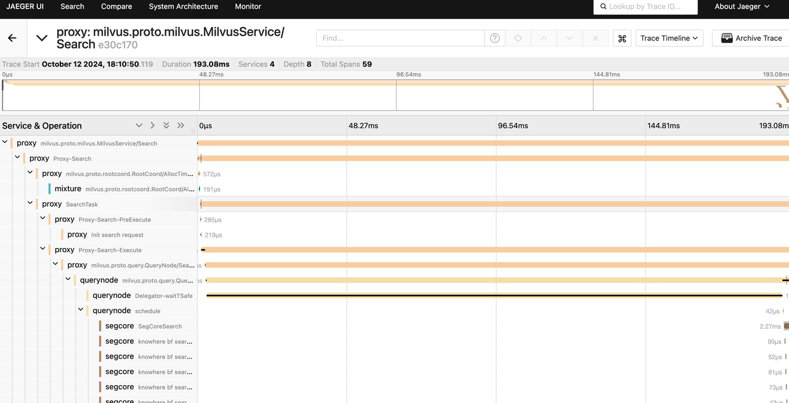
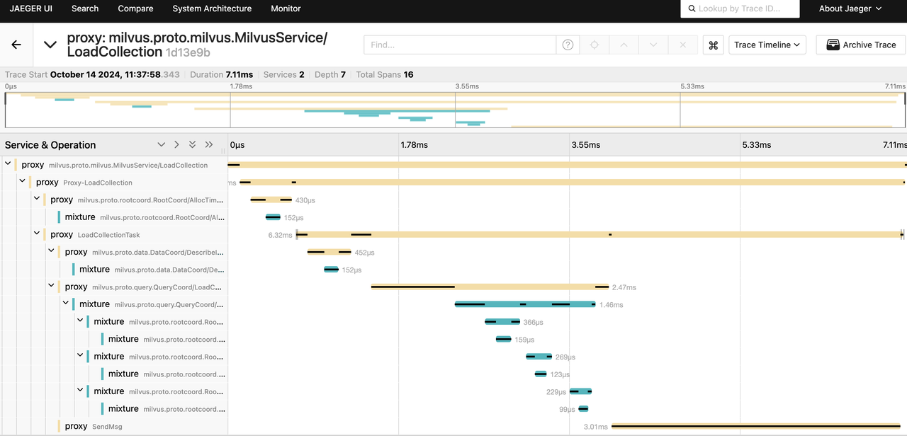

# Configure Trace

This guide provides instructions on how to configure Jaeger to collect traces for Milvus.

## Prerequisites

- You have installed necessary tools, including [Helm](https://helm.sh/docs/intro/install/) and [Kubectl](https://kubernetes.io/docs/tasks/tools/).
- Cert-manager version 1.6.1 or higher must be installed. An installation guide can be found [here](https://cert-manager.io/v1.6-docs/installation/#default-static-install).

## Deply Jaeger

Jaeger is a distributed tracing platform released as open source by [Uber Technologies](http://uber.github.io/).

### 1. Installing the Jaeger Operator on Kubernetes

To install the operator, run:

```shell
$ kubectl create namespace observability
$ kubectl create -f https://github.com/jaegertracing/jaeger-operator/releases/download/v1.62.0/jaeger-operator.yaml -n observability
```

At this point, there should be a `jaeger-operator` deployment available. You can view it by running the following command:

```shell
$ kubectl get deployment jaeger-operator -n observability

NAME              DESIRED   CURRENT   UP-TO-DATE   AVAILABLE   AGE
jaeger-operator   1         1         1            1           48s
```

### 2. Deploy Jaeger

The simplest possible way to create a Jaeger instance is by creating a YAML file like the following example. This will install the default AllInOne strategy, which deploys the **all-in-one** image (combining **jaeger-agent**, **jaeger-collector**, **jaeger-query**, and Jaeger UI) in a single pod, using **in-memory storage** by default.

If you want to store traces for a long time, please refer to [production-strategy](https://www.jaegertracing.io/docs/1.62/operator/#production-strategy).

```yaml
apiVersion: jaegertracing.io/v1
kind: Jaeger
metadata:
  name: jaeger
```

The YAML file can then be used with `kubectl`:

```shell
$ kubectl apply -f simplest.yaml
```

In a few seconds, a new in-memory all-in-one instance of Jaeger will be available, suitable for quick demos and development purposes. To check the instances that were created, list the jaeger objects:

```shell
$ kubectl get jaegers

NAME     STATUS    VERSION   STRATEGY   STORAGE   AGE
jaeger   Running   1.62.0    allinone   memory    13s
```

## Install Milvus with Helm Chart

You can install or upgrade Milvus with Helm Chart with the following settings:

```yaml
extraConfigFiles:
  user.yaml: |+
    trace:
      exporter: jaeger
      sampleFraction: 1
      jaeger:
        url: "http://jaeger-collector:14268/api/traces"
```

To apply the above settings to a new Milvus deployment , you can run the following command:

```shell
$ helm repo add zilliztech https://zilliztech.github.io/milvus-helm
$ helm repo update
$ helm upgrade --install -f values.yaml my-release milvus/milvus
```

To apply the above settings to an existing Milvus deployment, you can run the following command:

```shell
$ helm upgrade my-release -f values.yaml milvus/milvus
```

## View Traces

Once you have deployed Jaeger and Milvus with Helm Chart, an ingress has been enabled by dfault. You can view the ingress by running the following command:

```shell
$ kubectl get ingress

NAME           CLASS    HOSTS   ADDRESS         PORTS   AGE
jaeger-query   <none>   *       192.168.122.34  80      14m
```

Once the ingress is available, you can access the Jaeger UI by navigating to `http://${ADDRESS}`. Replace `${ADDRESS}` with the actual IP address of the ingress. 

The following screenshot shows the Jaeger UI with the traces of Milvus during a search operation and a load-collection operation:





