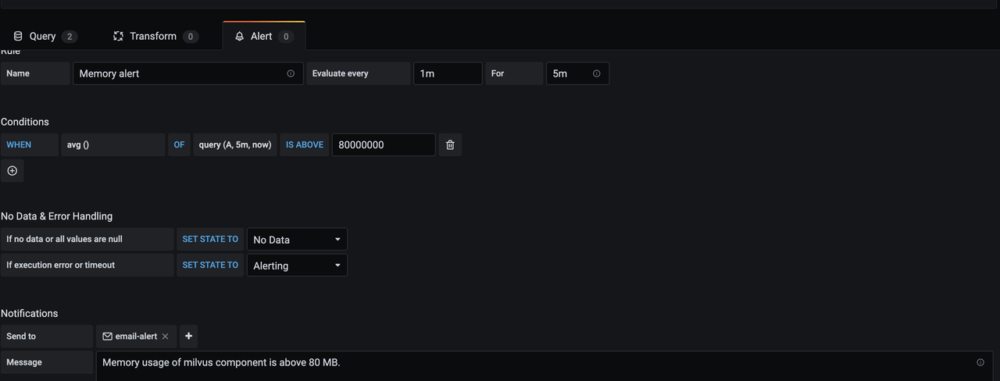
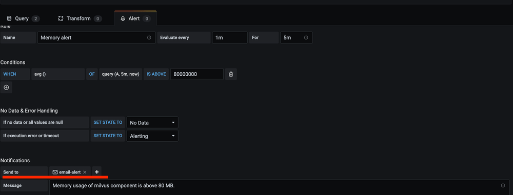
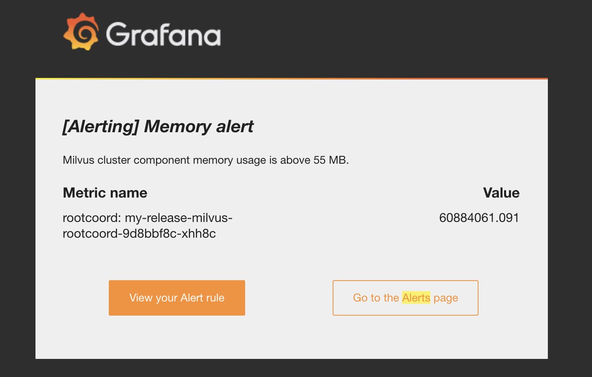
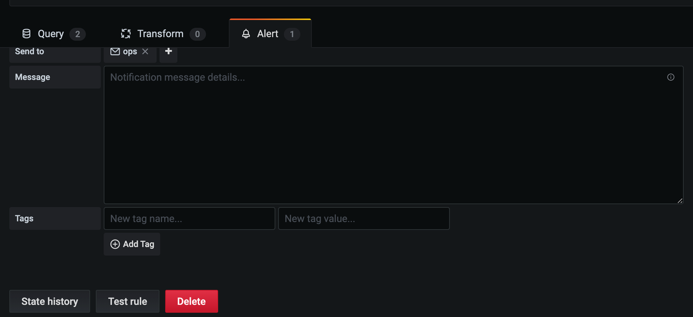

# Create an Alert for Milvus Services

This topic introduces the alert mechanism for Milvus services and explains why, when, and how to create alerts in Milvus.

By creating alerts, you can receive notifications when the value of a specific metric exceeds the threshold you have predefined. 

For example, you create an alert and set 80 MB as the maximum value for memory usage by Milvus components. If the actual usage exceeds the predefined number, you will receive alerts reminding you that the memory usage by Milvus component surpasses 80 MB. Upon the alert, you can then adjust the allocation of resources accordingly and timely to ensure service availability.

## Scenarios for creating alerts

Below are some common scenarios where you need to create an alert for.

- CPU or memory usage by Milvus components is too high.
- Milvus component pods are running low on disk space.
- Milvus component pods are restarting too frequently.

The following metrics are available for alerting configuration:

| Metric   | Description  | Unit of measure  |
| --------  | --------- | -------------- |
| CPU Usage   | CPU usage by Milvus components that is indicated by the running time of CPU.  | Second    |
| Memory      | Memory resources consumed by Milvus components.  | MB    |
| Goroutines   | Concurrent executing activities in GO language.  |  /   |
| OS Threads   | Threads, or lightweight processes in an operating system.  |   / |
| Process Opened Fds   | The current number of used file descriptors.  | /    |

## Set up alerts
This guide takes the example of creating an alert for the memory usage of Milvus components. To create other types of alerts, please adjust your commands accordingly. If you encounter any problems during the process, feel free to ask in the [Milvus forum](https://discuss.milvus.io/) or initiate a discussion on [Slack](https://join.slack.com/t/milvusio/shared_invite/zt-e0u4qu3k-bI2GDNys3ZqX1YCJ9OM~GQ).

### Prerequisites
This tutorial assumes that you have Grafana installed and configured. If not, we recommend reading the [monitoring guide](monitor.md). 

### 1. Add a new query
To add an alert for the memory usage of Milvus components, edit the Memory panel. Then, add a new query with the metric: `process_resident_memory_bytes{app_kubernetes_io_name="milvus", app_kubernetes_io_instance=~"my-release", namespace="default"}`

### 2. Save the dashboard
Save the dashboard, and wait for a few minutes to see the alert.

Grafana alert query does not support template variables. Therefore, you should add a second query without any template variables in the labels. The second query is named as "A" by default. You can rename it by clicking on the dropdown.

### 3. Add alert notifications
To receive alert notifications, add a "notification channel". Then, specify the channel in the field "Send to".

If the alert is successfully created and triggered, you will receive the notification as shown in the screenshot below.

To delete an alert, go to the "Alert" panel and click the delete button.

## What's next

- If you need to start monitoring services for Milvus:
  - Read the [monitoring guide](monitor.md)
  - Learn how to [visualize monitoring metrics](visualize.md)
- If you have created alerts for memory usage by Milvus components:
  - Learn how to [allocate resources](allocate.md#standalone)
- If you are looking for information about how to scale a Milvus cluster:
  - Learn [scale a Milvus cluster](scaleout.md)

