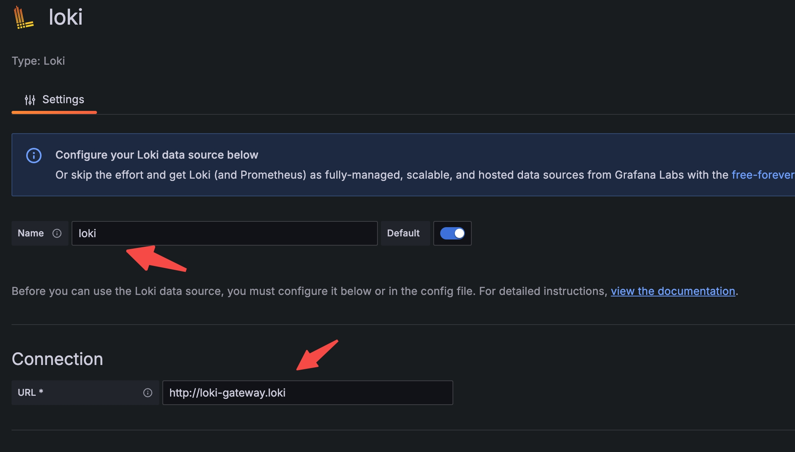

# Configure Grafana Loki

This guide provides instructions on how to configure Loki to collect logs and Grafana to query and display logs for a Milvus cluster.

In this guide, you will learn how to:

- Deploy [Loki](https://grafana.com/docs/loki/latest/get-started/overview/) and [Promtail](https://grafana.com/docs/loki/latest/send-data/promtail/) on a Milvus cluster using Helm.
- Configure object storage for Loki.
- Query logs using Grafana.

## Prerequisites

- You have [installed a Milvus cluster on K8s](install_cluster-helm.md).
- You have installed necessary tools, including [Helm](https://helm.sh/docs/intro/install/) and [Kubectl](https://kubernetes.io/docs/tasks/tools/).

## Deploy Loki

Loki is a log aggregation system inspired by Prometheus. Deploy Loki using Helm to collect logs from your Milvus cluster.

### 1. Add Grafana's Helm Chart Repository

Add Grafana’s chart repository to Helm and update it:

```
helm repo add grafana https://grafana.github.io/helm-charts
helm repo update
```

### 2. Configure Object Storage for Loki

Choose one of the following storage options and create a `loki.yaml` configuration file:

- Option 1: Using MinIO for storage

  ```yaml
  loki:
    commonConfig:
      replication_factor: 1
    auth_enabled: false

  minio:
    enabled: true
  ```

- Option 2: Using AWS S3 for storage

  In the following example, replace `<accessKey>` and `<keyId>` with your own S3 access key and ID, `s3.endpoint` with the S3 endpoint, and `s3.region` with the S3 region.

  ```yaml
  loki:
    commonConfig:
      replication_factor: 1
    auth_enabled: false
    storage:
      bucketNames:
        chunks: loki-chunks
        ruler: loki-ruler
        admin: loki-admin
      type: 's3'
      s3:
        endpoint: s3.us-west-2.amazonaws.com
        region: us-west-2
        secretAccessKey: <accessKey>
        accessKeyId: <keyId>
  ```

### 3. Install Loki

Run the following commands to install Loki:

```shell
kubectl create ns loki
helm install --values loki.yaml loki grafana/loki -n loki
```

## Deploy Promtail

Promtail is a log collection agent for Loki. It reads logs from Milvus pods and sends them to Loki.

### 1. Create Promtail Configuration

Create a `promtail.yaml` configuration file:

```yaml
config:
  clients:
    - url: http://loki-gateway/loki/api/v1/push
```

### 2. Install Promtail

Install Promtail using Helm:

```shell
helm install  --values promtail.yaml promtail grafana/promtail -n loki
```

## Query Logs with Grafana

Deploy Grafana and configure it to connect to Loki for querying logs.

### 1. Deploy Grafana

Install Grafana using the following commands:

```shell
kubectl create ns monitoring
helm install my-grafana grafana/grafana --namespace monitoring
```

Before you can access Grafana, you need to retrieve the `admin` password:

```shell
kubectl get secret --namespace monitoring my-grafana -o jsonpath="{.data.admin-password}" | base64 --decode ; echo
```

Then, forward the Grafana port to your local machine:

```shell
export POD_NAME=$(kubectl get pods --namespace monitoring -l "app.kubernetes.io/name=grafana,app.kubernetes.io/instance=my-grafana" -o jsonpath="{.items[0].metadata.name}")
kubectl --namespace monitoring port-forward $POD_NAME 3000
```

### 2. Add Loki as a Data Source in Grafana

Once Grafana is running, you need to add Loki as a data source to query logs.

1. Open a web browser and navigate to `127.0.0.1:3000`. Log in using the username `admin` and the password obtained earlier.
2. In the left-side menu, choose __Connections__ > __Add new connection__.
3. On the page that appears, choose __Loki__ as the data source type. You can enter __loki__ in the search bar to find the data source.
4. In the Loki data source settings, specify the __Name__ and __URL__, and then click __Save & test__.



### 3. Query Milvus Logs

After adding Loki as a data source, query Milvus logs in Grafana:

1. In the left-side menu, click __Explore__.
2. In the upper-left corner of the page, choose the loki data source.
3. Use __Label browser__ to select labels and query logs.


