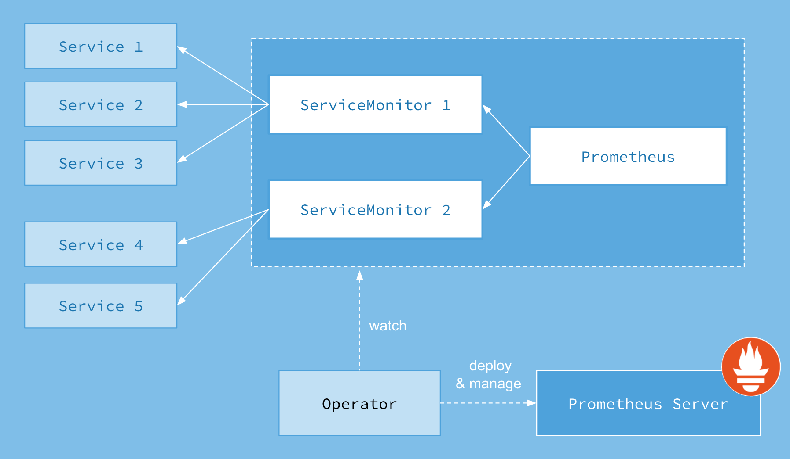

# Deploying Monitoring Services on Kubernetes

This topic describes how to use Prometheus to deploy monitoring services for a Milvus cluster on Kubernetes.

## Monitor metrics with Prometheus
Metrics are indicators providing information about the running status of your system. For example, with metrics, you can understand how much memory or CPU resources are consumed by a data node in Milvus. Being aware of the performance and status of the components in your Milvus cluster makes you well-informed and hence making better decisions and adjusting resource allocation in a more timely manner.

Generally, metrics are stored in a time series database (TSDB), like [Prometheus](https://prometheus.io/), and the metrics are recorded with a timestamp. In the case of monitoring Milvus services, you can use Prometheus to pull data from endpoints set by exporters. Prometheus then exports metrics of each Milvus component at `http://<component-host>:9091/metrics`. 

However, you might have several replicas for one component, which makes manual configuration of Prometheus too complicated. Therefore, you can use [Prometheus Operator](https://github.com/prometheus-operator/prometheus-operator), an extension to Kubernetes, for automated and effective management of Prometheus monitoring instances. Using Prometheus Operator saves you the trouble of manually adding metric targets and service providers.

The ServiceMonitor Custom Resource Definition (CRD) enables you to declaratively define how a dynamic set of services are monitored. It also allows selecting which services to monitor with the desired configuration using label selections. With Prometheus Operator, you can introduce conventions specifying how metrics are exposed. New services can be automatically discovered following the convention you set without the need for manual reconfiguration.

The following image illustrates Prometheus workflow.



## Prerequisites

This tutorial uses [kube-prometheus](https://github.com/prometheus-operator/kube-prometheus) to save you the trouble of installing and manually configuring each monitoring and alerting component.

Kube-prometheus collects Kubernetes manifests, [Grafana](http://grafana.com/) dashboards, and [Prometheus rules](https://prometheus.io/docs/prometheus/latest/configuration/recording_rules/) combined with documentation and scripts.

Before deploying monitoring services, you need to create a monitoring stack by using the configuration in the kube-prometheus manifests directory.

```
$ git clone https://github.com/prometheus-operator/kube-prometheus.git
$ cd kube-prometheus
$ kubectl apply --server-side -f manifests/setup
$ kubectl wait \
        --for condition=Established \
        --all CustomResourceDefinition \
        --namespace=monitoring
$ kubectl apply -f manifests/
```

<div class="alert note">
The default prometheus-k8s clusterrole can not capture milvus' metrics, need to patch:
</div>

```bash
kubectl patch clusterrole prometheus-k8s --type=json -p='[{"op": "add", "path": "/rules/-", "value": {"apiGroups": [""], "resources": ["pods", "services", "endpoints"], "verbs": ["get", "watch", "list"]}}]'
```

To delete a stack, run `kubectl delete --ignore-not-found=true -f manifests/ -f manifests/setup`.

## Deploy monitoring services on Kubernetes

### 1. Access the dashboards

Forward the Prometheus service to port `9090`, and Grafana service to port `3000`.

```
$ kubectl --namespace monitoring --address 0.0.0.0 port-forward svc/prometheus-k8s 9090
$ kubectl --namespace monitoring --address 0.0.0.0 port-forward svc/grafana 3000
```

### 2. Enable ServiceMonitor

The ServiceMonitor is not enabled for Milvus Helm by default. After installing the Prometheus Operator in the Kubernetes cluster, you can enable it by adding the parameter `metrics.serviceMonitor.enabled=true`.

```
$ helm upgrade my-release milvus/milvus --set metrics.serviceMonitor.enabled=true --reuse-values
```

When the installation completes, use `kubectl` to check the ServiceMonitor resource.

```
$ kubectl get servicemonitor
```
```
NAME                           AGE
my-release-milvus              54s
```

## What's next

- If you have deployed monitoring services for the Milvus cluster, you might also want to learn to:
  - [Visualize Milvus metrics in Grafana](visualize.md)
  - [Create an Alert for Milvus Services](alert.md)
  - Adjust your [resource allocation](allocate.md)
- If you are looking for information about how to scale a Milvus cluster:
  - Learn [scale a Milvus cluster](scaleout.md)
- If you are interested in upgrading the Milvus version,
  - Read the [guide for upgrading Milvus cluster](upgrade_milvus_cluster-operator.md) and [that for upgrade Milvus standalone](upgrade_milvus_standalone-operator.md).
