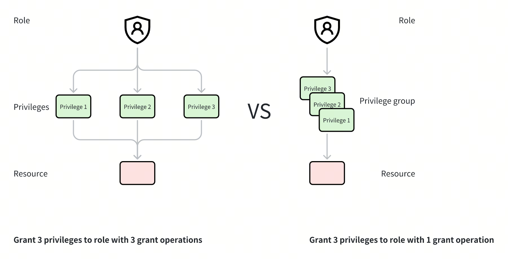

# Create Privilege Group​

To streamline the process of granting privileges, it is recommended that you combine multiple privileges into a privilege group.​

## Privilege group vs. privileges​

A privilege group consists of multiple privileges.​



As shown in the figure above, suppose you need to grant three different privileges to a role.​

- If you do not use a privilege group, you need to grant the privileges three times.​

- If you use a privilege group, you only need to create a privilege group and add the three privileges to this privilege group and grant the privilege group to Role A.​

By using a privilege group, you can grant multiple privileges in bulk to a role.​

## Built-in privilege groups​

For ease-of-use, Milvus provides a total of 9 built-in privileges on the collection, database, and instance level: COLL_RO, COLL_RW, COLL_ADMIN, DB_RO, DB_RW, DB_Admin, Cluster_RO, Cluster_RW and Cluster_Admin.​

<div class="alert note">

The three levels of built-in privilege groups do not have a cascading relationship. Setting a privilege group at the instance level does not automatically set permissions for all databases and collections under that instance. Privileges at the database and collection levels need to be set manually.​

</div>

The following tables explains the privileges includes in each of the built-in privilege group.​

### Collection level​

- **COLL_RO**: includes privileges to read collection data​

- **COLL_RW**: includes privileges to read and write collection data​

- **COLL_ADMIN**: includes privileges to read and write collection data and manage collections.​

The table below lists the specific privileges included in the three built-in privilege groups at the collection level:​

<table data-block-token="Pi3tdceUjopYWqxsiYTcnnNInoZ"><thead><tr><th data-block-token="DtTYdHoX5oh0qLxHd4ycswM5njh" colspan="1" rowspan="1"><p data-block-token="NV3RdP5IGoyTe7xFRT3cn0obnTh"><strong>Privilege</strong>​</p>

</th><th data-block-token="CHdFdtz1FoiZoyxUyz7csms0nGc" colspan="1" rowspan="1"><p data-block-token="C0vfdaj0uohILAxptsacgSj9nxe"><strong>CollectionReadOnly</strong>​</p>

</th><th data-block-token="SMKYdz1j6o1lUJxrrnKcGF16nKf" colspan="1" rowspan="1"><p data-block-token="X0tCdyXB7ovvsRxEAMtcgsZ7nNc"><strong>CollectionReadWrite</strong>​</p>

</th><th data-block-token="WuOcdy7ruoOSG7xwypbcGppLnCf" colspan="1" rowspan="1"><p data-block-token="CsvGdWuOaoRecvxBsRfckZKKntd"><strong>CollectionAdmin</strong>​</p>

</th></tr></thead><tbody><tr><td data-block-token="EqYidYZCSonxmexk3bAcLh1gndg" colspan="1" rowspan="1"><p data-block-token="H85ddLutEo698KxgytncmD0Hnnc">Query​</p>

</td><td data-block-token="VMjndLAaVo9V7bxe4KPcE6f8nNc" colspan="1" rowspan="1"><p data-block-token="MvCidzzimoZTs0xioR4cmtZ5nof">✔️​</p>

</td><td data-block-token="EoD8dGhNEoAJOnxB7Zjc5E9Jnyd" colspan="1" rowspan="1"><p data-block-token="J2OMdV9XXo8dEsxBlLqcmXmZnhe">✔️​</p>

</td><td data-block-token="FmVwdpcMKoAaIpxpBZlcrTF8nje" colspan="1" rowspan="1"><p data-block-token="F6bCd3IzUoPDaDxXwIucE2W1nrx">✔️​</p>

</td></tr><tr><td data-block-token="CbazdsqPmoQbH7xEWpvcPpOBnxe" colspan="1" rowspan="1"><p data-block-token="XY8Gdbwhrome2jxRt2gcP37jnLc">Search​</p>

</td><td data-block-token="YMHhdkBwvoDMkMxteC2ckEaEnTf" colspan="1" rowspan="1"><p data-block-token="OXknd86FUojtOQxRabUcEl0yn0d">✔️​</p>

</td><td data-block-token="J62DdYWjGod8Tcx3xdlc97azn7f" colspan="1" rowspan="1"><p data-block-token="UVg7dMXObog7fjxsFugc7ZgynSg">✔️​</p>

</td><td data-block-token="KIZ0dH02yoNPaDxsDG8cq2VYnC6" colspan="1" rowspan="1"><p data-block-token="GxrkdRlUDoQlLfxtJPScUqo7nYk">✔️​</p>

</td></tr><tr><td data-block-token="CawAd4pH9oIVPIx4DqPc6XxYnce" colspan="1" rowspan="1"><p data-block-token="SnQwdA4XFovEhMxexUHcVhRunJb">IndexDetail​</p>

</td><td data-block-token="C8WGd8NSZomxeXxbxWScR8p7nxH" colspan="1" rowspan="1"><p data-block-token="QDBGdT4k9oUzpcxDDUjcOpK6nzh">✔️​</p>

</td><td data-block-token="CFPcdegSMojxryxgdN5c6TSOnoe" colspan="1" rowspan="1"><p data-block-token="KG2YdL5cUof8NUxDoBjc1LrWnMp">✔️​</p>

</td><td data-block-token="SisMdRC3AoNQTix0dN9chgJhnye" colspan="1" rowspan="1"><p data-block-token="ArghdTA9CoUmRYxoGD9cW1JQnxg">✔️​</p>

</td></tr><tr><td data-block-token="TvgedQnqvowfrwxLj9acaVIknOc" colspan="1" rowspan="1"><p data-block-token="XJv7dkNPyoHxa5xQApmcbYt7nAb">GetFlushState​</p>

</td><td data-block-token="Grdud2hCAomjkmxCOfacyF8zntf" colspan="1" rowspan="1"><p data-block-token="YEj4dTmfJoKPQSx4ZkZcaUf6nRf">✔️​</p>

</td><td data-block-token="M0cBdGc1foYJEzxDY9hcIBBdn9d" colspan="1" rowspan="1"><p data-block-token="PW9ZdhgzwoyIvzxaraYcfFnxnVb">✔️​</p>

</td><td data-block-token="CmKadrPyLoqViYxd8Tic1ZNWnMe" colspan="1" rowspan="1"><p data-block-token="KVTIdWciaoySkaxXeznc0kZvn4g">✔️​</p>

</td></tr><tr><td data-block-token="I4itdRqyYoJPjRxxBbtcfSQJn3e" colspan="1" rowspan="1"><p data-block-token="Ja5ddmLceoRwf5xV7AIcgC62ncb">GetLoadState​</p>

</td><td data-block-token="EyIgd1EcIoCnq0xF2KScmldYnEb" colspan="1" rowspan="1"><p data-block-token="KnOrd6BLkoE5f4xKLgAcitqBnCb">✔️​</p>

</td><td data-block-token="KoOEd8tkuoBd1Ex6mWucLi2Xnkb" colspan="1" rowspan="1"><p data-block-token="ZvX4dIP3FovoAzxQZqGc8n9xnWd">✔️​</p>

</td><td data-block-token="YpPgdTmt7ooDSJxdHZmckE9hnjg" colspan="1" rowspan="1"><p data-block-token="FHn3dXq9posdJ6xwVR1c61uNnih">✔️​</p>

</td></tr><tr><td data-block-token="QNsjdT8eKoUXzyxj0gpcWIjsn0g" colspan="1" rowspan="1"><p data-block-token="RpLhdPbt7oT4bFxWCj3cWYLYnqg">GetLoadingProgress​</p>

</td><td data-block-token="TZjodaDFeoGN3mxa1VAcsHuWnZg" colspan="1" rowspan="1"><p data-block-token="ScE8d11gPoImbSxNdJEcXcY8n9d">✔️​</p>

</td><td data-block-token="RokLdt4jOoUjPFx1hZXc9Ziynub" colspan="1" rowspan="1"><p data-block-token="YpuvdqesfonHLVxY8xRc4KHVn3e">✔️​</p>

</td><td data-block-token="RFr9dpJQjoUbAuxmlaycaUpAnvb" colspan="1" rowspan="1"><p data-block-token="MgnId6UZOovodzxC3LFcPF0fncb">✔️​</p>

</td></tr><tr><td data-block-token="O1lzdPIbLogkSyxbUnMc7E3bnXe" colspan="1" rowspan="1"><p data-block-token="OdkFdLniIoyRcNxm4Orc9iYLnYc">HasPartition​</p>

</td><td data-block-token="Zx64dhfifoojEvx00cbcYNUMnig" colspan="1" rowspan="1"><p data-block-token="JKyvdaPKZoYxCDx66I0c9EAInZb">✔️​</p>

</td><td data-block-token="LlrwdTNSGo34j0x2TXGcS4xYn6h" colspan="1" rowspan="1"><p data-block-token="Oq2CdULXkot06dxPQNpc0IN3nGb">✔️​</p>

</td><td data-block-token="F2oLdQx16ouNpsxhjSZc7ONtnSf" colspan="1" rowspan="1"><p data-block-token="Bz39dETdOonO2QxUs8IcB8D1nsh">✔️​</p>

</td></tr><tr><td data-block-token="ItzXdiOwkooSZ8xLOmocMyDdnMd" colspan="1" rowspan="1"><p data-block-token="NpCIdkuwtoGd8SxjnMhc3NlrnVb">ShowPartitions​</p>

</td><td data-block-token="Qun3d5Pkvo0tjSxHKsAcZlhxnff" colspan="1" rowspan="1"><p data-block-token="RDp4d9dtPoAqdhxqrQucFFJSnFh">✔️​</p>

</td><td data-block-token="NcTxdbrpMoXyYBxE2BIckJLgn8e" colspan="1" rowspan="1"><p data-block-token="EJAkdcOLioLmOXxdeWzcx94CnWh">✔️​</p>

</td><td data-block-token="USbNd303BoZuUix39ICcurtonee" colspan="1" rowspan="1"><p data-block-token="QX2UdAnRFohWyFxMD1dcWZOHndb">✔️​</p>

</td></tr><tr><td data-block-token="YvH2dMkaNoDnN0xaVEQcEPFHnje" colspan="1" rowspan="1"><p data-block-token="HxBQdaQ8WoApWoxVlk0cZ0xAnmI">ListAliases​</p>

</td><td data-block-token="LGcTdaTVZolBvhxt3F5c64ESndf" colspan="1" rowspan="1"><p data-block-token="NlNYdqQSlof4oKxu8xCcHJlAnqc">✔️​</p>

</td><td data-block-token="SvdqdcxlOozCN0xfYQdcbYD3n8f" colspan="1" rowspan="1"><p data-block-token="PG8WdIDejoGIv7xxzYtc38y8nof">✔️​</p>

</td><td data-block-token="UoJvdKQESoUVKkxYaZxckt4DnWh" colspan="1" rowspan="1"><p data-block-token="DvQsdpeHioIYSQxCnahcs06Zn5c">✔️​</p>

</td></tr><tr><td data-block-token="I50QdNPZToMFyix2aNscdIadnSb" colspan="1" rowspan="1"><p data-block-token="JgDUdcOLHoX2T5x7Wgqc19C4ned">DescribeCollection​</p>

</td><td data-block-token="GzQTdpvuBoD0Zoxuk1acLnjfnqf" colspan="1" rowspan="1"><p data-block-token="YzD3dQigMouE5yxcQiUc3hY9njp">✔️​</p>

</td><td data-block-token="ICmudsnUroNYh1xiLficm5ncnNh" colspan="1" rowspan="1"><p data-block-token="ICj7dCHzyoqZ9IxMfwTcgSqLnlb">✔️​</p>

</td><td data-block-token="A8FcdGzdToM6iDxIjeic0aixnZe" colspan="1" rowspan="1"><p data-block-token="IL7sdor5ZogoUIxyuJxccRxonHb">✔️​</p>

</td></tr><tr><td data-block-token="ToQTdcf7ooFc1zxpKytcnhVVngc" colspan="1" rowspan="1"><p data-block-token="Bntfdu7Booi4kuxzsXcc5IG7nmf">DescribeAlias​</p>

</td><td data-block-token="UH5kdw1NeoikcoxvjwEc76E5nKc" colspan="1" rowspan="1"><p data-block-token="QCbtd19CDopHelxUZHIcRQ2hnbd">✔️​</p>

</td><td data-block-token="Br5Hd2iLHoOMFJxpK4pcxIzwnnd" colspan="1" rowspan="1"><p data-block-token="P9KQdgFiXoQycVxJGQ3c9hAjnag">✔️​</p>

</td><td data-block-token="EZredTN7Co16Hyx5HKBc7DAwnld" colspan="1" rowspan="1"><p data-block-token="TBK1dEJO9oumgsxkX7ZcJFhinMj">✔️​</p>

</td></tr><tr><td data-block-token="DyJZdn4c5o320CxRuSUcEcBvnTe" colspan="1" rowspan="1"><p data-block-token="PvDJdd5iGo46WvxXLEgc1syqnhg">GetStatistics​</p>

</td><td data-block-token="YIyrdA6XcolBplx4OzYcXzPynAb" colspan="1" rowspan="1"><p data-block-token="RmYqd6B33oT3fLxpo87cy5VwnBb">✔️​</p>

</td><td data-block-token="RRwfdzHKRorJoTxjvjWcVEn7naf" colspan="1" rowspan="1"><p data-block-token="RsvRdue7mokUEjxM6ULcCY0dnbc">✔️​</p>

</td><td data-block-token="BWpWdPwYpojZDzxx6f5cQVDpnvc" colspan="1" rowspan="1"><p data-block-token="UiVnd5gT0oZ6r5x1o4ucwEQ0nc3">✔️​</p>

</td></tr><tr><td data-block-token="EDvsd6ICdocUWXx2KnacLwOunvg" colspan="1" rowspan="1"><p data-block-token="E1updzSsLo0dQZxqtPjcDmuynxe">CreateIndex​</p>

</td><td data-block-token="H2ifdyUVqowxy0xifzfcnOlVncb" colspan="1" rowspan="1"><p data-block-token="HhurdKoUjo07BfxPAt4c0KcSnVb">❌​</p>

</td><td data-block-token="SzhydPZ2ToDzJexgnlqcw8dSnse" colspan="1" rowspan="1"><p data-block-token="YNfPdapFGogabpxjJIHc8ivvnwc">✔️​</p>

</td><td data-block-token="LNigdCHXKoEUBgxcSLZc0bM2nZg" colspan="1" rowspan="1"><p data-block-token="WCopdFvkpohAHexkSLTc8RgQnrg">✔️​</p>

</td></tr><tr><td data-block-token="DumDdE44JoQYp2x1ehRclcnnn2e" colspan="1" rowspan="1"><p data-block-token="AWwmd8V18ouhPixl10ScB0Lpnyc">DropIndex​</p>

</td><td data-block-token="B1spdfumYofvuNxHDvacQHdfnif" colspan="1" rowspan="1"><p data-block-token="Jaw9dnz8poxHiExb0dMcWoSsn3b">❌​</p>

</td><td data-block-token="MmZidXlOKomOgwxR8gicPvTanFg" colspan="1" rowspan="1"><p data-block-token="JK2ld8WLfoOxtsxBGd9cxVvAnJd">✔️​</p>

</td><td data-block-token="V9eAdWWlso2BHsx5lYpcJ6jfnGe" colspan="1" rowspan="1"><p data-block-token="S56qdjW1Foo3VXx4E6ucpsdFnHc">✔️​</p>

</td></tr><tr><td data-block-token="S5TudhHP8onTiOxVhRDcmlXwnqe" colspan="1" rowspan="1"><p data-block-token="TuAEdLXxeoZv83xFucxc8hoMn5c">CreatePartition​</p>

</td><td data-block-token="SMvwdsOoroPCC0xCsYhc5ubBnRl" colspan="1" rowspan="1"><p data-block-token="JM3bdYZwNoPLAExWkJ5cWXzEnsI">❌​</p>

</td><td data-block-token="JJAmdcgjCoAAtuxVxulcM0X3nQg" colspan="1" rowspan="1"><p data-block-token="JC6FdiExQoL2xwxdrWScHKJtnLg">✔️​</p>

</td><td data-block-token="I81Fdz87LoI3dCxVv6ZcJR28nRe" colspan="1" rowspan="1"><p data-block-token="OYW8dhONHo27PTxWjVVcoDo6ngh">✔️​</p>

</td></tr><tr><td data-block-token="A9vcdxWDOoQVSExKOhccjQyKnMb" colspan="1" rowspan="1"><p data-block-token="Y9abdRms2o2MQ8xEdteclxCQn0f">DropPartition​</p>

</td><td data-block-token="ITiKdnjVnoqm1kxljG8cseDinoc" colspan="1" rowspan="1"><p data-block-token="WK1XdImDroOqR0xeHBZcvyPKn5b">❌​</p>

</td><td data-block-token="Mr7PdKAjHoD0XtxAiYdcE22Xnxg" colspan="1" rowspan="1"><p data-block-token="ZPO8dRSiZoGWqmxlYhjcuZfcnti">✔️​</p>

</td><td data-block-token="QTX3d1ppyo23t1xUquechOgonzh" colspan="1" rowspan="1"><p data-block-token="FUgZdfWDXoLjR4xapeKclaimnGg">✔️​</p>

</td></tr><tr><td data-block-token="JfuldR7NBorkIzx62lmcMlYgnNg" colspan="1" rowspan="1"><p data-block-token="V6HZdaod5oMZ2OxzjKZcPzQXnEu">Load​</p>

</td><td data-block-token="Nb4bdgONVoHFBSxBQyEcGIMinvc" colspan="1" rowspan="1"><p data-block-token="R5f2dHMSMo3yr8xCkQZccODPnPd">❌​</p>

</td><td data-block-token="WekOd2TTEoZNDvxctCFczeTdnqh" colspan="1" rowspan="1"><p data-block-token="OTacdByf8oLcdExCelTcWkD7nzf">✔️​</p>

</td><td data-block-token="EBzJdWmzmok7J0xXnA3cXOKcnIg" colspan="1" rowspan="1"><p data-block-token="TRdwdprb7oL0bdxtSIKcNxzhngg">✔️​</p>

</td></tr><tr><td data-block-token="ZFvOdJZASoYbx7xt381cCBf2nod" colspan="1" rowspan="1"><p data-block-token="AGrGd4kVzoldgrxFapVcwFzPnTb">Release​</p>

</td><td data-block-token="Aivld2KMno6Ktaxgtv7cSYZWnAe" colspan="1" rowspan="1"><p data-block-token="UWwwdIhXaoniFUxyYTpckmEunh7">❌​</p>

</td><td data-block-token="R07KdCJClo7BfOxGdyocyiz4nkc" colspan="1" rowspan="1"><p data-block-token="NmMkdbn2bofAtXxp0jecarfqn9e">✔️​</p>

</td><td data-block-token="Em1jdPReboLD6TxBkGCcrtx2nrf" colspan="1" rowspan="1"><p data-block-token="SDpBdsW4vovFTYxFevdcUcVZnEg">✔️​</p>

</td></tr><tr><td data-block-token="DAvIdNUi9og0goxtG0WcBPelnTd" colspan="1" rowspan="1"><p data-block-token="XUTTdT7qHouALyxiF4AcIFNQnKf">Insert​</p>

</td><td data-block-token="HAWvd4MOqoIutExoHFCcZLQPnke" colspan="1" rowspan="1"><p data-block-token="CNgkddB17o22FgxgZ7TcyQ3xnxd">❌​</p>

</td><td data-block-token="JCtRdzi37oKTC3xTZYNcO7i1nIb" colspan="1" rowspan="1"><p data-block-token="ETyOdStzaorGaUxTFRdchB6EnDJ">✔️​</p>

</td><td data-block-token="SE1xdF5UMoOTNexoWBGcSKj0nKg" colspan="1" rowspan="1"><p data-block-token="XrQ5dVNF0ooAvVxxGtUcqYxfnud">✔️​</p>

</td></tr><tr><td data-block-token="TGm9d71ItoDlTUx288Ac5BOJn0c" colspan="1" rowspan="1"><p data-block-token="Cs1LdAZnAovvRvx1MHScQ14Enmg">Delete​</p>

</td><td data-block-token="VbB3dcn9BoWYLGxEV0GcEpS0n3b" colspan="1" rowspan="1"><p data-block-token="NE4udiLgdo71aaxSEsucKphlnff">❌​</p>

</td><td data-block-token="ZOsAdaZDTotWY5xC9wYcxEYMnMd" colspan="1" rowspan="1"><p data-block-token="Ut68dRikNoLwXyxloRecK2uTnCg">✔️​</p>

</td><td data-block-token="QjE2dhkVOoFJ3HxWVAJcmnIMnNg" colspan="1" rowspan="1"><p data-block-token="T4uwd4sT7oKmQsx1ACEcmT2OnEd">✔️​</p>

</td></tr><tr><td data-block-token="FgLTdbrKtopcZFxsPt8cMBfFnhd" colspan="1" rowspan="1"><p data-block-token="AfHhd602boSsR5xVKVLcruVengg">Upsert​</p>

</td><td data-block-token="SXbpdj5KrozJIMxzzBWcd49Lnvf" colspan="1" rowspan="1"><p data-block-token="SUDqdbVywoCbWyxj6tKcqJRanYc">❌​</p>

</td><td data-block-token="NOzCd2aBAoDE6lx6OG6cQNZBngf" colspan="1" rowspan="1"><p data-block-token="Nr6sdfQaWoNXOTxjKJ5cyGoHnCf">✔️​</p>

</td><td data-block-token="F9r7dEljSo4VfzxDgD1c2qL2neg" colspan="1" rowspan="1"><p data-block-token="DP23dVvauoaVT8x8YmZccJeHnGb">✔️​</p>

</td></tr><tr><td data-block-token="FE8rdBv4eot3WcxlQsycIBn4n1c" colspan="1" rowspan="1"><p data-block-token="VwX1dHOAnorLa9xgEHtc4wjdnyg">Import​</p>

</td><td data-block-token="OjJpdnQ5Qo0oj7xpSeucmHKmn63" colspan="1" rowspan="1"><p data-block-token="DlS1dsae9oqpLMx8H9ncqgHzn2d">❌​</p>

</td><td data-block-token="Lkf6dTIA4oQuJ4xBkbmcxwuanQh" colspan="1" rowspan="1"><p data-block-token="YiWXdaGtfoQO40x7nL9csgR2nJh">✔️​</p>

</td><td data-block-token="W0wwdbiBgorK1zxQVKWcBuPPnlb" colspan="1" rowspan="1"><p data-block-token="WP9tdbNc6ohDx9xLLh4cTFdinEg">✔️​</p>

</td></tr><tr><td data-block-token="IOCWdvXCjowloyxlZrRciBfdnNb" colspan="1" rowspan="1"><p data-block-token="HkD1dln5co7xqXxcMUUcq1hSnNh">Flush​</p>

</td><td data-block-token="RvDAdtUgeoxvGnxl3uec14Rgn8e" colspan="1" rowspan="1"><p data-block-token="F1mPdbewBoGzLJxppGrclcnQnDW">❌​</p>

</td><td data-block-token="CVpxddHJCodLFJxRUuwcnlsjnsz" colspan="1" rowspan="1"><p data-block-token="E4IydAkDioMjeLxdhJHcIGFgn5c">✔️​</p>

</td><td data-block-token="TKtwdzNB7o2j3cxX9kncGfHPnje" colspan="1" rowspan="1"><p data-block-token="NHuKd9In7oSCtDxe84acX0iPnJg">✔️​</p>

</td></tr><tr><td data-block-token="DxoMdrOiToQLUcxCzsXcbzHDnwc" colspan="1" rowspan="1"><p data-block-token="Hptedn3fJo8QgCx0GF7cTtsVngf">Compaction​</p>

</td><td data-block-token="Qy0hdcNmCozPYJxgwLTcN8GTnEg" colspan="1" rowspan="1"><p data-block-token="MtYUdaQhaokzKHxK5Pdcyon4njg">❌​</p>

</td><td data-block-token="MtHIdzYy1okjY2xWeYBcFbEonib" colspan="1" rowspan="1"><p data-block-token="XMWPdrJmDopCJXxD1BecOOLtnrc">✔️​</p>

</td><td data-block-token="VzBMdgT4kozS5RxCDsicez8EnHc" colspan="1" rowspan="1"><p data-block-token="MUHKdAgcLoQwORxx2pPcnkGhn4b">✔️​</p>

</td></tr><tr><td data-block-token="PXWfdasKooDEK9xzkDiceusAnrc" colspan="1" rowspan="1"><p data-block-token="JmwadvvReofe4PxNL7EcEqSunoe">LoadBalance​</p>

</td><td data-block-token="AmQsdzbXnopfqLxijVNcIMgonpg" colspan="1" rowspan="1"><p data-block-token="T3RMdwWDloPBpkx6jANcuVoWnnf">❌​</p>

</td><td data-block-token="IeZxdN9PIo8JeDx03tNcf5YSnsg" colspan="1" rowspan="1"><p data-block-token="WK29dSgVjoUoEhxC3JHcGD35nNf">✔️​</p>

</td><td data-block-token="WLL9dKmQdo56mAx01V9c53UdnSg" colspan="1" rowspan="1"><p data-block-token="Qbeid5LfoovciMxYYWnc4Z4unAX">✔️​</p>

</td></tr><tr><td data-block-token="Sgr0dHdWfoXx7QxYupxc9XMpnph" colspan="1" rowspan="1"><p data-block-token="NaOTdIjMZoitDexAXSMcFb3Bn5f">CreateAlias​</p>

</td><td data-block-token="ESlNdRC1potZoAx2UeOcptItnQd" colspan="1" rowspan="1"><p data-block-token="RvF5degCxomJTWx1357clmFmn9d">❌​</p>

</td><td data-block-token="H9RXdFur6oSRZ6xJfk4c07yWnTb" colspan="1" rowspan="1"><p data-block-token="YIM3dFFIOoW4vMxgt6rcUfCrnhf">❌​</p>

</td><td data-block-token="TVV5dQpPPobz5vxNKyFcrjmDnsd" colspan="1" rowspan="1"><p data-block-token="CLAEdp6EGoryvYxlZ1IcVFGbnvG">✔️​</p>

</td></tr><tr><td data-block-token="EJRIdTwhEolev7xlZyCck0lDnwe" colspan="1" rowspan="1"><p data-block-token="AQiXdTKayoLEtJxAjEVc5mcznzc">DropAlias​</p>

</td><td data-block-token="K5QKdeCzpo8wmzxnnjac1su8nLg" colspan="1" rowspan="1"><p data-block-token="OHvCdZxz0ofeftxGTHIcdpGanKg">❌​</p>

</td><td data-block-token="XCH4dkvyAo3TAaxTfnIcqWbenhh" colspan="1" rowspan="1"><p data-block-token="DR9AdabCtoDVTlxgp5wcqmp4npf">❌​</p>

</td><td data-block-token="ZIU8dDUVjoIXwAx8DDdcwDUHnXc" colspan="1" rowspan="1"><p data-block-token="WqxCdMvItoOAkKxz3P2ch9XFnVd">✔️​</p>

</td></tr></tbody></table>

### Database level​

- **DB_RO**: includes privileges to read database data​

- **DB_RW**: includes privileges to read and write database data​

- **DB_Admin**: includes privileges to read and write database data and manage databases.​

The table below lists the specific privileges included in the three built-in privilege groups at the database level:​

<table data-block-token="ULeKdJqFioDSsjxdw26cDExDn2b"><thead><tr><th data-block-token="FZpEd81iZoCJYrxi50yc1chLncd" colspan="1" rowspan="1"><p data-block-token="SHAldLGZToExKYxwjVycaNQ1nHd"><strong>Privilege</strong>​</p>

</th><th data-block-token="UVjkdAnzgo4ROkxL7bCcgx9xnGf" colspan="1" rowspan="1"><p data-block-token="FfCIdbxfjodDYWx1uXMc6KzPnsZ"><strong>DatabaseReadOnly</strong>​</p>

</th><th data-block-token="WSIgdzPmhoQLaFxJ9FGcj5mRnzh" colspan="1" rowspan="1"><p data-block-token="Oc2idsHzqoHzwyxhoe2c7dtxncd"><strong>DatabaseReadWrite</strong>​</p>

</th><th data-block-token="JTred0WFUoRO5Dx9DgfcTAV3nrf" colspan="1" rowspan="1"><p data-block-token="WWHOdfbfVo0i8txO7tucAMAknAo"><strong>DatabaseAdmin</strong>​</p>

</th></tr></thead><tbody><tr><td data-block-token="JX6adkIcEoCil9xzvxBc7j1XnOd" colspan="1" rowspan="1"><p data-block-token="YvMmdQvUNoViSPxA2ekcsgrhnqf">ShowCollections​</p>

</td><td data-block-token="FXt6dOWyZo5b14xd3zmcrvAKn8d" colspan="1" rowspan="1"><p data-block-token="PAGYdPiZCox710xmtZrcgqnXnef">✔️​</p>

</td><td data-block-token="EFcCdtsOSoOkKfxxJAMcFdnknsd" colspan="1" rowspan="1"><p data-block-token="Pz21dPCLmoI4GIxhIdpc80yvnKb">✔️​</p>

</td><td data-block-token="GcMzdOm71oYNJaxgMj4cyoednf1" colspan="1" rowspan="1"><p data-block-token="MWKId16APof76XxhQrfcHhq7nqb">✔️​</p>

</td></tr><tr><td data-block-token="QAhFdxuMuovVKYxI7uuctRjonVe" colspan="1" rowspan="1"><p data-block-token="OUhRdhyq0oE7xxx4zVZcHy7CnRh">DescribeDatabase​</p>

</td><td data-block-token="SJtQdYO1NopTVJxSKGJcL7donng" colspan="1" rowspan="1"><p data-block-token="QxpOdqQxjomyUWxnblncTCvKntg">✔️​</p>

</td><td data-block-token="Yq60dTmGzoFZHKxuS2tciSzInPg" colspan="1" rowspan="1"><p data-block-token="BsBVdIa7doEaaCxzqqZc2pZRnrg">✔️​</p>

</td><td data-block-token="Nn57dkcuYoHxxqxOCKkcKH5Jn9A" colspan="1" rowspan="1"><p data-block-token="AdV1dovwsoV48QxdCT8cIq7zndY">✔️​</p>

</td></tr><tr><td data-block-token="ReJ2djkYHoW4VexDerVcTnxpnbg" colspan="1" rowspan="1"><p data-block-token="ZRu3dgeXSovZaCxW5lsc7eJHnAf">CreateCollection​</p>

</td><td data-block-token="PuBzdsjaEo4v2uxfocicfgaonLb" colspan="1" rowspan="1"><p data-block-token="PscddYkp0ohY7DxxldVckRQdn4S">❌​</p>

</td><td data-block-token="DKYXd7vowobprZxx3AfcE7IUnTj" colspan="1" rowspan="1"><p data-block-token="GZHCdVDqCowQE0xyXWAcdrIFnDb">❌​</p>

</td><td data-block-token="GFsMd5hfzodAuXx5fSTcAfqqn0b" colspan="1" rowspan="1"><p data-block-token="TlAFdxWcLokn4MxCFLIcsen3nkd">✔️​</p>

</td></tr><tr><td data-block-token="MOeOdqqGnohcSDxQnajc76qinGb" colspan="1" rowspan="1"><p data-block-token="TbdLdlV4HoMoo3xCOAmcDf55nGd">DropCollection​</p>

</td><td data-block-token="Jl3idZdvmo5mgNxjalMcMXgvnwf" colspan="1" rowspan="1"><p data-block-token="USh3dgiPGoRZ2oxF7AaccqDknVb">❌​</p>

</td><td data-block-token="B4Z0dtyYoomjtyxqyOmcMWfvnSc" colspan="1" rowspan="1"><p data-block-token="BtqXdDi5CoURafx7ZGFc7zPTnSg">❌​</p>

</td><td data-block-token="BxtHdPjuposQEcxBJ5xcakCJnKe" colspan="1" rowspan="1"><p data-block-token="CQ1Mdprlboru1pxnfSfcAiwAnnb">✔️​</p>

</td></tr><tr><td data-block-token="AryjdXrDcoGJyAxCJnLc1hRhnCb" colspan="1" rowspan="1"><p data-block-token="GwmSdsVFbocwSKxCImmcebBinZf">AlterDatabase​</p>

</td><td data-block-token="E5gcdnQsFoBWLdxlYwsccTognBf" colspan="1" rowspan="1"><p data-block-token="Vaovdy097osfVVxLM2CcjUYnn5d">❌​</p>

</td><td data-block-token="TjFIdIJa7olC6uxkvCWcwNUDnGW" colspan="1" rowspan="1"><p data-block-token="OFeJdfI9goHMJUxfls8cEgiRn4f">✔️​</p>

</td><td data-block-token="YVKLdRtvPob8MmxIzVMcOKbonvd" colspan="1" rowspan="1"><p data-block-token="TtI4dATflonNO2xuBrjcq8hNnvb">✔️​</p>

</td></tr></tbody></table>

### Cluster level​

- **Cluster_RO**: includes privileges to read instnace data​

- **Cluster_RW**: includes privileges to read and write instance data​

- **Cluster_Admin**: includes privileges to read and write instance data and manage instances.​

The table below lists the specific privileges included in the three built-in privilege groups at the instance level:​

<table data-block-token="SDHtdzccpoaNdOxspzFcdkwEnu9"><thead><tr><th data-block-token="Pb9FdCS05ozBO9xBo65chofen5d" colspan="1" rowspan="1"><p data-block-token="OgnXdgTdyoKCBnxlyfac4Q5once"><strong>Privilege</strong>​</p>

</th><th data-block-token="Y6xPdMNjxomIPwxJB7Xczpm6nkc" colspan="1" rowspan="1"><p data-block-token="CO9bdrfCPoohejxhezZcDS6gnJr"><strong>ClusterReadOnly</strong>​</p>

</th><th data-block-token="ALGjdHwDgo7XOsxfGWwcA6RNn4f" colspan="1" rowspan="1"><p data-block-token="D4xfdML8VoDPqWxni5zc4Rjknte"><strong>ClusterReadWrite</strong>​</p>

</th><th data-block-token="QaTZdG7Pgo3rZ4xCk8lcqwhFnoh" colspan="1" rowspan="1"><p data-block-token="VmTSdQcJboLLNHxV7b8cgfDinVf"><strong>ClusterAdmin</strong>​</p>

</th></tr></thead><tbody><tr><td data-block-token="Byzbdv4XboCS74xhuzlcuVxZnKz" colspan="1" rowspan="1"><p data-block-token="SraLd2bxXo2rDZxCMzjcEHuXnGd">ListDatabases​</p>

</td><td data-block-token="Uc9Odk7c6owHn9xu7jUc9hJGnbg" colspan="1" rowspan="1"><p data-block-token="Ol51d8BzwovVTSxlvpEcLi7znhg">✔️​</p>

</td><td data-block-token="Idtudbo1hoJGtRxB00wcAyZ1nic" colspan="1" rowspan="1"><p data-block-token="PkFFdIkLJoJ3Asx3eZ1cvWHVn7f">✔️​</p>

</td><td data-block-token="AQ6hdba6lofGnlx4AX7cxwuAnOe" colspan="1" rowspan="1"><p data-block-token="RHpjdhjlHoWWZMxBUw7cKhqynYg">✔️​</p>

</td></tr><tr><td data-block-token="TQ6sdyUmIoPgkCxCAptczlOxnBc" colspan="1" rowspan="1"><p data-block-token="DHTidlzimoUCuHxx4YvctOaVnhd">RenameCollection​</p>

</td><td data-block-token="VPbFduye0o2w6NxvKDpc2vPQnm2" colspan="1" rowspan="1"><p data-block-token="BrOIdxfpOoPMQCxwwzkce6O1n4c">❌​</p>

</td><td data-block-token="RVXhdQINyoFQrNxJNKWcuW48nSh" colspan="1" rowspan="1"><p data-block-token="PNH0dRjtVoUWXjxzyzKcsENmnVd">❌​</p>

</td><td data-block-token="XL4ddyG3yojFZQx1IZJceKz6nIe" colspan="1" rowspan="1"><p data-block-token="GDgAdST0Mook1Ax1eicchQlrnGB">✔️​</p>

</td></tr><tr><td data-block-token="JCRpdtbsDoZ6G8xZh8Ncr5Wonyf" colspan="1" rowspan="1"><p data-block-token="IqqVdVkgOommfvx6aqwcw1jXnRf">CreateOwnership​</p>

</td><td data-block-token="UYsud3bNooFr5qxTtn7czXoinVb" colspan="1" rowspan="1"><p data-block-token="CEoldyQCrozKbCxMapZcQRKjnAb">❌​</p>

</td><td data-block-token="BI6UdpIUoo0hToxZ2D8cws5Ln9e" colspan="1" rowspan="1"><p data-block-token="D5fNd33tpoD3icxO1fAc27qOnFo">❌​</p>

</td><td data-block-token="S77tdqVstoW1vtxwfHqcNBM1n2b" colspan="1" rowspan="1"><p data-block-token="E2j3dBUF2oxuWUx0ebcc6hOsnyd">✔️​</p>

</td></tr><tr><td data-block-token="Ug1jdwmfVoT4bcxkw9WcNrjjngh" colspan="1" rowspan="1"><p data-block-token="VkgYdcuIxoj73txPiRocHiRonsh">UpdateUser​</p>

</td><td data-block-token="E5vtdgBnXonp2WxrAk3cYSvknkd" colspan="1" rowspan="1"><p data-block-token="DmWfdcvnpo7gxvxgKA7cAZZjnmh">❌​</p>

</td><td data-block-token="NKXddZ5v0opZKexmUFYcJSWinAh" colspan="1" rowspan="1"><p data-block-token="USFgdH8wbo4xLpxYSSfcf6UwnOg">❌​</p>

</td><td data-block-token="Rx5KdLH27ob98ZxmV3pcSwWWnnc" colspan="1" rowspan="1"><p data-block-token="BKrgdw2SKojYQmxqRuOcGiIhn4e">✔️​</p>

</td></tr><tr><td data-block-token="DsVKdRReDoVp5sxlc3ccmZ6tntd" colspan="1" rowspan="1"><p data-block-token="FLNJdnc4foeznWxhpCRcjh6Lnaf">DropOwnership​</p>

</td><td data-block-token="XrUbdRCWUoSgkyxEj1PcUh4Onyh" colspan="1" rowspan="1"><p data-block-token="F90Yd3wEbovAN0xN0Pqc1gTWnHY">❌​</p>

</td><td data-block-token="OXIVdtHlyoiCuixZ4Y7cWRYuncb" colspan="1" rowspan="1"><p data-block-token="GDxfdJe7goKqOVxgdH0cnfDynoc">❌​</p>

</td><td data-block-token="Qr55dthmVoRbmXxrEtYcYFG4nzf" colspan="1" rowspan="1"><p data-block-token="QAX1duZgboP6AWxoFlFcwMlUn5g">✔️​</p>

</td></tr><tr><td data-block-token="S4stdlNtroWT3IxOr8ZcgQtBnVc" colspan="1" rowspan="1"><p data-block-token="BczUdckfAonlOexKNtrcSS4Xn8c">SelectOwnership​</p>

</td><td data-block-token="POFcdCblCowAAzxotSIc3SIinlg" colspan="1" rowspan="1"><p data-block-token="OQrwdUf4BoFUfqxHI59cZTYHncX">✔️​</p>

</td><td data-block-token="UTGyd4uIOoslJNxkEkbchxKwnZe" colspan="1" rowspan="1"><p data-block-token="NzTMdCQbvoBoGrxojgAcUEconyb">✔️​</p>

</td><td data-block-token="G8jqdfmAOo8I8gx816Cc6zYtnYf" colspan="1" rowspan="1"><p data-block-token="P0YUda8rFoj8vJxfQVZc90Tangb">✔️​</p>

</td></tr><tr><td data-block-token="M7iedETVWoiN5nxl1Q7cPZKpnn9" colspan="1" rowspan="1"><p data-block-token="E58wdgE8qoDIF7xyqVEcGzeWnzc">ManageOwnership​</p>

</td><td data-block-token="YnJxdCIkVoI4rixwAhicT4TInEd" colspan="1" rowspan="1"><p data-block-token="HoEHdPvJQoISoGxHdNccgLp1n0O">❌​</p>

</td><td data-block-token="R3TWdLAq5ouVnexklkYc5bSMnkg" colspan="1" rowspan="1"><p data-block-token="SogUdQ3zvoy6f9xWJN1cu7oPnae">❌​</p>

</td><td data-block-token="MBBSdMx89ogo8SxmNPfcb97fnyh" colspan="1" rowspan="1"><p data-block-token="GFYydqaqGodI0AxJuPDcoFxcnJe">✔️​</p>

</td></tr><tr><td data-block-token="OtFEdjTb0olTDxxMkI7cEJWvn2g" colspan="1" rowspan="1"><p data-block-token="XdNJdSGWWoXkLux78XWcje5snac">SelectUser​</p>

</td><td data-block-token="EFVVdktrooTYyoxhQ61cFoBPnYc" colspan="1" rowspan="1"><p data-block-token="Wk1mdspxZoyulXxMdwUcir5pnWb">✔️​</p>

</td><td data-block-token="RimUd92e7oxrI2xuCn9cdx78nTd" colspan="1" rowspan="1"><p data-block-token="CiLrdyqT2o0GW2x6ivwcCmcxnmO">✔️​</p>

</td><td data-block-token="De3Oduut0o6BnexThqHcLt0wnvg" colspan="1" rowspan="1"><p data-block-token="YnsldILMgo0VNMxMXW6csrDgnod">✔️​</p>

</td></tr><tr><td data-block-token="XUrVdIwc3o2ud5xVDKYclpgZnQb" colspan="1" rowspan="1"><p data-block-token="GbDxdtJAZotS7axoxjJc9MHLnmd">BackupRBAC​</p>

</td><td data-block-token="DUkydLyH1ond5dxtCeacdAvenx8" colspan="1" rowspan="1"><p data-block-token="T8EYdvK58o0zpIxGHPtcf7bTnug">❌​</p>

</td><td data-block-token="Iq6Ddi2aFoqexCxUBZ1cI5Vzn2f" colspan="1" rowspan="1"><p data-block-token="YTzfdY5ARoWfZCxeyEucuGz9n8b">❌​</p>

</td><td data-block-token="DvE4dLlkooctJ3xu1apcPizfnug" colspan="1" rowspan="1"><p data-block-token="RWD3du7eBoIUNRxK4QCcCsc6nph">✔️​</p>

</td></tr><tr><td data-block-token="FuF9dE3yeoCYoLx3Y9ucxcipnec" colspan="1" rowspan="1"><p data-block-token="TdGDdLQzXozpsPxgVf3c8MIInTg">RestoreRBAC​</p>

</td><td data-block-token="KebudbJlMouuaAxSQlac1hWLn1g" colspan="1" rowspan="1"><p data-block-token="JFCvdBbtEobk2FxSPh3c21D2nXe">❌​</p>

</td><td data-block-token="PIvFdCBelol8F0x47d5cNrNanLc" colspan="1" rowspan="1"><p data-block-token="FCWJdcIXCohhIVxg2SvcLVKnnKg">❌​</p>

</td><td data-block-token="Hgw2dDzlCoQEEJxKJIXcxGK0nfc" colspan="1" rowspan="1"><p data-block-token="ALQmd7L9xohFfax0TXxcDfLgn2b">✔️​</p>

</td></tr><tr><td data-block-token="TlepdfFnxoXQ1AxrQBccjwsQnjd" colspan="1" rowspan="1"><p data-block-token="DkJpdWaO6o9WZKx5wANcD5e3n8z">CreateResourceGroup​</p>

</td><td data-block-token="Od4tdHFuwoP2Tixeh5DcWb1cnye" colspan="1" rowspan="1"><p data-block-token="XEkZdMlVco4K2HxDjQ2cHGUtnoh">❌​</p>

</td><td data-block-token="UVEydw6dToR8x9xyPP8cavB7nbm" colspan="1" rowspan="1"><p data-block-token="LkaCdhoXLoIHUkxO12pcQWcqnkg">❌​</p>

</td><td data-block-token="VSfSdDFRvocxuTxF7hrcFlWQn2d" colspan="1" rowspan="1"><p data-block-token="LQFbdYej6oJtt7xIO2IcNZTxnbh">✔️​</p>

</td></tr><tr><td data-block-token="KHRfdH5Two92ohxbDOJcjIMhnJg" colspan="1" rowspan="1"><p data-block-token="X0radwVpNoi2I3xZJsMcGr9rnge">DropResourceGroup​</p>

</td><td data-block-token="QnfEddXbvoGXjcxiGmIc5iPUnEc" colspan="1" rowspan="1"><p data-block-token="VmrGdl7Z8onArwxdiQucnsbEnUf">❌​</p>

</td><td data-block-token="NkXqd1kfuoeQ5KxaeXtcC0IOnKh" colspan="1" rowspan="1"><p data-block-token="WQC9dKoIfomeaSxBXG8cx072ndb">❌​</p>

</td><td data-block-token="WOaGd7YEIovzSUxSClmcKXQ9nBg" colspan="1" rowspan="1"><p data-block-token="OoLRd37GPoVO2TxfNm7cdxk0nnd">✔️​</p>

</td></tr><tr><td data-block-token="PbUHdrf86oNAZvxQMN6cgb9vnpO" colspan="1" rowspan="1"><p data-block-token="G68ldEUjyo1088xB1gIcmKFsnn8">UpdateResourceGroups​</p>

</td><td data-block-token="I1xfd6gxWoj1zyxlADbc4g6lnGd" colspan="1" rowspan="1"><p data-block-token="Oe34dvLlHoktZaxcORqc8npgnLf">❌​</p>

</td><td data-block-token="FFrodGH35oLEYPxB8rzcENt5nNc" colspan="1" rowspan="1"><p data-block-token="Oj9OdnqvUoQaEfxI6CKcz6sBnSb">✔️​</p>

</td><td data-block-token="LJoxdQB8eoDGOUxpHN2cNAHinDe" colspan="1" rowspan="1"><p data-block-token="LibSdnyocoQyGwxGsS6cjUDhnsg">✔️​</p>

</td></tr><tr><td data-block-token="BBandkIz2o0JBlxU0Rkcy5YEnyc" colspan="1" rowspan="1"><p data-block-token="CIJZdH7jDo13xNx7dMPcWlTynKg">DescribeResourceGroup​</p>

</td><td data-block-token="S5Hpdy1HGomiscx8tAIcQKXcnZe" colspan="1" rowspan="1"><p data-block-token="PyzddhauGoMdlqxEtcfcNNFenfh">✔️​</p>

</td><td data-block-token="MDi6dBlL0oSIiixwZGTccWwgnSh" colspan="1" rowspan="1"><p data-block-token="LZKHd0jqLomsF4xuFd8cggyjnFe">✔️​</p>

</td><td data-block-token="YwQgdDY3FoAAytx7izIcmWrdnOf" colspan="1" rowspan="1"><p data-block-token="P046d8DDeoPe8GxDKUccDhHKntd">✔️​</p>

</td></tr><tr><td data-block-token="JQaPdUFpYoc7K5xhQG1ckQOInNd" colspan="1" rowspan="1"><p data-block-token="WpBBdLBhEoVy10xyjEdcBlj9nec">ListResourceGroups​</p>

</td><td data-block-token="X0JPdltMMosJouxTzr3c9Rpfnfd" colspan="1" rowspan="1"><p data-block-token="WCZydwz9GoSb0CxurPncIdhRnPa">✔️​</p>

</td><td data-block-token="LW50d79pDoOQ4bx5bRectQhyn7d" colspan="1" rowspan="1"><p data-block-token="TDQ2diUY2oajFoxdTDOcyAJCnRg">✔️​</p>

</td><td data-block-token="Em26dOFIuoK1YsxqpRbcExAwn0f" colspan="1" rowspan="1"><p data-block-token="GgZ7dovRroBV00xKdTKcmAdxnob">✔️​</p>

</td></tr><tr><td data-block-token="CmP1dXreGoYVUcx4h1lccqiXnhc" colspan="1" rowspan="1"><p data-block-token="U9qqd0o6doUIRexM7t6cBYYdnPg">TransferNode​</p>

</td><td data-block-token="I78qd1PabosCEsxodQNc8ustndb" colspan="1" rowspan="1"><p data-block-token="KAtLdAwgPoQyWaxc9J4cy6cHnHb">❌​</p>

</td><td data-block-token="SLLHdA2PQo41OhxxEYRc0DEYnsg" colspan="1" rowspan="1"><p data-block-token="PzJKdclzgoaqa8xTFumcUJUInpd">✔️​</p>

</td><td data-block-token="LXKUdr458o0PGQx9qm3cYMgtnCh" colspan="1" rowspan="1"><p data-block-token="NwJBd6KuNo3a8gxH6MtcpGMvn9c">✔️​</p>

</td></tr><tr><td data-block-token="YAYYd1t8eogZ9kxnJDtc6H8Nnzb" colspan="1" rowspan="1"><p data-block-token="YlXddySkLo2W39xEsVic9bjCnLc">TransferReplica​</p>

</td><td data-block-token="WI2MdqGEGoakiixdROcchBw4nQd" colspan="1" rowspan="1"><p data-block-token="F33ud0h1Qo2zGWxfSt3csN3cnOh">❌​</p>

</td><td data-block-token="PFHzd9hjYooF1Sx9p3vcppl2nWe" colspan="1" rowspan="1"><p data-block-token="BjEDd0x55oi9Uax0lkuckCv0nnN">✔️​</p>

</td><td data-block-token="AvcodkOVUoPvu5x2KVBc6Gjzn6e" colspan="1" rowspan="1"><p data-block-token="CmJNdyfYHolCLjxX7tpcBSeFnAb">✔️​</p>

</td></tr><tr><td data-block-token="LmiudAtZNokCahxouY1c1O18nhi" colspan="1" rowspan="1"><p data-block-token="EVIydHMYooJMS9x0ZHhcOmP2nxf">CreateDatabase​</p>

</td><td data-block-token="GZDudwHdnoDgkpxCsFlcQXBMnYg" colspan="1" rowspan="1"><p data-block-token="H8XDdOUOIo3y5UxCXUmcrzuUn9e">❌​</p>

</td><td data-block-token="G5ujdW7EmojJwmxvvlwcaaAvn9g" colspan="1" rowspan="1"><p data-block-token="HC6MdiJCQok82wxRcTqc8InbnAh">❌​</p>

</td><td data-block-token="A8erdkiSGoobOuxfUBxchXp0nkb" colspan="1" rowspan="1"><p data-block-token="G5B9dSyJcojNX2x9GBIcLYEynCd">✔️​</p>

</td></tr><tr><td data-block-token="SrDVd4XgUotWTdx69vhcAiBmn1f" colspan="1" rowspan="1"><p data-block-token="DOlPdBQISoGBmHxTgvkcthm0n1g">DropDatabase​</p>

</td><td data-block-token="DvAvd2M2fo9IgexJfOXcWHuCnwh" colspan="1" rowspan="1"><p data-block-token="ApLNd42AMoJcUcxWeJycZBySnIc">❌​</p>

</td><td data-block-token="SWGBd0Io1ouh4OxgmtFcDPfEnzb" colspan="1" rowspan="1"><p data-block-token="KciFdYla7oa6fTxlzeIcW45EnEf">❌​</p>

</td><td data-block-token="EEYLdwTvGo4TJGxFvkYcecs3nte" colspan="1" rowspan="1"><p data-block-token="Cf6SdeNCFoXJX2xtdxsccZNdnYf">✔️​</p>

</td></tr><tr><td data-block-token="EIH9dHaEzo1R5sxGpiscar6Rnre" colspan="1" rowspan="1"><p data-block-token="ETXMdTT5io6hmlxIMDCcDdVknTh">FlushAll​</p>

</td><td data-block-token="QCrgd6fqqoVdiax155uczS5VnVb" colspan="1" rowspan="1"><p data-block-token="WAuLdNd58oTa54xSEpecKwzan01">❌​</p>

</td><td data-block-token="H6ATdXmm4oYcjxxh1wIcCNRGnmd" colspan="1" rowspan="1"><p data-block-token="Kptvd3uZZo2VQ8xNUK4cvzdln1d">✔️​</p>

</td><td data-block-token="XADideeiCo9GtTxFPt0c7G1snsb" colspan="1" rowspan="1"><p data-block-token="OsAFdki8Yo2dfPxT6VxcluYdnpg">✔️​</p>

</td></tr><tr><td data-block-token="UZTcdP8HJoqHgHxylK5cAe8mnub" colspan="1" rowspan="1"><p data-block-token="NCNEdXJ57oaBdjx415ZcaffRn9f">CreatePrivilegeGroup​</p>

</td><td data-block-token="PmJGdfmluoAjBdxsMRGcD4Ban7g" colspan="1" rowspan="1"><p data-block-token="ZfuTdE0uIoE1jfxpiaicsvmUnXe">❌​</p>

</td><td data-block-token="Is1kd34sCoxo4SxzIr4cnaLInQh" colspan="1" rowspan="1"><p data-block-token="AppCdEcQlop3raxKaOlcMq2Onlf">❌​</p>

</td><td data-block-token="H0QYdXL8zo9IlUxPHQPcdqnQnZe" colspan="1" rowspan="1"><p data-block-token="MRDZdPEpBoKyI4xZ14ScQAVHn0N">✔️​</p>

</td></tr><tr><td data-block-token="QHGQdNFWEo0LtoxFjCucGFP8ngc" colspan="1" rowspan="1"><p data-block-token="E98fdrF3foqQaCxKGarc2wfAnab">DropPrivilegeGroup​</p>

</td><td data-block-token="NOGldA3Exo3TMUxIA0ycmPrPnKd" colspan="1" rowspan="1"><p data-block-token="ZSEUddyXjoK18ax6NiQcQ9Mfn3f">❌​</p>

</td><td data-block-token="XfkIdziRKo8eKWxsqnYclpRMnFd" colspan="1" rowspan="1"><p data-block-token="ImW4d2e3docPg1x6gZqcAyKXnqc">❌​</p>

</td><td data-block-token="GGJcdwNloop1kmxwCrucC703ntg" colspan="1" rowspan="1"><p data-block-token="QE3Od6f86otCh2xaqGRcUKu4nVh">✔️​</p>

</td></tr><tr><td data-block-token="VJGfdd0yMoV0pyxtaKIclN0Wn9d" colspan="1" rowspan="1"><p data-block-token="C36ed8eJ8ogmw0xp2Prc12oCnad">ListPrivilegeGroups​</p>

</td><td data-block-token="IiUDdzL7rolWzcx0NFycAXjZnab" colspan="1" rowspan="1"><p data-block-token="YkJVdenzmoRm3Sxe1bncXd13nPd">❌​</p>

</td><td data-block-token="NhcydRiito1LhcxqwL1cNp5fnhc" colspan="1" rowspan="1"><p data-block-token="N8FOdpGNMos8mlxoKmDcimNgn3c">❌​</p>

</td><td data-block-token="CHsJd3Za0oATd9xx16Jc23ngnOg" colspan="1" rowspan="1"><p data-block-token="J7oUdVIRZo9oHsxkM0McY3fxn1f">✔️​</p>

</td></tr><tr><td data-block-token="IhE7duyeSojjJJx6WcZcuh2Yn0b" colspan="1" rowspan="1"><p data-block-token="Mgu7dKutLopZKMxElzdcAXHOnzb">OperatePrivilegeGroup​</p>

</td><td data-block-token="MLfBdPxHJoBHfdxfeaVcUmfxnbb" colspan="1" rowspan="1"><p data-block-token="VRSbdH6GGorxeDxStq3cdXyFn1b">❌​</p>

</td><td data-block-token="OGVOdukvuoAzKhxYWtMc9cfhnRb" colspan="1" rowspan="1"><p data-block-token="BxFBdyiajoWNBWxqrE9c94ysngc">❌​</p>

</td><td data-block-token="DeK9dC1DyoDuOZxCqvQcTHlTnTd" colspan="1" rowspan="1"><p data-block-token="WMWXdzCdoosl2JxYQhxcjuGfnHc">✔️​</p>

</td></tr></tbody></table>

## Procedures​

You can create a privilege group and then add privileges to the privilege group. ​

### Create a privilege group​

The following example demonstrates how to create a privilege group named `privilege_group_1`.​

<div class="multipleCode">
  <a href="#python">Python </a>
  <a href="#java">Java</a>
  <a href="#go">Go</a>
  <a href="#shell">cURL</a>
</div>

```python
from pymilvus import MilvusClient​
client.create_privileg_group(group_name='privilege_group_1'）​

```

```java
import io.milvus.v2.service.rbac.request.CreatePrivilegeGroupReq;​
​
client.createPrivilegeGroup(CreatePrivilegeGroupReq.builder()​
        .groupName("privilege_group_1")​
        .build());​

```

```go
import "github.com/milvus-io/milvus-sdk-go/v2/client"​
​
client.CreatePrivilegeGroup(context.Background(), "privilege_group_1")​

```

```shell
curl --request POST \​
--url "${CLUSTER_ENDPOINT}/v2/vectordb/privilege_groups/create" \​
--header "Authorization: Bearer ${TOKEN}" \​
--header "Content-Type: application/json" \​
-d '{​
    "privilegeGroupName":"privilege_group_1"​
}'​

```

### Add privileges to a privilege group​

The following example demonstrates how to add privileges `PrivilegeBackupRBAC` and `PrivilegeRestoreRBAC` to the privilege group `privilege_group_1` that is just created.​

<div class="multipleCode">
  <a href="#python">Python </a>
  <a href="#java">Java</a>
  <a href="#go">Go</a>
  <a href="#shell">cURL</a>
</div>

```python
from pymilvus import MilvusClient​
client.add_privileges_to_group(group_name='privilege_group_1', privileges=['Query', 'Search'])​

```

```java
import io.milvus.v2.service.rbac.request.AddPrivilegesToGroupReq;​
​
client.addPrivilegesToGroup(AddPrivilegesToGroupReq.builder()​
        .groupName("privilege_group_1")​
        .privileges(Arrays.asList("Query", "Search"))​
        .build());​

```

```go
import "github.com/milvus-io/milvus-sdk-go/v2/client"​
​
client.AddPrivilegesToGroup(context.Background(), "privilege_group_1", []string{"Query", "Search"})​

```

```shell
curl --request POST \​
--url "${CLUSTER_ENDPOINT}/v2/vectordb/privilege_groups/add_privileges_to_group" \​
--header "Authorization: Bearer ${TOKEN}" \​
--header "Content-Type: application/json" \​
-d '{​
    "privilegeGroupName":"privilege_group_1",​
    "privileges":["Query", "Search"]​
}'​

```

### Remove privileges from a privilege group​

The following example demonstrates how to remove the privilege `PrivilegeRestoreRBAC` from the privilege group `privilege_group_1`.​

<div class="multipleCode">
  <a href="#python">Python </a>
  <a href="#java">Java</a>
  <a href="#go">Go</a>
  <a href="#shell">cURL</a>
</div>

```python
from pymilvus import MilvusClient​
client.remove_privileges_from_group(group_name='privilege_group_1', privileges='Search')​

```

```java
import io.milvus.v2.service.rbac.request.RemovePrivilegesFromGroupReq;​
​
client.removePrivilegesFromGroup(RemovePrivilegesFromGroupReq.builder()​
        .groupName("privilege_group_1")​
        .privileges(Collections.singletonList("Search"))​
        .build());​

```

```go
import "github.com/milvus-io/milvus-sdk-go/v2/client"​
​
client.RemovePrivilegesFromGroup(context.Background(), "privilege_group_1", []string{"Search"})​

```

```shell
curl --request POST \​
--url "${CLUSTER_ENDPOINT}/v2/vectordb/privilege_groups/remove_privileges_from_group" \​
--header "Authorization: Bearer ${TOKEN}" \​
--header "Content-Type: application/json" \​
-d '{​
    "privilegeGroupName":"privilege_group_1",​
    "privileges":["Search"]​
}'​

```

### List privilege groups​

The following example demonstrates how to list all existing privilege groups.​

<div class="multipleCode">
  <a href="#python">Python </a>
  <a href="#java">Java</a>
  <a href="#go">Go</a>
  <a href="#shell">cURL</a>
</div>

```python
from pymilvus import MilvusClient​
client.list_privilege_groups()​

```

```java
import io.milvus.v2.service.rbac.PrivilegeGroup;​
import io.milvus.v2.service.rbac.request.ListPrivilegeGroupsReq;​
import io.milvus.v2.service.rbac.response.ListPrivilegeGroupsResp;​
​
ListPrivilegeGroupsResp resp = client.listPrivilegeGroups(ListPrivilegeGroupsReq.builder()​
        .build());​
List<PrivilegeGroup> groups = resp.getPrivilegeGroups();​

```

```go
import "github.com/milvus-io/milvus-sdk-go/v2/client"​
​
client.ListPrivilegeGroups(context.Background())​

```

```shell
curl --request POST \​
--url "${CLUSTER_ENDPOINT}/v2/vectordb/privilege_groups/list" \​
--header "Authorization: Bearer ${TOKEN}" \​
--header "Content-Type: application/json" \​
-d '{}'​

```

Below is an example output.​

```
PrivilegeGroupItem: <privilege_group:privilege_group_1>, <privileges:('Search', 'Query')>​

```

### Drop a privilege group​

The following example demonstrates how to drop the privilege group `privilege_group_1`.​

<div class="multipleCode">
  <a href="#python">Python </a>
  <a href="#java">Java</a>
  <a href="#go">Go</a>
  <a href="#shell">cURL</a>
</div>

```python
from pymilvus import MilvusClient​
client.drop_privilege_group(group_name='privilege_group_1')​

```

```java
import io.milvus.v2.service.rbac.request.DropPrivilegeGroupReq;​
​
client.dropPrivilegeGroup(DropPrivilegeGroupReq.builder()​
        .groupName("privilege_group_1")​
        .build());​

```

```go
import "github.com/milvus-io/milvus-sdk-go/v2/client"​
​
client.DropPrivilegeGroup(context.Background(), "privilege_group_1")​

```

```shell
curl --request POST \​
--url "${CLUSTER_ENDPOINT}/v2/vectordb/privilege_groups/drop" \​
--header "Authorization: Bearer ${TOKEN}" \​
--header "Content-Type: application/json" \​
-d '{​
    "privilegeGroupName":"privilege_group_1"​
}'​

```

