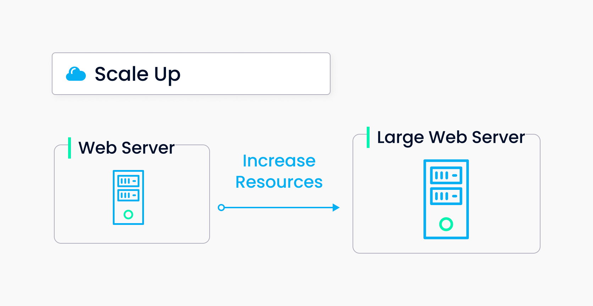

# Scale a Milvus Cluster

Milvus supports horizontal scaling of its components. This means you can either increase or decrease  the number of worker nodes of each type according to your own need. 

This topic describes how to scale out and scale in a Milvus cluster. We assume that you have already [installed a Milvus cluster](install_cluster-helm.md) before scaling. Also, we recommend familiarizing yourself with the [Milvus architecture](architecture_overview.md) before you begin.  

This tutorial takes scaling out three query nodes as an example. To scale out other types of nodes, replace `queryNode` with the corresponding node type in the command line.

<div class="alert note">

For information on how to scale a cluster with Milvus Operator, refer to [Scale a Cluster with Milvus Operator](https://github.com/zilliztech/milvus-operator/blob/main/docs/administration/scale-a-milvus-cluster.md).

</div>

## What is horizontal scaling?

Horizontal scaling includes scaling out and scaling in.

### Scaling out 
Scaling out refers to increasing the number of nodes in a cluster. Unlike scaling up, scaling out does not require you to allocate more resources to one node in the cluster. Instead, scaling out expands the cluster horizontally by adding more nodes. 




According to the [Milvus architecture](architecture_overview.md), stateless worker nodes include query node, data node, index node, and proxy. Therefore, you can scale out these type of nodes to suit your business needs and application scenarios. You can either scale out the Milvus cluster manually or automatically.

Generally, you will need to scale out the Milvus cluster you created if it is over-utilized. Below are some typical situations where you may need to scale out the Milvus cluster:
- The CPU and memory utilization is high for a period of time.
- The query throughput becomes higher.
- Higher speed for indexing is required.
- Massive volumes of large datasets need to be processed.
- High availability of the Milvus service needs to be ensured.


### Scaling in
Scaling in refers to decreasing the number of nodes in a cluster. Generally, you will need to scale in the Milvus cluster you created if it is under-utilized. Below are some typical situations where you need to scale in the Milvus cluster:
- The CPU and memory utilization is low for a period of time.
- The query throughput becomes lower.
- Higher speed for indexing is not required.
- The size of the dataset to be processed is small.

<div class="alert note">
We do not recommend reducing the number of workers nodes dramatically. For example, if there are five data nodes in the cluster, we recommend reducing one data node at a time to ensure service availability. If the service is available after the first attempt of scaling in, you can continue to further reduce the number of the data node.
</div>

## Prerequisites

Run `kubectl get pods` to get a list of the components and their working status in the Milvus cluster you created.

```
NAME                                            READY   STATUS       RESTARTS   AGE
my-release-etcd-0                               1/1     Running      0          1m
my-release-milvus-datacoord-7b5d84d8c6-rzjml    1/1     Running      0          1m
my-release-milvus-datanode-665d4586b9-525pm     1/1     Running      0          1m
my-release-milvus-indexcoord-9669d5989-kr5cm    1/1     Running      0          1m
my-release-milvus-indexnode-b89cc5756-xbpbn     1/1     Running      0          1m
my-release-milvus-proxy-7cbcc8ffbc-4jn8d        1/1     Running      0          1m
my-release-milvus-pulsar-6b9754c64d-4tg4m       1/1     Running      0          1m
my-release-milvus-querycoord-75f6c789f8-j28bg   1/1     Running      0          1m
my-release-milvus-querynode-7c7779c6f8-pnjzh    1/1     Running      0          1m
my-release-milvus-rootcoord-75585dc57b-cjh87    1/1     Running      0          1m
my-release-minio-5564fbbddc-9sbgv               1/1     Running      0          1m 
```

<div class="alert note">
Milvus only supports adding the worker nodes and does not support adding the coordinator components.
</div>

## Scale a Milvus cluster 

You can scale in your Milvus cluster either manually or automatically. If autoscaling is enabled, the Milvus cluster will shrink or expand automatically when CPU and memory resources consumption reaches the value you have set. 

Currently, Milvus 2.1.0 only supports scaling in and out manually.


#### Scaling out

Run `helm upgrade my-release milvus/milvus --set queryNode.replicas=3 --reuse-values` to manually scale out the query node.

If successful, three running pods on the query node are added as shown in the following example.

```
NAME                                            READY   STATUS    RESTARTS   AGE
my-release-etcd-0                               1/1     Running   0          2m
my-release-milvus-datacoord-7b5d84d8c6-rzjml    1/1     Running   0          2m
my-release-milvus-datanode-665d4586b9-525pm     1/1     Running   0          2m
my-release-milvus-indexcoord-9669d5989-kr5cm    1/1     Running   0          2m
my-release-milvus-indexnode-b89cc5756-xbpbn     1/1     Running   0          2m
my-release-milvus-proxy-7cbcc8ffbc-4jn8d        1/1     Running   0          2m
my-release-milvus-pulsar-6b9754c64d-4tg4m       1/1     Running   0          2m
my-release-milvus-querycoord-75f6c789f8-j28bg   1/1     Running   0          2m
my-release-milvus-querynode-7c7779c6f8-czq9f    1/1     Running   0          5s
my-release-milvus-querynode-7c7779c6f8-jcdcn    1/1     Running   0          5s
my-release-milvus-querynode-7c7779c6f8-pnjzh    1/1     Running   0          2m
my-release-milvus-rootcoord-75585dc57b-cjh87    1/1     Running   0          2m
my-release-minio-5564fbbddc-9sbgv               1/1     Running   0          2m
```

#### Scaling in

Run `helm upgrade my-release milvus/milvus --set queryNode.replicas=1 --reuse-values` to scale in the query node.

If successful, three running pods on the query node are reduced to one as shown in the following example.

```
NAME                                            READY   STATUS    RESTARTS   AGE
my-release-etcd-0                               1/1     Running   0          2m
my-release-milvus-datacoord-7b5d84d8c6-rzjml    1/1     Running   0          2m
my-release-milvus-datanode-665d4586b9-525pm     1/1     Running   0          2m
my-release-milvus-indexcoord-9669d5989-kr5cm    1/1     Running   0          2m
my-release-milvus-indexnode-b89cc5756-xbpbn     1/1     Running   0          2m
my-release-milvus-proxy-7cbcc8ffbc-4jn8d        1/1     Running   0          2m
my-release-milvus-pulsar-6b9754c64d-4tg4m       1/1     Running   0          2m
my-release-milvus-querycoord-75f6c789f8-j28bg   1/1     Running   0          2m
my-release-milvus-querynode-7c7779c6f8-pnjzh    1/1     Running   0          2m
my-release-milvus-rootcoord-75585dc57b-cjh87    1/1     Running   0          2m
my-release-minio-5564fbbddc-9sbgv               1/1     Running   0          2m
```


## What's next

- If you want to learn how to monitor the Milvus services and create alerts:
  - Learn [Monitor Milvus with Prometheus Operator on Kubernetes](monitor.md)

- If you are ready to deploy your cluster on clouds:
  - Learn how to [Deploy Milvus on Amazon EKS with Terraform](eks.md)
  - Learn how to [Deploy Milvus Cluster on GCP with Kubernetes](gcp.md)
  - Learn how to [Deploy Milvus on Microsoft Azure With Kubernetes](azure.md)

- If you are looking for instructions on how to allocate resources:
  - [Allocate Resources on Kubernetes](allocate.md#standalone)

