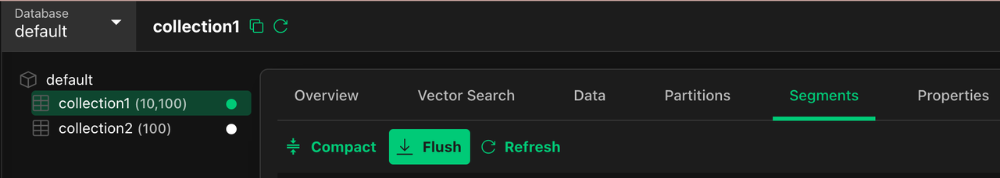
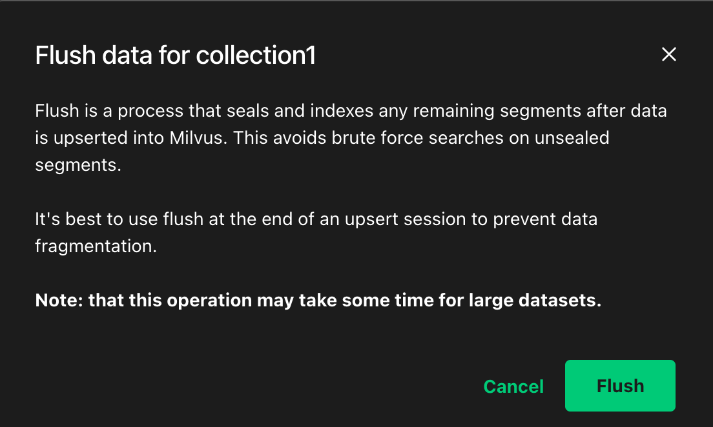
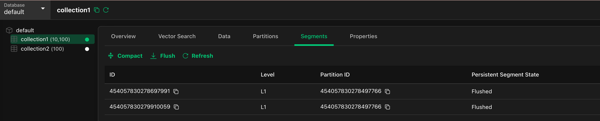

# Upgrading Pulsar ​

This article describes the proceure for you to upgrade your Pulsar component from V2 to V3 if you already have a working Milvus deployment with Pulsar V2.​ 

Since Milvus v2.5, **milvus-helm** and **milvus-operator** will use Pulsar V3 by default to fix some bugs and security vulnerabilities.​ While Milvus 2.5 is compatible with Pulsar 2.x, upgrading to Pulsar V3 is optional. For enhanced stability and performance, we recommend upgrading to Pulsar V3.

If you prefer to use Pulsar V2 with Milvus v2.5.x, read [Use Pulsar V2 with Milvus v2.5.x](use-pulsar-v2.md).

<div class="alert note">

1. The upgrade process requires a brief service outage (usually takes about a few minutes to more than ten minutes, depending on the amount of data).​

2. Before the operation, you need to stop all running clients from writing data to Milvus. Otherwise, the written data may be lost.​

3. This article assumes that Milvus is installed in namespace `default` and named `my-release`. Please change the parameters to your own namespace and release name while executing the commands copied from this page.​

4. Ensure that your work environment has permissions under the above-mentioned namespace in the Kubernetes cluster and the following commands are installed:​

    a. `kubectl` >= 1.20​

    b. `helm` >= 3.14.0​

    c. `cat`, `grep`, `awk` for string manipulate operations​

    d. `curl` or **Attu v2.4+** to interact with milvus management API​

</div>

## Roadmap

The upgrade process includes the following steps:

1. [Persist data not consumed in pulsar​.](#Persist-data-not-consumed-in-Pulsar)

2. [Stop Milvus and delete pulsar V2​.](#Stop-Milvus-and-delete-Pulsar-V2)

3. [Start Pulsar V3 and Milvus​.](#Start-Pulsar-V3-and-Milvus)

## Procedures

This section provides the detailed procedures for upgrading Pulsar from V2 to V3 in Milvus.​

### Persist data not consumed in Pulsar

In this step, you need to ensure that the existing data in Pulsar has been persisted to the object storage service.​ There are two approaches available, and you can choose the one that suits your needs.​

#### Approach 1: Using Attu

If you have only a small number of collections in your working Milvus deployment with not many segments, you can use Attu to persist the data to the object storage service.​

1. Select every collection in all your databases, get into the `Segments` panel, Click the `Flush` button​

    

2. Then upon the popup, Click `Flush` again.​

    

3. Then wait until all collections' Persistent Segment States are `Flushed`.​

    

#### Approach 2: Using management API

1. Proxy port 9091 of Milvus proxy to the local host for subsequent operations.​

    ```bash
    kubectl -n default port-forward deploy/my-release-milvus-proxy 9091:9091 &​
    ```

    Output:​

    ```yaml
    [1] 8116​
    Forwarding from 127.0.0.1:9091 -> 9091​

    ```

2. Save Pid for later cleanup.​

    ```yaml
    pid=8116​

    ```

3. Trigger the action of persisting all inserted data from Pulsar to Ojbect Storage​.

    ```bash
    curl 127.0.0.1:9091/api/v1/collections \​
    |curl 127.0.0.1:9091/api/v1/persist -d @/dev/stdin\​
    |jq '.flush_coll_segIDs'| jq '[.[] | .data[]]' | jq '{segmentIDs: (.)}' \​
    > flushing_segments.json​
    cat flushing_segments.json​

    ```

    Output:​

    ```yaml
    {​
      "segmentIDs": [​
        454097953998181000,​
        454097953999383600,​
        454097953998180800​
      ]​
    }​

    ```

4. Check All segments flushed.​

    ```bash
    cat flushing_segments.json|  curl -X GET 127.0.0.1:9091/api/v1/persist/state -d @/dev/stdin ​

    ```

    When it is finished, you should see the following output​

    ```json
    {"status":{},"flushed":true}​

    ```

5. Stop the backendground `kubectl port-forward` process​

    ```yaml
    kill $pid​

    ```

    Output:​

    ```yaml
    [1]  + 8116 terminated  kubectl -n default port-forward deploy/my-release-milvus-proxy 9091:9091                      ​

    ```

### Stop Milvus and delete Pulsar V2

In this step, you need to stop the Milvus pod and delete the Pulsar V2 deployment.​ There are two separate sections available:

- For Milvus Helm users

    If you have installed Milvus using the Milvus Helm chart, go to [Delete Pulsar v2 using Helm](#Delete-Pulsar-V2-using-Helm).

- For Milvus Operator users

    If you have installed Milvus using the Milvus Operator, go to [Delete Pulsar v2 using Milvus Operator](#Delete-Pulsar-V2-using-Milvus-Operator).

#### Delete Pulsar V2 using Helm

 If you have installed Milvus using the Milvus Helm chart, following the steps below to stop the Milvus pod and delete the Pulsar V2 deployment.

1. Save the current Milvus release values to `values.yaml` for later recover:​

    ```bash
    helm -n default get values my-release -o yaml > values.yaml​
    cat values.yaml​

    ```

2. Use the command to stop Milvus and all the dependencies. Don't worry about the data volumes, they will be kept by default.​

    ```bash
    helm -n default uninstall my-release​

    ```

    Output​

    ```bash
    These resources were kept due to the resource policy:​
    [PersistentVolumeClaim] my-release-minio​
    ​
    release "my-release" uninstalled​

    ```

3. List pulsar PVCs & PVs (Persistent Volume Claims & Persistent Volume) needs to be cleared​

    ```bash
    kubectl -n default get pvc -lapp=pulsar,release=my-release |grep -v NAME |awk '{print $1}' > pulsar-pvcs.txt​
    kubectl -n default get pvc -lapp=pulsar,release=my-release -o custom-columns=VOL:.spec.volumeName|grep -v VOL > pulsar-pvs.txt​
    echo "Volume Claims:"​
    cat pulsar-pvcs.txt​
    echo "Volumes:"​
    cat pulsar-pvs.txt​

    ```

    Output​

    ```yaml
    Volume Claims:​
    my-release-pulsar-bookie-journal-my-release-pulsar-bookie-0​
    my-release-pulsar-bookie-journal-my-release-pulsar-bookie-1​
    my-release-pulsar-bookie-ledgers-my-release-pulsar-bookie-0​
    my-release-pulsar-bookie-ledgers-my-release-pulsar-bookie-1​
    my-release-pulsar-zookeeper-data-my-release-pulsar-zookeeper-0​
    Volumes:​
    pvc-f590a4de-df31-4ca8-a424-007eac3c619a​
    pvc-17b0e215-3e14-4d14-901e-1a1dda9ff5a3​
    pvc-72f83c25-6ea1-45ee-9559-0b783f2c530b​
    pvc-60dcb6e4-760d-46c7-af1a-d1fc153b0caf​
    pvc-2da33f64-c053-42b9-bb72-c5d50779aa0a​

    ```

4. Check if the PVC list of `pulsar-pvcs.txt` is all for Pulsar.​ Once you have confirmed that there is no error, delete the PVCs.

    ```bash
    cat pulsar-pvcs.txt |xargs -I {} kubectl -n default delete pvc {} --wait=false​

    ```

    Output:​

    ```yaml
    persistentvolumeclaim "my-release-pulsar-bookie-journal-my-release-pulsar-bookie-0" deleted​
    persistentvolumeclaim "my-release-pulsar-bookie-journal-my-release-pulsar-bookie-1" deleted​
    persistentvolumeclaim "my-release-pulsar-bookie-ledgers-my-release-pulsar-bookie-0" deleted​
    persistentvolumeclaim "my-release-pulsar-bookie-ledgers-my-release-pulsar-bookie-1" deleted​
    persistentvolumeclaim "my-release-pulsar-zookeeper-data-my-release-pulsar-zookeeper-0" deleted​

    ```

5. (Optional) Depending on the storage class providing the PVC, you may also need to manually remove the PV.​

    ```yaml
    cat pulsar-pvs.txt |xargs -I {} kubectl -n default delete pvc {} --wait=false​

    ```

    It's OK if it outputs NotFound errors. It's already deleted by kubernetes controllers.​

    ```yaml
    Error from server (NotFound): persistentvolumeclaims "pvc-f590a4de-df31-4ca8-a424-007eac3c619a" not found​
    Error from server (NotFound): persistentvolumeclaims "pvc-17b0e215-3e14-4d14-901e-1a1dda9ff5a3" not found​
    Error from server (NotFound): persistentvolumeclaims "pvc-72f83c25-6ea1-45ee-9559-0b783f2c530b" not found​
    Error from server (NotFound): persistentvolumeclaims "pvc-60dcb6e4-760d-46c7-af1a-d1fc153b0caf" not found​
    Error from server (NotFound): persistentvolumeclaims "pvc-2da33f64-c053-42b9-bb72-c5d50779aa0a" not found​

    ```

#### Delete Pulsar V2 using Milvus Operator

If you have installed Milvus using the Milvus Operator, following the steps below to stop the Milvus pod and delete the Pulsar V2 deployment.

1. Save current Milvus Manifest to `milvus.yaml` for later use​.

    ```bash
    kubectl -n default get milvus my-release -o yaml > milvus.yaml​
    head milvus.yaml -n 20​

    ```

    Output:​

    ```yaml
    apiVersion: milvus.io/v1beta1​
    kind: Milvus​
    metadata:​
      annotations:​
        milvus.io/dependency-values-merged: "true"​
        milvus.io/pod-service-label-added: "true"​
        milvus.io/querynode-current-group-id: "0"​
      creationTimestamp: "2024-11-22T08:06:59Z"​
      finalizers:​
      - milvus.milvus.io/finalizer​
      generation: 3​
      labels:​
        app: milvus​
        milvus.io/operator-version: 1.1.2​
    name: my-release​
    namespace: default​
    resourceVersion: "692217324"​
    uid: 7a469ed0-9df1-494e-bd9a-340fac4305b5​
    spec:​
      components:​

    ```

2. Create an `patch.yaml` File with following content.

    ```yaml
    # a patch to retain etcd & storage data and delete pulsar data while delete milvus​
    spec:​
      dependencies:​
        etcd:​
          inCluster:​
            deletionPolicy: Retain​
            pvcDeletion: false​
        storage:​
          inCluster:​
            deletionPolicy: Retain​
            pvcDeletion: false​
        pulsar:​
          inCluster:​
            deletionPolicy: Delete​
            pvcDeletion: true​

    ```

3. Use `kubectl patch` to retain etcd & storage data and delete pulsar data while delete milvus​.

    ```yaml
    kubectl -n default patch milvus my-release --patch-file patch.yaml --type=merge​

    ```

    Output:​

    ```bash
    milvus.milvus.io/my-release patched​

    ```

4. Stop Milvus and delete pulsar V2. Don't worry about the etcd & object storage data volumes, they will be kept by default.​

    ```bash
    kubectl -n default delete milvus my-release --wait=false​
    kubectl -n default get milvus my-release​
    kubectl -n default delete milvus my-release --wait=true​

    ```

    Output: Note it might take a few minutes for milvus to graceful stop & for operator to delete pulsar volumes.​

    ```bash
    milvus.milvus.io "my-release" deleted​
    NAME         MODE      STATUS     UPDATED   AGE​
    my-release   cluster   Deleting   True      41m​
    milvus.milvus.io "my-release" deleted​

    ```

    Wait until the command finished.​

5. Check again to see the Milvus Resource is gone​

    ```yaml
    kubectl -n default get milvus my-release​

    ```

    Output should be like:​

    ```yaml
    No resources found in default namespace.​

    ```

### Start Pulsar V3 and Milvus

In this step, you need to start the Pulsar V3 and Milvus pods.​ There are two separate sections available:

- For Helm User

    If you have installed Milvus using the Milvus Helm chart, go to [For Helm User](#For-Helm-User).

- For Milvus Operator users

    If you have installed Milvus using the Milvus Operator, go to [For Milvus Operator User](#For-Milvus-Operator-User).

#### Start Pulsar V3 and using Helm

1. Edit the `values.yaml` saved in previous Step.​

    ```yaml
    # change the following:​
    pulsar:​
      enabled: false # set to false​
      # you may also clean up rest fields under pulsar field​
      # it's ok to keep them though.​
    pulsarv3:​
      enabled: true​
      # append other values for pulsar v3 chart if needs​

    ```

2. Update your local helm repo​

    ```bash
    helm repo add zilliztech https://zilliztech.github.io/milvus-helm​
    helm repo update zilliztech​

    ```

    Output​

    ```bash
    "zilliztech" already exists with the same configuration, skipping​
    Hang tight while we grab the latest from your chart repositories...​
    ...Successfully got an update from the "zilliztech" chart repository​
    Update Complete. ⎈Happy Helming!⎈​

    ```

3. Install your milvus release with the newest helm chart version using the edited `values.yaml` ​

    ```bash
    helm -n default install my-release zilliztech/milvus --reset-values -f values.yaml​

    ```

    Output​

    ```bash
    NAME: my-release​
    LAST DEPLOYED: Fri Nov 22 15:31:27 2024​
    NAMESPACE: default​
    STATUS: deployed​
    REVISION: 1​
    TEST SUITE: None​

    ```

4. Check the pods to see if all of them get scheduled and running​ with `kubectl -n default get pods`.

    It may take a few minutes for all pods to get started​

    Output is like:​

    ```bash
    NAME                                          READY   STATUS      RESTARTS   AGE​
    my-release-etcd-0                             1/1     Running     0          4m3s​
    my-release-milvus-datanode-56487bc4bc-s6mbd   1/1     Running     0          4m5s​
    my-release-milvus-indexnode-6476894d6-rv85d   1/1     Running     0          4m5s​
    my-release-milvus-mixcoord-6d8875cb9c-67fcq   1/1     Running     0          4m4s​
    my-release-milvus-proxy-7bc45d57c5-2qf8m      1/1     Running     0          4m4s​
    my-release-milvus-querynode-77465747b-kt7f4   1/1     Running     0          4m4s​
    my-release-minio-684ff4f5df-pnc97             1/1     Running     0          4m5s​
    my-release-pulsarv3-bookie-0                  1/1     Running     0          4m3s​
    my-release-pulsarv3-bookie-1                  1/1     Running     0          4m3s​
    my-release-pulsarv3-bookie-2                  1/1     Running     0          4m3s​
    my-release-pulsarv3-bookie-init-6z4tk         0/1     Completed   0          4m1s​
    my-release-pulsarv3-broker-0                  1/1     Running     0          4m2s​
    my-release-pulsarv3-broker-1                  1/1     Running     0          4m2s​
    my-release-pulsarv3-proxy-0                   1/1     Running     0          4m2s​
    my-release-pulsarv3-proxy-1                   1/1     Running     0          4m2s​
    my-release-pulsarv3-pulsar-init-wvqpc         0/1     Completed   0          4m1s​
    my-release-pulsarv3-recovery-0                1/1     Running     0          4m3s​
    my-release-pulsarv3-zookeeper-0               1/1     Running     0          4m2s​
    my-release-pulsarv3-zookeeper-1               1/1     Running     0          4m2s​
    my-release-pulsarv3-zookeeper-2               1/1     Running     0          4m2s​

    ```

#### Start Pulsar V3 and using Milvus Operator

1. Edit the `milvus.yaml` saved in previous Step.​

    ```yaml
    # change the followings fields:​
    apiVersion: milvus.io/v1beta1​
    kind: Milvus​
    metadata:​
      annotations: null # this field should be removed or set to null​
      resourceVersion: null # this field should be removed or set to null​
      uid: null # this field should be removed or set to null​
    spec:​
      dependencies:​
        pulsar:​
          inCluster:​
            chartVersion: pulsar-v3​
            # delete all previous values for pulsar v2 and set it to null.​
            # you may add additional values here for pulsar v3 if you're sure about it.​
            values: null​

    ```

2. Ensure your Milvus Operator is upgraded to v1.1.2 or later version​

    ```yaml
    helm repo add milvus-operator https://zilliztech.github.io/milvus-operator​
    helm repo update milvus-operator​
    helm -n milvus-operator upgrade milvus-operator milvus-operator/milvus-operator​

    ```

    Use command to start milvus with pulsar v3​

    ```yaml
    kubectl create -f milvus.yaml​

    ```

    Output​

    ```yaml
    milvus.milvus.io/my-release created​

    ```

3. Check the pods to see if all of them get scheduled and running​ with `kubectl -n default get pods`. ​

    It may take a few minutes for all pods to get started.​

    Output is like:​

    ```yaml
    NAME                                            READY   STATUS      RESTARTS   AGE​
    my-release-etcd-0                               1/1     Running     0          65m​
    my-release-milvus-datanode-57fd59ff58-5mdrk     1/1     Running     0          93s​
    my-release-milvus-indexnode-67867c6b9b-4wsbw    1/1     Running     0          93s​
    my-release-milvus-mixcoord-797849f9bb-sf8z5     1/1     Running     0          93s​
    my-release-milvus-proxy-5d5bf98445-c55m6        1/1     Running     0          93s​
    my-release-milvus-querynode-0-64797f5c9-lw4rh   1/1     Running     0          92s​
    my-release-minio-79476ccb49-zvt2h               1/1     Running     0          65m​
    my-release-pulsar-bookie-0                      1/1     Running     0          5m10s​
    my-release-pulsar-bookie-1                      1/1     Running     0          5m10s​
    my-release-pulsar-bookie-2                      1/1     Running     0          5m10s​
    my-release-pulsar-bookie-init-v8fdj             0/1     Completed   0          5m11s​
    my-release-pulsar-broker-0                      1/1     Running     0          5m11s​
    my-release-pulsar-broker-1                      1/1     Running     0          5m10s​
    my-release-pulsar-proxy-0                       1/1     Running     0          5m11s​
    my-release-pulsar-proxy-1                       1/1     Running     0          5m10s​
    my-release-pulsar-pulsar-init-5lhx7             0/1     Completed   0          5m11s​
    my-release-pulsar-recovery-0                    1/1     Running     0          5m11s​
    my-release-pulsar-zookeeper-0                   1/1     Running     0          5m11s​
    my-release-pulsar-zookeeper-1                   1/1     Running     0          5m10s​
    my-release-pulsar-zookeeper-2                   1/1     Running     0          5m10s​

    ```

​

