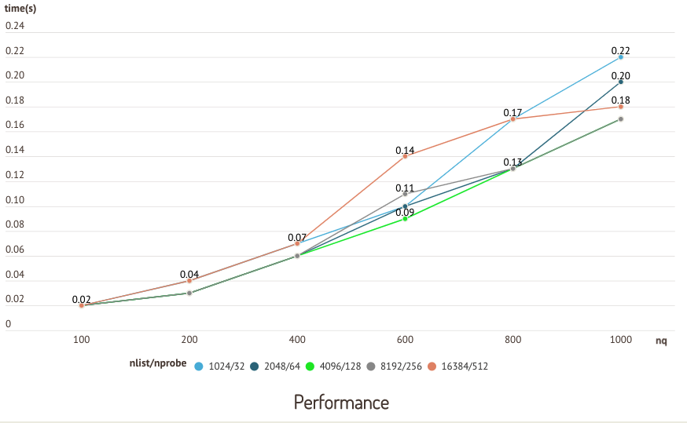

# Performance FAQ

#### How to set `nlist` and `nprobe` for IVF indexes?

Setting `nlist` is scenario-specific. As a rule of thumb, the recommended value of `nlist` is `4 × sqrt(n)`, where `n` is the total number of entities in a segment.

The size of each segment is determined by the `datacoord.segment.maxSize` parameter, which is set to 512 MB by default. The total number of entities in a segment n can be estimated by dividing `datacoord.segment.maxSize` by the size of each entity.

Setting `nprobe` is specific to the dataset and scenario, and involves a trade-off between accuracy and query performance. We recommend finding the ideal value through repeated experimentation.

The following charts are results from a test running on the sift50m dataset and IVF_SQ8 index, which compares recall and query performance of different `nlist`/`nprobe` pairs.

#### Why do queries sometimes take longer on smaller datasets?

Query operations are conducted on segments. Indexes reduce the amount of time it takes to query a segment. If a segment has not been indexed, Milvus resorts to brute-force search on the raw data—drastically increasing query time.

Therefore, it usually takes longer to query on a small dataset (collection) because it has not built index. This is because the sizes of its segments have not reached the index-building threshold set by `rootCoord.minSegmentSizeToEnableindex`. Call `create_index()` to force Milvus to index segments that have reached the threshold but not yet been automatically indexed, significantly improving query performance.

#### What factors impact CPU usage?

CPU usage increases when Milvus is building indexes or running queries. In general, index building is CPU intensive except when using Annoy, which runs on a single thread.

When running queries, CPU usage is affected by `nq` and `nprobe`. When `nq` and `nprobe` are small, concurrency is low and CPU usage stays low.

#### Does simultaneously inserting data and searching impact query performance?

Insert operations are not CPU intensive. However, because new segments may not have reached the threshold for index building, Milvus resorts to brute-force search—significantly impacting query performance.

The `rootcoord.minSegmentSizeToEnableIndex` parameter determines the index-building threshold for a segment, and is set to 1024 rows by default. See [System Configuration](system_configuration.md) for more information.

#### Is storage space released right after data deletion in Milvus?

No, storage space will not be immediately released when you delete data in Milvus. Although deleting data marks entities as "logically deleted," the actual space might not be freed instantly. Here's why:

- **Compaction**: Milvus automatically compacts data in the background. This process merges smaller data segments into larger ones and removes logically deleted data (entities marked for deletion) or data that has exceeded its Time-To-Live (TTL). However, compaction creates new segments while marking old ones as "Dropped."
- **Garbage Collection**: A separate process called Garbage Collection (GC) periodically removes these "Dropped" segments, freeing up the storage space they occupied. This ensures efficient use of storage but can introduce a slight delay between deletion and space reclamation.

#### Can I see inserted, deleted, or upserted data immediately after the operation without waiting for a flush?

Yes, in Milvus, data visibility is not directly tied to flush operations due to its storage-compute disaggregation architecture. You can manage data readability using consistency levels.

When selecting a consistency level, consider the trade-offs between consistency and performance. For operations requiring immediate visibility, use a "Strong" consistency level. For faster writes, prioritize weaker consistency (data might not be immediately visible). For more information, refer to [Consistency](consistency.md).

#### Can indexing a VARCHAR field improve deletion speed?

Indexing a VARCHAR field can speed up "Delete By Expression" operations, but only under certain conditions:

- **INVERTED Index**: This index helps for `IN` or `==` expressions on non-primary key VARCHAR fields.
- **Trie Index**: This index helps for prefix queries (e.g., `LIKE prefix%`) on non-primary VARCHAR fields.

However, indexing a VARCHAR field does not speed up:

- **Deleting by IDs**: When the VARCHAR field is the primary key.
- **Unrelated Expressions**: When the VARCHAR field isn't part of the delete expression.

#### Still have questions?

You can:

- Check out [Milvus](https://github.com/milvus-io/milvus/issues) on GitHub. Feel free to ask questions, share ideas, and help others.
- Join our [Slack Channel](https://join.slack.com/t/milvusio/shared_invite/enQtNzY1OTQ0NDI3NjMzLWNmYmM1NmNjOTQ5MGI5NDhhYmRhMGU5M2NhNzhhMDMzY2MzNDdlYjM5ODQ5MmE3ODFlYzU3YjJkNmVlNDQ2ZTk) to find support and engage with our open-source community.
