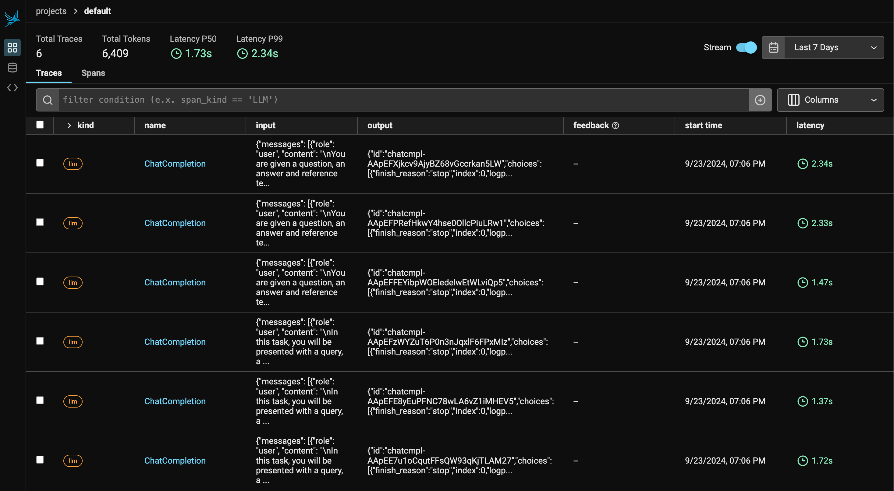

# Evaluation with Arize Pheonix

<a href="https://colab.research.google.com/github/milvus-io/bootcamp/blob/master/bootcamp/tutorials/integration/evaluation_with_phoenix.ipynb" target="_parent"></a>
<a href="https://github.com/milvus-io/bootcamp/blob/master/bootcamp/tutorials/integration/evaluation_with_phoenix.ipynb" target="_blank"></a>

This guide demonstrates how to use [Arize Pheonix](https://phoenix.arize.com/) to evaluate a Retrieval-Augmented Generation (RAG) pipeline built upon [Milvus](https://milvus.io/).

The RAG system combines a retrieval system with a generative model to generate new text based on a given prompt. The system first retrieves relevant documents from a corpus using Milvus, and then uses a generative model to generate new text based on the retrieved documents.

Arize Pheonix is a framework that helps you evaluate your RAG pipelines. There are existing tools and frameworks that help you build these pipelines but evaluating it and quantifying your pipeline performance can be hard. This is where Arize Pheonix comes in.

## Prerequisites

Before running this notebook, make sure you have the following dependencies installed:


```python
$ pip install --upgrade pymilvus openai requests tqdm pandas "arize-phoenix>=4.29.0" nest_asyncio
```

<div class="alert note">

If you are using Google Colab, to enable dependencies just installed, you may need to **restart the runtime** (click on the "Runtime" menu at the top of the screen, and select "Restart session" from the dropdown menu).

</div>

We will use OpenAI as the LLM in this example. You should prepare the [api key](https://platform.openai.com/docs/quickstart) `OPENAI_API_KEY` as an environment variable.


```python
import os

# os.environ["OPENAI_API_KEY"] = "sk-*****************"
```

## Define the RAG pipeline

We will define the RAG class that use Milvus as the vector store, and OpenAI as the LLM.
The class contains the `load` method, which loads the text data into Milvus, the `retrieve` method, which retrieves the most similar text data to the given question, and the `answer` method, which answers the given question with the retrieved knowledge.


```python
from typing import List
from tqdm import tqdm
from openai import OpenAI
from pymilvus import MilvusClient


class RAG:
    """
    RAG(Retrieval-Augmented Generation) class built upon OpenAI and Milvus.
    """

    def __init__(self, openai_client: OpenAI, milvus_client: MilvusClient):
        self._prepare_openai(openai_client)
        self._prepare_milvus(milvus_client)

    def _emb_text(self, text: str) -> List[float]:
        return (
            self.openai_client.embeddings.create(input=text, model=self.embedding_model)
            .data[0]
            .embedding
        )

    def _prepare_openai(
        self,
        openai_client: OpenAI,
        embedding_model: str = "text-embedding-3-small",
        llm_model: str = "gpt-4o-mini",
    ):
        self.openai_client = openai_client
        self.embedding_model = embedding_model
        self.llm_model = llm_model
        self.SYSTEM_PROMPT = """
            Human: You are an AI assistant. You are able to find answers to the questions from the contextual passage snippets provided.
        """
        self.USER_PROMPT = """
            Use the following pieces of information enclosed in <context> tags to provide an answer to the question enclosed in <question> tags.
            <context>
            {context}
            </context>
            <question>
            {question}
            </question>
        """

    def _prepare_milvus(
        self, milvus_client: MilvusClient, collection_name: str = "rag_collection"
    ):
        self.milvus_client = milvus_client
        self.collection_name = collection_name
        if self.milvus_client.has_collection(self.collection_name):
            self.milvus_client.drop_collection(self.collection_name)
        embedding_dim = len(self._emb_text("demo"))
        self.milvus_client.create_collection(
            collection_name=self.collection_name,
            dimension=embedding_dim,
            metric_type="IP",
            consistency_level="Strong",  # Supported values are (`"Strong"`, `"Session"`, `"Bounded"`, `"Eventually"`). See https://milvus.io/docs/consistency.md#Consistency-Level for more details.
        )

    def load(self, texts: List[str]):
        """
        Load the text data into Milvus.
        """
        data = []
        for i, line in enumerate(tqdm(texts, desc="Creating embeddings")):
            data.append({"id": i, "vector": self._emb_text(line), "text": line})
        self.milvus_client.insert(collection_name=self.collection_name, data=data)

    def retrieve(self, question: str, top_k: int = 3) -> List[str]:
        """
        Retrieve the most similar text data to the given question.
        """
        search_res = self.milvus_client.search(
            collection_name=self.collection_name,
            data=[self._emb_text(question)],
            limit=top_k,
            search_params={"metric_type": "IP", "params": {}},  # inner product distance
            output_fields=["text"],  # Return the text field
        )
        retrieved_texts = [res["entity"]["text"] for res in search_res[0]]
        return retrieved_texts[:top_k]

    def answer(
        self,
        question: str,
        retrieval_top_k: int = 3,
        return_retrieved_text: bool = False,
    ):
        """
        Answer the given question with the retrieved knowledge.
        """
        retrieved_texts = self.retrieve(question, top_k=retrieval_top_k)
        user_prompt = self.USER_PROMPT.format(
            context="\n".join(retrieved_texts), question=question
        )
        response = self.openai_client.chat.completions.create(
            model=self.llm_model,
            messages=[
                {"role": "system", "content": self.SYSTEM_PROMPT},
                {"role": "user", "content": user_prompt},
            ],
        )
        if not return_retrieved_text:
            return response.choices[0].message.content
        else:
            return response.choices[0].message.content, retrieved_texts
```

Let's initialize the RAG class with OpenAI and Milvus clients.


```python
openai_client = OpenAI()
milvus_client = MilvusClient(uri="./milvus_demo.db")

my_rag = RAG(openai_client=openai_client, milvus_client=milvus_client)
```

<div class="alert note">

As for the argument of `MilvusClient`:
- Setting the `uri` as a local file, e.g.`./milvus.db`, is the most convenient method, as it automatically utilizes [Milvus Lite](https://milvus.io/docs/milvus_lite.md) to store all data in this file.
- If you have large scale of data, you can set up a more performant Milvus server on [docker or kubernetes](https://milvus.io/docs/quickstart.md). In this setup, please use the server uri, e.g.`http://localhost:19530`, as your `uri`.
- If you want to use [Zilliz Cloud](https://zilliz.com/cloud), the fully managed cloud service for Milvus, adjust the `uri` and `token`, which correspond to the [Public Endpoint and Api key](https://docs.zilliz.com/docs/on-zilliz-cloud-console#free-cluster-details) in Zilliz Cloud.

</div>

## Run the RAG pipeline and get results

We use the [Milvus development guide](https://github.com/milvus-io/milvus/blob/master/DEVELOPMENT.md) to be as the private knowledge in our RAG, which is a good data source for a simple RAG pipeline.

Download it and load it into the rag pipeline.


```python
import urllib.request
import os

url = "https://raw.githubusercontent.com/milvus-io/milvus/master/DEVELOPMENT.md"
file_path = "./Milvus_DEVELOPMENT.md"

if not os.path.exists(file_path):
    urllib.request.urlretrieve(url, file_path)
with open(file_path, "r") as file:
    file_text = file.read()

text_lines = file_text.split("# ")
my_rag.load(text_lines)
```

    Creating embeddings: 100%|██████████| 47/47 [00:12<00:00,  3.84it/s]


Let's define a query question about the content of the development guide documentation. And then use the `answer` method to get the answer and the retrieved context texts.


```python
question = "what is the hardware requirements specification if I want to build Milvus and run from source code?"
my_rag.answer(question, return_retrieved_text=True)
```


    ('The hardware requirements specification to build and run Milvus from source code are:\n\n- 8GB of RAM\n- 50GB of free disk space',
     ['Hardware Requirements\n\nThe following specification (either physical or virtual machine resources) is recommended for Milvus to build and run from source code.\n\n```\n- 8GB of RAM\n- 50GB of free disk space\n```\n\n##',
      'Building Milvus on a local OS/shell environment\n\nThe details below outline the hardware and software requirements for building on Linux and MacOS.\n\n##',
      "Software Requirements\n\nAll Linux distributions are available for Milvus development. However a majority of our contributor worked with Ubuntu or CentOS systems, with a small portion of Mac (both x86_64 and Apple Silicon) contributors. If you would like Milvus to build and run on other distributions, you are more than welcome to file an issue and contribute!\n\nHere's a list of verified OS types where Milvus can successfully build and run:\n\n- Debian/Ubuntu\n- Amazon Linux\n- MacOS (x86_64)\n- MacOS (Apple Silicon)\n\n##"])


Now let's prepare some questions with its corresponding ground truth answers. We get answers and contexts from our RAG pipeline.


```python
from datasets import Dataset
import pandas as pd

question_list = [
    "what is the hardware requirements specification if I want to build Milvus and run from source code?",
    "What is the programming language used to write Knowhere?",
    "What should be ensured before running code coverage?",
]
ground_truth_list = [
    "If you want to build Milvus and run from source code, the recommended hardware requirements specification is:\n\n- 8GB of RAM\n- 50GB of free disk space.",
    "The programming language used to write Knowhere is C++.",
    "Before running code coverage, you should make sure that your code changes are covered by unit tests.",
]
contexts_list = []
answer_list = []
for question in tqdm(question_list, desc="Answering questions"):
    answer, contexts = my_rag.answer(question, return_retrieved_text=True)
    contexts_list.append(contexts)
    answer_list.append(answer)

df = pd.DataFrame(
    {
        "question": question_list,
        "contexts": contexts_list,
        "answer": answer_list,
        "ground_truth": ground_truth_list,
    }
)
rag_results = Dataset.from_pandas(df)
df
```

    /Users/eureka/miniconda3/envs/zilliz/lib/python3.9/site-packages/tqdm/auto.py:21: TqdmWarning: IProgress not found. Please update jupyter and ipywidgets. See https://ipywidgets.readthedocs.io/en/stable/user_install.html
      from .autonotebook import tqdm as notebook_tqdm
    Answering questions: 100%|██████████| 3/3 [00:03<00:00,  1.04s/it]


<div>
<style scoped>
    .dataframe tbody tr th:only-of-type {
        vertical-align: middle;
    }

    .dataframe tbody tr th {
        vertical-align: top;
    }

    .dataframe thead th {
        text-align: right;
    }
</style>
<table border="1" class="dataframe">
  <thead>
    <tr style="text-align: right;">
      <th></th>
      <th>question</th>
      <th>contexts</th>
      <th>answer</th>
      <th>ground_truth</th>
    </tr>
  </thead>
  <tbody>
    <tr>
      <th>0</th>
      <td>what is the hardware requirements specificatio...</td>
      <td>[Hardware Requirements\n\nThe following specif...</td>
      <td>The hardware requirements specification to bui...</td>
      <td>If you want to build Milvus and run from sourc...</td>
    </tr>
    <tr>
      <th>1</th>
      <td>What is the programming language used to write...</td>
      <td>[CMake &amp; Conan\n\nThe algorithm library of Mil...</td>
      <td>The programming language used to write Knowher...</td>
      <td>The programming language used to write Knowher...</td>
    </tr>
    <tr>
      <th>2</th>
      <td>What should be ensured before running code cov...</td>
      <td>[Code coverage\n\nBefore submitting your pull ...</td>
      <td>Before running code coverage, it should be ens...</td>
      <td>Before running code coverage, you should make ...</td>
    </tr>
  </tbody>
</table>
</div>


## Evaluation with Arize Phoenix

We use Arize Phoenix to evaluate our retrieval-augmented generation (RAG) pipeline, focusing on two key metrics:

- **Hallucination Evaluation**: Determines if the content is factual or hallucinatory (information not grounded in context), ensuring data integrity.
  - **Hallucination Explanation**: Explains why a response is factual or not.
  
- **QA Evaluation**: Assesses the accuracy of model answers to input queries.
  - **QA Explanation**: Details why an answer is correct or incorrect.

### Phoenix Tracing Overview

Phoenix provides **OTEL-compatible tracing** for LLM applications, with integrations for frameworks like **Langchain**, **LlamaIndex**, and SDKs such as **OpenAI** and **Mistral**. Tracing captures the entire request flow, offering insights into:

- **Application Latency**: Identify and optimize slow LLM invocations and component performance.
- **Token Usage**: Break down token consumption for cost optimization.
- **Runtime Exceptions**: Capture critical issues like rate-limiting.
- **Retrieved Documents**: Analyze document retrieval, score, and order.

By utilizing Phoenix’s tracing, you can **identify bottlenecks**, **optimize resources**, and **ensure system reliability** across various frameworks and languages.


```python
import phoenix as px
from phoenix.trace.openai import OpenAIInstrumentor

# To view traces in Phoenix, you will first have to start a Phoenix server. You can do this by running the following:
session = px.launch_app()

# Initialize OpenAI auto-instrumentation
OpenAIInstrumentor().instrument()
```

    🌍 To view the Phoenix app in your browser, visit http://localhost:6006/
    📖 For more information on how to use Phoenix, check out https://docs.arize.com/phoenix





```python
import nest_asyncio

from phoenix.evals import HallucinationEvaluator, OpenAIModel, QAEvaluator, run_evals

nest_asyncio.apply()  # This is needed for concurrency in notebook environments

# Set your OpenAI API key
eval_model = OpenAIModel(model="gpt-4o")

# Define your evaluators
hallucination_evaluator = HallucinationEvaluator(eval_model)
qa_evaluator = QAEvaluator(eval_model)

# We have to make some minor changes to our dataframe to use the column names expected by our evaluators
# for `hallucination_evaluator` the input df needs to have columns 'output', 'input', 'context'
# for `qa_evaluator` the input df needs to have columns 'output', 'input', 'reference'
df["context"] = df["contexts"]
df["reference"] = df["contexts"]
df.rename(columns={"question": "input", "answer": "output"}, inplace=True)
assert all(
    column in df.columns for column in ["output", "input", "context", "reference"]
)

# Run the evaluators, each evaluator will return a dataframe with evaluation results
# We upload the evaluation results to Phoenix in the next step
hallucination_eval_df, qa_eval_df = run_evals(
    dataframe=df,
    evaluators=[hallucination_evaluator, qa_evaluator],
    provide_explanation=True,
)
```

    run_evals |██████████| 6/6 (100.0%) | ⏳ 00:03<00:00 |  1.64it/s


```python
results_df = df.copy()
results_df["hallucination_eval"] = hallucination_eval_df["label"]
results_df["hallucination_explanation"] = hallucination_eval_df["explanation"]
results_df["qa_eval"] = qa_eval_df["label"]
results_df["qa_explanation"] = qa_eval_df["explanation"]
results_df.head()
```


<div>
<style scoped>
    .dataframe tbody tr th:only-of-type {
        vertical-align: middle;
    }

    .dataframe tbody tr th {
        vertical-align: top;
    }

    .dataframe thead th {
        text-align: right;
    }
</style>
<table border="1" class="dataframe">
  <thead>
    <tr style="text-align: right;">
      <th></th>
      <th>input</th>
      <th>contexts</th>
      <th>output</th>
      <th>ground_truth</th>
      <th>context</th>
      <th>reference</th>
      <th>hallucination_eval</th>
      <th>hallucination_explanation</th>
      <th>qa_eval</th>
      <th>qa_explanation</th>
    </tr>
  </thead>
  <tbody>
    <tr>
      <th>0</th>
      <td>what is the hardware requirements specificatio...</td>
      <td>[Hardware Requirements\n\nThe following specif...</td>
      <td>The hardware requirements specification to bui...</td>
      <td>If you want to build Milvus and run from sourc...</td>
      <td>[Hardware Requirements\n\nThe following specif...</td>
      <td>[Hardware Requirements\n\nThe following specif...</td>
      <td>factual</td>
      <td>To determine if the answer is factual or hallu...</td>
      <td>correct</td>
      <td>To determine if the answer is correct, we need...</td>
    </tr>
    <tr>
      <th>1</th>
      <td>What is the programming language used to write...</td>
      <td>[CMake &amp; Conan\n\nThe algorithm library of Mil...</td>
      <td>The programming language used to write Knowher...</td>
      <td>The programming language used to write Knowher...</td>
      <td>[CMake &amp; Conan\n\nThe algorithm library of Mil...</td>
      <td>[CMake &amp; Conan\n\nThe algorithm library of Mil...</td>
      <td>factual</td>
      <td>To determine if the answer is factual or hallu...</td>
      <td>correct</td>
      <td>To determine if the answer is correct, we need...</td>
    </tr>
    <tr>
      <th>2</th>
      <td>What should be ensured before running code cov...</td>
      <td>[Code coverage\n\nBefore submitting your pull ...</td>
      <td>Before running code coverage, it should be ens...</td>
      <td>Before running code coverage, you should make ...</td>
      <td>[Code coverage\n\nBefore submitting your pull ...</td>
      <td>[Code coverage\n\nBefore submitting your pull ...</td>
      <td>factual</td>
      <td>The reference text specifies that before runni...</td>
      <td>correct</td>
      <td>To determine if the answer is correct, we need...</td>
    </tr>
  </tbody>
</table>
</div>


