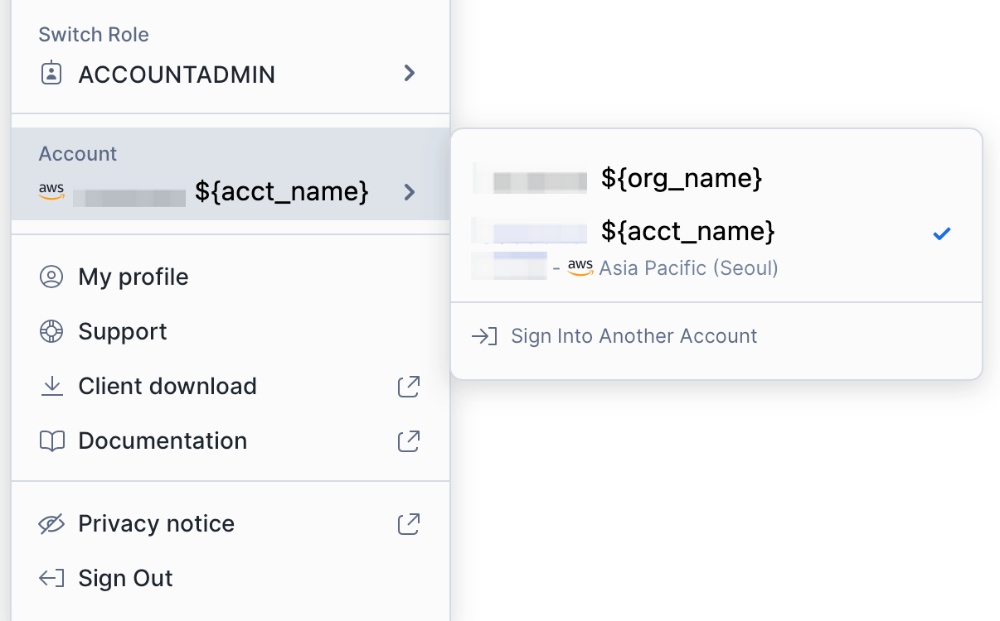
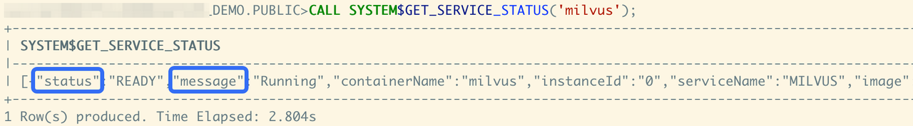
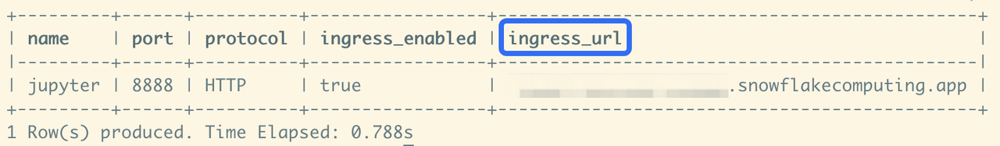
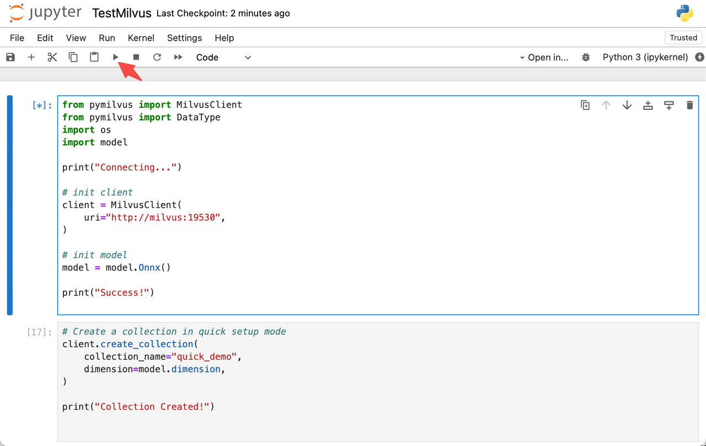
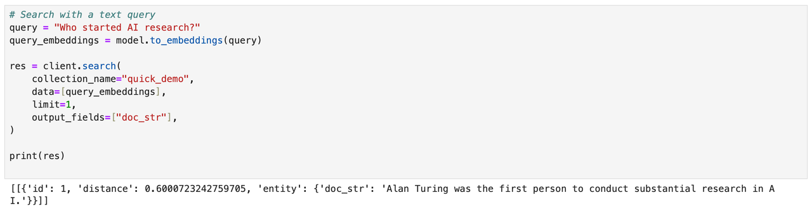

# Milvus on Snowpark Container Services

This guide demonstrates how to start a Milvus demo on Snowpark container services.

## About Snowpark Container Services

Snowpark Container Services is a fully managed container offering designed to facilitate the deployment, management, and scaling of containerized applications within the Snowflake ecosystem. This service enables users to run containerized workloads directly within Snowflake, ensuring that data doesn’t need to be moved out of the Snowflake environment for processing. For more information, please refer to the official introduction: [Snowpark Container Services](https://docs.snowflake.com/en/developer-guide/snowpark-container-services/overview).

## Configure Milvus demo

The following will let users understand the capabilities of Milvus and how to use Milvus in SPCS through configuration and code.

### 1. Obtain account information

Download the SPCS client: [SnowSQL](https://docs.snowflake.com/en/user-guide/snowsql-install-config), then log in to your account.

```shell
snowsql -a ${instance_name} -u ${user_name}
```

The rule of `${instance_name}` is `${org_name}-${acct_name}`. The relevant information can be obtained by logging in to [app.snowflake.com](http://app.snowflake.com/sn) and checking the personal account information.



### 2. Configure Role and privileges

Configure OAUTH integration.

```sql
USE ROLE ACCOUNTADMIN;
CREATE SECURITY INTEGRATION SNOWSERVICES_INGRESS_OAUTH
  TYPE=oauth
  OAUTH_CLIENT=snowservices_ingress
  ENABLED=true;
  
USE ROLE ACCOUNTADMIN;
GRANT BIND SERVICE ENDPOINT ON ACCOUNT TO ROLE SYSADMIN;
```

Create a role for the service, note that the `${PASSWORD}` part here needs to be replaced by the user when the demo is 

```sql
USE ROLE SECURITYADMIN;
CREATE ROLE MILVUS_ROLE;

USE ROLE USERADMIN;
CREATE USER milvus_user
  PASSWORD='milvususerok'
  DEFAULT_ROLE = MILVUS_ROLE
  DEFAULT_SECONDARY_ROLES = ('ALL')
  MUST_CHANGE_PASSWORD = FALSE;
  
USE ROLE SECURITYADMIN;
GRANT ROLE MILVUS_ROLE TO USER milvus_user;
```

### 3. Create data storage configuration

- Create warehouse and database

    ```sql
    USE ROLE SYSADMIN;
    CREATE OR REPLACE WAREHOUSE MILVUS_WAREHOUSE WITH
    WAREHOUSE_SIZE='X-SMALL'
    AUTO_SUSPEND = 180
    AUTO_RESUME = true
    INITIALLY_SUSPENDED=false;
    
    USE ROLE SYSADMIN;
    CREATE DATABASE IF NOT EXISTS MILVUS_DEMO;
    USE DATABASE MILVUS_DEMO;
    CREATE IMAGE REPOSITORY MILVUS_DEMO.PUBLIC.MILVUS_REPO;
    CREATE OR REPLACE STAGE YAML_STAGE;
    CREATE OR REPLACE STAGE DATA ENCRYPTION = (TYPE = 'SNOWFLAKE_SSE');
    CREATE OR REPLACE STAGE FILES ENCRYPTION = (TYPE = 'SNOWFLAKE_SSE');
    ```

- Grant role privileges

    ```sql
    USE ROLE SECURITYADMIN;
    GRANT ALL PRIVILEGES ON DATABASE MILVUS_DEMO TO MILVUS_ROLE;
    GRANT ALL PRIVILEGES ON SCHEMA MILVUS_DEMO.PUBLIC TO MILVUS_ROLE;
    GRANT ALL PRIVILEGES ON WAREHOUSE MILVUS_WAREHOUSE TO MILVUS_ROLE;
    GRANT ALL PRIVILEGES ON STAGE MILVUS_DEMO.PUBLIC.FILES TO MILVUS_ROLE;
    ```

- Configure ACL

    ```sql
    USE ROLE ACCOUNTADMIN;
    USE DATABASE MILVUS_DEMO;
    USE SCHEMA PUBLIC;
    CREATE NETWORK RULE allow_all_rule
    TYPE = 'HOST_PORT'
    MODE= 'EGRESS'
    VALUE_LIST = ('0.0.0.0:443','0.0.0.0:80');

    CREATE EXTERNAL ACCESS INTEGRATION allow_all_eai
    ALLOWED_NETWORK_RULES=(allow_all_rule)
    ENABLED=TRUE;

    GRANT USAGE ON INTEGRATION allow_all_eai TO ROLE SYSADMIN;
    ```

### 4. Create images

The image used by Milvus needs to be built locally and then uploaded by user. For the relevant configuration of the image, please refer to [this repo](https://github.com/dald001/milvus_on_spcs). After cloning the code, go to the root directory of the project and prepare to build the image.

- Build images locally

    Open your local shell and begin to build images.

    ```shell
    cd ${repo_git_root_path}
    docker build --rm --no-cache --platform linux/amd64 -t milvus ./images/milvus
    docker build --rm --no-cache --platform linux/amd64 -t jupyter ./images/jupyter
    ```

    There are two images here, the first one is running the Milvus database, and the second one is the notebook used for display.

    After the local images are built, prepare to tag and upload them.

- Tag built images

    Log in to the docker hub of SPCS.

    ```shell
    docker login ${instance_name}.registry.snowflakecomputing.com -u ${user_name}
    ```

    And you can tag images for spcs now.

    ```shell
    docker tag milvus ${instance_name}.registry.snowflakecomputing.com/milvus_demo/public/milvus_repo/milvus
    docker tag jupyter ${instance_name}.registry.snowflakecomputing.com/milvus_demo/public/milvus_repo/jupyter
    ```

    Then use `docker images | grep milvus` in the local shell to check whether the image has been packaged and tagged successfully.

    ```shell
    docker images | grep milvus

    ${instance_name}.registry.snowflakecomputing.com/milvus_demo/public/milvus_repo/milvus    latest        3721bbb8f62b   2 days ago    2.95GB
    ${instance_name}.registry.snowflakecomputing.com/milvus_demo/public/milvus_repo/jupyter   latest        20633f5bcadf   2 days ago    2GB
    ```

- Push images to SPCS

    ```shell
    docker push ${instance_name}.registry.snowflakecomputing.com/milvus_demo/public/milvus_repo/milvus
    docker push ${instance_name}.registry.snowflakecomputing.com/milvus_demo/public/milvus_repo/jupyter
    ```

### 5. Create and start services

Let us go back to the SnowSQL shell.

- Create Compute pools

```sql
USE ROLE SYSADMIN;
CREATE COMPUTE POOL IF NOT EXISTS MILVUS_COMPUTE_POOL
  MIN_NODES = 1
  MAX_NODES = 1
  INSTANCE_FAMILY = CPU_X64_S
  AUTO_RESUME = true;
CREATE COMPUTE POOL IF NOT EXISTS JUPYTER_COMPUTE_POOL
  MIN_NODES = 1
  MAX_NODES = 1
  INSTANCE_FAMILY = CPU_X64_S
  AUTO_RESUME = true;
```

Check the compute pools through `DESCRIBE` until the status is `ACTIVE` or `IDLE`.

```sql
DESCRIBE COMPUTE POOL MILVUS_COMPUTE_POOL;
DESCRIBE COMPUTE POOL JUPYTER_COMPUTE_POOL;
```


- Upload spec files

After creating the compute pool, start preparing the spce file for the service. The files are also in [this repo](https://github.com/dald001/milvus_on_spcs). Please refer to the specs directory.

Open the spec files of these two services, find `${org_name}-${acct_name}` in the spec file, and replace them with ${instance_name} of your own account. After modification, use SnowSQL to complete the upload.

```sql
PUT file://${path/to/jupyter.yaml} @yaml_stage overwrite=true auto_compress=false;
PUT file://${path/to/milvus.yaml} @yaml_stage overwrite=true auto_compress=false;
```

- Create service

When the upload is complete, you are ready to create the service, Continue to complete the process of creating the service.

```sql
USE ROLE SYSADMIN;
USE DATABASE MILVUS_DEMO;
USE SCHEMA PUBLIC;

CREATE SERVICE MILVUS
  IN COMPUTE POOL MILVUS_COMPUTE_POOL 
  FROM @YAML_STAGE
  SPEC='milvus.yaml'
  MIN_INSTANCES=1
  MAX_INSTANCES=1;

CREATE SERVICE JUPYTER
  IN COMPUTE POOL JUPYTER_COMPUTE_POOL 
  FROM @YAML_STAGE
  SPEC='jupyter.yaml'
  MIN_INSTANCES=1
  MAX_INSTANCES=1;
```

The services can also be viewed through `SHOW SERVICES;`.

```sql
SHOW SERVICES;

+---------+---------------+-------------+----------+----------------------+--------------------------------------------------------+-----------------
| name    | database_name | schema_name | owner    | compute_pool         | dns_name                                               | ......
|---------+---------------+-------------+----------+----------------------+--------------------------------------------------------+-----------------
| JUPYTER | MILVUS_DEMO   | PUBLIC      | SYSADMIN | JUPYTER_COMPUTE_POOL | jupyter.public.milvus-demo.snowflakecomputing.internal | ...... 
| MILVUS  | MILVUS_DEMO   | PUBLIC      | SYSADMIN | MILVUS_COMPUTE_POOL  | milvus.public.milvus-demo.snowflakecomputing.internal  | ......
+---------+---------------+-------------+----------+----------------------+--------------------------------------------------------+-----------------
```

If you encounter problems starting the service, you can view service information through `CALL SYSTEM$GET_SERVICE_STATUS('milvus');`.



More information can be obtained through `CALL SYSTEM$GET_SERVICE_LOGS('milvus', '0', 'milvus', 10);`.

## Use Notebook

Use **SnowSQL** to grant permissions.

```sql
USE ROLE SECURITYADMIN;
GRANT USAGE ON SERVICE MILVUS_DEMO.PUBLIC.JUPYTER TO ROLE MILVUS_ROLE;
```

Then view and record the endpoint of the Jupyter nootbook.

```sql
USE ROLE SYSADMIN;
SHOW ENDPOINTS IN SERVICE MILVUS_DEMO.PUBLIC.JUPYTER;
```

Record the `ingress_url` part of the information, then open the browser and enter the `ingress_url`, use the milvus_user account to log in to the website.



Opening the notebook through the `ingress_url`, double-click the `TestMilvus.ipynb` file on the page to try out Milvus. Select the first part of the code block, and click the **Run** button to start establishing the connection and initializing the embedding function.



After establishing the connection, continue to click **RUN**. The code will turn a piece of text into vector data after embedding processing, and then insert it into Milvus.

```python
docs = [
    "Artificial intelligence was founded as an academic discipline in 1956.",
    "Alan Turing was the first person to conduct substantial research in AI.",
    "Born in Maida Vale, London, Turing was raised in southern England.",
]
```

Then use a text as a query: "Who started AI research?", perform the query after embedding processing, and finally obtain and display the most relevant results.



For more information on the usage of the Milvus client, you can refer to the [Milvus Doc](quickstart.md) section.

## 7. Clean up

After verification, you can use SnowSQL to cleanup the  services, roles, and data resources.

```sql
USE ROLE ACCOUNTADMIN;
DROP USER milvus_user;

USE ROLE SYSADMIN;
DROP SERVICE MILVUS;
DROP SERVICE JUPYTER;

DROP COMPUTE POOL MILVUS_COMPUTE_POOL;
DROP COMPUTE POOL JUPYTER_COMPUTE_POOL;

DROP IMAGE REPOSITORY MILVUS_DEMO.PUBLIC.MILVUS_REPO;
DROP DATABASE MILVUS_DEMO;
DROP WAREHOUSE MILVUS_WAREHOUSE;

USE ROLE ACCOUNTADMIN;
DROP ROLE MILVUS_ROLE;
DROP SECURITY INTEGRATION SNOWSERVICES_INGRESS_OAUTH;
```

## About Milvus

For more information about Milvus, you can start with the [Milvus introduction](overview.md) and [Quick start](quickstart.md). Of course, there is a more detailed introduction to the API, refer to the [Python](https://milvus.io/api-reference/pymilvus/v2.4.x/About.md) and [Java](https://milvus.io/api-reference/java/v2.3.x/About.md) versions, and there is also information about [Embeddings](https://milvus.io/docs/embeddings.md) and [Integrations](https://milvus.io/docs/integrate_with_openai.md) for reference.
