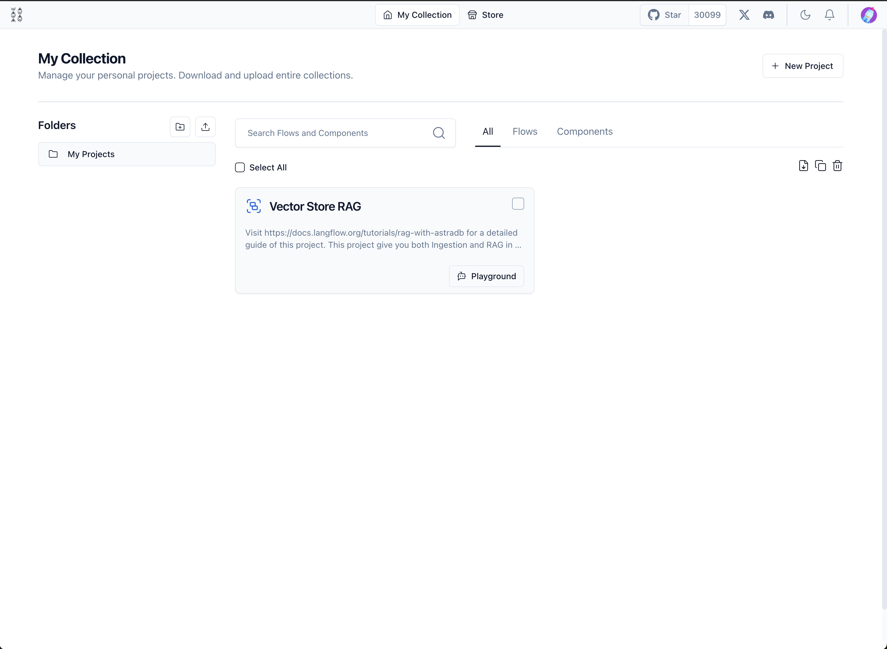
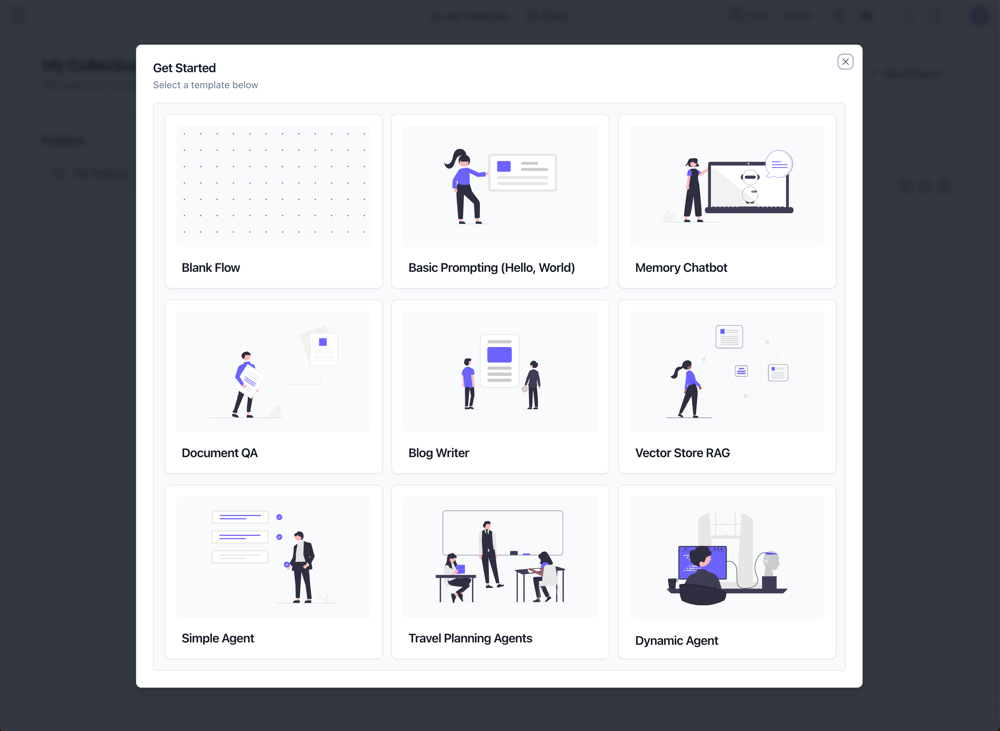
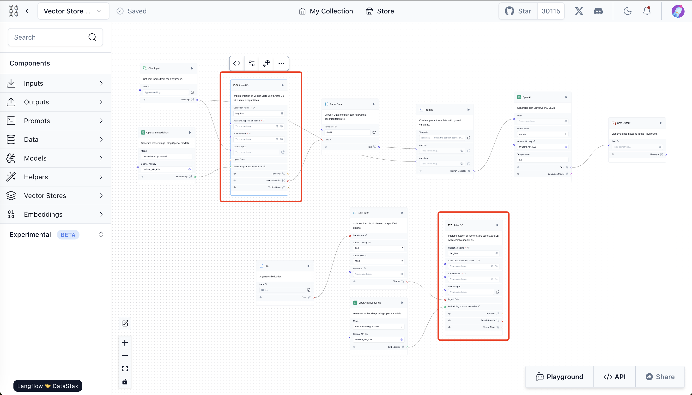
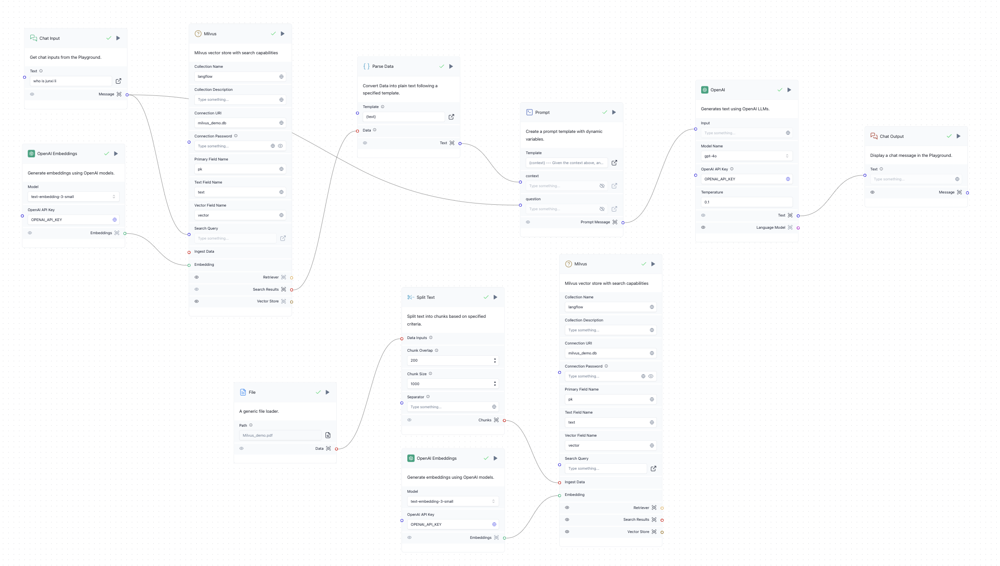
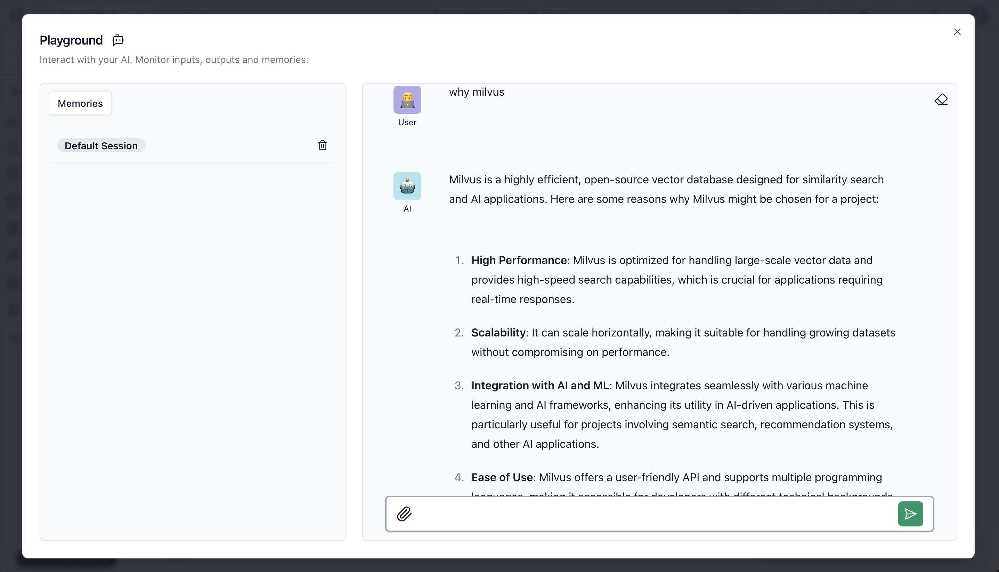

# Building a RAG System Using Langflow with Milvus

This guide demonstrates how to use [Langflow](https://www.langflow.org/) to build a Retrieval-Augmented Generation (RAG) pipeline with [Milvus](https://milvus.io/).

The RAG system enhances text generation by first retrieving relevant documents from a knowledge base and then generating new responses based on this context. Milvus is used to store and retrieve text embeddings, while Langflow facilitates the integration of retrieval and generation in a visual workflow.

Langflow enables easy construction of RAG pipelines, where chunks of text are embedded, stored in Milvus, and retrieved when relevant queries are made. This allows the language model to generate contextually informed responses.

Milvus serves as a scalable vector database that quickly finds semantically similar text, while Langflow allows you to manage how your pipeline handles text retrieval and response generation. Together, they provide an efficient way to build a robust RAG pipeline for enhanced text-based applications.

## Prerequisites

Before running this notebook, make sure you have the following dependencies installed:


```shell
$ python -m pip install langflow -U
```

## Tutorial

Once all the dependencies are installed, start a Langflow dashboard by typing in the following command:

```shell
$ python -m langflow run
```

Then a dashboard will pop up as shown below:


We want to create a **Vector Store** project, so we first need to click the **New Project** button. A panel would pop up, and we choose the **Vector Store RAG** option:


Once the Vector Store Rag project is successfully created, the default vector store is AstraDB, whereas we want to use Milvus. So we need to replace these two astraDB module with Milvus in order to use Milvus as vector store.


### Steps to replace astraDB with Milvus:

1. Remove existing cards of Vector Store. Click on two AstraDB cards marked red in the above image, and press **backspace** to delete them.
2. Click on the **Vector Store** option in the sidebar, chose Milvus and drag it into the canvas. Do this twice as we need 2 Milvus cards, one for storing the file processing workflow and one for search workflow.
3. Link the Milvus Modules to the rest of the components. See the image below for reference.
4. Configure the Milvus credentials for both Milvus modules. The simplest way is to use Milvus Lite by setting Connection URI to milvus_demo.db. If you have a Milvus server self-deployed or on Zilliz Cloud, set the Connection URI to server endpoint and Connection Password to token (for Milvus that's concatenated "<username>:<password>", for Zilliz Cloud it's API Key). See below image for reference:



### Embed knowledge into the RAG system

1. Upload a file as LLM's knowledge base through the file module on the bottom left. Here we uploaded a file containing a brief introduction to Milvus
2. Run the inserting workflow by pressing the run botton on the Milvus module on the bottom right. This will insert the knowledge to the Milvus vector store
3. Test whether the knowledge is in memory. Open playground and ask anything related to the file you uploaded.

