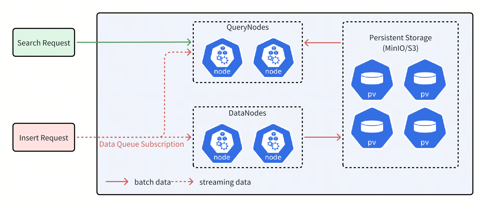
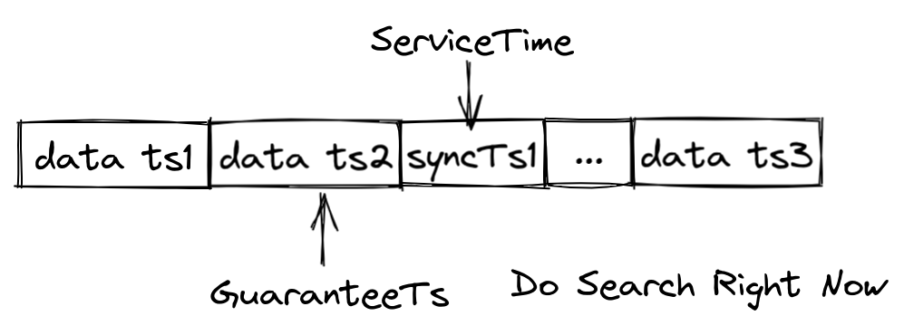
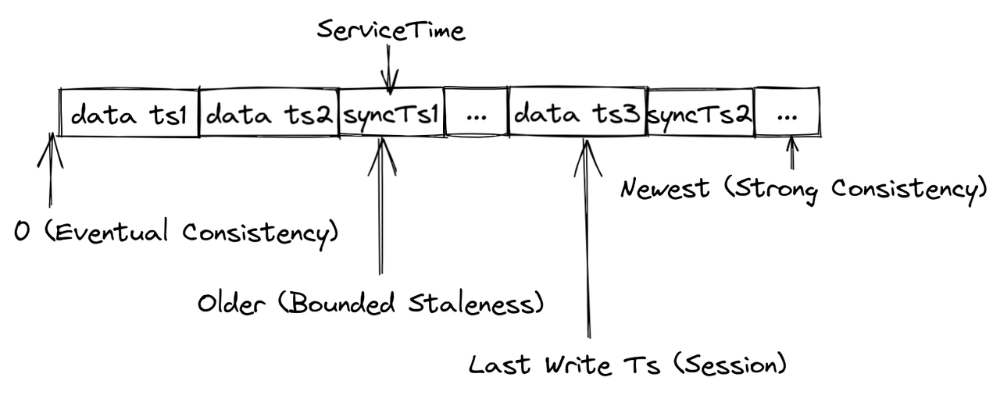

# Consistency Level

As a distributed vector database, Milvus offers multiple levels of consistency to ensure that each node or replica can access the same data during read and write operations. Currently, the supported levels of consistency include **Strong**, **Bounded**, **Eventually**, and **Session**, with **Bounded** being the default level of consistency used.

## Overview

Milvus is a system that separates storage and computation. In this system, **DataNodes** are responsible for the persistence of data and ultimately store it in distributed object storage such as MinIO/S3. **QueryNodes** handle computational tasks like Search. These tasks involve processing both **batch data** and **streaming data**. Simply put, batch data can be understood as data that has already been stored in object storage while streaming data refers to data that has not yet been stored in object storage. Due to network latency, QueryNodes often do not hold the most recent streaming data. Without additional safeguards, performing Search directly on streaming data may result in the loss of many uncommitted data points, affecting the accuracy of search results.

Milvus Commercial Edition is a system that separates storage and computation. In this system, DataNodes are responsible for the persistence of data and ultimately store it in distributed object storage such as MinIO/S3. QueryNodes handle computational tasks like Search. These tasks involve processing both batch data and streaming data. Simply put, batch data can be understood as data that has already been stored in object storage, while streaming data refers to data that has not yet been stored in object storage. Due to network latency, QueryNodes often do not hold the most recent streaming data. Without additional safeguards, performing Search directly on streaming data may result in the loss of many uncommitted data points, affecting the accuracy of search results.



As shown in the figure above, QueryNodes can receive both streaming data and batch data simultaneously after receiving a Search request. However, due to network latency, the streaming data obtained by QueryNodes may be incomplete.

To address this issue, Milvus timestamps each record in the data queue and continuously inserts synchronization timestamps into the data queue. Whenever a synchronization timestamp (syncTs) is received, QueryNodes sets it as the ServiceTime, meaning that QueryNodes can see all data prior to that Service Time. Based on the ServiceTime, Milvus can provide guarantee timestamps (GuaranteeTs) to meet different user requirements for consistency and availability. Users can inform QueryNodes of the need to include data prior to a specified point in time in the search scope by specifying GuaranteeTs in their Search requests.



As shown in the figure above, if GuaranteeTs is less than ServiceTime, it means that all data before the specified time point has been fully written to disk, allowing QueryNodes to immediately perform the Search operation. When GuaranteeTs is greater than ServiceTime, QueryNodes must wait until ServiceTime exceeds GuaranteeTs before they can execute the Search operation.

Users need to make a trade-off between query accuracy and query latency. If users have high consistency requirements and are not sensitive to query latency, they can set GuaranteeTs to a value as large as possible; if users wish to receive search results quickly and are more tolerant of query accuracy, then GuaranteeTs can be set to a smaller value.



Milvus provides four types of consistency levels with different GuaranteeTs.

- **Strong**

    The latest timestamp is used as the GuaranteeTs, and QueryNodes have to wait until the ServiceTime meets the GuaranteeTs before executing Search requests.

- **Eventual**

    The GuaranteeTs is set to an extremely small value, such as 1, to avoid consistency checks so that QueryNodes can immediately execute Search requests upon all batch data.

- **Bounded Staleness**

    The GuranteeTs is set to a time point earlier than the latest timestamp to make QueryNodes to perform searches with a tolerance of certain data loss.

- **Session**

    The latest time point at which the client inserts data is used as the GuaranteeTs so that QueryNodes can perform searches upon all the data inserted by the client.

Milvus uses Bounded Staleness as the default consistency level. If the GuaranteeTs is left unspecified, the latest ServiceTime is used as the GuaranteeTs.

## Set Consistency Level

You can set different consistency levels when you create a collection as well as perform searches and queries.

### Set Consistency Level upon Creating Collection

When creating a collection, you can set the consistency level for the searches and queries within the collection. The following code example sets the consistency level to **Strong**.

<div class="multipleCode">
    <a href="#python">Python</a>
    <a href="#java">Java</a>
    <a href="#go">Go</a>
    <a href="#bash">cURL</a>
</div>

```python
client.create_collection(
    collection_name="my_collection",
    schema=schema,
    # highlight-next
    consistency_level="Strong",
)
```

```java
CreateCollectionReq createCollectionReq = CreateCollectionReq.builder()
        .collectionName("my_collection")
        .collectionSchema(schema)
        // highlight-next
        .consistencyLevel(ConsistencyLevel.STRONG)
        .build();
client.createCollection(createCollectionReq);
```

```go
err = client.CreateCollection(ctx,
    milvusclient.NewCreateCollectionOption("my_collection", schema).
        WithConsistencyLevel(entity.ClStrong))
if err != nil {
    fmt.Println(err.Error())
    // handle error
}
```

```bash
export schema='{
        "autoId": true,
        "enabledDynamicField": false,
        "fields": [
            {
                "fieldName": "id",
                "dataType": "Int64",
                "isPrimary": true
            },
            {
                "fieldName": "vector",
                "dataType": "FloatVector",
                "elementTypeParams": {
                    "dim": "5"
                }
            },
            {
                "fieldName": "my_varchar",
                "dataType": "VarChar",
                "isClusteringKey": true,
                "elementTypeParams": {
                    "max_length": 512
                }
            }
        ]
    }'

export params='{
    "consistencyLevel": "Strong"
}'

curl --request POST \
--url "${CLUSTER_ENDPOINT}/v2/vectordb/collections/create" \
--header "Authorization: Bearer ${TOKEN}" \
--header "Content-Type: application/json" \
-d "{
    \"collectionName\": \"my_collection\",
    \"schema\": $schema,
    \"params\": $params
}"
```

Possible values for the `consistency_level` parameter are `Strong`, `Bounded`, `Eventually`, and `Session`.

### Set Consistency Level in Search

You can always change the consistency level for a specific search. The following code example sets the consistency level back to the **Bounded**. The change applies only to the current search request.

<div class="multipleCode">
    <a href="#python">Python</a>
    <a href="#java">Java</a>
    <a href="#plaintext">plaintext</a>
    <a href="#bash">cURL</a>
</div>

```python
res = client.search(
    collection_name="my_collection",
    data=[query_vector],
    limit=3,
    search_params={"metric_type": "IP"}，
    # highlight-start
    consistency_level="Bounded",
    # highlight-next
)
```

```java
SearchReq searchReq = SearchReq.builder()
        .collectionName("my_collection")
        .data(Collections.singletonList(queryVector))
        .topK(3)
        .searchParams(params)
        .consistencyLevel(ConsistencyLevel.BOUNDED)
        .build();

SearchResp searchResp = client.search(searchReq);
```

```plaintext
resultSets, err := client.Search(ctx, milvusclient.NewSearchOption(
    "my_collection", // collectionName
    3,               // limit
    []entity.Vector{entity.FloatVector(queryVector)},
).WithConsistencyLevel(entity.ClBounded).
    WithANNSField("vector"))
if err != nil {
    fmt.Println(err.Error())
    // handle error
}
```

```bash
curl --request POST \
--url "${CLUSTER_ENDPOINT}/v2/vectordb/entities/search" \
--header "Authorization: Bearer ${TOKEN}" \
--header "Content-Type: application/json" \
-d '{
    "collectionName": "my_collection",
    "data": [
        [0.3580376395471989, -0.6023495712049978, 0.18414012509913835, -0.26286205330961354, 0.9029438446296592]
    ],
    "limit": 3,
    "consistencyLevel": "Bounded"
}'
```

This parameter is also available in hybrid searches and the search iterator. Possible values for the `consistency_level` parameter are `Strong`, `Bounded`, `Eventually`, and `Session`.

### Set Consistency Level in Query

You can always change the consistency level for a specific search. The following code example sets the consistency level to the **Eventually**. The setting applies only to the current query request.

<div class="multipleCode">
    <a href="#python">Python</a>
    <a href="#java">Java</a>
    <a href="#plaintext">plaintext</a>
</div>

```python
res = client.query(
    collection_name="my_collection",
    filter="color like \"red%\"",
    output_fields=["vector", "color"],
    limit=3，
    # highlight-start
    consistency_level="Eventually",
    # highlight-next
)
```

```java
QueryReq queryReq = QueryReq.builder()
        .collectionName("my_collection")
        .filter("color like \"red%\"")
        .outputFields(Arrays.asList("vector", "color"))
        .limit(3)
        .consistencyLevel(ConsistencyLevel.EVENTUALLY)
        .build();
        
 QueryResp getResp = client.query(queryReq);
```

```plaintext
resultSet, err := client.Query(ctx, milvusclient.NewQueryOption("my_collection").
    WithFilter("color like \"red%\"").
    WithOutputFields("vector", "color").
    WithLimit(3).
    WithConsistencyLevel(entity.ClEventually))
if err != nil {
    fmt.Println(err.Error())
    // handle error
}
```

This parameter is also available in the query iterator. Possible values for the `consistency_level` parameter are `Strong`, `Bounded`, `Eventually`, and `Session`.