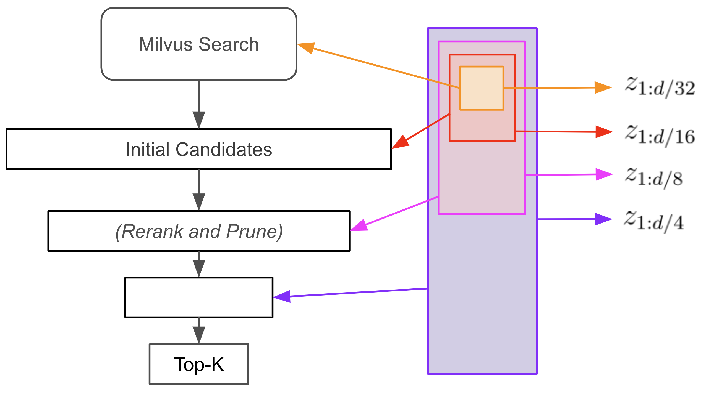
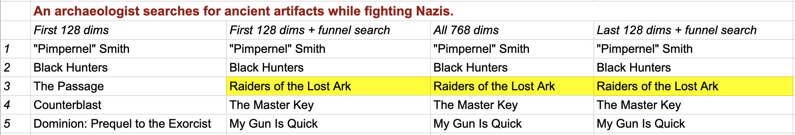
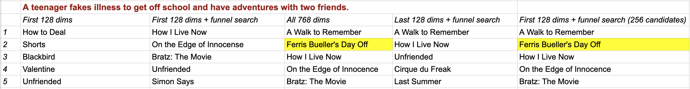
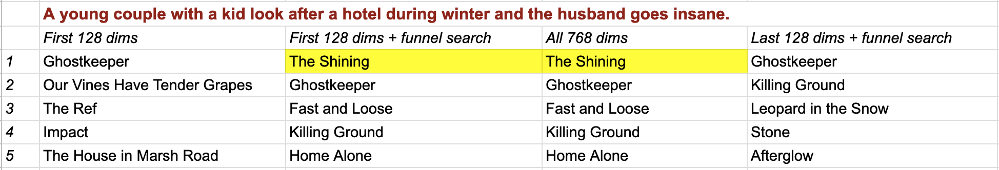

# Funnel Search with Matryoshka Embeddings

<div style='margin: auto; width: 50%;'></div>
When building efficient vector search systems, one key challenge is managing storage costs while maintaining acceptable latency and recall. Modern embedding models output vectors with hundreds or thousands of dimensions, creating significant storage and computational overhead for the raw vector and index.

Traditionally, the storage requirements are reduced by applying a quantization or dimensionality reduction method just before building the index. For instance, we can save storage by lowering the precision using Product Quantization (PQ) or the number of dimensions using Principal Component Analysis (PCA). These methods analyze the entire vector set to find a more compact one that maintains the semantic relationships between vectors.

While effective, these standard approaches reduce precision or dimensionality only once and at a single scale. But what if we could maintain multiple layers of detail simultaneously, like a pyramid of increasingly precise representations?

Enter Matryoshka embeddings. Named after Russian nesting dolls (see illustration), these clever constructs embed multiple scales of representation within a single vector. Unlike traditional post-processing methods, Matryoshka embeddings learn this multi-scale structure during the initial training process. The result is remarkable: not only does the full embedding capture input semantics, but each nested subset prefix (first half, first quarter, etc.) provides a coherent, if less detailed, representation.

In this notebook, we examine how to use Matryoshka embeddings with Milvus for semantic search. We illustrate an algorithm called "funnel search" that allows us to perform similarity search over a small subset of our embedding dimensions without a drastic drop in recall.

## Preparation


```shell
$ pip install datasets numpy pandas pymilvus sentence-transformers tqdm
```

For CPU-Only:


```shell
$ pip install torch torchvision torchaudio --index-url https://download.pytorch.org/whl/cpu
```

For CUDA 11.8:


```shell
$ pip install torch torchvision torchaudio --index-url https://download.pytorch.org/whl/cu118
```


Installation command of CUDA 11.8 is only an example. Please confirm your CUDA version when installing PyTorch.


```python
import functools

from datasets import load_dataset
import numpy as np
import pandas as pd
import pymilvus
from pymilvus import MilvusClient
from pymilvus import FieldSchema, CollectionSchema, DataType
from sentence_transformers import SentenceTransformer
import torch
import torch.nn.functional as F
from tqdm import tqdm
```

## Load Matryoshka Embedding Model

Instead of using a standard embedding model such as [`sentence-transformers/all-MiniLM-L12-v2`](https://huggingface.co/sentence-transformers/all-MiniLM-L12-v2), we use [a model from Nomic](https://huggingface.co/nomic-ai/nomic-embed-text-v1) trained especially to produce Matryoshka embeddings.


```python
model = SentenceTransformer(
    # Remove 'device='mps' if running on non-Mac device
    "nomic-ai/nomic-embed-text-v1.5",
    trust_remote_code=True,
    device="mps",
)
```

    <All keys matched successfully>


## Loading Dataset, Embedding Items, and Building Vector Database

The following code is a modification of that from the documentation page ["Movie Search with Sentence Transformers and Milvus"](https://milvus.io/docs/integrate_with_sentencetransformers.md). First, we load the dataset from HuggingFace. It contains around 35k entries, each corresponding to a movie having a Wikipedia article. We will use the `Title` and `PlotSummary` fields in this example.


```python
ds = load_dataset("vishnupriyavr/wiki-movie-plots-with-summaries", split="train")
print(ds)
```

    Dataset({
        features: ['Release Year', 'Title', 'Origin/Ethnicity', 'Director', 'Cast', 'Genre', 'Wiki Page', 'Plot', 'PlotSummary'],
        num_rows: 34886
    })


Next, we connect to a Milvus Lite database, specify the data schema, and create a collection with this schema. We will store both the unnormalized embedding and the first sixth of the embedding in separate fields. The reason for this is that we need the first 1/6th of the Matryoshka embedding for performing a similarity search, and the remaining 5/6ths of the embeddings for reranking and improving the search results.


```python
embedding_dim = 768
search_dim = 128
collection_name = "movie_embeddings"

client = MilvusClient(uri="./wiki-movie-plots-matryoshka.db")

fields = [
    FieldSchema(name="id", dtype=DataType.INT64, is_primary=True, auto_id=True),
    FieldSchema(name="title", dtype=DataType.VARCHAR, max_length=256),
    # First sixth of unnormalized embedding vector
    FieldSchema(name="head_embedding", dtype=DataType.FLOAT_VECTOR, dim=search_dim),
    # Entire unnormalized embedding vector
    FieldSchema(name="embedding", dtype=DataType.FLOAT_VECTOR, dim=embedding_dim),
]

schema = CollectionSchema(fields=fields, enable_dynamic_field=False)
client.create_collection(collection_name=collection_name, schema=schema)
```


Milvus does not currently support searching over subsets of embeddings, so we break the embeddings into two parts: the head represents the initial subset of the vector to index and search, and the tail is the remainder. The model is trained for cosine distance similarity search, so we normalize the head embeddings. However, in order to calculate similarities for larger subsets later on, we need to store the norm of the head embedding, so we can unnormalize it before joining to the tail.

To perform search via the first 1/6th of the embedding, we will need to create a vector search index over the `head_embedding` field. Later on, we will compare the results of "funnel search" with a regular vector search, and so build a search index over the full embedding also.

 *Importantly, we use the `COSINE` rather than the `IP` distance metric, because otherwise we would need to keep track of the embedding norms, which would complicate the implementation (this will make more sense once the funnel search algorithm has been described).*


```python
index_params = client.prepare_index_params()
index_params.add_index(
    field_name="head_embedding", index_type="FLAT", metric_type="COSINE"
)
index_params.add_index(field_name="embedding", index_type="FLAT", metric_type="COSINE")
client.create_index(collection_name, index_params)
```

Finally, we encode the plot summaries for all 35k movies and enter the corresponding embeddings in to the database.


```python
for batch in tqdm(ds.batch(batch_size=512)):
    # This particular model requires us to prefix 'search_document:' to stored entities
    plot_summary = ["search_document: " + x.strip() for x in batch["PlotSummary"]]

    # Output of embedding model is unnormalized
    embeddings = model.encode(plot_summary, convert_to_tensor=True)
    head_embeddings = embeddings[:, :search_dim]

    data = [
        {
            "title": title,
            "head_embedding": head.cpu().numpy(),
            "embedding": embedding.cpu().numpy(),
        }
        for title, head, embedding in zip(batch["Title"], head_embeddings, embeddings)
    ]
    res = client.insert(collection_name=collection_name, data=data)
```

    100%|██████████| 69/69 [05:57<00:00,  5.18s/it]


## Performing Funnel Search
Let's now implement a "funnel search" using the first 1/6th of the Matryoshka embedding dimensions. I have three movies in mind for retrieval and have produced my own plot summary for querying the database. We embed the queries, then perform a vector search on the `head_embedding` field, retrieving 128 result candidates.


```python
queries = [
    "An archaeologist searches for ancient artifacts while fighting Nazis.",
    "A teenager fakes illness to get off school and have adventures with two friends.",
    "A young couple with a kid look after a hotel during winter and the husband goes insane.",
]


# Search the database based on input text
def embed_search(data):
    embeds = model.encode(data)
    return [x for x in embeds]


# This particular model requires us to prefix 'search_query:' to queries
instruct_queries = ["search_query: " + q.strip() for q in queries]
search_data = embed_search(instruct_queries)

# Normalize head embeddings
head_search = [x[:search_dim] for x in search_data]

# Perform standard vector search on first sixth of embedding dimensions
res = client.search(
    collection_name=collection_name,
    data=head_search,
    anns_field="head_embedding",
    limit=128,
    output_fields=["title", "head_embedding", "embedding"],
)
```

At this point, we have performed search over a much smaller vector space, and are therefore likely to have lowered latency and lessened storage requirements for the index relative to search over the full space. Let's examine the top 5 matches for each query:


```python
for query, hits in zip(queries, res):
    rows = [x["entity"] for x in hits][:5]

    print("Query:", query)
    print("Results:")
    for row in rows:
        print(row["title"].strip())
    print()
```

    Query: An archaeologist searches for ancient artifacts while fighting Nazis.
    Results:
    "Pimpernel" Smith
    Black Hunters
    The Passage
    Counterblast
    Dominion: Prequel to the Exorcist
    
    Query: A teenager fakes illness to get off school and have adventures with two friends.
    Results:
    How to Deal
    Shorts
    Blackbird
    Valentine
    Unfriended
    
    Query: A young couple with a kid look after a hotel during winter and the husband goes insane.
    Results:
    Ghostkeeper
    Our Vines Have Tender Grapes
    The Ref
    Impact
    The House in Marsh Road
    


As we can see, recall has suffered as a consequence of truncating the embeddings during search. Funnel search fixes this with a clever trick: we can use the remainder of the embedding dimensions to rerank and prune our candidate list to recover retrieval performance without running any additional expensive vector searches.

For ease of exposition of the funnel search algorithm, we convert the Milvus search hits for each query into a Pandas dataframe.


```python
def hits_to_dataframe(hits: pymilvus.client.abstract.Hits) -> pd.DataFrame:
    """
    Convert a Milvus search result to a Pandas dataframe. This function is specific to our data schema.

    """
    rows = [x["entity"] for x in hits]
    rows_dict = [
        {"title": x["title"], "embedding": torch.tensor(x["embedding"])} for x in rows
    ]
    return pd.DataFrame.from_records(rows_dict)


dfs = [hits_to_dataframe(hits) for hits in res]
```

Now, to perform funnel search we iterate over the increasingly larger subsets of the embeddings. At each iteration, we rerank the candidates according to the new similarities and prune some fraction of the lowest ranked ones.

To make this concrete, from the previous step we have retrieved 128 candidates using 1/6 of the embedding and query dimensions. The first step in performing funnel search is to recalculate the similarities between the queries and candidates using *the first 1/3 of the dimensions*. The bottom 64 candidates are pruned. Then we repeat this process with *the first 2/3 of the dimensions*, and then *all of the dimensions*, successively pruning to 32 and 16 candidates.


```python
# An optimized implementation would vectorize the calculation of similarity scores across rows (using a matrix)
def calculate_score(row, query_emb=None, dims=768):
    emb = F.normalize(row["embedding"][:dims], dim=-1)
    return (emb @ query_emb).item()


# You could also add a top-K parameter as a termination condition
def funnel_search(
    df: pd.DataFrame, query_emb, scales=[256, 512, 768], prune_ratio=0.5
) -> pd.DataFrame:
    # Loop over increasing prefixes of the embeddings
    for dims in scales:
        # Query vector must be normalized for each new dimensionality
        emb = torch.tensor(query_emb[:dims] / np.linalg.norm(query_emb[:dims]))

        # Score
        scores = df.apply(
            functools.partial(calculate_score, query_emb=emb, dims=dims), axis=1
        )
        df["scores"] = scores

        # Re-rank
        df = df.sort_values(by="scores", ascending=False)

        # Prune (in our case, remove half of candidates at each step)
        df = df.head(int(prune_ratio * len(df)))

    return df


dfs_results = [
    {"query": query, "results": funnel_search(df, query_emb)}
    for query, df, query_emb in zip(queries, dfs, search_data)
]
```


```python
for d in dfs_results:
    print(d["query"], "\n", d["results"][:5]["title"], "\n")
```

    An archaeologist searches for ancient artifacts while fighting Nazis. 
     0           "Pimpernel" Smith
    1               Black Hunters
    29    Raiders of the Lost Ark
    34             The Master Key
    51            My Gun Is Quick
    Name: title, dtype: object 
    
    A teenager fakes illness to get off school and have adventures with two friends. 
     21               How I Live Now
    32     On the Edge of Innocence
    77             Bratz: The Movie
    4                    Unfriended
    108                  Simon Says
    Name: title, dtype: object 
    
    A young couple with a kid look after a hotel during winter and the husband goes insane. 
     9         The Shining
    0         Ghostkeeper
    11     Fast and Loose
    7      Killing Ground
    12         Home Alone
    Name: title, dtype: object 
    


We have been able to restore recall without performing any additional vector searches! Qualitatively, these results seem to have higher recall for "Raiders of the Lost Ark" and "The Shining" than the standard vector search in the tutorial, ["Movie Search using Milvus and Sentence Transformers"](https://milvus.io/docs/integrate_with_sentencetransformers.md), which uses a different embedding model. However, it is unable to find "Ferris Bueller's Day Off", which we will return to later in the notebook. (See the paper [Matryoshka Representation Learning](https://arxiv.org/abs/2205.13147) for more quantitative experiments and benchmarking.)

## Comparing Funnel Search to Regular Search

Let's compare the results of our funnel search to a standard vector search *on the same dataset with the same embedding model*. We perform a search on the full embeddings.


```python
# Search on entire embeddings
res = client.search(
    collection_name=collection_name,
    data=search_data,
    anns_field="embedding",
    limit=5,
    output_fields=["title", "embedding"],
)
```


```python
for query, hits in zip(queries, res):
    rows = [x["entity"] for x in hits]

    print("Query:", query)
    print("Results:")
    for row in rows:
        print(row["title"].strip())
    print()
```

    Query: An archaeologist searches for ancient artifacts while fighting Nazis.
    Results:
    "Pimpernel" Smith
    Black Hunters
    Raiders of the Lost Ark
    The Master Key
    My Gun Is Quick
    
    Query: A teenager fakes illness to get off school and have adventures with two friends.
    Results:
    A Walk to Remember
    Ferris Bueller's Day Off
    How I Live Now
    On the Edge of Innocence
    Bratz: The Movie
    
    Query: A young couple with a kid look after a hotel during winter and the husband goes insane.
    Results:
    The Shining
    Ghostkeeper
    Fast and Loose
    Killing Ground
    Home Alone
    


With the exception of the results for "A teenager fakes illness to get off school...", the results under funnel search are almost identical to the full search, even though the funnel search was performed on a search space of 128 dimensions vs 768 dimensions for the regular one.	

## Investigating Funnel Search Recall Failure for Ferris Bueller's Day Off

Why didn't funnel search succeed in retrieving Ferris Bueller's Day Off? Let's examine whether or not it was in the original candidate list or was mistakenly filtered out.


```python
queries2 = [
    "A teenager fakes illness to get off school and have adventures with two friends."
]


# Search the database based on input text
def embed_search(data):
    embeds = model.encode(data)
    return [x for x in embeds]


instruct_queries = ["search_query: " + q.strip() for q in queries2]
search_data2 = embed_search(instruct_queries)
head_search2 = [x[:search_dim] for x in search_data2]

# Perform standard vector search on subset of embeddings
res = client.search(
    collection_name=collection_name,
    data=head_search2,
    anns_field="head_embedding",
    limit=256,
    output_fields=["title", "head_embedding", "embedding"],
)
```


```python
for query, hits in zip(queries, res):
    rows = [x["entity"] for x in hits]

    print("Query:", queries2[0])
    for idx, row in enumerate(rows):
        if row["title"].strip() == "Ferris Bueller's Day Off":
            print(f"Row {idx}: Ferris Bueller's Day Off")
```

    Query: A teenager fakes illness to get off school and have adventures with two friends.
    Row 228: Ferris Bueller's Day Off


We see that the issue was that the initial candidate list was not large enough, or rather, the desired hit is not similar enough to the query at the highest level of granularity. Changing it from `128` to `256` results in successful retrieval. *We should form a rule-of-thumb to set the number of candidates on a held-out set to empirically evaluate the trade-off between recall and latency.*


```python
dfs = [hits_to_dataframe(hits) for hits in res]

dfs_results = [
    {"query": query, "results": funnel_search(df, query_emb)}
    for query, df, query_emb in zip(queries2, dfs, search_data2)
]

for d in dfs_results:
    print(d["query"], "\n", d["results"][:7]["title"].to_string(index=False), "\n")
```

    A teenager fakes illness to get off school and have adventures with two friends. 
           A Walk to Remember
    Ferris Bueller's Day Off
              How I Live Now
    On the Edge of Innocence
            Bratz: The Movie
                  Unfriended
                  Simon Says 
    


## Does the order matter? Prefix vs suffix embeddings.

The model was trained to perform well matching recursively smaller prefixes of the embeddings. Does the order of the dimensions we use matter? For instance, could we also take subsets of the embeddings that are suffixes? In this experiment, we reverse the order of the dimensions in the Matryoshka embeddings and perform a funnel search.


```python
client = MilvusClient(uri="./wikiplots-matryoshka-flipped.db")

fields = [
    FieldSchema(name="id", dtype=DataType.INT64, is_primary=True, auto_id=True),
    FieldSchema(name="title", dtype=DataType.VARCHAR, max_length=256),
    FieldSchema(name="head_embedding", dtype=DataType.FLOAT_VECTOR, dim=search_dim),
    FieldSchema(name="embedding", dtype=DataType.FLOAT_VECTOR, dim=embedding_dim),
]

schema = CollectionSchema(fields=fields, enable_dynamic_field=False)
client.create_collection(collection_name=collection_name, schema=schema)

index_params = client.prepare_index_params()
index_params.add_index(
    field_name="head_embedding", index_type="FLAT", metric_type="COSINE"
)
client.create_index(collection_name, index_params)
```

    huggingface/tokenizers: The current process just got forked, after parallelism has already been used. Disabling parallelism to avoid deadlocks...
    To disable this warning, you can either:
    	- Avoid using `tokenizers` before the fork if possible
    	- Explicitly set the environment variable TOKENIZERS_PARALLELISM=(true | false)


```python
for batch in tqdm(ds.batch(batch_size=512)):
    plot_summary = ["search_document: " + x.strip() for x in batch["PlotSummary"]]

    # Encode and flip embeddings
    embeddings = model.encode(plot_summary, convert_to_tensor=True)
    embeddings = torch.flip(embeddings, dims=[-1])
    head_embeddings = embeddings[:, :search_dim]

    data = [
        {
            "title": title,
            "head_embedding": head.cpu().numpy(),
            "embedding": embedding.cpu().numpy(),
        }
        for title, head, embedding in zip(batch["Title"], head_embeddings, embeddings)
    ]
    res = client.insert(collection_name=collection_name, data=data)
```

    100%|██████████| 69/69 [05:50<00:00,  5.08s/it]


```python
# Normalize head embeddings

flip_search_data = [
    torch.flip(torch.tensor(x), dims=[-1]).cpu().numpy() for x in search_data
]
flip_head_search = [x[:search_dim] for x in flip_search_data]

# Perform standard vector search on subset of embeddings
res = client.search(
    collection_name=collection_name,
    data=flip_head_search,
    anns_field="head_embedding",
    limit=128,
    output_fields=["title", "head_embedding", "embedding"],
)
```


```python
dfs = [hits_to_dataframe(hits) for hits in res]

dfs_results = [
    {"query": query, "results": funnel_search(df, query_emb)}
    for query, df, query_emb in zip(queries, dfs, flip_search_data)
]

for d in dfs_results:
    print(
        d["query"],
        "\n",
        d["results"][:7]["title"].to_string(index=False, header=False),
        "\n",
    )
```

    An archaeologist searches for ancient artifacts while fighting Nazis. 
           "Pimpernel" Smith
              Black Hunters
    Raiders of the Lost Ark
             The Master Key
            My Gun Is Quick
                The Passage
            The Mole People 
    
    A teenager fakes illness to get off school and have adventures with two friends. 
                           A Walk to Remember
                              How I Live Now
                                  Unfriended
    Cirque du Freak: The Vampire's Assistant
                                 Last Summer
                                     Contest
                                     Day One 
    
    A young couple with a kid look after a hotel during winter and the husband goes insane. 
             Ghostkeeper
         Killing Ground
    Leopard in the Snow
                  Stone
              Afterglow
             Unfaithful
         Always a Bride 
    


Recall is much poorer than funnel search or regular search as expected (the embedding model was trained by contrastive learning on prefixes of the embedding dimensions, not suffixes).

## Summary

Here is a comparison of our search results across methods:
<div style='margin: auto; width: 80%;'></div>
<div style='margin: auto; width: 100%;'></div>
<div style='margin: auto; width: 80%;'></div>
We have shown how to use Matryoshka embeddings with Milvus for performing a more efficient semantic search algorithm called "funnel search." We also explored the importance of the reranking and pruning steps of the algorithm, as well as a failure mode when the initial candidate list is too small. Finally, we discussed how the order of the dimensions is important when forming sub-embeddings - it must be in the same way for which the model was trained. Or rather, it is only because the model was trained in a certain way that prefixes of the embeddings are meaningful. Now you know how to implement Matryoshka embeddings and funnel search to reduce the storage costs of semantic search without sacrificing too much retrieval performance!
