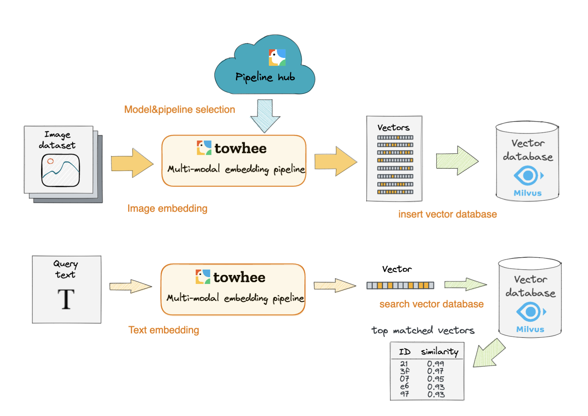

# Text to Image Search Engine

This tutorial demonstrates how to use Milvus, the open-source vector database, to build a text-to-image search engine. 

You can quickly build a minimum viable text-to-image search engine by following the basic tutorial. Alternatively, you can also read the deep dive tutorial which covers everything from model selection to service deployment. You can build a more advanced text-to-image search engine catering to your own business need by following the instructions in the deep dive tutorial.

- [Basic tutorial in notebook](https://github.com/towhee-io/examples/blob/main/image/text_image_search/1_build_text_image_search_engine.ipynb)

- [Deep dive tutorial in notebook](https://github.com/towhee-io/examples/blob/main/image/text_image_search/2_deep_dive_text_image_search.ipynb)

The ML model and third-party software used include:

- [CLIP](https://openai.com/blog/clip/)

- [Towhee](https://towhee.io/)

- [Gradio](https://www.google.com/url?sa=t&rct=j&q=&esrc=s&source=web&cd=&cad=rja&uact=8&ved=2ahUKEwj3nvvEhNj7AhVZSGwGHUFuA6sQFnoECA0QAQ&url=https%3A%2F%2Fgradio.app%2F&usg=AOvVaw0Rmnp2xYgYvkDcMb9d-9TR)

- [OpenCV-Python](https://www.google.com/url?sa=t&rct=j&q=&esrc=s&source=web&cd=&cad=rja&uact=8&ved=2ahUKEwjawLa4hNj7AhWrSGwGHSWKD1sQFnoECA0QAQ&url=https%3A%2F%2Fdocs.opencv.org%2F4.x%2Fd6%2Fd00%2Ftutorial_py_root.html&usg=AOvVaw3YMr9iiY-FTDoGSWWqppvP)

Nowadays, traditional text search engines are losing their charm with more and more people turning to TikTok as their favorite search engine. During a traditional text search, people input keywords and be shown all the texts containing the keyword. However, people complain that they cannot always find what they want in a search like this. What's more, the results are not intuitive enough. People say they find images and videos much more intuitive and pleasant than having to crawl through lines of text. The cross-modal text-to-image search engine emerged as a result. With such a new type of search engine, people can find relevant images by inputting a chunk of text of some keywords.

In this tutorial, you will learn how to build a text-to-image search engine. This tutorial uses the CLIP model to extract features of images and convert them into vectors. Then these image vectors are stored in the Milvus vector database. When users input query texts, these texts are also converted into embedding vectors using the same ML model CLIP. Subsequently, a vector similarity search is performed in Milvus to retrieve the most similar image vectors to the input text vector. 

