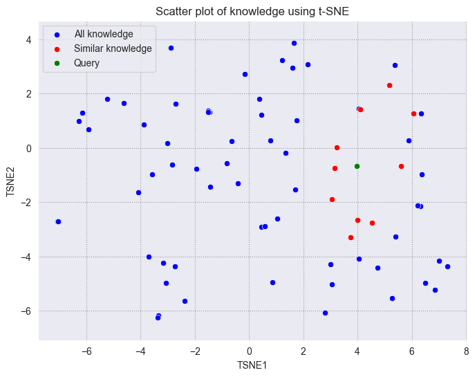

# Vector Visualization

<a href="https://colab.research.google.com/github/milvus-io/bootcamp/blob/master/tutorials/quickstart/vector_visualization.ipynb" target="_parent">
    
</a>
<a href="https://github.com/milvus-io/bootcamp/blob/master/tutorials/quickstart/vector_visualization.ipynb" target="_blank">
    
</a>

In this example, we will show how to visualize the embeddings(vectors) in Milvus using [t-SNE](https://www.wikiwand.com/en/articles/T-distributed_stochastic_neighbor_embedding).

Dimensionality reduction techniques, such as t-SNE, are invaluable for visualizing complex, high-dimensional data in a 2D or 3D space while preserving the local structure. This enables pattern recognition, enhances understanding of feature relationships, and facilitates the interpretation of machine learning model outcomes. Additionally, it aids in algorithm evaluation by visually comparing clustering results, simplifies data presentation to non-specialist audiences, and can reduce computational costs by working with lower-dimensional representations. Through these applications, t-SNE not only helps in gaining deeper insights into datasets but also supports more informed decision-making processes.

## Preparation

### Dependencies and Environment


```shell
$ pip install --upgrade pymilvus openai requests tqdm matplotlib seaborn
```

We will use OpenAI's embedding model in this example. You should prepare the api key OPENAI_API_KEY as an environment variable.


```python
import os

os.environ["OPENAI_API_KEY"] = "sk-***********"
```

## Prepare the data

We use the FAQ pages from the Milvus [Documentation 2.4.x](https://github.com/milvus-io/milvus-docs/releases/download/v2.4.6-preview/milvus_docs_2.4.x_en.zip) as the private knowledge in our RAG, which is a good data source for a simple RAG pipeline.

Download the zip file and extract documents to the folder `milvus_docs`.


```shell
$ wget https://github.com/milvus-io/milvus-docs/releases/download/v2.4.6-preview/milvus_docs_2.4.x_en.zip
$ unzip -q milvus_docs_2.4.x_en.zip -d milvus_docs
```

We load all markdown files from the folder `milvus_docs/en/faq`. For each document, we just simply use "# " to separate the content in the file, which can roughly separate the content of each main part of the markdown file.


```python
from glob import glob

text_lines = []

for file_path in glob("milvus_docs/en/faq/*.md", recursive=True):
    with open(file_path, "r") as file:
        file_text = file.read()

    text_lines += file_text.split("# ")
```

## Prepare the Embedding Model

We initialize the OpenAI client to prepare the embedding model.


```python
from openai import OpenAI

openai_client = OpenAI()
```

Define a function to generate text embeddings using OpenAI client. We use the [text-embedding-3-large](https://platform.openai.com/docs/guides/embeddings) model as an example.


```python
def emb_text(text):
    return (
        openai_client.embeddings.create(input=text, model="text-embedding-3-large")
        .data[0]
        .embedding
    )
```

Generate a test embedding and print its dimension and first few elements.


```python
test_embedding = emb_text("This is a test")
embedding_dim = len(test_embedding)
print(embedding_dim)
print(test_embedding[:10])
```

    3072
    [-0.015370666049420834, 0.00234124343842268, -0.01011690590530634, 0.044725317507982254, -0.017235849052667618, -0.02880779094994068, -0.026678944006562233, 0.06816216558218002, -0.011376636102795601, 0.021659553050994873]


## Load data into Milvus

### Create the Collection


```python
from pymilvus import MilvusClient

milvus_client = MilvusClient(uri="./milvus_demo.db")

collection_name = "my_rag_collection"
```

<div class="alert note">

As for the argument of `MilvusClient`:

- Setting the `uri` as a local file, e.g.`./milvus.db`, is the most convenient method, as it automatically utilizes [Milvus Lite](https://milvus.io/docs/milvus_lite.md) to store all data in this file.
- If you have large scale of data, you can set up a more performant Milvus server on [docker or kubernetes](https://milvus.io/docs/quickstart.md). In this setup, please use the server uri, e.g.`http://localhost:19530`, as your `uri`.
- If you want to use [Zilliz Cloud](https://zilliz.com/cloud), the fully managed cloud service for Milvus, adjust the `uri` and `token`, which correspond to the [Public Endpoint and Api key](https://docs.zilliz.com/docs/on-zilliz-cloud-console#free-cluster-details) in Zilliz Cloud.

</div>

Check if the collection already exists and drop it if it does.


```python
if milvus_client.has_collection(collection_name):
    milvus_client.drop_collection(collection_name)
```

Create a new collection with specified parameters.

If we don’t specify any field information, Milvus will automatically create a default `id` field for primary key, and a `vector` field to store the vector data. A reserved JSON field is used to store non-schema-defined fields and their values.


```python
milvus_client.create_collection(
    collection_name=collection_name,
    dimension=embedding_dim,
    metric_type="IP",  # Inner product distance
    consistency_level="Strong",  # Supported values are (`"Strong"`, `"Session"`, `"Bounded"`, `"Eventually"`). See https://milvus.io/docs/consistency.md#Consistency-Level for more details.
)
```

## Insert data

Iterate through the text lines, create embeddings, and then insert the data into Milvus.

Here is a new field `text`, which is a non-defined field in the collection schema. It will be automatically added to the reserved JSON dynamic field, which can be treated as a normal field at a high level.


```python
from tqdm import tqdm

data = []

for i, line in enumerate(tqdm(text_lines, desc="Creating embeddings")):
    data.append({"id": i, "vector": emb_text(line), "text": line})

milvus_client.insert(collection_name=collection_name, data=data)
```

    Creating embeddings: 100%|██████████| 72/72 [00:20<00:00,  3.60it/s]


    {'insert_count': 72, 'ids': [0, 1, 2, 3, 4, 5, 6, 7, 8, 9, 10, 11, 12, 13, 14, 15, 16, 17, 18, 19, 20, 21, 22, 23, 24, 25, 26, 27, 28, 29, 30, 31, 32, 33, 34, 35, 36, 37, 38, 39, 40, 41, 42, 43, 44, 45, 46, 47, 48, 49, 50, 51, 52, 53, 54, 55, 56, 57, 58, 59, 60, 61, 62, 63, 64, 65, 66, 67, 68, 69, 70, 71], 'cost': 0}


## Visualizing Embeddings in Vector Search

In this section, we perform a milvus search and then visualize the query vector and the retrieved vector together in reduced dimension.

### Retrieve Data for a Query

Let's prepare a question for the search.


```python
# Modify the question to test it with your own query!

question = "How is data stored in Milvus?"
```

Search for the question in the collection and retrieve the semantic top-10 matches.


```python
search_res = milvus_client.search(
    collection_name=collection_name,
    data=[
        emb_text(question)
    ],  # Use the `emb_text` function to convert the question to an embedding vector
    limit=10,  # Return top 10 results
    search_params={"metric_type": "IP", "params": {}},  # Inner product distance
    output_fields=["text"],  # Return the text field
)
```

Let’s take a look at the search results of the query


```python
import json

retrieved_lines_with_distances = [
    (res["entity"]["text"], res["distance"]) for res in search_res[0]
]
print(json.dumps(retrieved_lines_with_distances, indent=4))
```

    [
        [
            " Where does Milvus store data?\n\nMilvus deals with two types of data, inserted data and metadata. \n\nInserted data, including vector data, scalar data, and collection-specific schema, are stored in persistent storage as incremental log. Milvus supports multiple object storage backends, including [MinIO](https://min.io/), [AWS S3](https://aws.amazon.com/s3/?nc1=h_ls), [Google Cloud Storage](https://cloud.google.com/storage?hl=en#object-storage-for-companies-of-all-sizes) (GCS), [Azure Blob Storage](https://azure.microsoft.com/en-us/products/storage/blobs), [Alibaba Cloud OSS](https://www.alibabacloud.com/product/object-storage-service), and [Tencent Cloud Object Storage](https://www.tencentcloud.com/products/cos) (COS).\n\nMetadata are generated within Milvus. Each Milvus module has its own metadata that are stored in etcd.\n\n###",
            0.7675539255142212
        ],
        [
            "How does Milvus handle vector data types and precision?\n\nMilvus supports Binary, Float32, Float16, and BFloat16 vector types.\n\n- Binary vectors: Store binary data as sequences of 0s and 1s, used in image processing and information retrieval.\n- Float32 vectors: Default storage with a precision of about 7 decimal digits. Even Float64 values are stored with Float32 precision, leading to potential precision loss upon retrieval.\n- Float16 and BFloat16 vectors: Offer reduced precision and memory usage. Float16 is suitable for applications with limited bandwidth and storage, while BFloat16 balances range and efficiency, commonly used in deep learning to reduce computational requirements without significantly impacting accuracy.\n\n###",
            0.6210848689079285
        ],
        [
            "Does the query perform in memory? What are incremental data and historical data?\n\nYes. When a query request comes, Milvus searches both incremental data and historical data by loading them into memory. Incremental data are in the growing segments, which are buffered in memory before they reach the threshold to be persisted in storage engine, while historical data are from the sealed segments that are stored in the object storage. Incremental data and historical data together constitute the whole dataset to search.\n\n###",
            0.585393488407135
        ],
        [
            "Why is there no vector data in etcd?\n\netcd stores Milvus module metadata; MinIO stores entities.\n\n###",
            0.579704999923706
        ],
        [
            "How does Milvus flush data?\n\nMilvus returns success when inserted data are loaded to the message queue. However, the data are not yet flushed to the disk. Then Milvus' data node writes the data in the message queue to persistent storage as incremental logs. If `flush()` is called, the data node is forced to write all data in the message queue to persistent storage immediately.\n\n###",
            0.5777501463890076
        ],
        [
            "What is the maximum dataset size Milvus can handle?\n\n  \nTheoretically, the maximum dataset size Milvus can handle is determined by the hardware it is run on, specifically system memory and storage:\n\n- Milvus loads all specified collections and partitions into memory before running queries. Therefore, memory size determines the maximum amount of data Milvus can query.\n- When new entities and and collection-related schema (currently only MinIO is supported for data persistence) are added to Milvus, system storage determines the maximum allowable size of inserted data.\n\n###",
            0.5655910968780518
        ],
        [
            "Does Milvus support inserting and searching data simultaneously?\n\nYes. Insert operations and query operations are handled by two separate modules that are mutually independent. From the client\u2019s perspective, an insert operation is complete when the inserted data enters the message queue. However, inserted data are unsearchable until they are loaded to the query node. If the segment size does not reach the index-building threshold (512 MB by default), Milvus resorts to brute-force search and query performance may be diminished.\n\n###",
            0.5618637204170227
        ],
        [
            "What data types does Milvus support on the primary key field?\n\nIn current release, Milvus supports both INT64 and string.\n\n###",
            0.5561620593070984
        ],
        [
            "Is Milvus available for concurrent search?\n\nYes. For queries on the same collection, Milvus concurrently searches the incremental and historical data. However, queries on different collections are conducted in series. Whereas the historical data can be an extremely huge dataset, searches on the historical data are relatively more time-consuming and essentially performed in series.\n\n###",
            0.529681921005249
        ],
        [
            "Can vectors with duplicate primary keys be inserted into Milvus?\n\nYes. Milvus does not check if vector primary keys are duplicates.\n\n###",
            0.528809666633606
        ]
    ]


### Dimensionality reduction to 2-d by t-SNE

Let's reduce the dimension of the embeddings to 2-d by t-SNE. We will use the `sklearn` library to perform the t-SNE transformation.


```python
import pandas as pd
import numpy as np
from sklearn.manifold import TSNE

data.append({"id": len(data), "vector": emb_text(question), "text": question})
embeddings = []
for gp in data:
    embeddings.append(gp["vector"])

X = np.array(embeddings, dtype=np.float32)
tsne = TSNE(random_state=0, max_iter=1000)
tsne_results = tsne.fit_transform(X)

df_tsne = pd.DataFrame(tsne_results, columns=["TSNE1", "TSNE2"])
df_tsne
```


<div>
<style scoped>
    .dataframe tbody tr th:only-of-type {
        vertical-align: middle;
    }

    .dataframe tbody tr th {
        vertical-align: top;
    }

    .dataframe thead th {
        text-align: right;
    }
</style>
<table border="1" class="dataframe">
  <thead>
    <tr style="text-align: right;">
      <th></th>
      <th>TSNE1</th>
      <th>TSNE2</th>
    </tr>
  </thead>
  <tbody>
    <tr>
      <th>0</th>
      <td>-3.877362</td>
      <td>0.866726</td>
    </tr>
    <tr>
      <th>1</th>
      <td>-5.923084</td>
      <td>0.671701</td>
    </tr>
    <tr>
      <th>2</th>
      <td>-0.645954</td>
      <td>0.240083</td>
    </tr>
    <tr>
      <th>3</th>
      <td>0.444582</td>
      <td>1.222875</td>
    </tr>
    <tr>
      <th>4</th>
      <td>6.503896</td>
      <td>-4.984684</td>
    </tr>
    <tr>
      <th>...</th>
      <td>...</td>
      <td>...</td>
    </tr>
    <tr>
      <th>69</th>
      <td>6.354055</td>
      <td>1.264959</td>
    </tr>
    <tr>
      <th>70</th>
      <td>6.055961</td>
      <td>1.266211</td>
    </tr>
    <tr>
      <th>71</th>
      <td>-1.516003</td>
      <td>1.328765</td>
    </tr>
    <tr>
      <th>72</th>
      <td>3.971772</td>
      <td>-0.681780</td>
    </tr>
    <tr>
      <th>73</th>
      <td>3.971772</td>
      <td>-0.681780</td>
    </tr>
  </tbody>
</table>
<p>74 rows × 2 columns</p>
</div>


### Visualizing Milvus search results on a 2d plane

We will plot the query vector in green, the retrieved vectors in red, and the remaining vectors in blue.


```python
import matplotlib.pyplot as plt
import seaborn as sns

# Extract similar ids from search results
similar_ids = [gp["id"] for gp in search_res[0]]

df_norm = df_tsne[:-1]

df_query = pd.DataFrame(df_tsne.iloc[-1]).T

# Filter points based on similar ids
similar_points = df_tsne[df_tsne.index.isin(similar_ids)]

# Create the plot
fig, ax = plt.subplots(figsize=(8, 6))  # Set figsize

# Set the style of the plot
sns.set_style("darkgrid", {"grid.color": ".6", "grid.linestyle": ":"})

# Plot all points in blue
sns.scatterplot(
    data=df_tsne, x="TSNE1", y="TSNE2", color="blue", label="All knowledge", ax=ax
)

# Overlay similar points in red
sns.scatterplot(
    data=similar_points,
    x="TSNE1",
    y="TSNE2",
    color="red",
    label="Similar knowledge",
    ax=ax,
)

sns.scatterplot(
    data=df_query, x="TSNE1", y="TSNE2", color="green", label="Query", ax=ax
)

# Set plot titles and labels
plt.title("Scatter plot of knowledge using t-SNE")
plt.xlabel("TSNE1")
plt.ylabel("TSNE2")

# Set axis to be equal
plt.axis("equal")

# Display the legend
plt.legend()

# Show the plot
plt.show()
```


    

    


As we can see, the query vector is close to the retrieved vectors. Although the retrieved vectors are not within a standard circle with a fixed radius centered on the query, we can see that they are still very close to the query vector on the 2D plane.

Using dimensionality reduction techniques can facilitate the understanding of vectors and troubleshooting. Hope you can get a better understanding of vectors through this tutorial.
