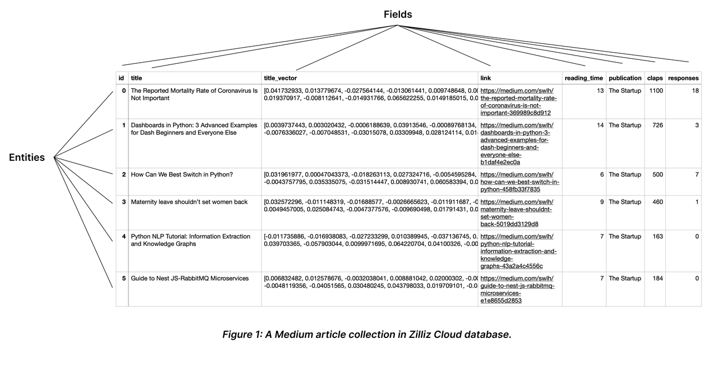

# Collection Explained

On Milvus, you can create multiple collections to manage your data, and insert your data as entities into the collections. Collection and entity are similar to tables and records in relational databases. This page helps you to learn about the collection and related concepts.

## Collection

A collection is a two-dimensional table with fixed columns and variant rows. Each column represents a field, and each row represents an entity. 

The following chart shows a collection with eight columns and six entities.

## Schema and Fields

When describing an object, we usually mention its attributes, such as size, weight, and position. You can use these attributes as fields in a collection. Each field has various constraining properties, such as the data type and the dimensionality of a vector field. You can form a collection schema by creating the fields and defining their order. For possible applicable data types, refer to [Schema Explained](schema.md).

You should include all schema-defined fields in the entities to insert. To make some of them optional, consider enabling dynamic field. For details, refer to [Dynamic Field](enable-dynamic-field.md).

- **Making them nullable or setting default values**

    For details on how to make a field nullable or set the default value, refer to [Nullable & Default](nullable-and-default.md).

- **Enabling dynamic field**

    For details on how to enable and use the dynamic field, refer to [Dynamic Field](enable-dynamic-field.md).

## Primary key and AutoId

Similar to the primary field in a relational database, a collection has a primary field to distinguish an entity from others. Each value in the primary field is globally unique and corresponds to one specific entity. 

As shown in the above chart, the field named **id** serves as the primary field, and the first ID **0** corresponds to an entity titled *The Mortality Rate of Coronavirus is Not Important*. There will not be any other entity that has the primary field of 0. 

A primary field accepts only integers or strings. When inserting entities, you should include the primary field values by default. However, if you have enabled **AutoId** upon collection creation, Milvus will generate those values upon data insertion. In such a case, exclude the primary field values from the entities to be inserted.

For more information, please refer to [Primary Field & AutoId](primary-field.md).

## Index

Creating indexes on specific fields improves search efficiency. You are advised to create indexes for all the fields your service relies on, among which indexes on vector fields are mandatory.

## Entity

Entities are data records that share the same set of fields in a collection. The values in all fields of the same row comprise an entity.

You can insert as many entities as you need into a collection. However, as the number of entities mounts, the memory size it takes also increases, affecting search performance.

For more information, refer to [Schema Explained](schema.md).

## Load and Release

Loading a collection is the prerequisite to conducting similarity searches and queries in collections. When you load a collection, Milvus loads all index files and the raw data in each field into memory for fast response to searches and queries.

Searches and queries are memory-intensive operations. To save the cost, you are advised to release the collections that are currently not in use.

For more details, refer to [Load & Release](load-and-release.md).

## Search and Query

Once you create indexes and load the collection, you can start a similarity search by feeding one or several query vectors. For example, when receiving the vector representation of your query carried in a search request, Milvus uses the specified metric type to measure the similarity between the query vector and those in the target collection before returning those that are semantically similar to the query.

You can also include metadata filtering within searches and queries to improve the relevancy of the results. Note that, metadata filtering conditions are mandatory in queries but optional in searches.

For details on applicable metric types, refer to [Metric Types](metric.md).

For more information about searches and queries, refer to the articles in the Search & Rerank chapter, among which, basic features are:

- [Basic ANN Search](single-vector-search.md)

- [Filtered Search](filtered-search.md)

- [Range Search](range-search.md)

- [Grouping Search](grouping-search.md)

- [Hybrid Search](multi-vector-search.md)

- [Search Iterator](with-iterators.md)

- [Query](get-and-scalar-query.md)

- [Full Text Search](full-text-search.md)

- [Text Match](keyword-match.md)

In addition, Milvus also provides enhancements to improve search performance and efficiency. They are disabled by default, and you can enable and use them according to your service requirements. They are

- [Use Partition Key](use-partition-key.md)

- [Use mmap](mmap.md)

- [Clustering Compaction](clustering-compaction.md)

## Partition

Partitions are subsets of a collection, which share the same field set with its parent collection, each containing a subset of entities.

By allocating entities into different partitions, you can create entity groups. You can conduct searches and queries in specific partitions to have Milvus ignore entities in other partitions, and improve search efficiency.

For details, refer to [Manage Partitions](manage-partitions.md).

## Shard

Shards are horizontal slices of a collection. Each shard corresponds to a data input channel. Every collection has a shard by default. You can set the appropriate number of shards when creating a collection based on the expected throughput and the volume of the data to insert into the collection.

For details on how to set the shard number, refer to [Create Collection](create-collection.md).

## Alias

You can create aliases for your collections. A collection can have several aliases, but collections cannot share an alias. Upon receiving a request against a collection, Milvus locates the collection based on the provided name. If the collection by the provided name does not exist, Milvus continues locating the provided name as an alias. You can use collection aliases to adapt your code to different scenarios.

For more details, refer to [Manage Aliases](manage-aliases.md).

## Function

You can set functions for Milvus to derive fields upon collection creation. For example, the full-text search function uses the user-defined function to derive a sparse vector field from a specific varchar field. For more information on full-text search, refer to [Full Text Search](full-text-search.md).

## Consistency Level

Distributed database systems usually use the consistency level to define the data sameness across data nodes and replicas. You can set separate consistency levels when you create a collection or conduct similarity searches within the collection. The applicable consistency levels are **Strong**, **Bounded Staleness**, **Session**, and **Eventually**.

 For details on these consistency levels, refer to [Consistency Level](tune_consistency.md).

