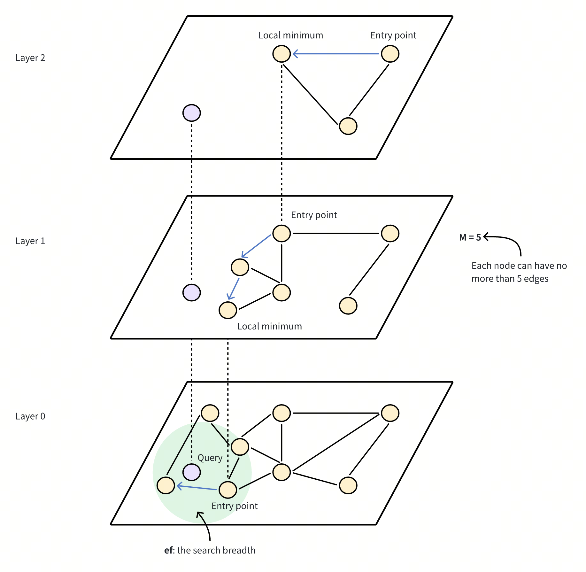

# HNSW

The **HNSW** index is a **graph-based** indexing algorithm that can improve performance when searching for high-dimensional floating vectors. It offers **excellent** search accuracy and **low** latency, while it requires **high** memory overhead to maintain its hierarchical graph structure.

## Overview

The Hierarchical Navigable Small World (HNSW) algorithm builds a multi-layered graph, kind of like a map with different zoom levels. The **bottom layer** contains all the data points, while the **upper layers** consist of a subset of data points sampled from the lower layer.

In this hierarchy, each layer contains nodes representing data points, connected by edges that indicate their proximity. The higher layers provide long-distance jumps to quickly get close to the target, while the lower layers enable a fine-grained search for the most accurate results.

Here's how it works:

1. **Entry point**: The search starts at a fixed entry point at the top layer, which is a pre-determined node in the graph.
2. **Greedy search**: The algorithm greedily moves to the closest neighbor at the current layer until it cannot get any closer to the query vector. The upper layers serve a navigational purpose, acting as a coarse filter to locate potential entry points for the finer search at the lower levels.
3. **Layer descend**: Once a **local minimum** is reached at the current layer, the algorithm jumps down to the lower layer, using a pre-established connection, and repeats the greedy search.
4. **Final** **refinement**: This process continues until the bottom layer is reached, where a final refinement step identifies the nearest neighbors.



The performance of HNSW depends on several key parameters that control both the structure of the graph and the search behavior. These include:

- `M`: The maximum number of edges or connections each node can have in the graph at each level of the hierarchy. A higher `M` results in a denser graph and increases recall and accuracy as the search has more pathways to explore, which also consumes more memory and slows down insertion time due to additional connections. As shown in the image above, **M = 5** indicates that each node in the HNSW graph is directly connected to a maximum of 5 other nodes. This creates a moderately dense graph structure where nodes have multiple pathways to reach other nodes.
- `efConstruction`: The number of candidates considered during index construction. A higher `efConstruction` generally results in a better quality graph but requires more time to build.
- `ef`: The number of neighbors evaluated during a search. Increasing `ef` improves the likelihood of finding the nearest neighbors but slows down the search process.

For details on how to adjust these settings to suit your needs, refer to [Index params](#index-params).

## Build index

To build an `HNSW` index on a vector field in Milvus, use the `add_index()` method, specifying the `index_type`, `metric_type`, and additional parameters for the index.

```python
from pymilvus import MilvusClient

# Prepare index building params
index_params = MilvusClient.prepare_index_params()

index_params.add_index(
    field_name="your_vector_field_name", # Name of the vector field to be indexed
    index_type="HNSW", # Type of the index to create
    index_name="vector_index", # Name of the index to create
    metric_type="L2", # Metric type used to measure similarity
    params={
        "M": 64, # Maximum number of neighbors each node can connect to in the graph
        "efConstruction": 100 # Number of candidate neighbors considered for connection during index construction
    } # Index building params
)
```

In this configuration:

- `index_type`: The type of index to be built. In this example, set the value to `HNSW`.
- `metric_type`: The method used to calculate the distance between vectors. Supported values include `COSINE`, `L2`, and `IP`. For details, refer to [Metric Types](metric.md).
- `params`: Additional configuration options for building the index.
    - `M`: Maximum number of neighbors each node can connect to.
    - `efConstruction`: Number of candidate neighbors considered for connection during index construction.
    
    To learn more building parameters available for the `HNSW` index, refer to [Index building params](#Index-building-params).
    

Once the index parameters are configured, you can create the index by using the `create_index()` method directly or passing the index params in the `create_collection` method. For details, refer to [Create Collection](create-collection.md).

## Search on index

Once the index is built and entities are inserted, you can perform similarity searches on the index.

```python
search_params = {
    "params": {
        "ef": 10, # Number of neighbors to consider during the search
    }
}

res = MilvusClient.search(
    collection_name="your_collection_name", # Collection name
    data=[[0.1, 0.2, 0.3, 0.4, 0.5]],  # Query vector
    limit=10,  # TopK results to return
    search_params=search_params
)
```

In this configuration:

- `params`: Additional configuration options for searching on the index.
    - `ef`: Number of neighbors to consider during a search.
    
    To learn more search parameters available for the `HNSW` index, refer to [Index-specific search params](#index-specific-search-params).
    

## Index params

This section provides an overview of the parameters used for building an index and performing searches on the index.

### Index building params

The following table lists the parameters that can be configured in `params` when [building an index](#Build-index).

| **Parameter** | **Description** | **Value Range** | **Tuning Suggestion** |
| --- | --- | --- | --- |
| `M` | Maximum number of connections （or edges) each node can have in the graph, including both outgoing and incoming edges.<br>This parameter directly affects both index construction and search. | **Type**: Integer<br>**Range**: [2, 2048]<br>**Default value**: `30` (up to 30 outgoing and 30 incoming edges per node) | A larger `M` generally leads to **higher accuracy** but **increases memory overhead** and **slows down both index building and search**.<br>Consider increasing `M` for datasets with high dimensionality or when high recall is crucial.<br>Consider decreasing `M` when memory usage and search speed are primary concerns.<br>In most cases, we recommend you set a value within this range: [5, 100]. |
| `efConstruction` | Number of candidate neighbors considered for connection during index construction.<br>A larger pool of candidates is evaluated for each new element, but the maximum number of connections actually established is still limited by `M`. | **Type**: Integer<br>**Range**: [1, *int_max*]<br>**Default value**: `360` | A higher `efConstruction` typically results in a **more accurate index**, as more potential connections are explored. However, this also leads to **longer indexing time and increased memory usage** during construction.<br>Consider increasing `efConstruction` for improved accuracy, especially in scenarios where indexing time is less critical.<br>Consider decreasing `efConstruction` to speed up index construction when resource constraints are a concern.<br>In most cases, we recommend you set a value within this range: [50, 500]. |

### Index-specific search params

The following table lists the parameters that can be configured in `search_params.params` when [searching on the index](#Search-on-index).

| **Parameter** | **Description** | **Value Range** | **Tuning Suggestion** |
| --- | --- | --- | --- |
| `ef` | **Controls the breadth of search during nearest neighbor retrieval.** It determines how many nodes are visited and evaluated as potential nearest neighbors. This parameter affects only the search process and applies exclusively to the bottom layer of the graph. | **Type**: Integer<br>**Range**: [1, *int_max*]<br>**Default value**: *limit* (TopK nearest neighbors to return) | A larger `ef` generally leads to **higher search accuracy** as more potential neighbors are considered. However, this also **increases search time**.<br>Consider increasing `ef` when achieving high recall is critical and search speed is less of a concern.<br>Consider decreasing `ef` to prioritize faster searches, especially in scenarios where a slight reduction in accuracy is acceptable.<br>In most cases, we recommend you set a value within this range: [K, 10K]. |