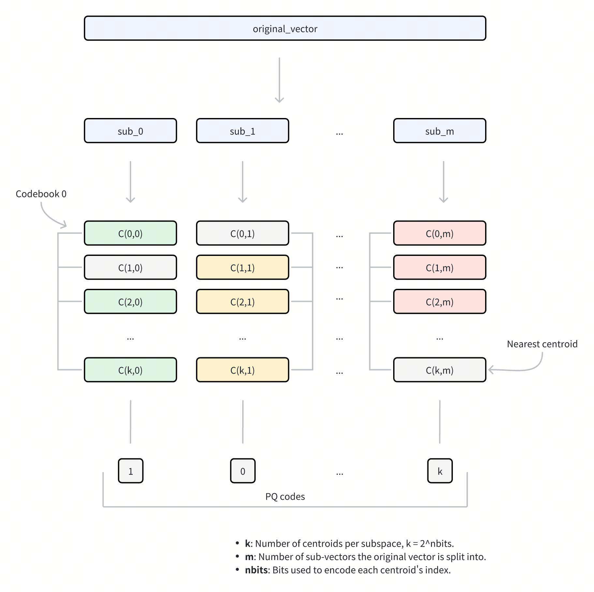
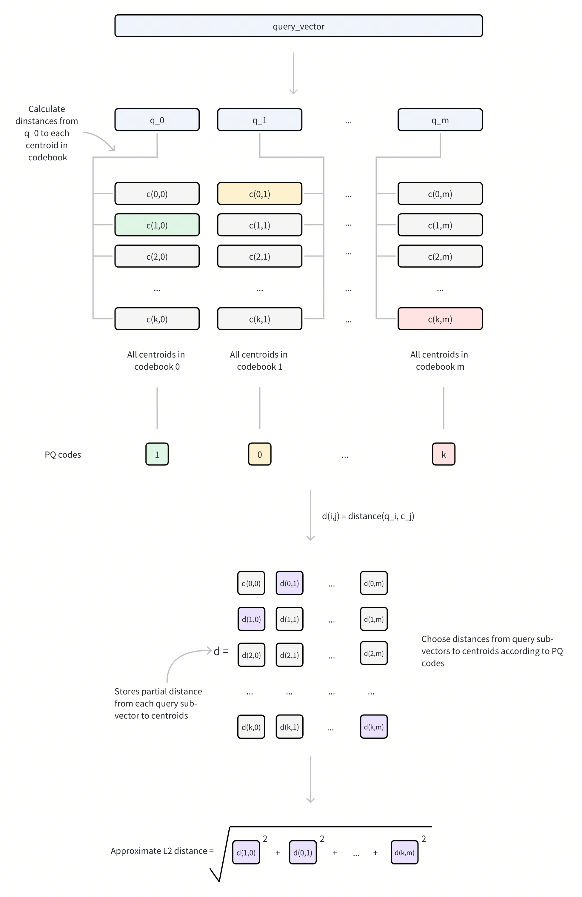

# IVF_PQ

The **IVF_PQ** index is a **quantization-based** indexing algorithm for approximate nearest neighbor search in high-dimensional spaces. While not as fast as some graph-based methods, **IVF_PQ** often requires significantly less memory, making it a practical choice for large datasets.

## Overview

The **IVF_PQ** stands for **Inverted File with Product Quantization**, a hybrid approach that combines indexing and compression for efficient vector search and retrieval. It leverages two core components: **Inverted File (IVF)** and **Product Quantization (PQ)**.

### IVF

IVF is like creating an index in a book. Instead of scanning every page (or, in our case, every vector), you look up specific keywords (clusters) in the index to quickly find the relevant pages (vectors). In our scenario, vectors are grouped into clusters, and the algorithm will search within a few clusters that are close to the query vector.

Here's how it works:

1. **Clustering:** Your vector dataset is divided into a specified number of clusters, using a clustering algorithm like k-means. Each cluster has a centroid (a representative vector for the cluster).

1. **Assignment:** Each vector is assigned to the cluster whose centroid is closest to it.

1. **Inverted Index:** An index is created, mapping each cluster centroid to the list of vectors assigned to that cluster.

1. **Search:** When you search for nearest neighbors, the search algorithm compares your query vector with the cluster centroids and selects the most promising cluster(s). The search is then narrowed down to the vectors within those selected clusters.

To learn more about its technical details , refer to [IVF_FLAT](ivf-flat.md).

### PQ

**Product Quantization (PQ)** is a compression method for high-dimensional vectors that significantly reduces storage requirements while enabling fast similarity search operations.

The PQ process involves these key stages:



1. **Dimension decomposition**: The algorithm begins by decomposing each high-dimensional vector into `m` equal-sized sub-vectors. This decomposition transforms the original D-dimensional space into `m` disjoint subspaces, where each subspace contains *D/m* dimensions. The parameter `m` controls the granularity of the decomposition and directly influences the compression ratio.

1. **Subspace codebook generation**: Within each subspace, the algorithm applies [k-means clustering](https://en.wikipedia.org/wiki/K-means_clustering) to learn a set of representative vectors (centroids). These centroids collectively form a codebook for that subspace. The number of centroids in each codebook is determined by the parameter `nbits`, where each codebook contains $2^{\textit{nbits}}$ centroids. For example, if `nbits = 8`, each codebook will contain 256 centroids. Each centroid is assigned a unique index with `nbits` bits.

1. **Vector** **quantization**: For each sub-vector in the original vector, PQ identifies its nearest centroid within the corresponding subspace using a specific metric type. This process effectively maps each sub-vector to its closest representative vector in the codebook. Instead of storing the full sub-vector coordinates, only the index of the matched centroid is retained.

1. **Compressed representation**: The final compressed representation consists of `m` indices, one from each subspace, collectively referred to as **PQ codes**. This encoding reduces the storage requirement from *D × 32* bits (assuming 32-bit floating-point numbers) to *m* × *nbits* bits, achieving substantial compression while preserving the ability to approximate vector distances.

For more details on parameter tuning and optimization, refer to [Index params](ivf-pq.md#Index-params).

<div class="alert note">

Consider a vector with *D = 128* dimensions using 32-bit floating-point numbers. With PQ parameters *m = 64* (sub-vectors) and *nbits = 8* (thus *k =* $2^8$ *= 256* centroids per subspace), we can compare the storage requirements:

- Original vector: 128 dimensions × 32 bits = 4,096 bits

- PQ-compressed vector: 64 sub-vectors × 8 bits = 512 bits

This represents an 8x reduction in storage requirements.

</div>

**Distance computation with PQ**

When performing similarity search with a query vector, PQ enables efficient distance computation through the following steps:

1. **Query preprocessing**

    - The query vector is decomposed into `m` sub-vectors, matching the original PQ decomposition structure.

    - For each query sub-vector and its corresponding codebook (containing $2^{\textit{nbits}}$ centroids), compute and store distances to all centroids.

    - This generates `m` lookup tables, where each table contains $2^{\textit{nbits}}$ distances.

1. **Distance approximation**

    For any database vector represented by PQ codes, its approximate distance to the query vector is computed as follows:

    - For each of the `m` sub-vectors, retrieve the pre-computed distance from the corresponding lookup table using the stored centroid index.

    - Sum these `m` distances to obtain the approximate distance based on a specific metric type (e.g. Euclidean distance).



### IVF + PQ

The **IVF_PQ** index combines the strengths of **IVF** and **PQ** to accelerate searches. The process works in two steps:

1. **Coarse filtering with IVF**: IVF partitions the vector space into clusters, reducing the search scope. Instead of evaluating the entire dataset, the algorithm focuses only on the clusters closest to the query vector.

1. **Fine-grained comparison with PQ**: Within the selected clusters, PQ uses compressed and quantized vector representations to compute approximate distances quickly.

The performance of the **IVF_PQ** index is significantly impacted by the parameters that control both the IVF and PQ algorithms. Tuning these parameters is crucial to achieve the optimal results for a given dataset and application. More detailed information about these parameters and how to tune them can be found in [Index params](ivf-pq.md#Index-params).

## Build index

To build an `IVF_PQ` index on a vector field in Milvus, use the `add_index()` method, specifying the `index_type`, `metric_type`, and additional parameters for the index.

```python
from pymilvus import MilvusClient

# Prepare index building params
index_params = MilvusClient.prepare_index_params()

index_params.add_index(
    field_name="your_vector_field_name", # Name of the vector field to be indexed
    index_type="IVF_PQ", # Type of the index to create
    index_name="vector_index", # Name of the index to create
    metric_type="L2", # Metric type used to measure similarity
    params={
        "m": 4, # Number of sub-vectors to split eahc vector into
    } # Index building params
)
```

In this configuration:

- `index_type`: The type of index to be built. In this example, set the value to `IVF_PQ`.

- `metric_type`: The method used to calculate the distance between vectors. Supported values include `COSINE`, `L2`, and `IP`. For details, refer to [Metric Types](metric.md).

- `params`: Additional configuration options for building the index.

    - `m`: Number of sub-vectors to split the vector into.

    To learn more building parameters available for the `IVF_PQ` index, refer to [Index building params](ivf-pq.md#Index-building-params).

Once the index parameters are configured, you can create the index by using the `create_index()` method directly or passing the index params in the `create_collection` method. For details, refer to [Create Collection](create-collection.md).

## Search on index

Once the index is built and entities are inserted, you can perform similarity searches on the index.

```python
search_params = {
    "params": {
        "nprobe": 10, # Number of clusters to search
    }
}

res = MilvusClient.search(
    collection_name="your_collection_name", # Collection name
    anns_field="vector_field", # Vector field name
    data=[[0.1, 0.2, 0.3, 0.4, 0.5]],  # Query vector
    limit=3,  # TopK results to return
    search_params=search_params
)
```

In this configuration:

- `params`: Additional configuration options for searching on the index.

    - `nprobe`: Number of clusters to search for.

    To learn more search parameters available for the `IVF_PQ` index, refer to [Index-specific search params](ivf-pq.md#Index-specific-search-params).

## Index params

This section provides an overview of the parameters used for building an index and performing searches on the index.

### Index building params

The following table lists the parameters that can be configured in `params` when [building an index](ivf-pq.md#Build-index).

<table>
   <tr>
     <th></th>
     <th><p>Parameter</p></th>
     <th><p>Description</p></th>
     <th><p>Value Range</p></th>
     <th><p>Tuning Suggestion</p></th>
   </tr>
   <tr>
     <td><p>IVF</p></td>
     <td><p><code>nlist</code></p></td>
     <td><p>The number of clusters to create using the k-means algorithm during index building.</p></td>
     <td><p><strong>Type</strong>: Integer <strong>Range</strong>: [1, 65536]</p><p><strong>Default value</strong>: <code>128</code></p></td>
     <td><p>Larger <code>nlist</code> values improve recall by creating more refined clusters but increase index building time. Optimize based on dataset size and available resources. In most cases, we recommend you set a value within this range: [32, 4096].</p></td>
   </tr>
   <tr>
     <td rowspan="2"><p>PQ</p></td>
     <td><p><code>m</code></p></td>
     <td><p>The number of sub-vectors (used for quantization) to divide each high-dimensional vector into during the quantization process.</p></td>
     <td><p><strong>Type</strong>: Integer <strong>Range</strong>: [1, 65536]</p><p><strong>Default value</strong>: None</p></td>
     <td><p>A higher <code>m</code> value can improve accuracy, but it also increases the computational complexity and memory usage. <code>m</code> must be a divisor of the vector dimension (<em>D</em>) to ensure proper decomposition. A commonly recommended value is <em>m = D/2</em>.</p><p>In most cases, we recommend you set a value within this range: [D/8, D].</p></td>
   </tr>
   <tr>
     <td><p><code>nbits</code></p></td>
     <td><p>The number of bits used to represent each sub-vector's centroid index in the compressed form. It directly determines the size of each codebook. Each codebook will contain $2^{\textit{nbits}}$ centroids. For example, if <code>nbits</code> is set to 8, each sub-vector will be represented by an 8-bit centroid's index. This allows for $2^8$ (256) possible centroids in the codebook for that sub-vector.</p></td>
     <td><p><strong>Type</strong>: Integer <strong>Range</strong>: [1, 64]</p><p><strong>Default value</strong>: <code>8</code></p></td>
     <td><p>A higher <code>nbits</code> value allows for larger codebooks, potentially leading to more accurate representations of the original vectors. However, it also means using more bits to store each index, resulting in less compression. In most cases, we recommend you set a value within this range: [1, 16].</p></td>
   </tr>
</table>

### Index-specific search params

The following table lists the parameters that can be configured in `search_params.params` when [searching on the index](ivf-pq.md#Search-on-index).

<table>
   <tr>
     <th></th>
     <th><p>Parameter</p></th>
     <th><p>Description</p></th>
     <th><p>Value Range</p></th>
     <th><p>Tuning Suggestion</p></th>
   </tr>
   <tr>
     <td><p>IVF</p></td>
     <td><p><code>nprobe</code></p></td>
     <td><p>The number of clusters to search for candidates.</p></td>
     <td><p><strong>Type</strong>: Integer <strong>Range</strong>: [1, <em>nlist</em>]</p><p><strong>Default value</strong>: <code>8</code></p></td>
     <td><p>Higher values allow more clusters to be searched, improving recall by expanding the search scope but at the cost of increased query latency. Set <code>nprobe</code> proportionally to <code>nlist</code> to balance speed and accuracy.</p><p>In most cases, we recommend you set a value within this range: [1, nlist].</p></td>
   </tr>
</table>

