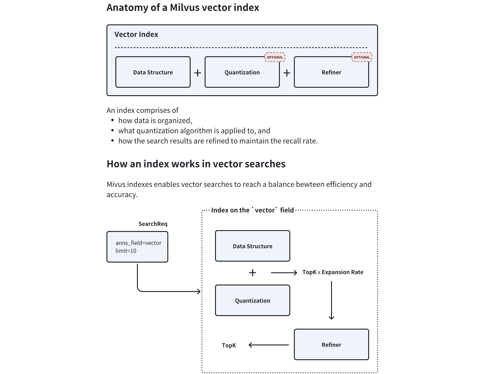

# Index Explained

An index is an additional structure built on top of data. Its internal structure depends on the approximate nearest neighbor search algorithm in use. An index speeds up the search, but incurs additional preprocessing time, space, and RAM during the search. Moreover, using an index typically lowers the recall rate (though the effect is negligible, it still matters). Therefore, this article explains how to minimize the costs of using an index while maximizing the benefits.

## Overview

In Milvus, indexes are specific to fields, and the applicable index types vary according to the data types of the target fields. As a professional vector database, Milvus focuses on enhancing both the performance of vector searches and scalar filtering, which is why it offers various index types. 

The following table lists the mapping relationship between field data types and applicable index types.

<table>
   <tr>
     <th><p>Field Data Type</p></th>
     <th><p>Applicable Index Types</p></th>
   </tr>
   <tr>
     <td><ul><li><p>FLOAT_VECTOR</p></li><li><p>FLOAT16_VECTOR</p></li><li><p>BFLOAT16_VECTOR</p></li></ul></td>
     <td><ul><li><p>FLAT</p></li><li><p>IVF_FLAT</p></li><li><p>IVF_SQ8</p></li><li><p>IVF_PQ</p></li><li><p>GPU_IVF_FLAT</p></li><li><p>GPU_IVF_PQ</p></li><li><p>HNSW</p></li><li><p>DISKANN</p></li></ul></td>
   </tr>
   <tr>
     <td><p>BINARY_VECTOR</p></td>
     <td><ul><li>BIN_FLAT</li><li>BIN_IVF_FLAT</li></ul></td>
   </tr>
   <tr>
     <td><p>SPARSE_FLOAT_VECTOR</p></td>
     <td><p>SPARSE_INVERTED_INDEX</p></td>
   </tr>
   <tr>
     <td><p>VARCHAR</p></td>
     <td><ul><li><p>INVERTED (Reommended)</p></li><li><p>BITMAP</p></li><li><p>Trie</p></li></ul></td>
   </tr>
   <tr>
     <td><p>BOOL</p></td>
     <td><ul><li>BITMAP (Recommended)</li><li>INVERTED</li></ul></td>
   </tr>
   <tr>
     <td><ul><li><p>INT8</p></li><li><p>INT16</p></li><li><p>INT32</p></li><li><p>INT64</p></li></ul></td>
     <td><ul><li>INVERTED</li><li>STL_SORT</li></ul></td>
   </tr>
   <tr>
     <td><ul><li>FLOAT</li><li>DOUBLE</li></ul></td>
     <td><p>INVERTED</p></td>
   </tr>
   <tr>
     <td><p>ARRAY <sup>(elements of the BOOL, INT8/16/32/64, and VARCHAR types)</sup></p></td>
     <td><p>BITMAP (Recommended)</p></td>
   </tr>
   <tr>
     <td><p>ARRAY <sup>(elements of the BOOL, INT8/16/32/64, FLOAT, DOUBLE, and VARCHAR types)</sup></p></td>
     <td><p>INVERTED</p></td>
   </tr>
   <tr>
     <td><p>JSON</p></td>
     <td><p>INVERTED</p></td>
   </tr>
</table>

This article focuses on how to select appropriate vector indexes. For scalar fields, you can always use the recommended index type.

Selecting an appropriate index type for a vector search can significantly impact performance and resource usage. When choosing an index type for a vector field, it is essential to consider various factors, including the underlying data structure, memory usage, and performance requirements.

## Vector Index anatomy

As demonstrated in the diagram below, an index type in Milvus consists of three core components, namely **data structure**, **quantization**, and **refiner**. Quantization and refiner are optional, but are widely used because of a significant gains-better-than-costs balance. 



During index creation, Milvus combines the chosen data structure and quantization method to determine an optimal **expansion rate**. At query time, the system retrieves `topK × expansion rate` candidate vectors, applies the refiner to recalculate distances with higher precision, and finally returns the most accurate `topK` results. This hybrid approach balances speed and accuracy by restricting resource-intensive refinement to a filtered subset of candidates.

### Data structure

The data structure forms the foundational layer of the index. Common types include:

- **Inverted File (IVF)**

    IVF-series index types allow Milvus to cluster vectors into buckets through centroid-based partitioning. It is generally safe to assume that all vectors in a bucket are likely to be close to the query vector if the bucket centroid is close to the query vector. Based on this premise, Milvus scans only the vector embeddings in those buckets where the centroids are near the query vector, rather than examining the entire dataset. This strategy reduces computational costs while maintaining acceptable accuracy.

    This type of index data structure is ideal for large-scale datasets requiring fast throughput.

- **Graph-based structure**

    A graph-based data structure for vector search, such as Hierarchical Navigable Small World ([HNSW](https://arxiv.org/abs/1603.09320)), constructs a layered graph where each vector connects to its nearest neighbors. Queries navigate this hierarchy, starting from coarse upper layers and switching through lower layers, enabling efficient logarithmic-time search complexity.

    This type of index data structure excels in high-dimensional spaces and scenarios demanding low-latency queries.

### Quantization

Quantization reduces memory footprint and computational costs through a coarser representation:

- **Scalar Quantization** (e.g. **SQ8**) enables Milvus to compress each vector dimension into a single byte (8-bit), reducing memory usage by 75% compared to 32-bit floats while preserving reasonable accuracy.

- **Product Quantization** (**PQ**) enables Milvus to split vectors into subvectors and encode them using codebook-based clustering. This achieves higher compression ratios (e.g., 4-32x) at the cost of marginally reduced recall, making it suitable for memory-constrained environments.

### Refiner

Quantization is inherently lossy. To maintain the recall rate, quantization consistently produces more top-K candidates than necessary, allowing refiners to use higher precision to further select the top-K results from these candidates, enhancing the recall rate. 

For instance, the FP32 refiner operates on the search result candidates returned by quantization by recalculating distances using FP32 precision rather than the quantized values.

This is critical for applications requiring a tradeoff between search efficiency and precision, such as semantic search or recommendation systems, where minor distance variations significantly impact result quality.

### Summary

This tiered architecture – coarse filtering via data structures, efficient computation through quantization, and precision tuning via refinement – allows Milvus to optimize the accuracy-performance tradeoff adaptively.

## Performance trade-offs

When evaluating performance, it is crucial to balance **build time**, **query per second (QPS)**, and **recall rate**. The general rules are as follows:

- **Graph-based index types** usually outperform **IVF variants** in terms of **QPS**.

- **IVF variants** particularly fit in the scenarios with **a large topK (for example, over 2,000)**.

- **PQ** typically offers a better recall rate at similar compression rates when compared to **SQ**, though the latter provides faster performance.

- Using hard drives for part of the index (as in **DiskANN**) helps manage large datasets, but it also introduces potential IOPS bottlenecks.

### Capacity

Capacity usually involves the relationship between data size and available RAM. When dealing with capacity, consider the following:

- If a quarter of your raw data fits into memory, consider DiskANN for its stable latency.

- If all your raw data fits into memory, consider memory-based index types and mmap.

- You can use the quantization-applied index types and mmap to trade accuracy for the maximum capacity.

<div class="alert note">

Mmap is not always the solution. When most of your data is on disk, DiskANN provides better latency.

</div>

### Recall

The recall usually involves the filter ratio, which refers to the data that is filtered out before searches. When dealing with recall, consider the following:

- If the filter ratio is less than 85%, graph-based index types outperform IVF variants.

- If the filter ratio is between 85% and 95%, use IVF variants.

- If the filter ratio is over 98%, use Brute-Force (FLAT) for the most accurate search results.

<div class="alert note">

The above items are not always correct. You are advised to tune the recall with different index types to determine which index type works.

</div>

### Performance

The performance of a search usually involves the top-K, which refers to the number of records that the search returns. When dealing with performance, consider the following:

- For a search with a small top-K (e.g., 2,000) requiring a high recall rate, graph-based index types outperform IVF variants.

- For a search with a great top-K (compared with the total number of vector embeddings), IVF variants are a better choice than graph-based index types.

- For a search with a medium-sized top-K and a high filter ratio, IVF variants are better choices.

### Decision Matrix: Choosing the most appropriate index type

The following table is a decision matrix for you to refer to when choosing an appropriate index type.

<table>
   <tr>
     <th><p>Scenario</p></th>
     <th><p>Recommended Index</p></th>
     <th><p>Notes</p></th>
   </tr>
   <tr>
     <td><p>Raw data fits in memory</p></td>
     <td><p>HNSW, IVF + Refinement</p></td>
     <td><p>Use HNSW for low-<code>k</code>/high recall.</p></td>
   </tr>
   <tr>
     <td><p>Raw data on disk, SSD</p></td>
     <td><p>DiskANN</p></td>
     <td><p>Optimal for latency-sensitive queries.</p></td>
   </tr>
   <tr>
     <td><p>Raw data on disk, limited RAM</p></td>
     <td><p>IVFPQ/SQ + mmap</p></td>
     <td><p>Balances memory and disk access.</p></td>
   </tr>
   <tr>
     <td><p>High filter ratio (&gt;95%)</p></td>
     <td><p>Brute-Force (FLAT)</p></td>
     <td><p>Avoids index overhead for tiny candidate sets.</p></td>
   </tr>
   <tr>
     <td><p>Large <code>k</code> (≥1% of dataset)</p></td>
     <td><p>IVF</p></td>
     <td><p>Cluster pruning reduces computation.</p></td>
   </tr>
   <tr>
     <td><p>Extremely high recall rate (&gt;99%)</p></td>
     <td><p>Brute-Force (FLAT) + GPUs</p></td>
     <td><p>--</p></td>
   </tr>
</table>

## Memory usage estimation

<div class="alert note">

This section focuses on calculating the memory consumption of a specific index type and includes many technical details. You can skip this section safely if it does not align with your interests.

</div>

The memory consumption of an index is influenced by its data structure, compression rate through quantization, and the refiner in use. Generally speaking, graph-based indices typically have a higher memory footprint due to the graph's structure (e.g., **HNSW**), which usually implies a noticeable per-vector space overhead. In contrast, IVF and its variants are more memory-efficient because less per-vector space overhead applies. However, advanced techniques such as **DiskANN** allow parts of the index, like the graph or the refiner, to reside on disk, reducing memory load while maintaining performance.

Specifically, the memory usage of an index can be calculated as follows:

### IVF index memory usage

IVF indexes balance memory efficiency with search performance by partitioning data into clusters. Below is a breakdown of the memory used by 1 million 128-dimensional vectors indexed using IVF variants.

1. **Calculate the memory used by centroids.**

    IVF-series index types enable Milvus to cluster vectors into buckets using centroid-based partitioning. Each centroid is included in the index in raw vector embedding. When you divide the vectors into 2,000 clusters, the memory usage can be calculated as follows:

    ```plaintext
    2,000 clusters × 128 dimensions × 4 bytes = 1.0 MB
    ```

1. **Calculate the memory used by cluster assignments.**

    Each vector embedding is assigned to a cluster and stored as integer IDs. For 2,000 clusters, a 2-byte integer suffices. The memory usage can be calculated as follows:

    ```plaintext
    1,000,000 vectors × 2 bytes = 2.0 MB
    ```

1. **Calculate the compression caused by quantization.**

    IVF variants typically use PQ and SQ8, and the memory usage can be estimated as follows:

    - Using PQ with 8 subquantizers

        ```plaintext
        1,000,000 vectors × 8 bytes = 8.0 MB
        ```

    - Using SQ8

        ```plaintext
        1,000,000 vectors × 128 dimensions × 1 byte = 128 MB 
        ```

    The following table lists the estimated memory usage with different configurations:

    <table>
       <tr>
         <th><p>Configuration</p></th>
         <th><p>Memory Estimation</p></th>
         <th><p>Total Memory</p></th>
       </tr>
       <tr>
         <td><p>IVF-PQ (no refinement)</p></td>
         <td><p>1.0 MB + 2.0 MB + 8.0 MB</p></td>
         <td><p>11.0 MB</p></td>
       </tr>
       <tr>
         <td><p>IVF-PQ + 10% raw refinement</p></td>
         <td><p>1.0 MB + 2.0 MB + 8.0 MB + 51.2 MB</p></td>
         <td><p>62.2 MB</p></td>
       </tr>
       <tr>
         <td><p>IVF-SQ8 (no refinement)</p></td>
         <td><p>1.0 MB + 2.0 MB + 128 MB</p></td>
         <td><p>131.0 MB</p></td>
       </tr>
       <tr>
         <td><p>IVF-FLAT (full raw vectors)</p></td>
         <td><p>1.0 MB + 2.0 MB + 512 MB</p></td>
         <td><p>515.0 MB</p></td>
       </tr>
    </table>

1. **Calculate the refinement overhead.**

    IVF variants often pair with a refiner to re-rank candidates. For a search retrieving the top 10 results with an expansion rate of 5, the refinement overhead can be estimated as follows:

    ```plaintext
    10 (topK) x 5 (expansion rate) = 50 candidates
    50 candidates x 128 dimensions x 4 bytes = 25.6 KB
    ```

### Graph-based index memory usage

Graph-based index types like HNSW require significant memory to store both the graph structure and raw vector embeddings. Below is a detailed breakdown of the memory consumed by 1 million 128-dimensional vectors indexed using the HNSW index type.

1. **Calculate the memory used by the graph structure.**

    Each vector in HNSW maintains connections to its neighbors. With a graph degree (edges per node) of 32, the memory consumed can be calculated as follows:

    ```plaintext
    1,000,000 vectors × 32 links × 4 bytes (for 32-bit integer storage) = 128 MB  
    ```

1. **Calculate the memory used by the raw vector embeddings.**

    The memory consumed by storing uncompressed FP32 vectors can be calculated as follows:

    ```plaintext
    1,000,000 vectors × 128 dimensions × 4 bytes = 512 MB  
    ```

    When you use HNSW to index the 1 million 128-dimensional vector embeddings, the total memory in use would be **128 MB (graph) + 512 MB (vectors) = 640 MB**.

1. **Calculate the compression caused by quantization.**

    Quantization reduces vector size. For example, using PQ with 8 subquantizers (8 bytes per vector) leads to a drastic compression. The memory consumed by the compressed vector embeddings can be calculated as follows:

    ```plaintext
    1,000,000 vectors × 8 bytes = 8 MB
    ```

    This achieves a 64-times compression rate when compared to the raw vector embeddings, and the total memory used by the **HNSWPQ** index type would be **128 MB (graph) + 8 MB (compressed vector) = 136 MB**.

1. **Calculate the refinement overhead.**

    Refinement, such as re-ranking with raw vectors, temporarily loads high-precision data into memory. For a search retrieving the top 10 results with an expansion rate of 5, the refinement overhead can be estimated as follows:

    ```plaintext
    10 (topK) x 5 (expansion rate) = 50 candidates
    50 candidates x 128 dimensions x 4 bytes = 25.6 KB
    ```

### Other considerations

While IVF and graph-based indexes optimize memory usage through quantization, memory-mapped files (mmap) and DiskANN address scenarios where datasets exceed available random access memory (RAM).

#### DiskANN

DiskANN is a Vamana graph-based index that connects data points for efficient navigation during search while applying PQ to reduce the size of vectors and enable quick approximate distance calculation between vectors.

The Vamana graph is stored on disk, which allows DiskANN to handle large datasets that would otherwise be too big to fit in memory. This is particularly useful for billion-point datasets.

#### Memory-mapped files (mmap)

Memory mapping (Mmap) enables direct memory access to large files on disk, allowing Milvus to store indexes and data in both memory and hard drives. This approach helps optimize I/O operations by reducing the overhead of I/O calls based on access frequency, thereby expanding storage capacity for collections without significantly impacting search performance.

Specifically, you can configure Milvus to memory-map the raw data in certain fields instead of fully loading them into memory. This way, you can gain direct memory access to the fields without worrying about memory issues and extend the collection capacity.

