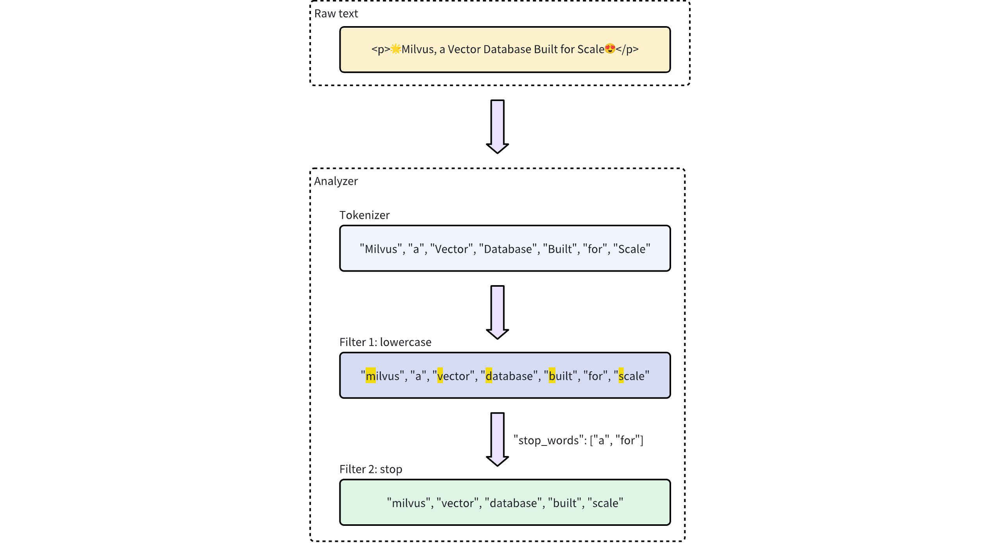

# Analyzer Overview

In text processing, an **analyzer** is a crucial component that converts raw text into a structured, searchable format. Each analyzer typically consists of two core elements: **tokenizer** and **filter**. Together, they transform input text into tokens, refine these tokens, and prepare them for efficient indexing and retrieval.

In Milvus, analyzers are configured during collection creation when you add `VARCHAR` fields to the collection schema. Tokens produced by an analyzer can be used to build an index for keyword matching or converted into sparse embeddings for full text search. For more information, refer to [Text Match](keyword-match.md) or [Full Text Search](full-text-search.md).

<div class="alert note">

The use of analyzers may impact performance:

- **Full text search:** For full text search, **DataNode** and **QueryNode** channels consume data more slowly because they must wait for tokenization to complete. As a result, newly ingested data takes longer to become available for search.

- **Keyword match:** For keyword matching, index creation is also slower since tokenization needs to finish before an index can be built.

</div>

## Anatomy of an analyzer

An analyzer in Milvus consists of exactly one **tokenizer** and **zero or more** filters.

- **Tokenizer**: The tokenizer breaks input text into discrete units called tokens. These tokens could be words or phrases, depending on the tokenizer type.

- **Filters**: Filters can be applied to tokens to further refine them, for example, by making them lowercase or removing common words.

<div class="alert note">

Tokenizers support only UTF-8 format. Support for other formats will be added in future releases.

</div>

The workflow below shows how an analyzer processes text.



## Analyzer types

Milvus provides two types of analyzers to meet different text processing needs:

- **Built-in analyzer**: These are predefined configurations that cover common text processing tasks with minimal setup. Built-in analyzers are ideal for general-purpose searches, as they require no complex configuration.

- **Custom analyzer**: For more advanced requirements, custom analyzers allow you to define your own configuration by specifying both the tokenizer and zero or more filters. This level of customization is especially useful for specialized use cases where precise control over text processing is needed.

<div class="alert note">

If you omit analyzer configurations during collection creation, Milvus uses the `standard` analyzer for all text processing by default. For details, refer to [Standard](standard-analyzer.md).

</div>

### Built-in analyzer

Built-in analyzers in Milvus are pre-configured with specific tokenizers and filters, allowing you to use them immediately without needing to define these components yourself. Each built-in analyzer serves as a template that includes a preset tokenizer and filters, with optional parameters for customization.

For example, to use the `standard` built-in analyzer, simply specify its name `standard` as the `type` and optionally include extra configurations specific to this analyzer type, such as `stop_words`:

<div class="multipleCode">
    <a href="#python">Python</a>
    <a href="#java">Java</a>
    <a href="#javascript">NodeJS</a>
    <a href="#go">Go</a>
    <a href="#bash">cURL</a>
</div>

```python
analyzer_params = {
    "type": "standard", # Uses the standard built-in analyzer
    "stop_words": ["a", "an", "for"] # Defines a list of common words (stop words) to exclude from tokenization
}
```

```java
Map<String, Object> analyzerParams = new HashMap<>();
analyzerParams.put("type", "standard");
analyzerParams.put("stop_words", Arrays.asList("a", "an", "for"));
```

```javascript
const analyzer_params = {
    "type": "standard", // Uses the standard built-in analyzer
    "stop_words": ["a", "an", "for"] // Defines a list of common words (stop words) to exclude from tokenization
};
```

```go
analyzerParams := map[string]any{"type": "standard", "stop_words": []string{"a", "an", "for"}}
```

```bash
export analyzerParams='{
       "type": "standard",
       "stop_words": ["a", "an", "for"]
    }'
```

To check the execution result of an analyzer, use the `run_analyzer` method:

<div class="multipleCode">
    <a href="#python">Python</a>
    <a href="#java">Java</a>
    <a href="#javascript">NodeJS</a>
    <a href="#go">Go</a>
    <a href="#bash">cURL</a>
</div>

```python
# Sample text to analyze
text = "An efficient system relies on a robust analyzer to correctly process text for various applications."

# Run analyzer
result = client.run_analyzer(
    text,
    analyzer_params
)
```

```java
import io.milvus.v2.service.vector.request.RunAnalyzerReq;
import io.milvus.v2.service.vector.response.RunAnalyzerResp;

List<String> texts = new ArrayList<>();
texts.add("An efficient system relies on a robust analyzer to correctly process text for various applications.");

RunAnalyzerResp resp = client.runAnalyzer(RunAnalyzerReq.builder()
        .texts(texts)
        .analyzerParams(analyzerParams)
        .build());
List<RunAnalyzerResp.AnalyzerResult> results = resp.getResults();
```

```javascript
// javascrip# Sample text to analyze
const text = "An efficient system relies on a robust analyzer to correctly process text for various applications."

// Run analyzer
const result = await client.run_analyzer({
    text,
    analyzer_params
});
```

```go
import (
    "context"
    "encoding/json"
    "fmt"

    "github.com/milvus-io/milvus/client/v2/milvusclient"
)

bs, _ := json.Marshal(analyzerParams)
texts := []string{"An efficient system relies on a robust analyzer to correctly process text for various applications."}
option := milvusclient.NewRunAnalyzerOption(texts).
    WithAnalyzerParams(string(bs))

result, err := client.RunAnalyzer(ctx, option)
if err != nil {
    fmt.Println(err.Error())
    // handle error
}
```

```bash
# restful
```

The output will be:

```plaintext
['efficient', 'system', 'relies', 'on', 'robust', 'analyzer', 'to', 'correctly', 'process', 'text', 'various', 'applications']
```

This demonstrates that the analyzer properly tokenizes the input text by filtering out the stop words `"a"`, `"an"`, and `"for"`, while returning the remaining meaningful tokens.

The configuration of the `standard` built-in analyzer above is equivalent to setting up a [custom analyzer](analyzer-overview.md#Custom-analyzer) with the following parameters, where `tokenizer` and `filter` options are explicitly defined to achieve similar functionality:

<div class="multipleCode">
    <a href="#python">Python</a>
    <a href="#java">Java</a>
    <a href="#javascript">NodeJS</a>
    <a href="#go">Go</a>
    <a href="#bash">cURL</a>
</div>

```python
analyzer_params = {
    "tokenizer": "standard",
    "filter": [
        "lowercase",
        {
            "type": "stop",
            "stop_words": ["a", "an", "for"]
        }
    ]
}
```

```java
Map<String, Object> analyzerParams = new HashMap<>();
analyzerParams.put("tokenizer", "standard");
analyzerParams.put("filter",
        Arrays.asList("lowercase",
                new HashMap<String, Object>() {{
                    put("type", "stop");
                    put("stop_words", Arrays.asList("a", "an", "for"));
                }}));
```

```javascript
const analyzer_params = {
    "tokenizer": "standard",
    "filter": [
        "lowercase",
        {
            "type": "stop",
            "stop_words": ["a", "an", "for"]
        }
    ]
};
```

```go
analyzerParams = map[string]any{"tokenizer": "standard",
    "filter": []any{"lowercase", map[string]any{
        "type":       "stop",
        "stop_words": []string{"a", "an", "for"},
    }}}
```

```bash
export analyzerParams='{
       "type": "standard",
       "filter":  [
       "lowercase",
       {
            "type": "stop",
            "stop_words": ["a", "an", "for"]
       }
   ]
}'
```

Milvus offers the following built-in analyzers, each designed for specific text processing needs:

- `standard`: Suitable for general-purpose text processing, applying standard tokenization and lowercase filtering.

- `english`: Optimized for English-language text, with support for English stop words.

- `chinese`: Specialized for processing Chinese text, including tokenization adapted for Chinese language structures.

### Custom analyzer

For more advanced text processing, custom analyzers in Milvus allow you to build a tailored text-handling pipeline by specifying both a **tokenizer** and **filters**. This setup is ideal for specialized use cases where precise control is required.

#### Tokenizer

The **tokenizer** is a **mandatory** component for a custom analyzer, which initiates the analyzer pipeline by breaking down input text into discrete units or **tokens**. Tokenization follows specific rules, such as splitting by whitespace or punctuation, depending on the tokenizer type. This process allows for more precise and independent handling of each word or phrase.

For example, a tokenizer would convert text `"Vector Database Built for Scale"` into separate tokens:

```plaintext
["Vector", "Database", "Built", "for", "Scale"]
```

**Example of specifying a tokenizer**:

<div class="multipleCode">
    <a href="#python">Python</a>
    <a href="#java">Java</a>
    <a href="#javascript">NodeJS</a>
    <a href="#go">Go</a>
    <a href="#bash">cURL</a>
</div>

```python
analyzer_params = {
    "tokenizer": "whitespace",
}
```

```java
Map<String, Object> analyzerParams = new HashMap<>();
analyzerParams.put("tokenizer", "whitespace");
```

```javascript
const analyzer_params = {
    "tokenizer": "whitespace",
};
```

```go
analyzerParams = map[string]any{"tokenizer": "whitespace"}
```

```bash
export analyzerParams='{
       "type": "whitespace"
    }'
```

#### Filter

**Filters** are **optional** components working on the tokens produced by the tokenizer, transforming or refining them as needed. For example, after applying a `lowercase` filter to the tokenized terms `["Vector", "Database", "Built", "for", "Scale"]`, the result might be:

```sql
["vector", "database", "built", "for", "scale"]
```

Filters in a custom analyzer can be either **built-in** or **custom**, depending on configuration needs.

- **Built-in filters**: Pre-configured by Milvus, requiring minimal setup. You can use these filters out-of-the-box by specifying their names. The filters below are built-in for direct use:

    - `lowercase`: Converts text to lowercase, ensuring case-insensitive matching. For details, refer to [Lowercase](lowercase-filter.md).

    - `asciifolding`: Converts non-ASCII characters to ASCII equivalents, simplifying multilingual text handling. For details, refer to [ASCII folding](ascii-folding-filter.md).

    - `alphanumonly`: Retains only alphanumeric characters by removing others. For details, refer to [Alphanumonly](alphanumonly-filter.md).

    - `cnalphanumonly`: Removes tokens that contain any characters other than Chinese characters, English letters, or digits. For details, refer to [Cnalphanumonly](cnalphanumonly-filter.md).

    - `cncharonly`: Removes tokens that contain any non-Chinese characters. For details, refer to [Cncharonly](cncharonly-filter.md).

    **Example of using a built-in filter:**

    <div class="multipleCode">
        <a href="#python">Python</a>
        <a href="#java">Java</a>
        <a href="#javascript">NodeJS</a>
        <a href="#go">Go</a>
        <a href="#bash">cURL</a>
    </div>

    ```python
    analyzer_params = {
        "tokenizer": "standard", # Mandatory: Specifies tokenizer
        "filter": ["lowercase"], # Optional: Built-in filter that converts text to lowercase
    }
    ```

    ```java
    Map<String, Object> analyzerParams = new HashMap<>();
    analyzerParams.put("tokenizer", "standard");
    analyzerParams.put("filter", Collections.singletonList("lowercase"));
    ```

    ```javascript
    const analyzer_params = {
        "tokenizer": "standard", // Mandatory: Specifies tokenizer
        "filter": ["lowercase"], // Optional: Built-in filter that converts text to lowercase
    }
    ```

    ```go
    analyzerParams = map[string]any{"tokenizer": "standard",
            "filter": []any{"lowercase"}}
    ```

    ```bash
    export analyzerParams='{
           "type": "standard",
           "filter":  ["lowercase"]
        }'
    ```

- **Custom filters**: Custom filters allow for specialized configurations. You can define a custom filter by choosing a valid filter type (`filter.type`) and adding specific settings for each filter type. Examples of filter types that support customization:

    - `stop`: Removes specified common words by setting a list of stop words (e.g., `"stop_words": ["of", "to"]`). For details, refer to [Stop](stop-filter.md).

    - `length`: Excludes tokens based on length criteria, such as setting a maximum token length. For details, refer to [Length](length-filter.md).

    - `stemmer`: Reduces words to their root forms for more flexible matching. For details, refer to [Stemmer](stemmer-filter.md).

    **Example of configuring a custom filter:**

    <div class="multipleCode">
        <a href="#python">Python</a>
        <a href="#java">Java</a>
        <a href="#javascript">NodeJS</a>
        <a href="#go">Go</a>
        <a href="#bash">cURL</a>
    </div>

    ```python
    analyzer_params = {
        "tokenizer": "standard", # Mandatory: Specifies tokenizer
        "filter": [
            {
                "type": "stop", # Specifies 'stop' as the filter type
                "stop_words": ["of", "to"], # Customizes stop words for this filter type
            }
        ]
    }
    ```

    ```java
    Map<String, Object> analyzerParams = new HashMap<>();
    analyzerParams.put("tokenizer", "standard");
    analyzerParams.put("filter",
            Collections.singletonList(new HashMap<String, Object>() {{
                put("type", "stop");
                put("stop_words", Arrays.asList("a", "an", "for"));
            }}));
    ```

    ```javascript
    const analyzer_params = {
        "tokenizer": "standard", // Mandatory: Specifies tokenizer
        "filter": [
            {
                "type": "stop", // Specifies 'stop' as the filter type
                "stop_words": ["of", "to"], // Customizes stop words for this filter type
            }
        ]
    };
    ```

    ```go
    analyzerParams = map[string]any{"tokenizer": "standard",
        "filter": []any{map[string]any{
            "type":       "stop",
            "stop_words": []string{"of", "to"},
        }}}
    ```

    ```bash
    export analyzerParams='{
           "type": "standard",
           "filter":  [
           {
                "type": "stop",
                "stop_words": ["a", "an", "for"]
           }
        ]
    }'
    ```

## Example use

In this example, you will create a collection schema that includes:

- A vector field for embeddings.

- Two `VARCHAR` fields for text processing:

    - One field uses a built-in analyzer.

    - The other uses a custom analyzer.

Before incorporating these configurations into your collection, you'll verify each analyzer using the `run_analyzer` method.

### Step 1: Initialize MilvusClient and create schema

Begin by setting up the Milvus client and creating a new schema.

<div class="multipleCode">
    <a href="#python">Python</a>
    <a href="#java">Java</a>
    <a href="#javascript">NodeJS</a>
    <a href="#go">Go</a>
    <a href="#bash">cURL</a>
</div>

```python
from pymilvus import MilvusClient, DataType

# Set up a Milvus client
client = MilvusClient(uri="http://localhost:19530")

# Create a new schema
schema = client.create_schema(auto_id=True, enable_dynamic_field=False)
```

```java
import io.milvus.v2.client.ConnectConfig;
import io.milvus.v2.client.MilvusClientV2;
import io.milvus.v2.common.DataType;
import io.milvus.v2.common.IndexParam;
import io.milvus.v2.service.collection.request.AddFieldReq;
import io.milvus.v2.service.collection.request.CreateCollectionReq;

// Set up a Milvus client
ConnectConfig config = ConnectConfig.builder()
        .uri("http://localhost:19530")
        .build();
MilvusClientV2 client = new MilvusClientV2(config);

// Create schema
CreateCollectionReq.CollectionSchema schema = CreateCollectionReq.CollectionSchema.builder()
        .enableDynamicField(false)
        .build();
```

```javascript
import { MilvusClient, DataType } from "@zilliz/milvus2-sdk-node";

// Set up a Milvus client
const client = new MilvusClient("http://localhost:19530");
```

```go
import (
    "context"
    "fmt"

    "github.com/milvus-io/milvus/client/v2/column"
    "github.com/milvus-io/milvus/client/v2/entity"
    "github.com/milvus-io/milvus/client/v2/index"
    "github.com/milvus-io/milvus/client/v2/milvusclient"
)  

ctx, cancel := context.WithCancel(context.Background())
defer cancel()

cli, err := milvusclient.New(ctx, &milvusclient.ClientConfig{
    Address: "localhost:19530",
})
if err != nil {
    fmt.Println(err.Error())
    // handle err
}
defer client.Close(ctx)

schema := entity.NewSchema().WithAutoID(true).WithDynamicFieldEnabled(false)
```

```bash
# restful
```

### Step 2: Define and verify analyzer configurations

1. **Configure and verify a built-in analyzer** (`english`)**:**

    - **Configuration:** Define the analyzer parameters for the built-in English analyzer.

    - **Verification:** Use `run_analyzer` to check that the configuration produces the expected tokenization.

    <div class="multipleCode">
        <a href="#python">Python</a>
        <a href="#java">Java</a>
        <a href="#javascript">NodeJS</a>
        <a href="#go">Go</a>
        <a href="#bash">cURL</a>
    </div>

    ```python
    # Built-in analyzer configuration for English text processing
    analyzer_params_built_in = {
        "type": "english"
    }
    
    # Verify built-in analyzer configuration
    sample_text = "Milvus simplifies text analysis for search."
    result = client.run_analyzer(sample_text, analyzer_params_built_in)
    print("Built-in analyzer output:", result)
    
    # Expected output:
    # Built-in analyzer output: ['milvus', 'simplifi', 'text', 'analysi', 'search']
    
    ```

    ```java
    Map<String, Object> analyzerParamsBuiltin = new HashMap<>();
    analyzerParamsBuiltin.put("type", "english");

    List<String> texts = new ArrayList<>();
    texts.add("Milvus simplifies text ana
    
    lysis for search.");
    
    RunAnalyzerResp resp = client.runAnalyzer(RunAnalyzerReq.builder()
            .texts(texts)
            .analyzerParams(analyzerParams)
            .build());
    List<RunAnalyzerResp.AnalyzerResult> results = resp.getResults();
    
    ```

    ```javascript
    // Use a built-in analyzer for VARCHAR field `title_en`
    const analyzerParamsBuiltIn = {
      type: "english",
    };

    const sample_text = "Milvus simplifies text analysis for search.";
    const result = await client.run_analyzer({
        text: sample_text, 
        analyzer_params: analyzer_params_built_in
    });
    
    ```

    ```go
    analyzerParams := map[string]any{"type": "english"}

    bs, _ := json.Marshal(analyzerParams)
    texts := []string{"Milvus simplifies text analysis for search."}
    option := milvusclient.NewRunAnalyzerOption(texts).
        WithAnalyzerParams(string(bs))
    
    result, err := client.RunAnalyzer(ctx, option)
    if err != nil {
        fmt.Println(err.Error())
        // handle error
    }
    
    ```

    ```bash
    # restful
    ```

1. **Configure and verify a custom analyzer:**

    - **Configuration:** Define a custom analyzer that uses a standard tokenizer along with a built-in lowercase filter and custom filters for token length and stop words.

    - **Verification:** Use `run_analyzer` to ensure the custom configuration processes text as intended.

    <div class="multipleCode">
        <a href="#python">Python</a>
        <a href="#java">Java</a>
        <a href="#javascript">NodeJS</a>
        <a href="#go">Go</a>
        <a href="#bash">cURL</a>
    </div>

    ```python
    # Custom analyzer configuration with a standard tokenizer and custom filters
    analyzer_params_custom = {
        "tokenizer": "standard",
        "filter": [
            "lowercase",  # Built-in filter: convert tokens to lowercase
            {
                "type": "length",  # Custom filter: restrict token length
                "max": 40
            },
            {
                "type": "stop",  # Custom filter: remove specified stop words
                "stop_words": ["of", "for"]
            }
        ]
    }
    
    # Verify custom analyzer configuration
    sample_text = "Milvus provides flexible, customizable analyzers for robust text processing."
    result = client.run_analyzer(sample_text, analyzer_params_custom)
    print("Custom analyzer output:", result)
    
    # Expected output:
    # Custom analyzer output: ['milvus', 'provides', 'flexible', 'customizable', 'analyzers', 'robust', 'text', 'processing']
    
    ```

    ```java
    // Configure a custom analyzer
    Map<String, Object> analyzerParams = new HashMap<>();
    analyzerParams.put("tokenizer", "standard");
    analyzerParams.put("filter",
            Arrays.asList("lowercase",
                    new HashMap<String, Object>() {{
                        put("type", "length");
                        put("max", 40);
                    }},
                    new HashMap<String, Object>() {{
                        put("type", "stop");
                        put("stop_words", Arrays.asList("of", "for"));
                    }}
            )
    );
    
    List<String> texts = new ArrayList<>();
    texts.add("Milvus provides flexible, customizable analyzers for robust text processing.");
    
    RunAnalyzerResp resp = client.runAnalyzer(RunAnalyzerReq.builder()
            .texts(texts)
            .analyzerParams(analyzerParams)
            .build());
    List<RunAnalyzerResp.AnalyzerResult> results = resp.getResults();
    ```

    ```javascript
    // Configure a custom analyzer for VARCHAR field `title`
    const analyzerParamsCustom = {
      tokenizer: "standard",
      filter: [
        "lowercase",
        {
          type: "length",
          max: 40,
        },
        {
          type: "stop",
          stop_words: ["of", "to"],
        },
      ],
    };
    const sample_text = "Milvus provides flexible, customizable analyzers for robust text processing.";
    const result = await client.run_analyzer({
        text: sample_text, 
        analyzer_params: analyzer_params_built_in
    });
    ```

    ```go
    analyzerParams = map[string]any{"tokenizer": "standard",
        "filter": []any{"lowercase", 
        map[string]any{
            "type": "length",
            "max":  40,
        map[string]any{
            "type": "stop",
            "stop_words": []string{"of", "to"},
        }}}
        
    bs, _ := json.Marshal(analyzerParams)
    texts := []string{"Milvus provides flexible, customizable analyzers for robust text processing."}
    option := milvusclient.NewRunAnalyzerOption(texts).
        WithAnalyzerParams(string(bs))
    
    result, err := client.RunAnalyzer(ctx, option)
    if err != nil {
        fmt.Println(err.Error())
        // handle error
    }
    ```

    ```bash
    # curl
    ```

### Step 3: Add fields to the schema

Now that you have verified your analyzer configurations, add them to your schema fields:

<div class="multipleCode">
    <a href="#python">Python</a>
    <a href="#java">Java</a>
    <a href="#javascript">NodeJS</a>
    <a href="#go">Go</a>
    <a href="#bash">cURL</a>
</div>

```python
# Add VARCHAR field 'title_en' using the built-in analyzer configuration
schema.add_field(
    field_name='title_en',
    datatype=DataType.VARCHAR,
    max_length=1000,
    enable_analyzer=True,
    analyzer_params=analyzer_params_built_in,
    enable_match=True,
)

# Add VARCHAR field 'title' using the custom analyzer configuration
schema.add_field(
    field_name='title',
    datatype=DataType.VARCHAR,
    max_length=1000,
    enable_analyzer=True,
    analyzer_params=analyzer_params_custom,
    enable_match=True,
)

# Add a vector field for embeddings
schema.add_field(field_name="embedding", datatype=DataType.FLOAT_VECTOR, dim=3)

# Add a primary key field
schema.add_field(field_name="id", datatype=DataType.INT64, is_primary=True)
```

```java
schema.addField(AddFieldReq.builder()
        .fieldName("title")
        .dataType(DataType.VarChar)
        .maxLength(1000)
        .enableAnalyzer(true)
        .analyzerParams(analyzerParams)
        .enableMatch(true) // must enable this if you use TextMatch
        .build());

// Add vector field
schema.addField(AddFieldReq.builder()
        .fieldName("embedding")
        .dataType(DataType.FloatVector)
        .dimension(3)
        .build());
// Add primary field
schema.addField(AddFieldReq.builder()
        .fieldName("id")
        .dataType(DataType.Int64)
        .isPrimaryKey(true)
        .autoID(true)
        .build());
```

```javascript
// Create schema
const schema = {
  auto_id: true,
  fields: [
    {
      name: "id",
      type: DataType.INT64,
      is_primary: true,
    },
    {
      name: "title_en",
      data_type: DataType.VARCHAR,
      max_length: 1000,
      enable_analyzer: true,
      analyzer_params: analyzerParamsBuiltIn,
      enable_match: true,
    },
    {
      name: "title",
      data_type: DataType.VARCHAR,
      max_length: 1000,
      enable_analyzer: true,
      analyzer_params: analyzerParamsCustom,
      enable_match: true,
    },
    {
      name: "embedding",
      data_type: DataType.FLOAT_VECTOR,
      dim: 4,
    },
  ],
};
```

```go
schema.WithField(entity.NewField().
    WithName("id").
    WithDataType(entity.FieldTypeInt64).
    WithIsPrimaryKey(true).
    WithIsAutoID(true),
).WithField(entity.NewField().
    WithName("embedding").
    WithDataType(entity.FieldTypeFloatVector).
    WithDim(3),
).WithField(entity.NewField().
    WithName("title").
    WithDataType(entity.FieldTypeVarChar).
    WithMaxLength(1000).
    WithEnableAnalyzer(true).
    WithAnalyzerParams(analyzerParams).
    WithEnableMatch(true),
)
```

```bash
# restful
```

### Step 4: Prepare index parameters and create the collection

<div class="multipleCode">
    <a href="#python">Python</a>
    <a href="#java">Java</a>
    <a href="#javascript">NodeJS</a>
    <a href="#go">Go</a>
    <a href="#bash">cURL</a>
</div>

```python
# Set up index parameters for the vector field
index_params = client.prepare_index_params()
index_params.add_index(field_name="embedding", metric_type="COSINE", index_type="AUTOINDEX")

# Create the collection with the defined schema and index parameters
client.create_collection(
    collection_name="my_collection",
    schema=schema,
    index_params=index_params
)
```

```java
// Set up index params for vector field
List<IndexParam> indexes = new ArrayList<>();
indexes.add(IndexParam.builder()
        .fieldName("embedding")
        .indexType(IndexParam.IndexType.AUTOINDEX)
        .metricType(IndexParam.MetricType.COSINE)
        .build());

// Create collection with defined schema
CreateCollectionReq requestCreate = CreateCollectionReq.builder()
        .collectionName("my_collection")
        .collectionSchema(schema)
        .indexParams(indexes)
        .build();
client.createCollection(requestCreate);
```

```javascript
// Set up index params for vector field
const indexParams = [
  {
    name: "embedding",
    metric_type: "COSINE",
    index_type: "AUTOINDEX",
  },
];

// Create collection with defined schema
await client.createCollection({
  collection_name: "my_collection",
  schema: schema,
  index_params: indexParams,
});

console.log("Collection created successfully!");
```

```go
idx := index.NewAutoIndex(index.MetricType(entity.COSINE))
indexOption := milvusclient.NewCreateIndexOption("my_collection", "embedding", idx)

err = client.CreateCollection(ctx,
    milvusclient.NewCreateCollectionOption("my_collection", schema).
        WithIndexOptions(indexOption))
if err != nil {
    fmt.Println(err.Error())
    // handle error
}
```

```bash
# restful
```