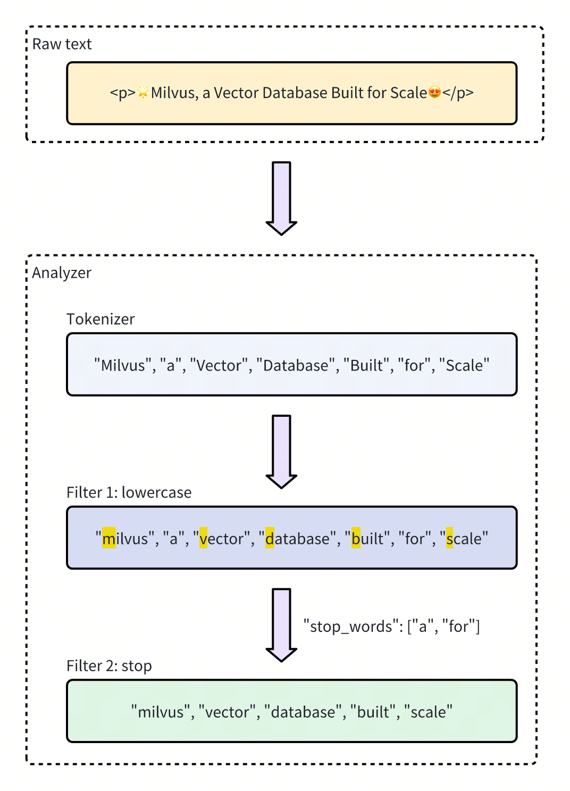

# Analyzer Overview​

In text processing, an **analyzer** is a crucial component that converts raw text into a structured, searchable format. Each analyzer typically consists of two core elements: **tokenizer** and **filter**. Together, they transform input text into tokens, refine these tokens, and prepare them for efficient indexing and retrieval.​

In Milvus, analyzers are configured during collection creation when you add `VARCHAR` fields to the collection schema. Tokens produced by an analyzer can be used to build an index for keyword matching or converted into sparse embeddings for full text search. For more information, refer to [​Keyword Match](keyword-match.md) or [​Full Text Search](full-text-search.md).​

<div class="alert note">

The use of analyzers may impact performance:​

- **Full text search:** For full text search, DataNode and **QueryNode** channels consume data more slowly because they must wait for tokenization to complete. As a result, newly ingested data takes longer to become available for search.​

- **Keyword match:** For keyword matching, index creation is also slower since tokenization needs to finish before an index can be built.​

</div>

## Anatomy of an analyzer​

An analyzer in Milvus consists of exactly one **tokenizer** and **zero or more** filters.​

- **Tokenizer**: The tokenizer breaks input text into discrete units called tokens. These tokens could be words or phrases, depending on the tokenizer type.​

- **Filters**: Filters can be applied to tokens to further refine them, for example, by making them lowercase or removing common words.​

The workflow below shows how an analyzer processes text.​



## Analyzer types​

Milvus provides two types of analyzers to meet different text processing needs:​

- **Built-in analyzer**: These are predefined configurations that cover common text processing tasks with minimal setup. Built-in analyzers are ideal for general-purpose searches, as they require no complex configuration.​

- **Custom analyzer**: For more advanced requirements, custom analyzers allow you to define your own configuration by specifying both the tokenizer and zero or more filters. This level of customization is especially useful for specialized use cases where precise control over text processing is needed.​

<div class="alert note">

If you omit analyzer configurations during collection creation, Milvus uses the `standard` analyzer for all text processing by default. For details, refer to [​Standard](standard-analyzer.md).​

</div>

### Built-in analyzer​

Built-in analyzers in Milvus are pre-configured with specific tokenizers and filters, allowing you to use them immediately without needing to define these components yourself. Each built-in analyzer serves as a template that includes a preset tokenizer and filters, with optional parameters for customization.​

For example, to use the `standard` built-in analyzer, simply specify its name `standard` as the `type` and optionally include extra configurations specific to this analyzer type, such as `stop_words`:​

```python
analyzer_params = {​
    "type": "standard", # Uses the standard built-in analyzer​
    "stop_words": ["a", "an", "for"] # Defines a list of common words (stop words) to exclude from tokenization​
}​

```

The configuration of the `standard` built-in analyzer above is equivalent to setting up a custom analyzer with the following parameters, where `tokenizer` and `filter` options are explicitly defined to achieve the same functionality:

```python
analyzer_params = {​
    "tokenizer": "standard",​
    "filter": [​
        "lowercase",​
        {​
            "type": "stop",​
            "stop_words": ["a", "an", "for"]​
        }​
    ]​
}​

```

Milvus offers the following built-in analyzers, each of which can be used directly by specifying their name as the `type` parameter:​

- `standard`: Suitable for general-purpose text processing, applying standard tokenization and lowercase filtering.​

- `english`: Optimized for English-language text, with support for English stop words.​

- `chinese`: Specialized for processing Chinese text, including tokenization adapted for Chinese language structures.​

### Custom analyzer​

For more advanced text processing, custom analyzers in Milvus allow you to build a tailored text-handling pipeline by specifying both a **tokenizer** and filters. This setup is ideal for specialized use cases where precise control is required.​

#### Tokenizer​

The **tokenizer** is a **mandatory** component for a custom analyzer, which initiates the analyzer pipeline by breaking down input text into discrete units or **tokens**. Tokenization follows specific rules, such as splitting by whitespace or punctuation, depending on the tokenizer type. This process allows for more precise and independent handling of each word or phrase.​

For example, a tokenizer would convert text `"Vector Database Built for Scale"` into separate tokens:​

```Plain Text
["Vector", "Database", "Built", "for", "Scale"]​
```

**Example of specifying a tokenizer**:​

```python
analyzer_params = {​
    "tokenizer": "whitespace",​
}​
```

#### Filter​

**Filters** are **optional** components working on the tokens produced by the tokenizer, transforming or refining them as needed. For example, after applying a `lowercase` filter to the tokenized terms `["Vector", "Database", "Built", "for", "Scale"]`, the result might be:​

```SQL
["vector", "database", "built", "for", "scale"]​
```

Filters in a custom analyzer can be either **built-in** or **custom**, depending on configuration needs.​

- **Built-in filters**: Pre-configured by Milvus, requiring minimal setup. You can use these filters out-of-the-box by specifying their names. The filters below are built-in for direct use:​

    - `lowercase`: Converts text to lowercase, ensuring case-insensitive matching. For details, refer to [​Lowercase](lowercase-filter.md).​

    - `asciifolding`: Converts non-ASCII characters to ASCII equivalents, simplifying multilingual text handling. For details, refer to [​ASCII folding](ascii-folding-filter.md).​

    - `alphanumonly`: Retains only alphanumeric characters by removing others. For details, refer to [​Alphanumonly](alphanumonly-filter.md).​

    - `cnalphanumonly`: Removes tokens that contain any characters other than Chinese characters, English letters, or digits. For details, refer to [​Cnalphanumonly](cnalphanumonly-filter.md).​

    - `cncharonly`: Removes tokens that contain any non-Chinese characters. For details, refer to [​Cncharonly](cncharonly-filter.md).​

    **Example of using a built-in filter:**​

    ```python
    analyzer_params = {​
        "tokenizer": "standard", # Mandatory: Specifies tokenizer​
        "filter": ["lowercase"], # Optional: Built-in filter that converts text to lowercase​
    }​
    ```

- **Custom filters**: Custom filters allow for specialized configurations. You can define a custom filter by choosing a valid filter type (`filter.type`) and adding specific settings for each filter type. Examples of filter types that support customization:​

    - `stop`: Removes specified common words by setting a list of stop words (e.g., `"stop_words": ["of", "to"]`). For details, refer to [​Stop](stop-filter.md).​

    - `length`: Excludes tokens based on length criteria, such as setting a maximum token length. For details, refer to [​Length](length-filter.md).​

    - `stemmer`: Reduces words to their root forms for more flexible matching. For details, refer to [​Stemmer](stemmer-filter.md).​

    **Example of configuring a custom filter:**​

    ```python
    analyzer_params = {​
        "tokenizer": "standard", # Mandatory: Specifies tokenizer​
        "filter": [​
            {​
                "type": "stop", # Specifies 'stop' as the filter type​
                "stop_words": ["of", "to"], # Customizes stop words for this filter type​
            }​
        ]​
    }​

    ```

## Example use​

In this example, we define a collection schema with a vector field for embeddings and two `VARCHAR` fields for text processing capabilities. Each `VARCHAR` field is configured with its own analyzer settings to handle different processing needs.​

```python
from pymilvus import MilvusClient, DataType​
​
# Set up a Milvus client​
client = MilvusClient(​
    uri="http://localhost:19530"​
)​
​
# Create schema​
schema = client.create_schema(auto_id=True, enable_dynamic_field=False)​
​
# Add fields to schema​
​
# Use a built-in analyzer​
analyzer_params_built_in = {​
    "type": "english"​
}​
​
# Add VARCHAR field `title_en`​
schema.add_field(​
    field_name='title_en', ​
    datatype=DataType.VARCHAR, ​
    max_length=1000, ​
    enable_analyzer=True，​
    analyzer_params=analyzer_params_built_in,​
    enable_match=True, ​
)​
​
# Configure a custom analyzer​
analyzer_params_custom = {​
    "tokenizer": "standard",​
    "filter": [​
        "lowercase", # Built-in filter​
        {​
            "type": "length", # Custom filter​
            "max": 40​
        },​
        {​
            "type": "stop", # Custom filter​
            "stop_words": ["of", "to"]​
        }​
    ]​
}​
​
# Add VARCHAR field `title`​
schema.add_field(​
    field_name='title', ​
    datatype=DataType.VARCHAR, ​
    max_length=1000, ​
    enable_analyzer=True，​
    analyzer_params=analyzer_params_custom,​
    enable_match=True, ​
)​
​
# Add vector field​
schema.add_field(field_name="embedding", datatype=DataType.FLOAT_VECTOR, dim=3)​
# Add primary field​
schema.add_field(field_name="id", datatype=DataType.INT64, is_primary=True)​
​
# Set up index params for vector field​
index_params = client.prepare_index_params()​
index_params.add_index(field_name="embedding", metric_type="COSINE", index_type="AUTOINDEX")​
​
# Create collection with defined schema​
client.create_collection(​
    collection_name="YOUR_COLLECTION_NAME",​
    schema=schema,​
    index_params=index_params​
)​
```

​

