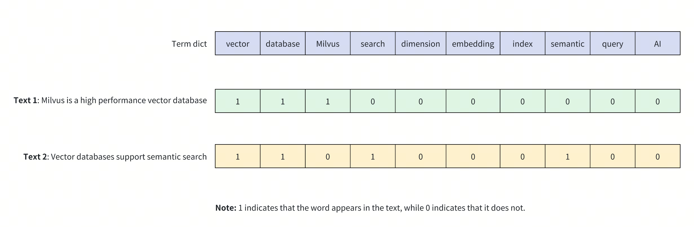
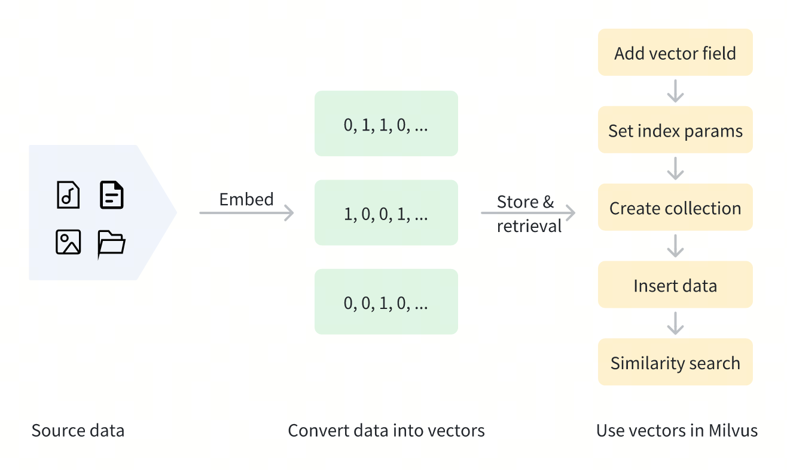

# Binary Vector

Binary vectors are a special form of data representation that convert traditional high-dimensional floating-point vectors into binary vectors containing only 0s and 1s. This transformation not only compresses the size of the vector but also reduces storage and computational costs while retaining semantic information. When precision for non-critical features is not essential, binary vectors can effectively maintain most of the integrity and utility of the original floating-point vectors.

Binary vectors have a wide range of applications, particularly in situations where computational efficiency and storage optimization are crucial. In large-scale AI systems, such as search engines or recommendation systems, real-time processing of massive amounts of data is key. By reducing the size of the vectors, binary vectors help lower latency and computational costs without significantly sacrificing accuracy. Additionally, binary vectors are useful in resource-constrained environments, such as mobile devices and embedded systems, where memory and processing power are limited. Through the use of binary vectors, complex AI functions can be implemented in these restricted settings while maintaining high performance.

## Overview

Binary vectors are a method of encoding complex objects (like images, text, or audio) into fixed-length binary values. In Milvus, binary vectors are typically represented as bit arrays or byte arrays. For example, an 8-dimensional binary vector can be represented as `[1, 0, 1, 1, 0, 0, 1, 0]`.

The diagram below shows how binary vectors represent the presence of keywords in text content. In this example, a 10-dimensional binary vector is used to represent two different texts (**Text 1** and **Text 2**), where each dimension corresponds to a word in the vocabulary: 1 indicates the presence of the word in the text, while 0 indicates its absence.



Binary vectors have the following characteristics:

- **Efficient Storage:** Each dimension requires only 1 bit of storage, significantly reducing storage space.

- **Fast Computation:** Similarity between vectors can be quickly calculated using bitwise operations like XOR.

- **Fixed Length:** The length of the vector remains constant regardless of the original text length, making indexing and retrieval easier.

- **Simple and Intuitive:** Directly reflects the presence of keywords, making it suitable for certain specialized retrieval tasks.

Binary vectors can be generated through various methods. In text processing, predefined vocabularies can be used to set corresponding bits based on word presence. For image processing, perceptual hashing algorithms (like [pHash](https://en.wikipedia.org/wiki/Perceptual_hashing)) can generate binary features of images. In machine learning applications, model outputs can be binarized to obtain binary vector representations.

After binary vectorization, the data can be stored in Milvus for management and vector retrieval. The diagram below shows the basic process.



<div class="alert note">

Although binary vectors excel in specific scenarios, they have limitations in their expressive capability, making it difficult to capture complex semantic relationships. Therefore, in real-world scenarios, binary vectors are often used alongside other vector types to balance efficiency and expressiveness. For more information, refer to [Dense Vector](dense-vector.md) and [Sparse Vector](sparse_vector.md).

</div>

## Use binary vectors

### Add vector field

To use binary vectors in Milvus, first define a vector field for storing binary vectors when creating a collection. This process includes:

1. Setting `datatype` to the supported binary vector data type, i.e., `BINARY_VECTOR`.

1. Specifying the vector's dimensions using the `dim` parameter. Note that `dim` must be a multiple of 8 as binary vectors must be converted into a byte array when inserting. Every 8 boolean values (0 or 1) will be packed into 1 byte. For example, if `dim=128`, a 16-byte array is required for insertion.

<div class="multipleCode">
    <a href="#python">Python</a>
    <a href="#java">Java</a>
    <a href="#javascript">NodeJS</a>
    <a href="#go">Go</a>
    <a href="#bash">cURL</a>
</div>

```python
from pymilvus import MilvusClient, DataType

client = MilvusClient(uri="http://localhost:19530")

schema = client.create_schema(
    auto_id=True,
    enable_dynamic_fields=True,
)

schema.add_field(field_name="pk", datatype=DataType.VARCHAR, is_primary=True, max_length=100)
schema.add_field(field_name="binary_vector", datatype=DataType.BINARY_VECTOR, dim=128)
```

```java
import io.milvus.v2.client.ConnectConfig;
import io.milvus.v2.client.MilvusClientV2;

import io.milvus.v2.common.DataType;
import io.milvus.v2.service.collection.request.AddFieldReq;
import io.milvus.v2.service.collection.request.CreateCollectionReq;

MilvusClientV2 client = new MilvusClientV2(ConnectConfig.builder()
        .uri("http://localhost:19530")
        .build());
        
CreateCollectionReq.CollectionSchema schema = client.createSchema();
schema.setEnableDynamicField(true);
schema.addField(AddFieldReq.builder()
        .fieldName("pk")
        .dataType(DataType.VarChar)
        .isPrimaryKey(true)
        .autoID(true)
        .maxLength(100)
        .build());

schema.addField(AddFieldReq.builder()
        .fieldName("binary_vector")
        .dataType(DataType.BinaryVector)
        .dimension(128)
        .build());
```

```javascript
import { DataType } from "@zilliz/milvus2-sdk-node";

schema.push({
  name: "binary vector",
  data_type: DataType.BinaryVector,
  dim: 128,
});
```

```go
import (
    "context"
    "fmt"

    "github.com/milvus-io/milvus/client/v2/column"
    "github.com/milvus-io/milvus/client/v2/entity"
    "github.com/milvus-io/milvus/client/v2/index"
    "github.com/milvus-io/milvus/client/v2/milvusclient"
)

ctx, cancel := context.WithCancel(context.Background())
defer cancel()

milvusAddr := "localhost:19530"
client, err := milvusclient.New(ctx, &milvusclient.ClientConfig{
    Address: milvusAddr,
})
if err != nil {
    fmt.Println(err.Error())
    // handle error
}
defer client.Close(ctx)

schema := entity.NewSchema()
schema.WithField(entity.NewField().
    WithName("pk").
    WithDataType(entity.FieldTypeVarChar).
    WithIsAutoID(true).
    WithIsPrimaryKey(true).
    WithMaxLength(100),
).WithField(entity.NewField().
    WithName("binary_vector").
    WithDataType(entity.FieldTypeBinaryVector).
    WithDim(128),
)
```

```bash
export primaryField='{
    "fieldName": "pk",
    "dataType": "VarChar",
    "isPrimary": true,
    "elementTypeParams": {
        "max_length": 100
    }
}'

export vectorField='{
    "fieldName": "binary_vector",
    "dataType": "BinaryVector",
    "elementTypeParams": {
        "dim": 128
    }
}'

export schema="{
    \"autoID\": true,
    \"fields\": [
        $primaryField,
        $vectorField
    ],
    \"enableDynamicField\": true
}"

```

In this example, a vector field named `binary_vector` is added for storing binary vectors. The data type of this field is `BINARY_VECTOR`, with a dimension of 128.

### Set index params for vector field

To speed up searches, an index must be created for the binary vector field. Indexing can significantly enhance the retrieval efficiency of large-scale vector data.

<div class="multipleCode">
    <a href="#python">Python</a>
    <a href="#java">Java</a>
    <a href="#javascript">NodeJS</a>
    <a href="#go">Go</a>
    <a href="#bash">cURL</a>
</div>

```python
index_params = client.prepare_index_params()

index_params.add_index(
    field_name="binary_vector",
    index_name="binary_vector_index",
    index_type="AUTOINDEX",
    metric_type="HAMMING"
)
```

```java
import io.milvus.v2.common.IndexParam;
import java.util.*;

List<IndexParam> indexParams = new ArrayList<>();
Map<String,Object> extraParams = new HashMap<>();

indexParams.add(IndexParam.builder()
        .fieldName("binary_vector")
        .indexType(IndexParam.IndexType.AUTOINDEX)
        .metricType(IndexParam.MetricType.HAMMING)
        .build());
```

```javascript
import { MetricType, IndexType } from "@zilliz/milvus2-sdk-node";

const indexParams = {
  indexName: "binary_vector_index",
  field_name: "binary_vector",
  metric_type: MetricType.HAMMING,
  index_type: IndexType.AUTOINDEX
};
```

```go
idx := index.NewAutoIndex(entity.HAMMING)
indexOption := milvusclient.NewCreateIndexOption("my_collection", "binary_vector", idx)
```

```bash
export indexParams='[
        {
            "fieldName": "binary_vector",
            "metricType": "HAMMING",
            "indexName": "binary_vector_index",
            "indexType": "AUTOINDEX"
        }
    ]'
```

In the example above, an index named `binary_vector_index` is created for the `binary_vector` field, using the `AUTOINDEX` index type. The `metric_type` is set to `HAMMING`, indicating that Hamming distance is used for similarity measurement.

Milvus provides various index types for a better vector search experience. AUTOINDEX is a special index type designed to smooth the learning curve of vector search. There are a lot of index types available for you to choose from. For details, refer to xxx.

Additionally, Milvus supports other similarity metrics for binary vectors. For more information, refer to [Metric Types](metric.md).

### Create collection

Once the binary vector and index settings are complete, create a collection that contains binary vectors. The example below uses the `create_collection` method to create a collection named `my_collection`.

<div class="multipleCode">
    <a href="#python">Python</a>
    <a href="#java">Java</a>
    <a href="#javascript">NodeJS</a>
    <a href="#go">Go</a>
    <a href="#bash">cURL</a>
</div>

```python
client.create_collection(
    collection_name="my_collection",
    schema=schema,
    index_params=index_params
)
```

```java
import io.milvus.v2.client.ConnectConfig;
import io.milvus.v2.client.MilvusClientV2;

MilvusClientV2 client = new MilvusClientV2(ConnectConfig.builder()
        .uri("http://localhost:19530")
        .build());

CreateCollectionReq requestCreate = CreateCollectionReq.builder()
        .collectionName("my_collection")
        .collectionSchema(schema)
        .indexParams(indexParams)
        .build();
client.createCollection(requestCreate);
```

```javascript
import { MilvusClient } from "@zilliz/milvus2-sdk-node";

const client = new MilvusClient({
    address: 'http://localhost:19530'
});

await client.createCollection({
    collection_name: 'my_collection',
    schema: schema,
    index_params: indexParams
});
```

```go
err = client.CreateCollection(ctx,
    milvusclient.NewCreateCollectionOption("my_collection", schema).
        WithIndexOptions(indexOption))
if err != nil {
    fmt.Println(err.Error())
    // handle error
}
```

```bash
curl --request POST \
--url "${CLUSTER_ENDPOINT}/v2/vectordb/collections/create" \
--header "Authorization: Bearer ${TOKEN}" \
--header "Content-Type: application/json" \
-d "{
    \"collectionName\": \"my_collection\",
    \"schema\": $schema,
    \"indexParams\": $indexParams
}"
```

### Insert data

After creating the collection, use the `insert` method to add data containing binary vectors. Note that binary vectors should be provided in the form of a byte array, where each byte represents 8 boolean values.

For example, for a 128-dimensional binary vector, a 16-byte array is required (since 128 bits ÷ 8 bits/byte = 16 bytes). Below is an example code for inserting data:

<div class="multipleCode">
    <a href="#python">Python</a>
    <a href="#java">Java</a>
    <a href="#javascript">NodeJS</a>
    <a href="#go">Go</a>
    <a href="#bash">cURL</a>
</div>

```python
def convert_bool_list_to_bytes(bool_list):
    if len(bool_list) % 8 != 0:
        raise ValueError("The length of a boolean list must be a multiple of 8")

    byte_array = bytearray(len(bool_list) // 8)
    for i, bit in enumerate(bool_list):
        if bit == 1:
            index = i // 8
            shift = i % 8
            byte_array[index] |= (1 << shift)
    return bytes(byte_array)

bool_vectors = [
    [1, 0, 0, 1, 1, 0, 1, 1, 0, 1, 0, 1, 0, 1, 0, 0] + [0] * 112,
    [0, 1, 0, 1, 0, 1, 0, 0, 1, 1, 0, 0, 1, 1, 0, 1] + [0] * 112,
]

data = [{"binary_vector": convert_bool_list_to_bytes(bool_vector) for bool_vector in bool_vectors}]

client.insert(
    collection_name="my_collection",
    data=data
)
```

```java
import com.google.gson.Gson;
import com.google.gson.JsonObject;
import io.milvus.v2.service.vector.request.InsertReq;
import io.milvus.v2.service.vector.response.InsertResp;

private static byte[] convertBoolArrayToBytes(boolean[] booleanArray) {
    byte[] byteArray = new byte[booleanArray.length / Byte.SIZE];
    for (int i = 0; i < booleanArray.length; i++) {
        if (booleanArray[i]) {
            int index = i / Byte.SIZE;
            int shift = i % Byte.SIZE;
            byteArray[index] |= (byte) (1 << shift);
        }
    }

    return byteArray;
}

List<JsonObject> rows = new ArrayList<>();
Gson gson = new Gson();
{
    boolean[] boolArray = {true, false, false, true, true, false, true, true, false, true, false, false, true, true, false, true};
    JsonObject row = new JsonObject();
    row.add("binary_vector", gson.toJsonTree(convertBoolArrayToBytes(boolArray)));
    rows.add(row);
}
{
    boolean[] boolArray = {false, true, false, true, false, true, false, false, true, true, false, false, true, true, false, true};
    JsonObject row = new JsonObject();
    row.add("binary_vector", gson.toJsonTree(convertBoolArrayToBytes(boolArray)));
    rows.add(row);
}

InsertResp insertR = client.insert(InsertReq.builder()
        .collectionName("my_collection")
        .data(rows)
        .build());
```

```javascript
const data = [
  { binary_vector: [1, 0, 0, 1, 1, 0, 1, 1, 0, 1, 0, 0, 1, 1, 0, 1] },
  { binary_vector: [1, 0, 0, 1, 1, 0, 1, 1, 0, 1, 0, 0, 1, 1, 0, 1] },
];

client.insert({
  collection_name: "my_collection",
  data: data,
});
```

```go
_, err = client.Insert(ctx, milvusclient.NewColumnBasedInsertOption("my_collection").
    WithBinaryVectorColumn("binary_vector", 128, [][]byte{
        {0b10011011, 0b01010100, 0, 0, 0, 0, 0, 0, 0, 0, 0, 0, 0, 0, 0, 0},
        {0b10011011, 0b01010101, 0, 0, 0, 0, 0, 0, 0, 0, 0, 0, 0, 0, 0, 0},
    }))
if err != nil {
    fmt.Println(err.Error())
    // handle err
}
```

```bash
curl --request POST \
--url "${CLUSTER_ENDPOINT}/v2/vectordb/entities/insert" \
--header "Authorization: Bearer ${TOKEN}" \
--header "Content-Type: application/json" \
-d "{
    \"data\": $data,
    \"collectionName\": \"my_collection\"
}"
```

### Perform similarity search

Similarity search is one of the core features of Milvus, allowing you to quickly find data that is most similar to a query vector based on the distance between vectors. To perform a similarity search using binary vectors, prepare the query vector and search parameters, then call the `search` method.

During search operations, binary vectors must also be provided in the form of a byte array. Ensure that the dimensionality of the query vector matches the dimension specified when defining `dim` and that every 8 boolean values are converted into 1 byte.

<div class="multipleCode">
    <a href="#python">Python</a>
    <a href="#java">Java</a>
    <a href="#javascript">NodeJS</a>
    <a href="#go">Go</a>
    <a href="#bash">cURL</a>
</div>

```python
search_params = {
    "params": {"nprobe": 10}
}

query_bool_list = [1, 0, 0, 1, 1, 0, 1, 1, 0, 1, 0, 1, 0, 1, 0, 0] + [0] * 112
query_vector = convert_bool_list_to_bytes(query_bool_list)

res = client.search(
    collection_name="my_collection",
    data=[query_vector],
    anns_field="binary_vector",
    search_params=search_params,
    limit=5,
    output_fields=["pk"]
)

print(res)

# Output
# data: ["[{'id': '453718927992172268', 'distance': 10.0, 'entity': {'pk': '453718927992172268'}}]"] 
```

```java
import io.milvus.v2.service.vector.request.SearchReq;
import io.milvus.v2.service.vector.request.data.BinaryVec;
import io.milvus.v2.service.vector.response.SearchResp;

Map<String,Object> searchParams = new HashMap<>();
searchParams.put("nprobe",10);

boolean[] boolArray = {true, false, false, true, true, false, true, true, false, true, false, false, true, true, false, true};
BinaryVec queryVector = new BinaryVec(convertBoolArrayToBytes(boolArray));

SearchResp searchR = client.search(SearchReq.builder()
        .collectionName("my_collection")
        .data(Collections.singletonList(queryVector))
        .annsField("binary_vector")
        .searchParams(searchParams)
        .topK(5)
        .outputFields(Collections.singletonList("pk"))
        .build());
        
 System.out.println(searchR.getSearchResults());
 
 // Output
 //
 // [[SearchResp.SearchResult(entity={pk=453444327741536775}, score=0.0, id=453444327741536775), SearchResp.SearchResult(entity={pk=453444327741536776}, score=7.0, id=453444327741536776)]]
```

```javascript
query_vector = [1,0,1,0,1,1,1,1,1,1,1,1];

client.search({
    collection_name: 'my_collection',
    data: query_vector,
    limit: 5,
    output_fields: ['pk'],
    params: {
        nprobe: 10
    }
});
```

```go
queryVector := []byte{0b10011011, 0b01010100, 0, 0, 0, 0, 0, 0, 0, 0, 0, 0, 0, 0, 0, 0}

annSearchParams := index.NewCustomAnnParam()
annSearchParams.WithExtraParam("nprobe", 10)
resultSets, err := client.Search(ctx, milvusclient.NewSearchOption(
    "my_collection", // collectionName
    5,                      // limit
    []entity.Vector{entity.BinaryVector(queryVector)},
).WithANNSField("binary_vector").
    WithOutputFields("pk").
    WithAnnParam(annSearchParams))
if err != nil {
    fmt.Println(err.Error())
    // handle err
}

for _, resultSet := range resultSets {
    fmt.Println("IDs: ", resultSet.IDs.FieldData().GetScalars())
    fmt.Println("Scores: ", resultSet.Scores)
    fmt.Println("Pks: ", resultSet.GetColumn("pk").FieldData().GetScalars())
}
```

```bash
export searchParams='{
        "params":{"nprobe":10}
    }'

curl --request POST \
--url "${CLUSTER_ENDPOINT}/v2/vectordb/entities/search" \
--header "Authorization: Bearer ${TOKEN}" \
--header "Content-Type: application/json" \
-d "{
    \"collectionName\": \"my_collection\",
    \"data\": $data,
    \"annsField\": \"binary_vector\",
    \"limit\": 5,
    \"searchParams\":$searchParams,
    \"outputFields\": [\"pk\"]
}"
```

For more information on similarity search parameters, refer to [Basic ANN Search](single-vector-search.md).

