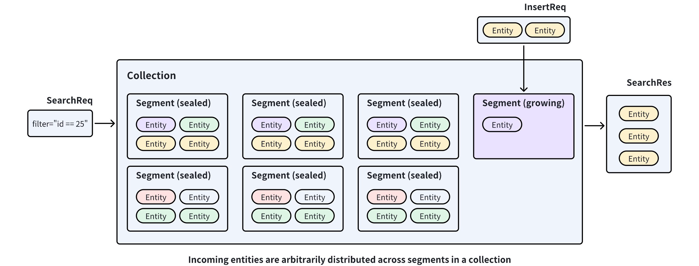
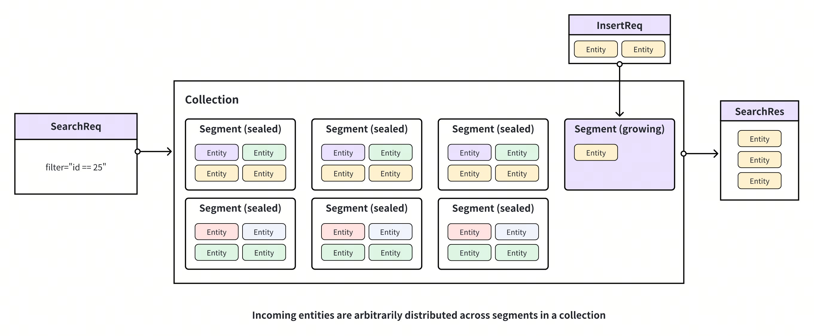

# Clustering Compaction

Clustering compaction is designed to improve search performance and reduce costs in large collections. This guide will help you understand clustering compaction and how this feature can improve search performance.

## Overview

Milvus stores incoming entities in segments within a collection and seals a segment when it is full. If this happens, a new segment is created to accommodate additional entities. As a result, entities are arbitrarily distributed across segments. This distribution requires Milvus to search multiple segments to find the nearest neighbors to a given query vector.



If Milvus can distribute entities among segments based on the values in a specific field, the search scope can be restricted within one segment, thus improving search performance.

**Clustering Compaction** is a feature in Milvus that redistributes entities among segments in a collection based on the values in a scalar field. To enable this feature, you first need to select a scalar field as the **clustering key**. This allows Milvus to redistribute entities into a segment when their clustering key values fall within a specific range. When you trigger a clustering compaction, Milvus generates/updates a global index called **PartitionStats**, which records the mapping relationship between segments and clustering key values.



Using **PartitionStats** as a reference, Milvus can prune irrelevant data upon receiving a search/query request that carries a clustering key value and restricting the search scope within the segments mapping to the value, thus improving search performance. For details on performance improvement, refer to [Benchmark tests](clustering-compaction.md#Benchmark-Test).

## Use Clustering Compaction

The Clustering Compaction feature in Milvus is highly configurable. You can choose to trigger it manually or set it to be triggered automatically at intervals by Milvus. To enable clustering compaction, do as follows: 

### Global Configuration

You need to modify your Milvus configuration file as shown below.

```yaml
dataCoord:
  compaction:
    clustering:
      enable: true 
      autoEnable: false 
      triggerInterval: 600 
      minInterval: 3600 
      maxInterval: 259200 
      newDataSizeThreshold: 512m 
      timeout: 7200
     
queryNode:
  enableSegmentPrune: true 

datanode:
  clusteringCompaction:
    memoryBufferRatio: 0.1 
    workPoolSize: 8  
common:
  usePartitionKeyAsClusteringKey: true 
```

<table>
   <tr>
     <th><p>Configure Item</p></th>
     <th><p>Description</p></th>
     <th><p>Default Value</p></th>
   </tr>
   <tr>
     <td colspan="3"><p><code>dataCoord.compaction.clustering</code></p></td>
   </tr>
   <tr>
     <td><p><code>enable</code></p></td>
     <td><p>Specifies whether to enable clustering compaction. Setting this to <code>true</code> if you need to enable this feature for every collection having a clustering key.</p></td>
     <td><p>false</p></td>
   </tr>
   <tr>
     <td><p><code>autoEnable</code></p></td>
     <td><p>Specifies whether to enable automatically triggered compaction. Setting this to <code>true</code> indicates that Milvus compacts the collections having a clustering key at the specified intervals.</p></td>
     <td><p>false</p></td>
   </tr>
   <tr>
     <td><p><code>triggerInterval</code></p></td>
     <td><p>Specifies the interval in milliseconds at which Milvus starts clustering compaction. This applies only when you set <code>autoEnable</code> to <code>true</code>.</p></td>
     <td></td>
   </tr>
   <tr>
     <td><p><code>minInterval</code></p></td>
     <td><p>Specifies the minimum interval in milliseconds. This applies only when you set <code>autoEnable</code> to <code>true</code>.</p><p>Setting this to an integer greater than <code>triggerInterval</code> helps avoid repeated compactions within a short period.</p></td>
     <td></td>
   </tr>
   <tr>
     <td><p><code>maxInterval</code></p></td>
     <td><p>Specifies the maximum interval in milliseconds. This applies only when you set <code>autoEnable</code> to <code>true</code>.</p><p>Once Milvus detects that a collection has not been clustering-compacted for a duration longer than this value, it forces a clustering compaction.</p></td>
     <td></td>
   </tr>
   <tr>
     <td><p><code>newDataSizeThreshold</code></p></td>
     <td><p>Specifies the upper threshold to trigger a clustering compaction. This applies only when you set <code>autoEnable</code> to <code>true</code>.</p><p>Once Milvus detects that the data volume in a collection exceeds this value, it initiates a clustering compaction process.</p></td>
     <td></td>
   </tr>
   <tr>
     <td><p><code>timeout</code></p></td>
     <td><p>Specifies the timeout duration for a clustering compaction. A clustering compaction fails if its execution time exceeds this value.</p></td>
     <td></td>
   </tr>
   <tr>
     <td colspan="3"><p><code>queryNode</code></p></td>
   </tr>
   <tr>
     <td><p><code>enableSegmentPrune</code></p></td>
     <td><p>Specifies whether Milvus prunes data by referring to PartitionStats upon receiving search/query requests. Set this to <code>true</code> so Milvus can prune data upon receiving search/query requests by referring to PartitionStats.</p></td>
     <td></td>
   </tr>
   <tr>
     <td colspan="3"><p><code>dataNode.clusteringCompaction</code></p></td>
   </tr>
   <tr>
     <td><p><code>memoryBufferRatio</code></p></td>
     <td><p>Specifies the memory buffer ratio for clustering compaction tasks.  Milvus flushes data when the data size exceeds the allocated buffer size calculated using this ratio.</p></td>
     <td></td>
   </tr>
   <tr>
     <td><p><code>workPoolSize</code></p></td>
     <td><p>Specifies the worker pool size for a clustering compaction task.</p></td>
     <td></td>
   </tr>
   <tr>
     <td colspan="3"><p><code>common</code></p></td>
   </tr>
   <tr>
     <td><p><code>usePartitionKeyAsClusteringKey</code></p></td>
     <td><p>Specifies whether to use the partition key in collections as the clustering key. Setting this to true makes Milvus treat the partition keys in collections as the clustering key. </p><p>You can always override this setting in a collection by explicitly setting a clustering key.</p></td>
     <td></td>
   </tr>
</table>

To apply the above changes to your Milvus cluster, please follow the steps in [Configure Milvus with Helm](configure-helm.md#Configure-Milvus-via-configuration-file) and [Configure Milvus with Milvus Operators](configure_operator.md).

### Collection Configuration

For clustering compacting in a specific collection, you should select a scalar field from the collection as the clustering key.

<div class="multipleCode">
    <a href="#python">Python</a>
    <a href="#java">Java</a>
    <a href="#go">Go</a>
    <a href="#javascript">NodeJS</a>
    <a href="#bash">cURL</a>
</div>

```python
from pymilvus import MilvusClient, DataType

CLUSTER_ENDPOINT="http://localhost:19530"
TOKEN="root:Milvus"

client = MilvusClient(
    uri=CLUSTER_ENDPOINT,
    token=TOKEN
)

schema = MilvusClient.create_schema()
schema.add_field("id", DataType.INT64, is_primary=True, auto_id=False)
schema.add_field("key", DataType.INT64, is_clustering_key=True)
schema.add_field("var", DataType.VARCHAR, max_length=1000)
schema.add_field("vector", DataType.FLOAT_VECTOR, dim=5)

client.create_collection(
    collection_name="clustering_test",
    schema=schema
)
```

```java
import io.milvus.v2.client.ConnectConfig;
import io.milvus.v2.client.MilvusClientV2;
import io.milvus.v2.common.DataType;
import io.milvus.v2.service.collection.request.AddFieldReq;
import io.milvus.v2.service.collection.request.CreateCollectionReq;

MilvusClientV2 client = new MilvusClientV2(ConnectConfig.builder()
        .uri("http://localhost:19530")
        .token("root:Milvus")
        .build());
        
CreateCollectionReq.CollectionSchema schema = client.createSchema();

schema.addField(AddFieldReq.builder()
        .fieldName("id")
        .dataType(DataType.Int64)
        .isPrimaryKey(true)
        .autoID(false)
        .build());

schema.addField(AddFieldReq.builder()
        .fieldName("key")
        .dataType(DataType.Int64)
        .isClusteringKey(true)
        .build());

schema.addField(AddFieldReq.builder()
        .fieldName("var")
        .dataType(DataType.VarChar)
        .maxLength(1000)
        .build());

schema.addField(AddFieldReq.builder()
        .fieldName("vector")
        .dataType(DataType.FloatVector)
        .dimension(5)
        .build());

CreateCollectionReq requestCreate = CreateCollectionReq.builder()
        .collectionName("clustering_test")
        .collectionSchema(schema)
        .build();
client.createCollection(requestCreate);
```

```go
// go
```

```javascript
import { MilvusClient, DataType } from '@zilliz/milvus2-sdk-node';

const CLUSTER_ENDPOINT = 'http://localhost:19530';
const TOKEN = 'root:Milvus';
const client = new MilvusClient({
  address: CLUSTER_ENDPOINT,
  token: TOKEN,
});
const schema = [
    {
      name: 'id',
      type: DataType.Int64,
      is_primary_key: true,
      autoID: false,
    },
    {
      name: 'key',
      type: DataType.Int64,
      is_clustering_key: true,
    },
    {
      name: 'var',
      type: DataType.VarChar,
      max_length: 1000,
      is_primary_key: false,
    },
    {
      name: 'vector',
      type: DataType.FloatVector,
      dim: 5,
    },
  ];
  
  await client.createCollection({
    collection_name: 'clustering_test',
    schema: schema,
  });
```

```bash
# restful
```

<div class="alert note">

You can use the scalar fields of the following data types as the clustering key: `Int8`, `Int16`, `Int32`, `Int64`, `Float`, `Double`, and `VarChar`.

</div>

### Trigger Clustering Compaction

If you have enabled automatic clustering compaction, Milvus automatically triggers the compaction at the specified interval. Alternatively, you can manually trigger the compaction as follows:

<div class="multipleCode">
    <a href="#python">Python</a>
    <a href="#java">Java</a>
    <a href="#go">Go</a>
    <a href="#javascript">NodeJS</a>
    <a href="#bash">cURL</a>
</div>

```python
# trigger a manual compaction
job_id = client.compact(
    collection_name="clustering_test", 
    is_clustering=True
)

# get the compaction state
client.get_compaction_state(
    job_id=job_id,
)
```

```java
import io.milvus.v2.service.utility.request.CompactReq;
import io.milvus.v2.service.utility.request.GetCompactionStateReq;
import io.milvus.v2.service.utility.response.CompactResp;
import io.milvus.v2.service.utility.response.GetCompactionStateResp;

CompactResp compactResp = client.compact(CompactReq.builder()
        .collectionName("clustering_test")
        .isClustering(true)
        .build());

GetCompactionStateResp stateResp = client.getCompactionState(GetCompactionStateReq.builder()
        .compactionID(compactResp.getCompactionID())
        .build());

System.out.println(stateResp.getState());
```

```go
// go
```

```javascript
// trigger a manual compaction
const {compactionID} = await client.compact({
    collection_name: "clustering_test", 
    is_clustering: true
});

// get the compaction state
await client.getCompactionState({
    compactionID: compactionID,
});
```

```bash
# restful
```

## Benchmark Test

Data volume and query patterns combined determine the performance improvement clustering compaction can bring. An internal benchmark test demonstrates that clustering compaction yields up to a 25-fold improvement in queries per second (QPS).

The benchmark test is on a collection containing entities from a 20-million, 768-dimensional LAION dataset with the `key` field designated as the clustering key. After clustering compaction is triggered in the collection, concurrent searches are sent until the CPU usage reaches a high water level. 

<table>
   <tr>
     <th rowspan="2"><p>Search filter</p></th>
     <th rowspan="2"><p>Prune ratio</p></th>
     <th colspan="5"><p>Latency</p></th>
     <th rowspan="2"><p>Reqs/s</p></th>
   </tr>
   <tr>
     <td><p>Avg</p></td>
     <td><p>Min</p></td>
     <td><p>Max</p></td>
     <td><p>Median</p></td>
     <td><p>TP99</p></td>
   </tr>
   <tr>
     <td><p>N/A</p></td>
     <td><p>0%</p></td>
     <td><p>1685</p></td>
     <td><p>672</p></td>
     <td><p>2294</p></td>
     <td><p>1710</p></td>
     <td><p>2291</p></td>
     <td><p>17.75</p></td>
   </tr>
   <tr>
     <td><p>key&gt;200 and key &lt; 800</p></td>
     <td><p>40.2%</p></td>
     <td><p>1045</p></td>
     <td><p>47</p></td>
     <td><p>1828</p></td>
     <td><p>1085</p></td>
     <td><p>1617</p></td>
     <td><p>28.38</p></td>
   </tr>
   <tr>
     <td><p>key&gt;200 and key &lt; 600</p></td>
     <td><p>59.8%</p></td>
     <td><p>829</p></td>
     <td><p>45</p></td>
     <td><p>1483</p></td>
     <td><p>882</p></td>
     <td><p>1303</p></td>
     <td><p>35.78</p></td>
   </tr>
   <tr>
     <td><p>key&gt;200 and key &lt; 400</p></td>
     <td><p>79.5%</p></td>
     <td><p>550</p></td>
     <td><p>100</p></td>
     <td><p>985</p></td>
     <td><p>584</p></td>
     <td><p>898</p></td>
     <td><p>54.00</p></td>
   </tr>
   <tr>
     <td><p>key==1000</p></td>
     <td><p>99%</p></td>
     <td><p>68</p></td>
     <td><p>24</p></td>
     <td><p>1273</p></td>
     <td><p>70</p></td>
     <td><p>246</p></td>
     <td><p>431.41</p></td>
   </tr>
</table>

As the search range narrows in the search filters, the prune ratio increases. This means that more entities are skipped during the search process. When comparing the statistics in the first and last rows, you can see that searches without clustering compaction require scanning the entire collection. On the other hand, searches with clustering compaction using a specific key can achieve up to a 25-fold improvement.

## Best Practices

Here are some tips for you to use clustering compaction efficiently:

- Enable this for collections with large data volumes.

    Search performance improves with larger data volumes in a collection. It is a good choice to enable this feature for collections with over 1 million entities.

- Choose a proper clustering key.

    You can use scalar fields commonly employed as filtering conditions as the clustering key. For a collection that holds data from multiple tenants, you can utilize the field that distinguishes one tenant from another as the clustering key.

- Use the partition key as the clustering key.

    You can set `common.usePartitionKeyAsClusteringKey` to `true` if you want to enable this feature for all collections in your Milvus instance or if you still face performance issues in a large collection with a partition key. By doing so, you will have a clustering key and a partition key when you choose a scalar field in a collection as the partition key. 

    Note that this setting does not prevent you from choosing another scalar field as the clustering key. The explicitly designated clustering key always takes precedence.

