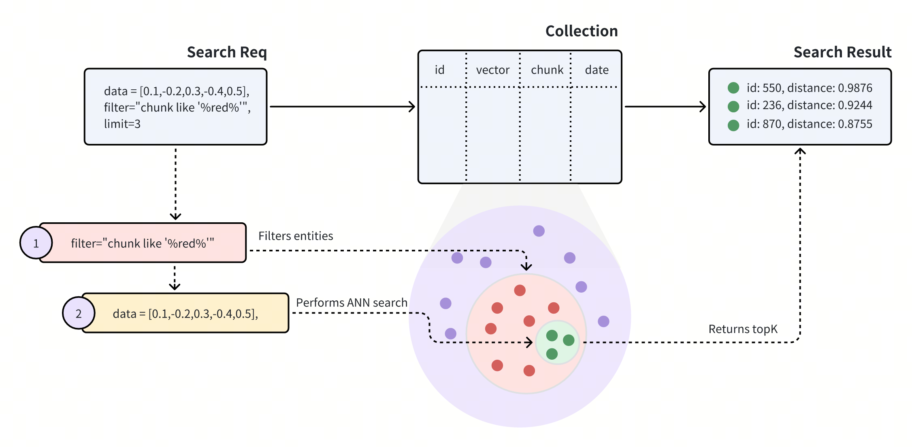

# Filtered Search

An ANN search finds vector embeddings most similar to specified vector embeddings. However, the search results may not always be correct. You can include filtering conditions in a search request so that Milvus conducts metadata filtering before conducting ANN searches, reducing the search scope from the whole collection to only the entities matching the specified filtering conditions.

## Overview

In Milvus, filtered searches are categorized into two types — **standard filtering** and **iterative filtering** — depending on the stage at which the filtering is applied.

### Standard filtering

If a collection contains both vector embeddings and their metadata, you can filter metadata before ANN search to improve the relevancy of the search result. Once Milvus receives a search request carrying a filtering condition, it restricts the search scope within the entities matching the specified filtering condition.



As shown in the above diagram, the search request carries `chunk like "%red%"` as the filtering condition, indicating that Milvus should conduct the ANN search within all the entities that have the word `red` in the `chunk` field. Specifically, Milvus does the following:

- Filter entities that match the filtering conditions carried in the search request.

- Conduct the ANN search within the filtered entities.

- Returns top-K entities.

### Iterative filtering

The standard filtering process effectively narrows the search scope to a small range. However, overly complex filtering expressions may result in very high search latency. In such cases, iterative filtering can serve as an alternative, helping to reduce the workload of scalar filtering.


As illustrated in the diagram above, a search with iterative filtering performs the vector search in iterations. Each entity returned by the iterator undergoes scalar filtering, and this process continues until the specified topK results are achieved.

This method significantly reduces the number of entities subjected to scalar filtering, making it especially beneficial for handling highly complex filtering expressions.

However, it’s important to note that the iterator processes entities one at a time. This sequential approach can lead to longer processing times or potential performance issues, especially when a large number of entities are subjected to scalar filtering.

## Examples

This section demonstrates how to conduct a filtered search. Code snippets in this section assume  you already have the following entities in your collection. Each entity has four fields, namely **id**, **vector**, **color**, and **likes**.

```json
[
    {"id": 0, "vector": [0.3580376395471989, -0.6023495712049978, 0.18414012509913835, -0.26286205330961354, 0.9029438446296592], "color": "pink_8682", "likes": 165},
    {"id": 1, "vector": [0.19886812562848388, 0.06023560599112088, 0.6976963061752597, 0.2614474506242501, 0.838729485096104], "color": "red_7025", "likes": 25},
    {"id": 2, "vector": [0.43742130801983836, -0.5597502546264526, 0.6457887650909682, 0.7894058910881185, 0.20785793220625592], "color": "orange_6781", "likes": 764},
    {"id": 3, "vector": [0.3172005263489739, 0.9719044792798428, -0.36981146090600725, -0.4860894583077995, 0.95791889146345], "color": "pink_9298", "likes": 234},
    {"id": 4, "vector": [0.4452349528804562, -0.8757026943054742, 0.8220779437047674, 0.46406290649483184, 0.30337481143159106], "color": "red_4794", "likes": 122},
    {"id": 5, "vector": [0.985825131989184, -0.8144651566660419, 0.6299267002202009, 0.1206906911183383, -0.1446277761879955], "color": "yellow_4222", "likes": 12},
    {"id": 6, "vector": [0.8371977790571115, -0.015764369584852833, -0.31062937026679327, -0.562666951622192, -0.8984947637863987], "color": "red_9392", "likes": 58},
    {"id": 7, "vector": [-0.33445148015177995, -0.2567135004164067, 0.8987539745369246, 0.9402995886420709, 0.5378064918413052], "color": "grey_8510", "likes": 775},
    {"id": 8, "vector": [0.39524717779832685, 0.4000257286739164, -0.5890507376891594, -0.8650502298996872, -0.6140360785406336], "color": "white_9381", "likes": 876},
    {"id": 9, "vector": [0.5718280481994695, 0.24070317428066512, -0.3737913482606834, -0.06726932177492717, -0.6980531615588608], "color": "purple_4976", "likes": 765}
]
```

### Search with standard filtering

The following code snippets demonstrate a search with standard filtering, and the request in the following code snippet carries a filtering condition and several output fields.

<div class="multipleCode">
    <a href="#python">Python</a>
    <a href="#java">Java</a>
    <a href="#go">Go</a>
    <a href="#javascript">NodeJS</a>
    <a href="#bash">cURL</a>
</div>

```python
from pymilvus import MilvusClient

client = MilvusClient(
    uri="http://localhost:19530",
    token="root:Milvus"
)

query_vector = [0.3580376395471989, -0.6023495712049978, 0.18414012509913835, -0.26286205330961354, 0.9029438446296592]

res = client.search(
    collection_name="my_collection",
    data=[query_vector],
    limit=5,
    # highlight-start
    filter='color like "red%" and likes > 50',
    output_fields=["color", "likes"]
    # highlight-end
)

for hits in res:
    print("TopK results:")
    for hit in hits:
        print(hit)
```

```java
import io.milvus.v2.client.ConnectConfig;
import io.milvus.v2.client.MilvusClientV2;
import io.milvus.v2.service.vector.request.SearchReq
import io.milvus.v2.service.vector.request.data.FloatVec;
import io.milvus.v2.service.vector.response.SearchResp

MilvusClientV2 client = new MilvusClientV2(ConnectConfig.builder()
        .uri("http://localhost:19530")
        .token("root:Milvus")
        .build());

FloatVec queryVector = new FloatVec(new float[]{0.3580376395471989f, -0.6023495712049978f, 0.18414012509913835f, -0.26286205330961354f, 0.9029438446296592f});
SearchReq searchReq = SearchReq.builder()
        .collectionName("my_collection")
        .data(Collections.singletonList(queryVector))
        .topK(5)
        .filter("color like \"red%\" and likes > 50")
        .outputFields(Arrays.asList("color", "likes"))
        .build();

SearchResp searchResp = client.search(searchReq);

List<List<SearchResp.SearchResult>> searchResults = searchResp.getSearchResults();
for (List<SearchResp.SearchResult> results : searchResults) {
    System.out.println("TopK results:");
    for (SearchResp.SearchResult result : results) {
        System.out.println(result);
    }
}

// Output
// TopK results:
// SearchResp.SearchResult(entity={color=red_4794, likes=122}, score=0.5975797, id=4)
// SearchResp.SearchResult(entity={color=red_9392, likes=58}, score=-0.24996188, id=6)
```

```go
import (
    "context"
    "fmt"

    "github.com/milvus-io/milvus/client/v2/entity"
    "github.com/milvus-io/milvus/client/v2/milvusclient"
)

ctx, cancel := context.WithCancel(context.Background())
defer cancel()

milvusAddr := "localhost:19530"
token := "root:Milvus"

client, err := client.New(ctx, &client.ClientConfig{
    Address: milvusAddr,
    APIKey:  token,
})
if err != nil {
    fmt.Println(err.Error())
    // handle error
}
defer client.Close(ctx)

queryVector := []float32{0.3580376395471989, -0.6023495712049978, 0.18414012509913835, -0.26286205330961354, 0.9029438446296592}

    resultSets, err := client.Search(ctx, milvusclient.NewSearchOption(
        "my_collection", // collectionName
        5,               // limit
        []entity.Vector{entity.FloatVector(queryVector)},
    ).WithConsistencyLevel(entity.ClStrong).
        WithANNSField("vector").
        WithFilter("color like 'red%' and likes > 50").
        WithOutputFields("color", "likes"))
    if err != nil {
        fmt.Println(err.Error())
        // handle error
    }

    for _, resultSet := range resultSets {
        fmt.Println("IDs: ", resultSet.IDs.FieldData().GetScalars())
        fmt.Println("Scores: ", resultSet.Scores)
        fmt.Println("color: ", resultSet.GetColumn("color").FieldData().GetScalars())
        fmt.Println("likes: ", resultSet.GetColumn("likes").FieldData().GetScalars())
    }

```

```javascript
import { MilvusClient, DataType } from "@zilliz/milvus2-sdk-node";

const address = "http://localhost:19530";
const token = "root:Milvus";
const client = new MilvusClient({address, token});

const query_vector = [0.3580376395471989, -0.6023495712049978, 0.18414012509913835, -0.26286205330961354, 0.9029438446296592]

const res = await client.search({
    collection_name: "my_collection",
    data: [query_vector],
    limit: 5,
    // highlight-start
    filters: 'color like "red%" and likes > 50',
    output_fields: ["color", "likes"]
    // highlight-end
})
```

```bash
export CLUSTER_ENDPOINT="http://localhost:19530"
export TOKEN="root:Milvus"

curl --request POST \
--url "${CLUSTER_ENDPOINT}/v2/vectordb/entities/search" \
--header "Authorization: Bearer ${TOKEN}" \
--header "Content-Type: application/json" \
-d '{
    "collectionName": "my_collection",
    "data": [
        [0.3580376395471989, -0.6023495712049978, 0.18414012509913835, -0.26286205330961354, 0.9029438446296592]
    ],
    "annsField": "vector",
    "filter": "color like \"red%\" and likes > 50",
    "limit": 5,
    "outputFields": ["color", "likes"]
}'
# {"code":0,"cost":0,"data":[]}
```

The filtering condition carried in the search request reads `color like "red%" and likes > 50`. It uses the and operator to include two conditions: the first one asks for entities that have a value starting with `red` in the `color` field, and the other asks for entities with a value greater than `50` in the `likes` field. There are only two entities meeting these requirements. With the top-K set to `3`, Milvus will calculate the distance between these two entities to the query vector and return them as the search results.

```json
[
    {
        "id": 4, 
        "distance": 0.3345786594834839,
        "entity": {
            "vector": [0.4452349528804562, -0.8757026943054742, 0.8220779437047674, 0.46406290649483184, 0.30337481143159106], 
            "color": "red_4794", 
            "likes": 122
        }
    },
    {
        "id": 6, 
        "distance": 0.6638239834383389，
        "entity": {
            "vector": [0.8371977790571115, -0.015764369584852833, -0.31062937026679327, -0.562666951622192, -0.8984947637863987], 
            "color": "red_9392", 
            "likes": 58
        }
    },
]
```

For more information on the operators you can use in metadata filtering, refer to [Filtering](filtering).

### Search with iterative filtering

To conduct a filtered search with iterative filtering, you can do as follows:

<div class="multipleCode">
    <a href="#python">Python</a>
    <a href="#java">Java</a>
    <a href="#go">Go</a>
    <a href="#javascript">NodeJS</a>
    <a href="#bash">cURL</a>
</div>

```python
from pymilvus import MilvusClient

client = MilvusClient(
    uri="http://localhost:19530",
    token="root:Milvus"
)

query_vector = [0.3580376395471989, -0.6023495712049978, 0.18414012509913835, -0.26286205330961354, 0.9029438446296592]

res = client.search(
    collection_name="my_collection",
    data=[query_vector],
    limit=5,
    # highlight-start
    filter='color like "red%" and likes > 50',
    output_fields=["color", "likes"],
    search_params={
        "hints": "iterative_filter"
    }
    # highlight-end
)

for hits in res:
    print("TopK results:")
    for hit in hits:
        print(hit)
```

```java
import io.milvus.v2.client.ConnectConfig;
import io.milvus.v2.client.MilvusClientV2;
import io.milvus.v2.service.vector.request.SearchReq;
import io.milvus.v2.service.vector.request.data.FloatVec;
import io.milvus.v2.service.vector.response.SearchResp;

MilvusClientV2 client = new MilvusClientV2(ConnectConfig.builder()
        .uri("http://localhost:19530")
        .token("root:Milvus")
        .build());

FloatVec queryVector = new FloatVec(new float[]{0.3580376395471989f, -0.6023495712049978f, 0.18414012509913835f, -0.26286205330961354f, 0.9029438446296592f});
SearchReq searchReq = SearchReq.builder()
        .collectionName("my_collection")
        .data(Collections.singletonList(queryVector))
        .topK(5)
        .filter("color like \"red%\" and likes > 50")
        .outputFields(Arrays.asList("color", "likes"))
        .searchParams(new HashMap<>("hints", "iterative_filter"))
        .build();

SearchResp searchResp = client.search(searchReq);

List<List<SearchResp.SearchResult>> searchResults = searchResp.getSearchResults();
for (List<SearchResp.SearchResult> results : searchResults) {
    System.out.println("TopK results:");
    for (SearchResp.SearchResult result : results) {
        System.out.println(result);
    }
}

// Output
// TopK results:
// SearchResp.SearchResult(entity={color=red_4794, likes=122}, score=0.5975797, id=4)
// SearchResp.SearchResult(entity={color=red_9392, likes=58}, score=-0.24996188, id=6)
```

```go
import (
    "context"
    "fmt"

    "github.com/milvus-io/milvus/client/v2/entity"
    "github.com/milvus-io/milvus/client/v2/milvusclient"
)

ctx, cancel := context.WithCancel(context.Background())
defer cancel()

milvusAddr := "localhost:19530"
token := "root:Milvus"

client, err := client.New(ctx, &client.ClientConfig{
    Address: milvusAddr,
    APIKey:  token,
})
if err != nil {
    fmt.Println(err.Error())
    // handle error
}
defer client.Close(ctx)

queryVector := []float32{0.3580376395471989, -0.6023495712049978, 0.18414012509913835, -0.26286205330961354, 0.9029438446296592}

resultSets, err := client.Search(ctx, milvusclient.NewSearchOption(
    "my_collection", // collectionName
    5,               // limit
    []entity.Vector{entity.FloatVector(queryVector)},
).WithConsistencyLevel(entity.ClStrong).
    WithANNSField("vector").
    WithFilter("color like 'red%' and likes > 50").
    WithOutputFields("color", "likes").
    WithSearchParam("hints", "iterative_filter"))
if err != nil {
    fmt.Println(err.Error())
    // handle error
}

for _, resultSet := range resultSets {
    fmt.Println("IDs: ", resultSet.IDs.FieldData().GetScalars())
    fmt.Println("Scores: ", resultSet.Scores)
    fmt.Println("color: ", resultSet.GetColumn("color").FieldData().GetScalars())
    fmt.Println("likes: ", resultSet.GetColumn("likes").FieldData().GetScalars())
}

```

```javascript
import { MilvusClient, DataType } from "@zilliz/milvus2-sdk-node";

const address = "http://localhost:19530";
const token = "root:Milvus";
const client = new MilvusClient({address, token});

const query_vector = [0.3580376395471989, -0.6023495712049978, 0.18414012509913835, -0.26286205330961354, 0.9029438446296592]

const res = await client.search({
    collection_name: "filtered_search_collection",
    data: [query_vector],
    limit: 5,
    // highlight-start
    filters: 'color like "red%" and likes > 50',
    hints: "iterative_filter",
    output_fields: ["color", "likes"]
    // highlight-end
})
```

```bash
export CLUSTER_ENDPOINT="http://localhost:19530"
export TOKEN="root:Milvus"

curl --request POST \
--url "${CLUSTER_ENDPOINT}/v2/vectordb/entities/search" \
--header "Authorization: Bearer ${TOKEN}" \
--header "Content-Type: application/json" \
-d '{
    "collectionName": "my_collection",
    "data": [
        [0.3580376395471989, -0.6023495712049978, 0.18414012509913835, -0.26286205330961354, 0.9029438446296592]
    ],
    "annsField": "vector",
    "filter": "color like \"red%\" and likes > 50",
    "searchParams": {"hints": "iterative_filter"},
    "limit": 5,
    "outputFields": ["color", "likes"]
}'
# {"code":0,"cost":0,"data":[]}
```

