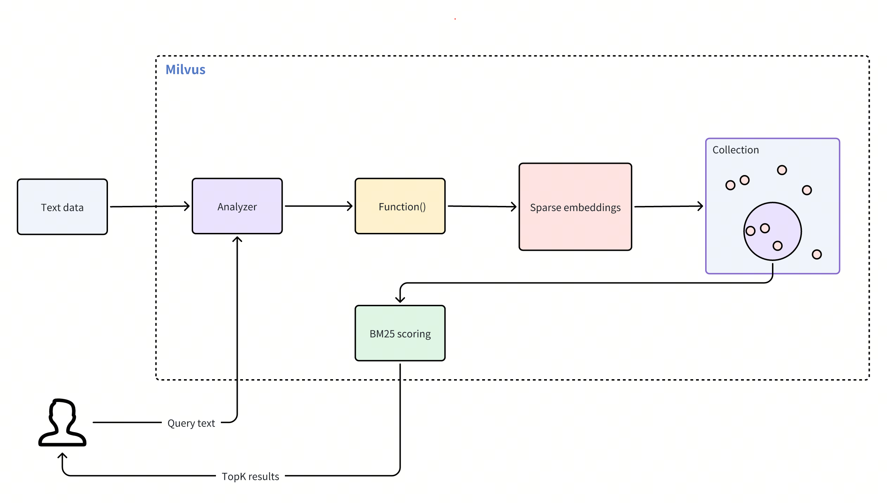

# Full Text Search

Full text search is a feature that retrieves documents containing specific terms or phrases in text datasets, then ranking the results based on relevance. This feature overcomes semantic search limitations, which might overlook precise terms, ensuring you receive the most accurate and contextually relevant results. Additionally, it simplifies vector searches by accepting raw text input, automatically converting your text data into sparse embeddings without the need to manually generate vector embeddings.

Using the BM25 algorithm for relevance scoring, this feature is particularly valuable in retrieval-augmented generation (RAG) scenarios, where it prioritizes documents that closely match specific search terms.

<div class="alert note">

By integrating full text search with semantic-based dense vector search, you can enhance the accuracy and relevance of search results. For more information, refer to [Hybrid Search](multi-vector-search.md).

</div>

## Overview

Full text search simplifies the process of text-based searching by eliminating the need for manual embedding. This feature operates through the following workflow:

1. **Text input**: You insert raw text documents or provide query text without any need for manual embedding.

1. **Text analysis**: Milvus uses an [analyzer](analyzer-overview.md) to tokenize input text into individual, searchable terms.

1. **Function processing**: The built-in function receives tokenized terms and converts them into sparse vector representations.

1. **Collection store**: Milvus stores these sparse embeddings in a collection for efficient retrieval.

1. **BM25 scoring**: During a search, Milvus applies the BM25 algorithm to calculate scores for the stored documents and ranks matched results based on relevance to the query text.



To use full text search, follow these main steps:

1. [Create a collection](full-text-search.md#Create-a-collection-for-full-text-search): Set up a collection with necessary fields and define a function to convert raw text into sparse embeddings.

1. [Insert data](full-text-search.md#Insert-text-data): Ingest your raw text documents to the collection.

1. [Perform searches](full-text-search.md#Perform-full-text-search): Use query texts to search through your collection and retrieve relevant results.

## Create a collection for full text search

To enable full text search, create a collection with a specific schema. This schema must include three necessary fields:

- The primary field that uniquely identifies each entity in a collection.

- A `VARCHAR` field that stores raw text documents, with the `enable_analyzer` attribute set to `True`. This allows Milvus to tokenize text into specific terms for function processing.

- A `SPARSE_FLOAT_VECTOR` field reserved to store sparse embeddings that Milvus will automatically generate for the `VARCHAR` field.

### Define the collection schema

First, create the schema and add the necessary fields:

<div class="multipleCode">
    <a href="#python">Python</a>
    <a href="#java">Java</a>
    <a href="#go">Go</a>
    <a href="#javascript">NodeJS</a>
    <a href="#bash">cURL</a>
</div>

```python
from pymilvus import MilvusClient, DataType, Function, FunctionType

client = MilvusClient(
    uri="http://localhost:19530",
    token="root:Milvus"
)

schema = MilvusClient.create_schema()

schema.add_field(field_name="id", datatype=DataType.INT64, is_primary=True, auto_id=True)
schema.add_field(field_name="text", datatype=DataType.VARCHAR, max_length=1000, enable_analyzer=True)
schema.add_field(field_name="sparse", datatype=DataType.SPARSE_FLOAT_VECTOR)
```

```java
import io.milvus.v2.common.DataType;
import io.milvus.v2.service.collection.request.AddFieldReq;
import io.milvus.v2.service.collection.request.CreateCollectionReq;

CreateCollectionReq.CollectionSchema schema = CreateCollectionReq.CollectionSchema.builder()
        .build();
schema.addField(AddFieldReq.builder()
        .fieldName("id")
        .dataType(DataType.Int64)
        .isPrimaryKey(true)
        .autoID(true)
        .build());
schema.addField(AddFieldReq.builder()
        .fieldName("text")
        .dataType(DataType.VarChar)
        .maxLength(1000)
        .enableAnalyzer(true)
        .build());
schema.addField(AddFieldReq.builder()
        .fieldName("sparse")
        .dataType(DataType.SparseFloatVector)
        .build());
```

```go
import (
    "context"
    "fmt"

    "github.com/milvus-io/milvus/client/v2/column"
    "github.com/milvus-io/milvus/client/v2/entity"
    "github.com/milvus-io/milvus/client/v2/index"
    "github.com/milvus-io/milvus/client/v2/milvusclient"
)

ctx, cancel := context.WithCancel(context.Background())
defer cancel()

milvusAddr := "localhost:19530"
client, err := milvusclient.New(ctx, &milvusclient.ClientConfig{
    Address: milvusAddr,
})
if err != nil {
    fmt.Println(err.Error())
    // handle error
}
defer client.Close(ctx)

schema := entity.NewSchema()
schema.WithField(entity.NewField().
    WithName("id").
    WithDataType(entity.FieldTypeInt64).
    WithIsPrimaryKey(true).
    WithIsAutoID(true),
).WithField(entity.NewField().
    WithName("text").
    WithDataType(entity.FieldTypeVarChar).
    WithEnableAnalyzer(true).
    WithMaxLength(1000),
).WithField(entity.NewField().
    WithName("sparse").
    WithDataType(entity.FieldTypeSparseVector),
)
```

```javascript
import { MilvusClient, DataType } from "@zilliz/milvus2-sdk-node";

const address = "http://localhost:19530";
const token = "root:Milvus";
const client = new MilvusClient({address, token});
const schema = [
  {
    name: "id",
    data_type: DataType.Int64,
    is_primary_key: true,
  },
  {
    name: "text",
    data_type: "VarChar",
    enable_analyzer: true,
    enable_match: true,
    max_length: 1000,
  },
  {
    name: "sparse",
    data_type: DataType.SparseFloatVector,
  },
];

console.log(res.results)
```

```bash
export schema='{
        "autoId": true,
        "enabledDynamicField": false,
        "fields": [
            {
                "fieldName": "id",
                "dataType": "Int64",
                "isPrimary": true
            },
            {
                "fieldName": "text",
                "dataType": "VarChar",
                "elementTypeParams": {
                    "max_length": 1000,
                    "enable_analyzer": true
                }
            },
            {
                "fieldName": "sparse",
                "dataType": "SparseFloatVector"
            }
        ]
    }'
```

In this configuration,

- `id`: serves as the primary key and is automatically generated with `auto_id=True`.

- `text`: stores your raw text data for full text search operations. The data type must be `VARCHAR`, as `VARCHAR` is Milvus string data type for text storage. Set `enable_analyzer=True` to allow Milvus to tokenize the text. By default, Milvus uses the `standard`[ analyzer](standard-analyzer.md) for text analysis. To configure a different analyzer, refer to [Analyzer Overview](analyzer-overview.md).

- `sparse`: a vector field reserved to store internally generated sparse embeddings for full text search operations. The data type must be `SPARSE_FLOAT_VECTOR`.

Now, define a function that will convert your text into sparse vector representations and then add it to the schema:

<div class="multipleCode">
    <a href="#python">Python</a>
    <a href="#java">Java</a>
    <a href="#go">Go</a>
    <a href="#javascript">NodeJS</a>
    <a href="#bash">cURL</a>
</div>

```python
bm25_function = Function(
    name="text_bm25_emb", # Function name
    input_field_names=["text"], # Name of the VARCHAR field containing raw text data
    output_field_names=["sparse"], # Name of the SPARSE_FLOAT_VECTOR field reserved to store generated embeddings
    function_type=FunctionType.BM25, # Set to `BM25`
)

schema.add_function(bm25_function)
```

```java
import io.milvus.common.clientenum.FunctionType;
import io.milvus.v2.service.collection.request.CreateCollectionReq.Function;

import java.util.*;

schema.addFunction(Function.builder()
        .functionType(FunctionType.BM25)
        .name("text_bm25_emb")
        .inputFieldNames(Collections.singletonList("text"))
        .outputFieldNames(Collections.singletonList("sparse"))
        .build());
```

```go
function := entity.NewFunction().
    WithName("text_bm25_emb").
    WithInputFields("text").
    WithOutputFields("sparse").
    WithType(entity.FunctionTypeBM25)
schema.WithFunction(function)
```

```javascript
const functions = [
    {
      name: 'text_bm25_emb',
      description: 'bm25 function',
      type: FunctionType.BM25,
      input_field_names: ['text'],
      output_field_names: ['sparse'],
      params: {},
    },
]；
```

```bash
export schema='{
        "autoId": true,
        "enabledDynamicField": false,
        "fields": [
            {
                "fieldName": "id",
                "dataType": "Int64",
                "isPrimary": true
            },
            {
                "fieldName": "text",
                "dataType": "VarChar",
                "elementTypeParams": {
                    "max_length": 1000,
                    "enable_analyzer": true
                }
            },
            {
                "fieldName": "sparse",
                "dataType": "SparseFloatVector"
            }
        ],
        "functions": [
            {
                "name": "text_bm25_emb",
                "type": "BM25",
                "inputFieldNames": ["text"],
                "outputFieldNames": ["sparse"],
                "params": {}
            }
        ]
    }'
```

<table>
   <tr>
     <th><p>Parameter</p></th>
     <th><p>Description</p></th>
   </tr>
   <tr>
     <td><p><code>name</code></p></td>
     <td><p>The name of the function. This function converts your raw text from the <code>text</code> field into searchable vectors that will be stored in the <code>sparse</code> field.</p></td>
   </tr>
   <tr>
     <td><p><code>input_field_names</code></p></td>
     <td><p>The name of the <code>VARCHAR</code> field requiring text-to-sparse-vector conversion. For <code>FunctionType.BM25</code>, this parameter accepts only one field name.</p></td>
   </tr>
   <tr>
     <td><p><code>output_field_names</code></p></td>
     <td><p>The name of the field where the internally generated sparse vectors will be stored. For <code>FunctionType.BM25</code>, this parameter accepts only one field name.</p></td>
   </tr>
   <tr>
     <td><p><code>function_type</code></p></td>
     <td><p>The type of the function to use. Set the value to <code>FunctionType.BM25</code>.</p></td>
   </tr>
</table>

<div class="alert note">

For collections with multiple `VARCHAR` fields requiring text-to-sparse-vector conversion, add separate functions to the collection schema, ensuring each function has a unique name and `output_field_names` value.

</div>

### Configure the index

After defining the schema with necessary fields and the built-in function, set up the index for your collection. To simplify this process, use `AUTOINDEX` as the `index_type`, an option that allows Milvus to choose and configure the most suitable index type based on the structure of your data.

<div class="multipleCode">
    <a href="#python">Python</a>
    <a href="#java">Java</a>
    <a href="#go">Go</a>
    <a href="#javascript">NodeJS</a>
    <a href="#bash">cURL</a>
</div>

```python
index_params = MilvusClient.prepare_index_params()

index_params.add_index(
    field_name="sparse",

    index_type="SPARSE_INVERTED_INDEX",
    metric_type="BM25",
    params={
        "inverted_index_algo": "DAAT_MAXSCORE",
        "bm25_k1": 1.2,
        "bm25_b": 0.75
    }

)
```

```java
import io.milvus.v2.common.IndexParam;

List<IndexParam> indexes = new ArrayList<>();
indexes.add(IndexParam.builder()
        .fieldName("sparse")
        .indexType(IndexParam.IndexType.AUTOINDEX)
        .metricType(IndexParam.MetricType.BM25)
        .build());    
```

```go
indexOption := milvusclient.NewCreateIndexOption("my_collection", "sparse",
    index.NewAutoIndex(entity.MetricType(entity.BM25)))
```

```javascript
const index_params = [
  {
    field_name: "sparse",
    metric_type: "BM25",
    index_type: "AUTOINDEX",
  },
];
```

```bash
export indexParams='[
        {
            "fieldName": "sparse",
            "metricType": "BM25",
            "indexType": "AUTOINDEX"
        }
    ]'
```

<table>
   <tr>
     <th><p>Parameter</p></th>
     <th><p>Description</p></th>
   </tr>
   <tr>
     <td><p><code>field_name</code></p></td>
     <td><p>The name of the vector field to index. For full text search, this should be the field that stores the generated sparse vectors. In this example, set the value to <code>sparse</code>.</p></td>
   </tr>
   <tr>
     <td><p><code>index_type</code></p></td>
     <td><p>The type of the index to create. <code>AUTOINDEX</code> allows Milvus to automatically optimize index settings. If you need more control over your index settings, you can choose from various index types available for sparse vectors in Milvus. For more information, refer to <a href="index.md#Indexes-supported-in-Milvus">Indexes supported in Milvus</a>.</p></td>
   </tr>
   <tr>
     <td><p><code>metric_type</code></p></td>
     <td><p>The value for this parameter must be set to <code>BM25</code> specifically for full text search functionality.</p></td>
   </tr>
   <tr>
     <td><p><code>params</code></p></td>
     <td><p>A dictionary of additional parameters specific to the index.</p></td>
   </tr>
   <tr>
     <td><p><code>params.inverted_index_algo</code></p></td>
     <td><p>The algorithm used for building and querying the index. Valid values:</p><ul><li><p><code>"DAAT_MAXSCORE"</code> (default): Optimized Document-at-a-Time (DAAT) query processing using the MaxScore algorithm. MaxScore provides better performance for high <em>k</em> values or queries with many terms by skipping terms and documents likely to have minimal impact. It achieves this by partitioning terms into essential and non-essential groups based on their maximum impact scores, focusing on terms that can contribute to the top-k results.</p></li><li><p><code>"DAAT_WAND"</code>: Optimized DAAT query processing using the WAND algorithm. WAND evaluates fewer hit documents by leveraging maximum impact scores to skip non-competitive documents, but it has a higher per-hit overhead. This makes WAND more efficient for queries with small <em>k</em> values or short queries, where skipping is more feasible.</p></li><li><p><code>"TAAT_NAIVE"</code>: Basic Term-at-a-Time (TAAT) query processing. While it is slower compared to <code>DAAT_MAXSCORE</code> and <code>DAAT_WAND</code>, <code>TAAT_NAIVE</code> offers a unique advantage. Unlike DAAT algorithms, which use cached maximum impact scores that remain static regardless of changes to the global collection parameter (avgdl), <code>TAAT_NAIVE</code> dynamically adapts to such changes.</p></li></ul></td>
   </tr>
   <tr>
     <td><p><code>params.bm25_k1</code></p></td>
     <td><p>Controls the term frequency saturation. Higher values increase the importance of term frequencies in document ranking. Value range: [1.2, 2.0].</p></td>
   </tr>
   <tr>
     <td><p><code>params.bm25_b</code></p></td>
     <td><p>Controls the extent to which document length is normalized. Values between 0 and 1 are typically used, with a common default around 0.75. A value of 1 means no length normalization, while a value of 0 means full normalization.</p></td>
   </tr>
</table>

### Create the collection

Now create the collection using the schema and index parameters defined.

<div class="multipleCode">
    <a href="#python">Python</a>
    <a href="#java">Java</a>
    <a href="#go">Go</a>
    <a href="#javascript">NodeJS</a>
    <a href="#bash">cURL</a>
</div>

```python
client.create_collection(
    collection_name='my_collection', 
    schema=schema, 
    index_params=index_params
)
```

```java
import io.milvus.v2.service.collection.request.CreateCollectionReq;

CreateCollectionReq requestCreate = CreateCollectionReq.builder()
        .collectionName("my_collection")
        .collectionSchema(schema)
        .indexParams(indexes)
        .build();
client.createCollection(requestCreate);
```

```go
err = client.CreateCollection(ctx,
    milvusclient.NewCreateCollectionOption("my_collection", schema).
        WithIndexOptions(indexOption))
if err != nil {
    fmt.Println(err.Error())
    // handle error
}
```

```javascript
await client.create_collection(
    collection_name: 'my_collection', 
    schema: schema, 
    index_params: index_params,
    functions: functions
);
```

```bash
export CLUSTER_ENDPOINT="http://localhost:19530"
export TOKEN="root:Milvus"

curl --request POST \
--url "${CLUSTER_ENDPOINT}/v2/vectordb/collections/create" \
--header "Authorization: Bearer ${TOKEN}" \
--header "Content-Type: application/json" \
-d "{
    \"collectionName\": \"my_collection\",
    \"schema\": $schema,
    \"indexParams\": $indexParams
}"
```

## Insert text data

After setting up your collection and index, you're ready to insert text data. In this process, you need only to provide the raw text. The built-in function we defined earlier automatically generates the corresponding sparse vector for each text entry.

<div class="multipleCode">
    <a href="#python">Python</a>
    <a href="#java">Java</a>
    <a href="#go">Go</a>
    <a href="#javascript">NodeJS</a>
    <a href="#bash">cURL</a>
</div>

```python
client.insert('my_collection', [
    {'text': 'information retrieval is a field of study.'},
    {'text': 'information retrieval focuses on finding relevant information in large datasets.'},
    {'text': 'data mining and information retrieval overlap in research.'},
])
```

```java
import com.google.gson.Gson;
import com.google.gson.JsonObject;

import io.milvus.v2.service.vector.request.InsertReq;

Gson gson = new Gson();
List<JsonObject> rows = Arrays.asList(
        gson.fromJson("{\"text\": \"information retrieval is a field of study.\"}", JsonObject.class),
        gson.fromJson("{\"text\": \"information retrieval focuses on finding relevant information in large datasets.\"}", JsonObject.class),
        gson.fromJson("{\"text\": \"data mining and information retrieval overlap in research.\"}", JsonObject.class)
);

client.insert(InsertReq.builder()
        .collectionName("my_collection")
        .data(rows)
        .build());
```

```go
// go
```

```javascript
await client.insert({
collection_name: 'my_collection', 
data: [
    {'text': 'information retrieval is a field of study.'},
    {'text': 'information retrieval focuses on finding relevant information in large datasets.'},
    {'text': 'data mining and information retrieval overlap in research.'},
]);
```

```bash
curl --request POST \
--url "${CLUSTER_ENDPOINT}/v2/vectordb/entities/insert" \
--header "Authorization: Bearer ${TOKEN}" \
--header "Content-Type: application/json" \
-d '{
    "data": [
        {"text": "information retrieval is a field of study."},
        {"text": "information retrieval focuses on finding relevant information in large datasets."},
        {"text": "data mining and information retrieval overlap in research."}       
    ],
    "collectionName": "my_collection"
}'

```

## Perform full text search

Once you've inserted data into your collection, you can perform full text searches using raw text queries. Milvus automatically converts your query into a sparse vector and ranks the matched search results using the BM25 algorithm, and then returns the topK (`limit`) results.

<div class="multipleCode">
    <a href="#python">Python</a>
    <a href="#java">Java</a>
    <a href="#go">Go</a>
    <a href="#javascript">NodeJS</a>
    <a href="#bash">cURL</a>
</div>

```python
search_params = {
    'params': {'drop_ratio_search': 0.2},
}

client.search(
    collection_name='my_collection', 
    data=['whats the focus of information retrieval?'],
    anns_field='sparse',
    limit=3,
    search_params=search_params
)
```

```java
import io.milvus.v2.service.vector.request.SearchReq;
import io.milvus.v2.service.vector.request.data.EmbeddedText;
import io.milvus.v2.service.vector.response.SearchResp;

Map<String,Object> searchParams = new HashMap<>();
searchParams.put("drop_ratio_search", 0.2);
SearchResp searchResp = client.search(SearchReq.builder()
        .collectionName("my_collection")
        .data(Collections.singletonList(new EmbeddedText("whats the focus of information retrieval?")))
        .annsField("sparse")
        .topK(3)
        .searchParams(searchParams)
        .outputFields(Collections.singletonList("text"))
        .build());
```

```go
annSearchParams := index.NewCustomAnnParam()
annSearchParams.WithExtraParam("drop_ratio_search", 0.2)
resultSets, err := client.Search(ctx, milvusclient.NewSearchOption(
    "my_collection", // collectionName
    3,               // limit
    []entity.Vector{entity.Text("whats the focus of information retrieval?")},
).WithConsistencyLevel(entity.ClStrong).
    WithANNSField("sparse").
    WithAnnParam(annSearchParams).
    WithOutputFields("text"))
if err != nil {
    fmt.Println(err.Error())
    // handle error
}

for _, resultSet := range resultSets {
    fmt.Println("IDs: ", resultSet.IDs.FieldData().GetScalars())
    fmt.Println("Scores: ", resultSet.Scores)
    fmt.Println("text: ", resultSet.GetColumn("text").FieldData().GetScalars())
}
```

```javascript
await client.search(
    collection_name: 'my_collection', 
    data: ['whats the focus of information retrieval?'],
    anns_field: 'sparse',
    limit: 3,
    params: {'drop_ratio_search': 0.2},
)
```

```bash
curl --request POST \
--url "${CLUSTER_ENDPOINT}/v2/vectordb/entities/search" \
--header "Authorization: Bearer ${TOKEN}" \
--header "Content-Type: application/json" \
--data-raw '{
    "collectionName": "my_collection",
    "data": [
        "whats the focus of information retrieval?"
    ],
    "annsField": "sparse",
    "limit": 3,
    "outputFields": [
        "text"
    ],
    "searchParams":{
        "params":{
            "drop_ratio_search":0.2
        }
    }
}'
```

<table>
   <tr>
     <th><p>Parameter</p></th>
     <th><p>Description</p></th>
   </tr>
   <tr>
     <td><p><code>search_params</code></p></td>
     <td><p>A dictionary containing search parameters.</p></td>
   </tr>
   <tr>
     <td><p><code>params.drop_ratio_search</code></p></td>
     <td><p>Proportion of low-importance terms to ignore during search. For details, refer to <a href="sparse_vector.md">Sparse Vector</a>.</p></td>
   </tr>
   <tr>
     <td></td>
     <td></td>
   </tr>
   <tr>
     <td><p><code>data</code></p></td>
     <td><p>The raw query text.</p></td>
   </tr>
   <tr>
     <td><p><code>anns_field</code></p></td>
     <td><p>The name of the field that contains internally generated sparse vectors.</p></td>
   </tr>
   <tr>
     <td><p><code>limit</code></p></td>
     <td><p>Maximum number of top matches to return.</p></td>
   </tr>
</table>

