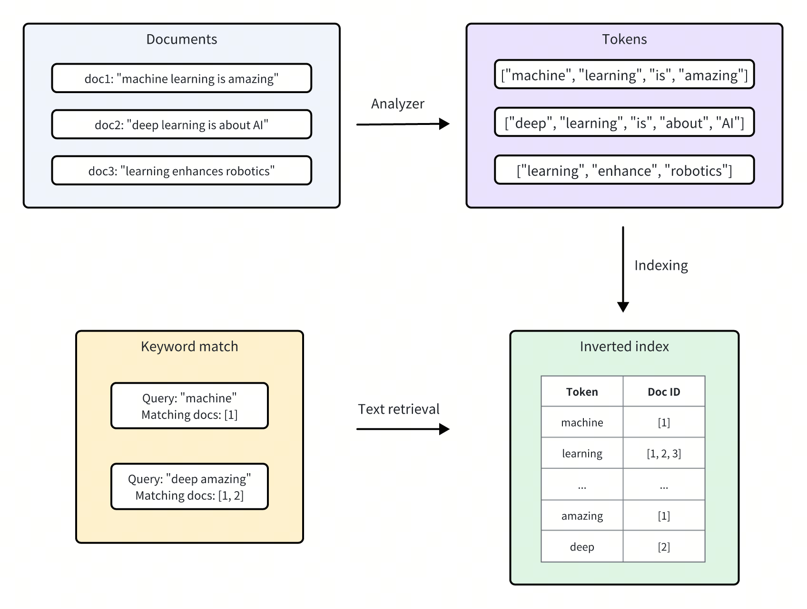

# Text Match​

Text match in Milvus enables precise document retrieval based on specific terms. This feature is primarily used for filtered search to satisfy specific conditions and can incorporate scalar filtering to refine query results, allowing similarity searches within vectors that meet scalar criteria.​

<div class="alert note">

Text match focuses on finding exact occurrences of the query terms, without scoring the relevance of the matched documents. If you want to retrieve the most relevant documents based on the semantic meaning and importance of the query terms, we recommend you use [​Full Text Search](full-text-search.md).​

</div>

## Overview

Milvus integrates [Tantivy](https://github.com/quickwit-oss/tantivy) to power its underlying inverted index and term-based text search. For each text entry, Milvus indexes it following the procedure:​

1. [Analyzer](analyzer-overview.md): The analyzer processes input text by tokenizing it into individual words, or tokens, and then applying filters as needed. This allows Milvus to build an index based on these tokens.​

2. [Indexing](index-scalar-fields.md): After text analysis, Milvus creates an inverted index that maps each unique token to the documents containing it.​

When a user performs a text match, the inverted index is used to quickly retrieve all documents containing the terms. This is much faster than scanning through each document individually.​



## Enable text match

Text match works on the `VARCHAR` field type, which is essentially the string data type in Milvus. To enable text match, set both `enable_analyzer` and `enable_match` to `True` and then optionally configure an analyzer for text analysis when defining your collection schema.​

### Set `enable_analyzer` and `enable_match`​

To enable text match for a specific `VARCHAR` field, set both the `enable_analyzer` and `enable_match` parameters to `True` when defining the field schema. This instructs Milvus to tokenize text and create an inverted index for the specified field, allowing fast and efficient text matches.​

<div class="multipleCode">
    <a href="#python">Python </a>
    <a href="#java">Java</a>
    <a href="#javascript">Node.js</a>
    <a href="#curl">cURL</a>
</div>

```python
from pymilvus import MilvusClient, DataType​
​
schema = MilvusClient.create_schema(auto_id=True, enable_dynamic_field=False)​
​
schema.add_field(​
    field_name='text', ​
    datatype=DataType.VARCHAR, ​
    max_length=1000, ​
    enable_analyzer=True, # Whether to enable text analysis for this field​
    enable_match=True # Whether to enable text match​
)​

```

```java
import io.milvus.v2.common.DataType;
import io.milvus.v2.service.collection.request.AddFieldReq;
import io.milvus.v2.service.collection.request.CreateCollectionReq;

CreateCollectionReq.CollectionSchema schema = CreateCollectionReq.CollectionSchema.builder()
        .enableDynamicField(false)
        .build();

schema.addField(AddFieldReq.builder()
        .fieldName("text")
        .dataType(DataType.VarChar)
        .maxLength(1000)
        .enableAnalyzer(true)
        .enableMatch(true)
        .build());

```

```javascript
const schema = [
  {
    name: "id",
    data_type: DataType.Int64,
    is_primary_key: true,
  },
  {
    name: "text",
    data_type: "VarChar",
    enable_analyzer: true,
    enable_match: true,
    max_length: 1000,
  },
  {
    name: "sparse",
    data_type: DataType.SparseFloatVector,
  },
];

```

```curl
export schema='{
        "autoId": true,
        "enabledDynamicField": false,
        "fields": [
            {
                "fieldName": "id",
                "dataType": "Int64",
                "isPrimary": true
            },
            {
                "fieldName": "text",
                "dataType": "VarChar",
                "elementTypeParams": {
                    "max_length": 1000,
                    "enable_analyzer": true,
                    "enable_match": true
                }
            },
            {
                "fieldName": "sparse",
                "dataType": "SparseFloatVector"
            }
        ]
    }'

```

### Optional: Configure an analyzer​

The performance and accuracy of text matching depend on the selected analyzer. Different analyzers are tailored to various languages and text structures, so choosing the right one can significantly impact search results for your specific use case.​

By default, Milvus uses the `standard` analyzer, which tokenizes text based on whitespace and punctuation, removes tokens longer than 40 characters, and converts text to lowercase. No additional parameters are needed to apply this default setting. For more information, refer to [​Standard](standard-analyzer.md).​

In cases where a different analyzer is required, you can configure one using the `analyzer_params` parameter. For example, to apply the `english` analyzer for processing English text:​

<div class="multipleCode">
    <a href="#python">Python </a>
    <a href="#java">Java</a>
    <a href="#javascript">Node.js</a>
    <a href="#curl">cURL</a>
</div>

```python
analyzer_params={​
    "type": "english"​
}​
​
schema.add_field(​
    field_name='text', ​
    datatype=DataType.VARCHAR, ​
    max_length=200, ​
    enable_analyzer=True，​
    analyzer_params=analyzer_params,​
    enable_match=True, ​
)​

```

```java
Map<String, Object> analyzerParams = new HashMap<>();
analyzerParams.put("type", "english");
schema.addField(AddFieldReq.builder()
        .fieldName("text")
        .dataType(DataType.VarChar)
        .maxLength(200)
        .enableAnalyzer(true)
        .analyzerParams(analyzerParams)
        .enableMatch(true)
        .build());

```

```javascript
const schema = [
  {
    name: "id",
    data_type: DataType.Int64,
    is_primary_key: true,
  },
  {
    name: "text",
    data_type: "VarChar",
    enable_analyzer: true,
    enable_match: true,
    max_length: 1000,
    analyzer_params: { type: 'english' },
  },
  {
    name: "sparse",
    data_type: DataType.SparseFloatVector,
  },
];

```

```curl
export schema='{
        "autoId": true,
        "enabledDynamicField": false,
        "fields": [
            {
                "fieldName": "id",
                "dataType": "Int64",
                "isPrimary": true
            },
            {
                "fieldName": "text",
                "dataType": "VarChar",
                "elementTypeParams": {
                    "max_length": 200,
                    "enable_analyzer": true,
                    "enable_match": true,
                    "analyzer_params": {"type": "english"}
                }
            },
            {
                "fieldName": "my_vector",
                "dataType": "FloatVector",
                "elementTypeParams": {
                    "dim": "5"
                }
            }
        ]
    }'

```

Milvus also provides various other analyzers suited to different languages and scenarios. For more details, refer to [​Overview](analyzer-overview.md).​

## Use text match

Once you have enabled text match for a VARCHAR field in your collection schema, you can perform text matches using the `TEXT_MATCH` expression.​

### TEXT_MATCH expression syntax​

The `TEXT_MATCH` expression is used to specify the field and the terms to search for. Its syntax is as follows:​

```
TEXT_MATCH(field_name, text)​

```

- `field_name`: The name of the VARCHAR field to search for.​

- `text`: The terms to search for. Multiple terms can be separated by spaces or other appropriate delimiters based on the language and configured analyzer.​

By default, `TEXT_MATCH` uses the **OR** matching logic, meaning it will return documents that contain any of the specified terms. For example, to search for documents containing the term `machine` or `deep` in the `text` field, use the following expression:​

<div class="multipleCode">
    <a href="#python">Python </a>
    <a href="#java">Java</a>
    <a href="#javascript">Node.js</a>
    <a href="#curl">cURL</a>
</div>

```python
filter = "TEXT_MATCH(text, 'machine deep')"​
```

```java
String filter = "TEXT_MATCH(text, 'machine deep')";
```

```javascript
const filter = "TEXT_MATCH(text, 'machine deep')";
```

```curl
export filter="\"TEXT_MATCH(text, 'machine deep')\""
```

You can also combine multiple `TEXT_MATCH` expressions using logical operators to perform **AND** matching.

- To search for documents containing both `machine` and `deep` in the `text` field, use the following expression:​

    <div class="multipleCode">
        <a href="#python">Python </a>
        <a href="#java">Java</a>
        <a href="#javascript">Node.js</a>
        <a href="#curl">cURL</a>
    </div>

    ```python
    filter = "TEXT_MATCH(text, 'machine') and TEXT_MATCH(text, 'deep')"​
    ```

    ```java
    String filter = "TEXT_MATCH(text, 'machine') and TEXT_MATCH(text, 'deep')";
    ```

    ```javascript
    const filter = "TEXT_MATCH(text, 'machine') and TEXT_MATCH(text, 'deep')"
    ```

    ```curl
    export filter="\"TEXT_MATCH(text, 'machine') and TEXT_MATCH(text, 'deep')\""
    ```

- To search for documents containing both `machine` and `learning` but without `deep` in the `text` field, use the following expressions:

    <div class="multipleCode">
        <a href="#python">Python </a>
        <a href="#java">Java</a>
        <a href="#javascript">Node.js</a>
        <a href="#curl">cURL</a>
    </div>

    ```python
    filter = "not TEXT_MATCH(text, 'deep') and TEXT_MATCH(text, 'machine') and TEXT_MATCH(text, 'learning')"
    ```

    ```java
    String filter = "not TEXT_MATCH(text, 'deep') and TEXT_MATCH(text, 'machine') and TEXT_MATCH(text, 'learning')";
    ```

    ```javascript
    const filter = "not TEXT_MATCH(text, 'deep') and TEXT_MATCH(text, 'machine') and TEXT_MATCH(text, 'learning')";
    ```

    ```curl
    export filter="\"not TEXT_MATCH(text, 'deep') and TEXT_MATCH(text, 'machine') and TEXT_MATCH(text, 'learning')\""
    ```

### Search with text match​

Text match can be used in combination with vector similarity search to narrow the search scope and improve search performance. By filtering the collection using text match before vector similarity search, you can reduce the number of documents that need to be searched, resulting in faster query times.​

In this example, the `filter` expression filters the search results to only include documents that match the specified term `keyword1` or `keyword2`. The vector similarity search is then performed on this filtered subset of documents.​
<div class="multipleCode">
    <a href="#python">Python </a>
    <a href="#java">Java</a>
    <a href="#javascript">Node.js</a>
    <a href="#curl">cURL</a>
</div>

```python
# Match entities with `keyword1` or `keyword2`​
filter = "TEXT_MATCH(text, 'keyword1 keyword2')"​
​
# Assuming 'embeddings' is the vector field and 'text' is the VARCHAR field​
result = MilvusClient.search(​
    collection_name="YOUR_COLLECTION_NAME", # Your collection name​
    anns_field="embeddings", # Vector field name​
    data=[query_vector], # Query vector​
    filter=filter,​
    search_params={"params": {"nprobe": 10}},​
    limit=10, # Max. number of results to return​
    output_fields=["id", "text"] # Fields to return​
)​

```

```java
String filter = "TEXT_MATCH(text, 'keyword1 keyword2')";

SearchResp searchResp = client.search(SearchReq.builder()
        .collectionName("YOUR_COLLECTION_NAME")
        .annsField("embeddings")
        .data(Collections.singletonList(queryVector)))
        .filter(filter)
        .topK(10)
        .outputFields(Arrays.asList("id", "text"))
        .build());
```

```javascript
// Match entities with `keyword1` or `keyword2`
const filter = "TEXT_MATCH(text, 'keyword1 keyword2')";

// Assuming 'embeddings' is the vector field and 'text' is the VARCHAR field
const result = await client.search(
    collection_name: "YOUR_COLLECTION_NAME", // Your collection name
    anns_field: "embeddings", // Vector field name
    data: [query_vector], // Query vector
    filter: filter,
    params: {"nprobe": 10},
    limit: 10, // Max. number of results to return
    output_fields: ["id", "text"] //Fields to return
);
```

```curl
export filter="\"TEXT_MATCH(text, 'keyword1 keyword2')\""

export CLUSTER_ENDPOINT="http://localhost:19530"
export TOKEN="root:Milvus"

curl --request POST \
--url "${CLUSTER_ENDPOINT}/v2/vectordb/entities/search" \
--header "Authorization: Bearer ${TOKEN}" \
--header "Content-Type: application/json" \
-d '{
    "collectionName": "demo2",
    "annsField": "my_vector",
    "data": [[0.19886812562848388, 0.06023560599112088, 0.6976963061752597, 0.2614474506242501, 0.838729485096104]],
    "filter": '"$filter"',
    "searchParams": {
        "params": {
            "nprobe": 10
        }
    },
    "limit": 3,
    "outputFields": ["text","id"]
}'
```

### Query with text match​

Text match can also be used for scalar filtering in query operations. By specifying a `TEXT_MATCH` expression in the `expr` parameter of the `query()` method, you can retrieve documents that match the given terms.​

The example below retrieves documents where the `text` field contains both terms `keyword1` and `keyword2`.​

<div class="multipleCode">
    <a href="#python">Python </a>
    <a href="#java">Java</a>
    <a href="#javascript">Node.js</a>
    <a href="#curl">cURL</a>
</div>

```python
# Match entities with both `keyword1` and `keyword2`​
filter = "TEXT_MATCH(text, 'keyword1') and TEXT_MATCH(text, 'keyword2')"​
​
result = MilvusClient.query(​
    collection_name="YOUR_COLLECTION_NAME",​
    filter=filter, ​
    output_fields=["id", "text"]​
)​

```

```java
String filter = "TEXT_MATCH(text, 'keyword1') and TEXT_MATCH(text, 'keyword2')";

QueryResp queryResp = client.query(QueryReq.builder()
        .collectionName("YOUR_COLLECTION_NAME")
        .filter(filter)
        .outputFields(Arrays.asList("id", "text"))
        .build()
);
```

```javascript
// Match entities with both `keyword1` and `keyword2`
const filter = "TEXT_MATCH(text, 'keyword1') and TEXT_MATCH(text, 'keyword2')";

const result = await client.query(
    collection_name: "YOUR_COLLECTION_NAME",
    filter: filter, 
    output_fields: ["id", "text"]
)
```

```curl
export filter="\"TEXT_MATCH(text, 'keyword1') and TEXT_MATCH(text, 'keyword2')\""

export CLUSTER_ENDPOINT="http://localhost:19530"
export TOKEN="root:Milvus"

curl --request POST \
--url "${CLUSTER_ENDPOINT}/v2/vectordb/entities/query" \
--header "Authorization: Bearer ${TOKEN}" \
--header "Content-Type: application/json" \
-d '{
    "collectionName": "demo2",
    "filter": '"$filter"',
    "outputFields": ["id", "text"]
}'
```

## Considerations

- Enabling text matching for a field triggers the creation of an inverted index, which consumes storage resources. Consider storage impact when deciding to enable this feature, as it varies based on text size, unique tokens, and the analyzer used.​

- Once you've defined an analyzer in your schema, its settings become permanent for that collection. If you decide that a different analyzer would better suit your needs, you may consider dropping the existing collection and creating a new one with the desired analyzer configuration.​