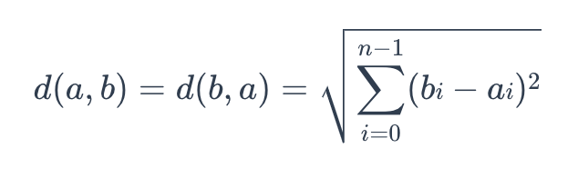
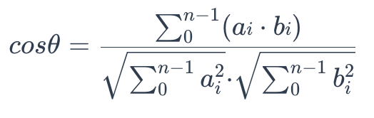

# Metric Types​

Similarity metrics are used to measure similarities among vectors. Choosing an appropriate distance metric helps improve classification and clustering performance significantly.​

Currently, Milvus supports these types of similarity Metrics: Euclidean distance (`L2`), Inner Product (`IP`), Cosine Similarity (`COSINE`), `JACCARD`, `HAMMING`, and `BM25` (specifically designed for full text search on sparse vectors).​

The table below summarizes the mapping between different field types and their corresponding metric types.​

<table data-block-token="LHu5dKCHro3mnTx6PsmckEsinQd"><thead><tr><th data-block-token="JOJvdTK9MouhT8x7tfGc59NGnfg" colspan="1" rowspan="1">
Field Type​

</th><th data-block-token="Iy8ZdPGpIo6nfwxiz4RcSuwanwf" colspan="1" rowspan="1">
Dimension Range​

</th><th data-block-token="LkYndBOhGotOkGxsog2ciFTSnKd" colspan="1" rowspan="1">
Supported Metric Types​

</th><th data-block-token="Hw3WdXW8UoXmZhxNbTRcMGkjnLb" colspan="1" rowspan="1">
Default Metric Type​

</th></tr></thead><tbody><tr><td data-block-token="PGXedlNoqoilHxx2AGJc7i9mnjd" colspan="1" rowspan="1">
<code>FLOAT_VECTOR</code>​

</td><td data-block-token="PsDDdjHs1ofQVcxorBXca4ognRh" colspan="1" rowspan="1">
2-32,768​

</td><td data-block-token="Lcd9dYDt7oQaFVxCWFFcSRtDnue" colspan="1" rowspan="1">
<code>COSINE</code>, <code>L2</code>, <code>IP</code>​

</td><td data-block-token="Ay3Fd5LNqo4RPsxuuNpck2BMnkh" colspan="1" rowspan="1">
<code>COSINE</code>​

</td></tr><tr><td data-block-token="XJjsdPYLAoS9UTx2dMfctcTDnGh" colspan="1" rowspan="1">
<code>FLOAT16_VECTOR</code>​

</td><td data-block-token="CxFFd2zLGocDQ5x8W6KcaNsTncc" colspan="1" rowspan="1">
2-32,768​

</td><td data-block-token="Tb0SdIkLyofe0rxXJCgccCePnAf" colspan="1" rowspan="1">
<code>COSINE</code>, <code>L2</code>, <code>IP</code>​

​

</td><td data-block-token="WlU2d4iIfoPCyKx1Pmmchfi3nOl" colspan="1" rowspan="1">
<code>COSINE</code>​

</td></tr><tr><td data-block-token="LWfPdDMxmoR7gtxg0SicPi5TnVe" colspan="1" rowspan="1">
<code>BFLOAT16_VECTOR</code>​

</td><td data-block-token="YUUNdZ8b0oZyt3xWiTMcPiJxnKe" colspan="1" rowspan="1">
2-32,768​

</td><td data-block-token="DV93ds317o3UmgxWZbicIJJsnSd" colspan="1" rowspan="1">
<code>COSINE</code>, <code>L2</code>, <code>IP</code>​

</td><td data-block-token="MnocdwigMoBJGZxnAl5c8g7Qnbd" colspan="1" rowspan="1">
<code>COSINE</code>​

</td></tr><tr><td data-block-token="J3qEdX4N3o0H0nx3ikbcMGWRnLc" colspan="1" rowspan="1">
<code>SPARSE_FLOAT_VECTOR</code>​

</td><td data-block-token="Swg5dVhAboemtgx5lDKcYKBSnFb" colspan="1" rowspan="1">
No need to specify the dimension.​

</td><td data-block-token="Kh3vdZtdoo4ebbxhpl6cYdcZnZc" colspan="1" rowspan="1">
<code>IP</code>, <code>BM25</code> (used only for full text search)​

</td><td data-block-token="RZWudPDO8oGzo9xrouncv8PXnch" colspan="1" rowspan="1">
<code>IP</code>​

</td></tr><tr><td data-block-token="Qh9YdBV0yocP8Ux1GZzctRcinwh" colspan="1" rowspan="1">
<code>BINARY_VECTOR</code>​

</td><td data-block-token="RnLodmlT3oe8tgxFrPrcqPD6nEb" colspan="1" rowspan="1">
8-32,768*8​

​

</td><td data-block-token="H5jdd6wKZofy9zxiu88cMrLVn5d" colspan="1" rowspan="1">
<code>HAMMING</code>, <code>JACCARD</code>​

</td><td data-block-token="QJBadzeQRox54VxflTLcYRO5nsj" colspan="1" rowspan="1">
<code>HAMMING</code>​

</td></tr></tbody></table>

- For vector fields of the `SPARSE_FLOAT_VECTOR` type, use the `BM25` metric type only when performing full text search. For more information, refer to [​Full Text Search](full-text-search.md).​

- For vector fields of the `BINARY_VECTOR` type, the dimension value (`dim`) must be a multiple of 8. ​

The table below summarizes the characteristics of the similarity distance values of all supported metric types and their value range.​

<table data-block-token="EOgLdu5WdoBkLqxmYIfcYGkinLd"><thead><tr><th data-block-token="NQdRdW2N9oqzaox1LHdcqs62n2f" colspan="1" rowspan="1">
Metric Type​

</th><th data-block-token="UgmddW6X6oP1S0xFq3QcPtUznYf" colspan="1" rowspan="1">
Characteristics of the Similarity Distance Values​

</th><th data-block-token="A6aTdLiwpoZiTOxOKDKcUV3Ynpe" colspan="1" rowspan="1">
Similarity Distance Value Range​

</th></tr></thead><tbody><tr><td data-block-token="WueMdzdxZoPUMaxYFXccfNq3nQc" colspan="1" rowspan="1">
<code>L2</code>​

</td><td data-block-token="U4sEdyrLPo11oxxeK1OcsAYGnMc" colspan="1" rowspan="1">
A smaller value indicates a greater similarity.​

</td><td data-block-token="NuIIdRT0Vo0ReDx4YxCcrSr1nvg" colspan="1" rowspan="1">
[0, ∞)​

</td></tr><tr><td data-block-token="VZPGde4XnokxQWxwZkXcbj4pnnh" colspan="1" rowspan="1">
<code>IP</code>​

</td><td data-block-token="FLsidgKBYoYSIPxLL6hceY6Unug" colspan="1" rowspan="1">
A greater value indicates a greater similarity.​

</td><td data-block-token="Eqg9d7C9CodcAbxKTH8cFl01nbe" colspan="1" rowspan="1">
[-1, 1]​

</td></tr><tr><td data-block-token="O999dQ01qoPM8axWJEIcQ7fAnlh" colspan="1" rowspan="1">
<code>COSINE</code>​

</td><td data-block-token="UxNzdl0UboEmoqx85QIcbJWxncb" colspan="1" rowspan="1">
A greater value indicates a greater similarity.​

</td><td data-block-token="RUo6dZMMooT6PHxaG7LcCHfhnHh" colspan="1" rowspan="1">
[-1, 1]​

</td></tr><tr><td data-block-token="ZvJ8dlR2coPDm6x5MHkcxHLQnPe" colspan="1" rowspan="1">
<code>JACCARD</code> ​

</td><td data-block-token="Aq8Cd7Awao5IhExSnUjcUzRxndh" colspan="1" rowspan="1">
A smaller value indicates a greater similarity.​

</td><td data-block-token="ULaFdvx0WoKy4rxBgPzciLZMnFg" colspan="1" rowspan="1">
[0, 1]​

</td></tr><tr><td data-block-token="L5l6dqaAVoVpSJxFW5TcZlXLnAc" colspan="1" rowspan="1">
<code>HAMMING</code> ​

</td><td data-block-token="H3vYdaah4oWsXmxmABOcW01XnSh" colspan="1" rowspan="1">
A smaller value indicates a greater similarity.​

</td><td data-block-token="NZnwdhAGUoO0R9x9gz6cZfCYnOd" colspan="1" rowspan="1">
[0, dim(vector)]​

</td></tr><tr><td data-block-token="Xm5BdUTvXoPS1Xxtc26cBqAWn9e" colspan="1" rowspan="1">
<code>BM25</code>​

</td><td data-block-token="OHEldDxlaoejYmxXgUPcbwCYn4b" colspan="1" rowspan="1">
Score the relevance based on the term frequency, inverted document frequency, and document normalization.​

</td><td data-block-token="KNCEd8WTioQbwnxmHzNcpHkHnzf" colspan="1" rowspan="1">
[0, ∞)​

​

</td></tr></tbody></table>

## Euclidean distance (L2)​

Essentially, Euclidean distance measures the length of a segment that connects 2 points.​

The formula for Euclidean distance is as follows:​

where **a = (a0, a1,..., an-1)** and **b = (b0, b1,..., bn-1)** are two points in n-dimensional Euclidean space.​

It's the most commonly used distance metric and is very useful when the data are continuous.​

Milvus only calculates the value before applying the square root when Euclidean distance is chosen as the distance metric.​

## Inner product (IP)​

The IP distance between two embeddings is defined as follows:​

IP is more useful if you need to compare non-normalized data or when you care about magnitude and angle.​

If you use IP to calculate similarities between embeddings, you must normalize your embeddings. After normalization, the inner product equals cosine similarity.​

Suppose X' is normalized from embedding X:​

The correlation between the two embeddings is as follows:​

## Cosine similarity ​

Cosine similarity uses the cosine of the angle between two sets of vectors to measure how similar they are. You can think of the two sets of vectors as line segments starting from the same point, such as [0,0,...], but pointing in different directions.​

To calculate the cosine similarity between two sets of vectors **A = (a0, a1,..., an-1)** and **B = (b0, b1,..., bn-1)**, use the following formula:​

The cosine similarity is always in the interval **[-1, 1]**. For example, two proportional vectors have a cosine similarity of **1**, two orthogonal vectors have a similarity of **0**, and two opposite vectors have a similarity of **-1**. The larger the cosine, the smaller the angle between the two vectors, indicating that these two vectors are more similar to each other.​

By subtracting their cosine similarity from 1, you can get the cosine distance between two vectors.​

## JACCARD distance​

JACCARD similarity coefficient measures the similarity between two sample sets and is defined as the cardinality of the intersection of the defined sets divided by the cardinality of the union of them. It can only be applied to finite sample sets.​

JACCARD distance measures the dissimilarity between data sets and is obtained by subtracting the JACCARD similarity coefficient from 1. For binary variables, JACCARD distance is equivalent to the Tanimoto coefficient.​

## HAMMING distance​

HAMMING distance measures binary data strings. The distance between two strings of equal length is the number of bit positions at which the bits are different.​

For example, suppose there are two strings, 1101 1001 and 1001 1101.​

11011001 ⊕ 10011101 = 01000100. Since, this contains two 1s, the HAMMING distance, d (11011001, 10011101) = 2.​

## BM25 similarity​

BM25 is a widely used text relevance measurement method, specifically designed for [full text search](full-text-search.md). It combines the following three key factors:​

- **Term Frequency (TF):** Measures how frequently a term appears in a document. While higher frequencies often indicate greater importance, BM25 uses the saturation parameter ​k1​ to prevent overly frequent terms from dominating the relevance score.​

- **Inverse Document Frequency (IDF):** Reflects the importance of a term across the entire corpus. Terms appearing in fewer documents receive a higher IDF value, indicating greater contribution to relevance.​

- **Document Length **Normalization**:** Longer documents tend to score higher due to containing more terms. BM25 mitigates this bias by normalizing document lengths, with parameter ​b controlling the strength of this normalization.​

The BM25 scoring is calculated as follows:​

Parameter description:​

- `​Q`: The query text provided by the user.​

- `​D`: The document being evaluated.​

- `​TF(qi​,D)`: Term frequency, representing how often term `​qi` ​appears in document `​D`.​

- `​IDF(qi​)`: Inverse document frequency, calculated as:​

    

    where `​N` is the total number of documents in the corpus, and `​n(qi​)` is the number of documents containing term ​qi​.​

- `​∣D∣`: Length of document `​D` (total number of terms).​

- `​avgdl`: Average length of all documents in the corpus.​

- `​k1​`: Controls the influence of term frequency on the score. Higher values increase the importance of term frequency. The typical range is [1.2, 2.0], while Milvus allows a range of [0, 3].​

- `​b`: Controls the degree of length normalization, ranging from 0 to 1. When the value is 0, no normalization is applied; when the value is 1, full normalization is applied.​

​

