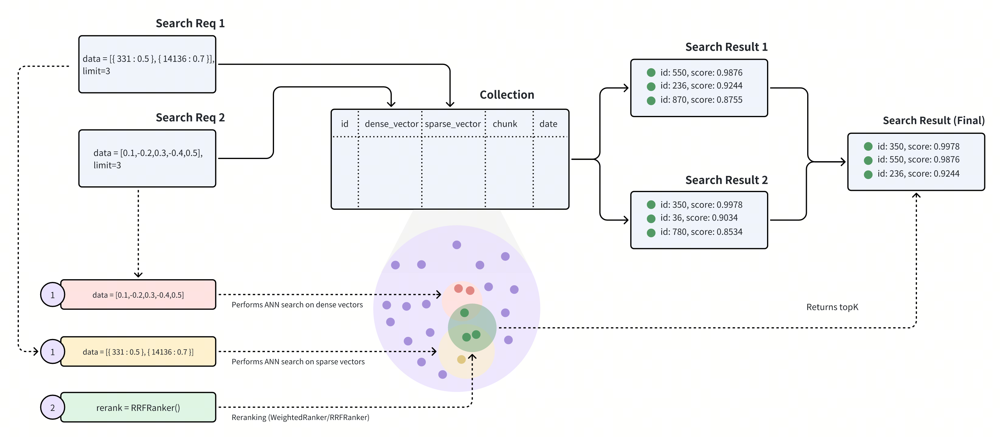

# Hybrid Search​

Hybrid Search refers to a search method that conducts multiple ANN searches simultaneously, reranks multiple sets of results from these ANN searches, and ultimately returns a single set of results. Using Hybrid Search can enhance the search accuracy. Zilliz supports conducting Hybrid Search on a collection with multiple vector fields. ​

Hybrid Search is most commonly used in scenarios including sparse-dense vector searches and multimodal searches. This guide will demonstrate how to conduct a Hybrid Search in Zilliz with a specific example.​

## Scenarios​

Hybrid Search is suitable for the following two scenarios:​

### Sparse-Dense Vector Search​

Different types of vectors can represent different information, and using various embedding models can more comprehensively represent different features and aspects of the data. For example, using different embedding models for the same sentence can generate a dense vector to represent the semantic meaning and a sparse vector to represent the word frequency in the sentence.​

- **Sparse vectors:** Sparse vectors are characterized by their high vector dimensionality and the presence of few non-zero values. This structure makes them particularly well-suited for traditional information retrieval applications. In most cases, the number of dimensions used in sparse vectors correspond to different tokens across one or more languages. Each dimension is assigned a value that indicates the relative importance of that token within the document. This layout proves advantageous for tasks that involve text matching.​

- **Dense vectors:** Dense vectors are embeddings derived from neural networks. When arranged in an ordered array, these vectors capture the semantic essence of the input text. Note that dense vectors are not limited to text processing; they are also extensively used in computer vision to represent the semantics of visual data. These dense vectors, usually generated by text embedding models, are characterized by most or all elements being non-zero. Thus, dense vectors are particularly effective for semantic search applications, as they can return the most similar results based on vector distance even in the absence of exact text matches. This capability allows for more nuanced and context-aware search results, often capturing relationships between concepts that might be missed by keyword-based approaches.​

For more details, refer to [​Sparse Vector](sparse_vector.md) and [​Dense Vector](dense-vector.md).​

### Multimodal Search​

Multimodal search refers to the similarity search of unstructured data across multiple modalities (such as images, videos, audio, text, etc). For instance, a person can be represented using various modalities of data such as fingerprints, voiceprints, and facial features. Hybrid Search supports multiple searches simultaneously. For example searching a person with both similar fingerprints and voiceprints.​

## Workflow​

The main workflow for conducting a Hybrid Search is as follows:​

1. Generate dense vectors through embedding models like [BERT](https://zilliz.com/learn/explore-colbert-token-level-embedding-and-ranking-model-for-similarity-search#A-Quick-Recap-of-BERT) and [Transformers](https://zilliz.com/learn/NLP-essentials-understanding-transformers-in-AI).​

2. Generate sparse vectors through embedding models like [BM25](https://zilliz.com/learn/mastering-bm25-a-deep-dive-into-the-algorithm-and-application-in-milvus), [BGE-M3](https://zilliz.com/learn/bge-m3-and-splade-two-machine-learning-models-for-generating-sparse-embeddings#BGE-M3), [SPLADE](https://zilliz.com/learn/bge-m3-and-splade-two-machine-learning-models-for-generating-sparse-embeddings#SPLADE), etc.​ In Milvus, you can use the Function to generate sparse vectors.​ For more information, refer to [Full Text Search](full-text-search.md).

3. Create a collection and define the collection schema which includes both dense and sparse vector fields.​

4. Insert sparse-dense vectors into the collection just created in the previous step.​

5. Conduct a Hybrid Search: ANN Search on dense vectors will return a set of top-K most similar results, and text match on sparse vectors will also return a set of top-K results.​

6. Normalization: Normalize the scores of the two sets of top-K results, converting the scores to a range between [0,1].​

7. Choose an appropriate reranking strategy to merge and rerank the two sets of top-K results and ultimately return a final set of top-K results.​



## Examples​

This section will use a specific example to illustrate how to conduct a Hybrid Search on sparse-dense vectors to enhance the accuracy of text searches.​

### Create a collection with multiple vector fields​

The process of creating a collection includes three parts: defining the collection schema, configuring the index parameters, and creating the collection.​

#### Define schema​

In this example, multiple vector fields need to be defined within the collection schema. Currently, each collection can include up to 4 vector fields by default. But you can also modify the value of  [`proxy.maxVectorFieldNum`](https://milvus.io/docs/configure_proxy.md#proxymaxVectorFieldNum)  to include up to 10 vector fields in a collection as needed.​

The following example defines a collection schema, where `dense` and `sparse` are the two vector fields:​

- `id`: This field serves as the primary key for storing text IDs. The data type of this field is INT64.​

- `text`: This field is used for storing textual content. The data type of this field is VARCHAR, with a maximum length of 1000 characters.​

- `dense`: This field is used to store the dense vectors of the texts. The data type of this field is FLOAT_VECTOR, with a vector dimension of 768.​

- `sparse`: This field is used to store the sparse vectors of the texts. The data type of this field is SPARSE_FLOAT_VECTOR.​ In this example, we use the Function to generate sparse vectors.​

<div class="multipleCode">
    <a href="#python">Python </a>
    <a href="#java">Java</a>
    <a href="#javascript">Node.js</a>
    <a href="#curl">cURL</a>
</div>

```python
# Create a collection in customized setup mode​
from pymilvus import (​
    MilvusClient, DataType​
)​
​
client = MilvusClient(​
    uri="http://localhost:19530",​
    token="root:Milvus"​
)​
​
# Create schema​
schema = MilvusClient.create_schema(​
    auto_id=False,​
    enable_dynamic_field=True,​
)​
# Add fields to schema​
schema.add_field(field_name="id", datatype=DataType.INT64, is_primary=True)​
schema.add_field(field_name="text", datatype=DataType.VARCHAR, max_length=1000)​
# Define a sparse vector field to generate spare vectors with BM25
schema.add_field(field_name="sparse", datatype=DataType.SPARSE_FLOAT_VECTOR)​
schema.add_field(field_name="dense", datatype=DataType.FLOAT_VECTOR, dim=5)​

```

```java
import io.milvus.v2.client.ConnectConfig;​
import io.milvus.v2.client.MilvusClientV2;​
import io.milvus.v2.common.DataType;​
import io.milvus.v2.service.collection.request.AddFieldReq;​
import io.milvus.v2.service.collection.request.CreateCollectionReq;​
​
MilvusClientV2 client = new MilvusClientV2(ConnectConfig.builder()​
        .uri("http://localhost:19530")​
        .token("root:Milvus")​
        .build());​
​
CreateCollectionReq.CollectionSchema schema = client.createSchema();​
schema.addField(AddFieldReq.builder()​
        .fieldName("id")​
        .dataType(DataType.Int64)​
        .isPrimaryKey(true)​
        .autoID(false)​
        .build());​
​
schema.addField(AddFieldReq.builder()​
        .fieldName("text")​
        .dataType(DataType.VarChar)​
        .maxLength(1000)​
        .build());​
​
schema.addField(AddFieldReq.builder()​
        .fieldName("dense")​
        .dataType(DataType.FloatVector)​
        .dimension(768)​
        .build());​
​
schema.addField(AddFieldReq.builder()​
        .fieldName("sparse")​
        .dataType(DataType.SparseFloatVector)​
        .build());​

```

```go
// WIP​

```

```javascript
import { MilvusClient, DataType } from "@zilliz/milvus2-sdk-node";​
​
const address = "http://localhost:19530";​
const token = "root:Milvus";​
const client = new MilvusClient({address, token});​
​
// Create a collection in customized setup mode​
// Define fields​
const fields = [​
    {​
        name: "id",​
        data_type: DataType.Int64,​
        is_primary_key: true,​
        auto_id: false​
    },​
    {​
        name: "text",​
        data_type: DataType.VarChar,​
        max_length: 1000​
    },​
    {​
        name: "sparse",​
        data_type: DataType.SPARSE_FLOAT_VECTOR​
    },​
    {​
        name: "dense",​
        data_type: DataType.FloatVector,​
        dim: 768​
    }​
]​

```

```curl
export schema='{​
        "autoId": false,​
        "enabledDynamicField": true,​
        "fields": [​
            {​
                "fieldName": "id",​
                "dataType": "Int64",​
                "isPrimary": true​
            },​
            {​
                "fieldName": "text",​
                "dataType": "VarChar",​
                "elementTypeParams": {​
                    "max_length": 1000​
                }​
            },​
            {​
                "fieldName": "sparse",​
                "dataType": "SparseFloatVector"​
            },​
            {​
                "fieldName": "dense",​
                "dataType": "FloatVector",​
                "elementTypeParams": {​
                    "dim": "768"​
                }​
            }​
        ]​
    }'​

```

During sparse vector searches, you can simplify the process of generating sparse embedding vectors by leveraging Full Text Search capabilities. For more details, see [​Full Text Search](full-text-search.md).​

#### Define function to generate sparse vectors​

To generate sparse vectors, you can use the Function feature in Milvus. The following example defines a Function to generate sparse vectors using the BM25 algorithm. For more information, refer to [Full Text Search](full-text-search.md).​

<div class="multipleCode">
    <a href="#python">Python </a>
    <a href="#java">Java</a>
    <a href="#javascript">Node.js</a>
    <a href="#curl">cURL</a>
</div>

```python
# Define function to generate sparse vectors

bm25_function = Function(
    name="text_bm25_emb", # Function name
    input_field_names=["text"], # Name of the VARCHAR field containing raw text data
    output_field_names=["sparse"], # Name of the SPARSE_FLOAT_VECTOR field reserved to store generated embeddings
    function_type=FunctionType.BM25,
)

schema.add_function(bm25_function)
```

```java
import io.milvus.common.clientenum.FunctionType;
import io.milvus.v2.service.collection.request.CreateCollectionReq.Function;

import java.util.*;

schema.addFunction(Function.builder()
        .functionType(FunctionType.BM25)
        .name("text_bm25_emb")
        .inputFieldNames(Collections.singletonList("text"))
        .outputFieldNames(Collections.singletonList("sparse"))
        .build());
```

```javascript
const functions = [
    {
      name: 'text_bm25_emb',
      description: 'bm25 function',
      type: FunctionType.BM25,
      input_field_names: ['text'],
      output_field_names: ['sparse'],
      params: {},
    },
]；
```

```curl
export schema='{
        "autoId": true,
        "enabledDynamicField": false,
        "fields": [
            {
                "fieldName": "id",
                "dataType": "Int64",
                "isPrimary": true
            },
            {
                "fieldName": "text",
                "dataType": "VarChar",
                "elementTypeParams": {
                    "max_length": 1000,
                    "enable_analyzer": true
                }
            },
            {
                "fieldName": "sparse",
                "dataType": "SparseFloatVector"
            }
        ],
        "functions": [
            {
                "name": "text_bm25_emb",
                "type": "BM25",
                "inputFieldNames": ["text"],
                "outputFieldNames": ["sparse"],
                "params": {}
            }
        ]
    }'
```

#### Create index​

After defining the collection schema, it is necessary to set up the vector indexes and the similarity metrics. In this example, an IVF_FLAT index is created for the dense vector field `dense`, and a SPARSE_INVERTED_INDEX is created for the sparse vector field `sparse`. To learn about the types of indexes supported, see [​Index Explained](https://milvus.io/docs/index.md?tab=floating).​

<div class="multipleCode">
    <a href="#python">Python </a>
    <a href="#java">Java</a>
    <a href="#javascript">Node.js</a>
    <a href="#curl">cURL</a>
</div>

```python
from pymilvus import MilvusClient​
​
# Prepare index parameters​
index_params = client.prepare_index_params()​
​
# Add indexes​
index_params.add_index(​
    field_name="dense",​
    index_name="dense_index",​
    index_type="IVF_FLAT",​
    metric_type="IP",​
    params={"nlist": 128},​
)​
​
index_params.add_index(
    field_name="sparse",
    index_name="sparse_index",
    index_type="SPARSE_INVERTED_INDEX",  # Index type for sparse vectors
    metric_type="BM25",  # Set to `BM25` when using function to generate sparse vectors
    params={"inverted_index_algo": "DAAT_MAXSCORE"},  # The ratio of small vector values to be dropped during indexing
)
```

```java
import io.milvus.v2.common.IndexParam;​
import java.util.*;​
​
Map<String, Object> denseParams = new HashMap<>();​
denseParams.put("nlist", 128);​
IndexParam indexParamForDenseField = IndexParam.builder()​
        .fieldName("dense")​
        .indexName("dense_index")​
        .indexType(IndexParam.IndexType.IVF_FLAT)​
        .metricType(IndexParam.MetricType.IP)​
        .extraParams(denseParams)​
        .build();​
​
Map<String, Object> sparseParams = new HashMap<>();​
sparseParams.put("inverted_index_algo": "DAAT_MAXSCORE");​ // Algorithm used for building and querying the index
IndexParam indexParamForSparseField = IndexParam.builder()​
        .fieldName("sparse")​
        .indexName("sparse_index")​
        .indexType(IndexParam.IndexType.SPARSE_INVERTED_INDEX)​
        .metricType(IndexParam.MetricType.BM25)​
        .extraParams(sparseParams)​
        .build();​
​
List<IndexParam> indexParams = new ArrayList<>();​
indexParams.add(indexParamForDenseField);​
indexParams.add(indexParamForSparseField);​

```

```javascript
const index_params = [{​
    field_name: "dense",​
    index_type: "IVF_FLAT",​
    metric_type: "IP"​
},{​
    field_name: "sparse",​
    index_type: "SPARSE_INVERTED_INDEX",​
    metric_type: "BM25"​
}]​

```

```curl
export indexParams='[​
        {​
            "fieldName": "dense",​
            "metricType": "IP",​
            "indexName": "dense_index",​
            "indexType":"IVF_FLAT",​
            "params":{"nlist":128}​
        },​
        {​
            "fieldName": "sparse",​
            "metricType": "BM25",​
            "indexName": "sparse_index",​
            "indexType": "SPARSE_INVERTED_INDEX"​
        }​
    ]'​

```

#### Create collection​

Create a collection named `demo` with the collection schema and indexes configured in the previous two steps.​

<div class="multipleCode">
    <a href="#python">Python </a>
    <a href="#java">Java</a>
    <a href="#javascript">Node.js</a>
    <a href="#curl">cURL</a>
</div>

```python
from pymilvus import MilvusClient​
​
client.create_collection(​
    collection_name="hybrid_search_collection",​
    schema=schema,​
    index_params=index_params​
)​

```

```java
CreateCollectionReq createCollectionReq = CreateCollectionReq.builder()​
        .collectionName("hybrid_search_collection")​
        .collectionSchema(schema)​
        .indexParams(indexParams)​
        .build();​
client.createCollection(createCollectionReq);​

```

```javascript
res = await client.createCollection({​
    collection_name: "hybrid_search_collection",​
    fields: fields,​
    index_params: index_params,​
})​

```

```curl
export CLUSTER_ENDPOINT="http://localhost:19530"​
export TOKEN="root:Milvus"​
​
curl --request POST \​
--url "${CLUSTER_ENDPOINT}/v2/vectordb/collections/create" \​
--header "Authorization: Bearer ${TOKEN}" \​
--header "Content-Type: application/json" \​
-d "{​
    \"collectionName\": \"hybrid_search_collection\",​
    \"schema\": $schema,​
    \"indexParams\": $indexParams​
}"​

```

### Insert data​

Insert the sparse-dense vectors into the the collection `demo`.​

<div class="multipleCode">
    <a href="#python">Python </a>
    <a href="#java">Java</a>
    <a href="#javascript">Node.js</a>
    <a href="#curl">cURL</a>
</div>

```python
from pymilvus import MilvusClient​
​
docs = [
    "Artificial intelligence was founded as an academic discipline in 1956.",
    "Alan Turing was the first person to conduct substantial research in AI.",
    "Born in Maida Vale, London, Turing was raised in southern England.",
]

data = [
    {"id": 1, "text": docs[0], "dense": [2.7242085933685303, 6.021071434020996, 0.4754035174846649, 9.358858108520508, 5.173221111297607]},
    {"id": 2, "text": docs[1], "dense": [8.584294319152832, 2.7640628814697266, 9.558855056762695, 2.584272861480713, 4.705013275146484]},
    {"id": 3, "text": docs[2], "dense": [2.5525057315826416, 3.8815805912017822, 9.343480110168457, 7.888997554779053, 4.500918388366699]},
]
​
res = client.insert(​
    collection_name="hybrid_search_collection",​
    data=data​
)​
​

```

```java
import com.google.gson.Gson;​
import com.google.gson.JsonObject;​
import io.milvus.v2.service.vector.request.InsertReq;​
​
Gson gson = new Gson();​
float[] dense1 = {2.7242086f, 6.0210714f, 0.47540352f, 9.3588581f, 5.1732211f};
float[] dense2 = {8.5842943f, 2.7640628f, 9.5588550f, 2.5842728f, 4.7050133f};
float[] dense3 = {2.5525057f, 3.8815806f, 9.3434801f, 7.8889976f, 4.5009184f};
String[] docs = {
            "Artificial intelligence was founded as an academic discipline in 1956.",
            "Alan Turing was the first person to conduct substantial research in AI.",
            "Born in Maida Vale, London, Turing was raised in southern England."
};
JsonObject row1 = new JsonObject();
row1.addProperty("id", 1);
row1.addProperty("text", docs[0]);
row1.add("dense", gson.toJsonTree(dense1));
​
JsonObject row2 = new JsonObject();
row2.addProperty("id", 2);
row2.addProperty("text", docs[1]);
row2.add("dense", gson.toJsonTree(dense2));
​
JsonObject row3 = new JsonObject();
row3.addProperty("id", 3);
row3.addProperty("text", docs[2]);
row3.add("dense", gson.toJsonTree(dense3));
​
List<JsonObject> data = Arrays.asList(row1, row2, row3);​
InsertReq insertReq = InsertReq.builder()​
        .collectionName("hybrid_search_collection")​
        .data(data)​
        .build();​
​
InsertResp insertResp = client.insert(insertReq);​

```

```javascript
const { MilvusClient, DataType } = require("@zilliz/milvus2-sdk-node")​
​
const docs = [
    "Artificial intelligence was founded as an academic discipline in 1956.",
    "Alan Turing was the first person to conduct substantial research in AI.",
    "Born in Maida Vale, London, Turing was raised in southern England."
];

const data = [
    {
        id: 1,
        text: docs[0],
        dense: [2.7242085933685303, 6.021071434020996, 0.4754035174846649, 9.358858108520508, 5.173221111297607]
    },
    {
        id: 2,
        text: docs[1],
        dense: [8.584294319152832, 2.7640628814697266, 9.558855056762695, 2.584272861480713, 4.705013275146484]
    },
    {
        id: 3,
        text: docs[2],
        dense: [2.5525057315826416, 3.8815805912017822, 9.343480110168457, 7.888997554779053, 4.500918388366699]
    }
];
​
var res = await client.insert({​
    collection_name: "hybrid_search_collection",​
    data: data,​
})​

```

```curl
curl --request POST \​
--url "${CLUSTER_ENDPOINT}/v2/vectordb/entities/insert" \​
--header "Authorization: Bearer ${TOKEN}" \​
--header "Content-Type: application/json" \​
-d '{​
    "data": [
            {
                "id": 1,
                "text": "Artificial intelligence was founded as an academic discipline in 1956.",
                "dense": [2.7242085933685303, 6.021071434020996, 0.4754035174846649, 9.358858108520508, 5.173221111297607]
            },
            {
                "id": 2,
                "text": "Alan Turing was the first person to conduct substantial research in AI.",
                "dense": [8.584294319152832, 2.7640628814697266, 9.558855056762695, 2.584272861480713, 4.705013275146484]
            },
            {
                "id": 3,
                "text": "Born in Maida Vale, London, Turing was raised in southern England.",
                "dense": [2.5525057315826416, 3.8815805912017822, 9.343480110168457, 7.888997554779053, 4.500918388366699]
            }
        ],​
    "collectionName": "hybrid_search_collection"​
}'​

```

### Create multiple AnnSearchRequest instances​

Hybrid Search is implemented by creating multiple `AnnSearchRequest` in the `hybrid_search()` function, where each `AnnSearchRequest` represents a basic ANN search request for a specific vector field. Therefore, before conducting a Hybrid Search, it is necessary to create an `AnnSearchRequest` for each vector field.​

<div class="alert note">

In Hybrid Search, each `AnnSearchRequest` supports only one query vector.​

</div>

Suppose the query text "Who started AI research?" has already been converted into sparse and dense vectors. Based on this, two `AnnSearchRequest` search requests are created for the `sparse` and `dense` vector fields respectively, as shown in the following example.​

<div class="multipleCode">
    <a href="#python">Python </a>
    <a href="#java">Java</a>
    <a href="#javascript">Node.js</a>
    <a href="#curl">cURL</a>
</div>

```python
from pymilvus import AnnSearchRequest​
​
search_param_1 = {
    "data": [[0.7425515055656433, 7.774101734161377, 0.7397570610046387, 2.429982900619507, 3.8253049850463867]],
    "anns_field": "dense",
    "param": {
        "metric_type": "IP",
        "params": {"nprobe": 10}
    },
    "limit": 2
}
request_1 = AnnSearchRequest(**search_param_1)

search_param_2 = {
    "data": ['Who started AI research'],
    "anns_field": "sparse",
    "param": {
        "metric_type": "BM25",
    },
    "limit": 2
}
request_2 = AnnSearchRequest(**search_param_2)

reqs = [request_1, request_2]
​

```

```java
import io.milvus.v2.service.vector.request.AnnSearchReq;
import io.milvus.v2.service.vector.request.data.BaseVector;
import io.milvus.v2.service.vector.request.data.FloatVec;
import io.milvus.v2.service.vector.request.data.TextVec;
import io.milvus.v2.service.index.IndexParam;

import java.util.*;

public class MilvusSearchRequest {
    public static void main(String[] args) {
        float[] denseQueryVector = {
                0.7425515f, 7.7741017f, 0.73975706f, 2.4299829f, 3.825305f
        };

        String sparseQueryText = "Who started AI research";

        List<BaseVector> queryDenseVectors = Collections.singletonList(new FloatVec(denseQueryVector));

        List<BaseVector> querySparseVectors = Collections.singletonList(new TextVec(sparseQueryText));

        List<AnnSearchReq> searchRequests = new ArrayList<>();

        searchRequests.add(AnnSearchReq.builder()
                .vectorFieldName("dense")  // Field Name
                .vectors(queryDenseVectors) // Query Vector
                .metricType(IndexParam.MetricType.IP) // Inner Product Metric
                .params("{\"nprobe\": 10}") // Search Params
                .topK(2) // Limit results to top 2
                .build());

        searchRequests.add(AnnSearchReq.builder()
                .vectorFieldName("sparse") // Field Name
                .vectors(querySparseVectors) // Query Text Vector
                .metricType(IndexParam.MetricType.BM25) // BM25 Metric for sparse
                .params("{}") // No additional parameters for BM25
                .topK(2) // Limit results to top 2
                .build());

        System.out.println("Generated Search Requests:");
        searchRequests.forEach(System.out::println);
    }
}


```

```javascript
const search_param_1 = {
    "data": [[0.7425515055656433, 7.774101734161377, 0.7397570610046387, 2.429982900619507, 3.8253049850463867]], 
    "anns_field": "dense",
    "param": {
        "metric_type": "IP",
        "params": { "nprobe": 10 } 
    },
    "limit": 2
};

const search_param_2 = {
    "data": ["Who started AI research"], 
    "anns_field": "sparse",
    "param": {
        "metric_type": "BM25",
        "params": {} // BM25 does not require extra parameters
    },
    "limit": 2
};

// Combine both search parameters into a single request list
const reqs = [search_param_1, search_param_2];

```

```curl
export req='[
    {
        "data": [[0.7425515055656433, 7.774101734161377, 0.7397570610046387, 2.429982900619507, 3.8253049850463867]], 
        "anns_field": "dense",
        "param": {
            "metric_type": "IP",
            "params": {
                "nprobe": 10
            }
        },
        "limit": 2
    },
    {
        "data": ["Who started AI research"],
        "anns_field": "sparse",
        "param": {
            "metric_type": "BM25",
            "params": {}
        },
        "limit": 2
    }
]'

curl -X POST "http://your-milvus-server-address/v1/vector/search" \
     -H "Content-Type: application/json" \
     -d "$req"


```

Since the parameter `limit` is set to 2, each `AnnSearchRequest` returns 2 search results. In this example, 2 `AnnSearchRequest` are created, therefore a total of 4 search results will be returned.​

### Configure a reranking strategy​

To merge and rerank the two sets of ANN search results, it is necessary to select an appropriate reranking strategy. Zilliz supports two types of reranking strategy: **WeightedRanker** and **RRFRanker**. When choosing a reranking strategy, one thing to consider is whether to there is any emphasis for one or more basic ANN search on the vector fields.​

- **WeightedRanker**: This strategy is recommended if you require the results to emphasize a particular vector field. The WeightedRanker allows you to assign higher weights to certain vector fields, emphasizing them more. For instance, in multimodal searches, textual descriptions of an image might be considered more important than the colors in this image.​

- **RRFRanker (Reciprocal Rank Fusion Ranker)**: This strategy is recommended when there is no specific emphasis. The RRF can effectively balance the importance of each vector field.​

For more details about the mechanisms of these two reranking strategies, refer to [​Reranking](reranking.md).​

The following  two examples demonstrate how to use the WeightedRanker and RRFRanker reranking strategies:​

1. **Example 1: Using WeightedRanker**​

    When using the WeightedRanker strategy, you need to input weight values into the `WeightedRanker` function. The number of basic ANN searches in a Hybrid Search corresponds to the number of values that need to be inputted. The input values should be in the range [0,1], with values closer to 1 indicating greater importance.​

    <div class="multipleCode">
        <a href="#python">Python </a>
        <a href="#java">Java</a>
        <a href="#javascript">Node.js</a>
        <a href="#curl">cURL</a>
    </div>
    
    ```python
    from pymilvus import WeightedRanker​
    ​
    ranker = WeightedRanker(0.8, 0.3) ​

    ```
    
    ```java
    import io.milvus.v2.service.vector.request.ranker.BaseRanker;​
    import io.milvus.v2.service.vector.request.ranker.WeightedRanker;​
    ​
    BaseRanker reranker = new WeightedRanker(Arrays.asList(0.8f, 0.3f));​

    ```
    
    ```javascript
    import { MilvusClient, DataType } from "@zilliz/milvus2-sdk-node";​
    ​
    const rerank = WeightedRanker(0.8, 0.3);​

    ```    
   
    ```curl
    export rerank='{​
            "strategy": "ws",​
            "params": {"weights": [0.8,0.3]}​
        }'​

    ```    

2. **Example 2: Using RRFRanker**​

    When using the RRFRanker strategy, you need to input the parameter value `k` into the RRFRanker. The default value of `k` is 60. This parameter helps to determine how the ranks are combined from different ANN searches, aiming to balance and blend the importance across all searches.​

    <div class="multipleCode">
        <a href="#python">Python </a>
        <a href="#java">Java</a>
        <a href="#javascript">Node.js</a>
        <a href="#curl">cURL</a>
    </div>

    ```python
    from pymilvus import RRFRanker​
    ​
    ranker = RRFRanker(100)​

    ```    
    
    ```java
    import io.milvus.v2.service.vector.request.ranker.BaseRanker;​
    import io.milvus.v2.service.vector.request.ranker.RRFRanker;​
    ​
    BaseRanker reranker = new RRFRanker(100);​

    ```    
    
    ```javascript
    import { MilvusClient, DataType } from "@zilliz/milvus2-sdk-node";​
    ​
    const rerank = RRFRanker("100");​

    ```    

    ```curl
    export rerank='{​
            "strategy": "rrf",​
            "params": { "k": 100}​
        }'​

    ```    

### Perform a Hybrid Search​

Before conducting a Hybrid Search, it is necessary to load the collection into memory. If any vector fields in the collection do not have an index or are not loaded, an error will occur when calling the Hybrid Search method. ​

<div class="multipleCode">
    <a href="#python">Python </a>
    <a href="#java">Java</a>
    <a href="#javascript">Node.js</a>
    <a href="#curl">cURL</a>
</div>

```python
from pymilvus import MilvusClient​
​
res = client.hybrid_search(​
    collection_name="hybrid_search_collection",​
    reqs=reqs,​
    ranker=ranker,​
    limit=2​
)​
for hits in res:​
    print("TopK results:")​
    for hit in hits:​
        print(hit)​

```

```java
import io.milvus.v2.common.ConsistencyLevel;​
import io.milvus.v2.service.vector.request.HybridSearchReq;​
import io.milvus.v2.service.vector.response.SearchResp;​
​
HybridSearchReq hybridSearchReq = HybridSearchReq.builder()​
        .collectionName("hybrid_search_collection")​
        .searchRequests(searchRequests)​
        .ranker(reranker)​
        .topK(2)​
        .consistencyLevel(ConsistencyLevel.BOUNDED)​
        .build();​
​
SearchResp searchResp = client.hybridSearch(hybridSearchReq);​

```

```javascript
const { MilvusClient, DataType } = require("@zilliz/milvus2-sdk-node")​
​
res = await client.loadCollection({​
    collection_name: "hybrid_search_collection"​
})​
​
import { MilvusClient, RRFRanker, WeightedRanker } from '@zilliz/milvus2-sdk-node';​
​
const search = await client.search({​
  collection_name: "hybrid_search_collection",​
  data: [search_param_1, search_param_2],​
  limit: 2,​
  rerank: RRFRanker(100)​
});​

```

```curl
curl --request POST \​
--url "${CLUSTER_ENDPOINT}/v2/vectordb/entities/advanced_search" \​
--header "Authorization: Bearer ${TOKEN}" \​
--header "Content-Type: application/json" \​
-d "{​
    \"collectionName\": \"hybrid_search_collection\",​
    \"search\": ${req},​
    \"rerank\": {​
        \"strategy\":\"rrf\",​
        \"params\": {​
            \"k\": 10​
        }​
    },​
    \"limit\": 3,​
    \"outputFields\": [​
        \"user_id\",​
        \"word_count\",​
        \"book_describe\"​
    ]​
}"​

```

The following is the output:​

```json
["['id: 844, distance: 0.006047376897186041, entity: {}', 'id: 876, distance: 0.006422005593776703, entity: {}']"]​

```

Since `limit=2` is specified in the Hybrid Search, Zilliz will rerank the four search results from step 3 and ultimately return only the top 2 most similar search results. ​

