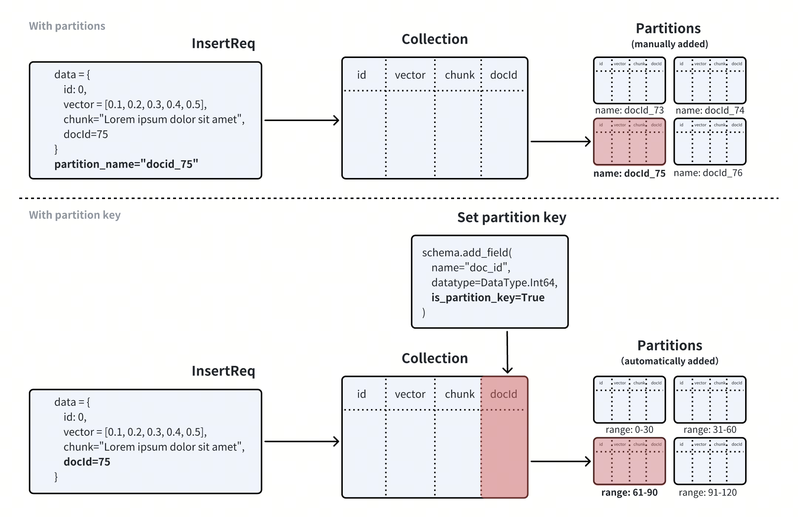
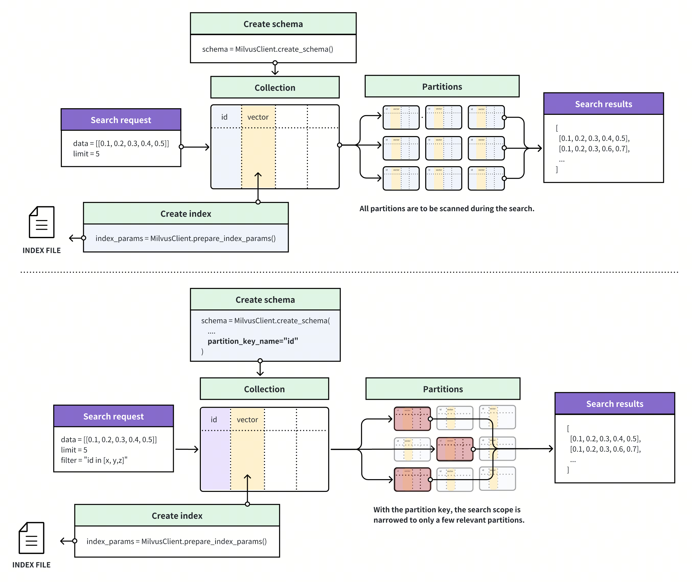
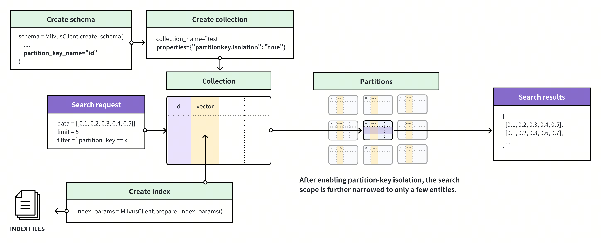

# Use Partition Key

The Partition Key is a search optimization solution based on partitions. By designating a specific scalar field as the Partition Key and specifying filtering conditions based on the Partition Key during the search, the search scope can be narrowed down to several partitions, thereby improving search efficiency. This article will introduce how to use the Partition Key and related considerations.

## Overview

In Milvus, you can use partitions to implement data segregation and improve search performance by restricting the search scope to specific partitions. If you choose to manage partitions manually, you can create a maximum of 1,024 partitions in a collection, and insert entities into these partitions based on a specific rule so that you can narrow the search scope by restricting searches within a specific number of partitions.

Milvus introduces the Partition Key for you to reuse partitions in data segregation to overcome the limit on the number of partitions you can create in a collection. When creating a collection, you can use a scalar field as the Partition Key. Once the collection is ready, Milvus creates the specified number of partitions inside the collection. Upon receiving an inserted entity, Milvus calculates a hash value using the Partition Key value of the entity, executes a modulo operation based on the hash value and the `partitions_num` property of the collection to obtain the target partition ID, and stores the entity in the target partition.



The following figure illustrates how Milvus processes the search requests in a collection with or without the Partition Key feature enabled. 

- If the Partition Key is disabled, Milvus searches for entities that are the most similar to the query vector within the collection. You can narrow the search scope if you know which partition contains the most relevant results.

- If the Partition Key is enabled, Milvus determines the search scope based on the Partition Key value specified in a search filter and scans only the entities within the partitions that match.



## Use Partition Key

To use the Partition Key, you need to

- [Set the Partition Key](use-partition-key.md#Set-Partition-Key),

- [Set the number of partitions to create](use-partition-key.md#Set-Partition-Numbers) (Optional), and

- [Create a filtering condition based on the Partition Key](use-partition-key.md#Create-Filtering-Condition).

### Set Partition Key

To designate a scalar field as the Partition Key, you need to set its `is_partition_key` attribute to `true` when you add the scalar field.

<div class="alert note">

When you set a scalar field as the Partition Key, the field values cannot be empty or null.

</div>

<div class="multipleCode">
    <a href="#python">Python</a>
    <a href="#java">Java</a>
    <a href="#go">Go</a>
    <a href="#javascript">NodeJS</a>
    <a href="#bash">cURL</a>
</div>

```python
from pymilvus import (
    MilvusClient, DataType
)

client = MilvusClient(
    uri="http://localhost:19530",
    token="root:Milvus"
)

schema = client.create_schema()

schema.add_field(field_name="id",
    datatype=DataType.INT64,
    is_primary=True)
    
schema.add_field(field_name="vector",
    datatype=DataType.FLOAT_VECTOR,
    dim=5)

# Add the partition key
schema.add_field(
    field_name="my_varchar", 
    datatype=DataType.VARCHAR, 
    max_length=512,
    # highlight-next-line
    is_partition_key=True,
)
```

```java
import io.milvus.v2.client.ConnectConfig;
import io.milvus.v2.client.MilvusClientV2;
import io.milvus.v2.common.DataType;
import io.milvus.v2.service.collection.request.AddFieldReq;
import io.milvus.v2.service.collection.request.CreateCollectionReq;

MilvusClientV2 client = new MilvusClientV2(ConnectConfig.builder()
        .uri("http://localhost:19530")
        .token("root:Milvus")
        .build());

// Create schema
CreateCollectionReq.CollectionSchema schema = client.createSchema();

schema.addField(AddFieldReq.builder()
        .fieldName("id")
        .dataType(DataType.Int64)
        .isPrimaryKey(true)
        .build());

schema.addField(AddFieldReq.builder()
        .fieldName("vector")
        .dataType(DataType.FloatVector)
        .dimension(5)
        .build());
        
// Add the partition key
schema.addField(AddFieldReq.builder()
        .fieldName("my_varchar")
        .dataType(DataType.VarChar)
        .maxLength(512)
        // highlight-next-line
        .isPartitionKey(true)
        .build());
```

```go
import (
    "context"
    "fmt"

    "github.com/milvus-io/milvus/client/v2/column"
    "github.com/milvus-io/milvus/client/v2/entity"
    "github.com/milvus-io/milvus/client/v2/index"
    "github.com/milvus-io/milvus/client/v2/milvusclient"
)

ctx, cancel := context.WithCancel(context.Background())
defer cancel()

milvusAddr := "localhost:19530"
client, err := milvusclient.New(ctx, &milvusclient.ClientConfig{
    Address: milvusAddr,
})
if err != nil {
    fmt.Println(err.Error())
    // handle error
}
defer client.Close(ctx)

schema := entity.NewSchema().WithDynamicFieldEnabled(false)
schema.WithField(entity.NewField().
    WithName("id").
    WithDataType(entity.FieldTypeInt64).
    WithIsPrimaryKey(true),
).WithField(entity.NewField().
    WithName("my_varchar").
    WithDataType(entity.FieldTypeVarChar).
    WithIsPartitionKey(true).
    WithMaxLength(512),
).WithField(entity.NewField().
    WithName("vector").
    WithDataType(entity.FieldTypeFloatVector).
    WithDim(5),
)
```

```javascript
import { MilvusClient, DataType } from "@zilliz/milvus2-sdk-node";

const address = "http://localhost:19530";
const token = "root:Milvus";
const client = new MilvusClient({address, token});

// 3. Create a collection in customized setup mode
// 3.1 Define fields
const fields = [
    {
        name: "my_varchar",
        data_type: DataType.VarChar,
        max_length: 512,
        // highlight-next-line
        is_partition_key: true
    }
]
```

```bash
export schema='{
        "autoId": true,
        "enabledDynamicField": false,
        "fields": [
            {
                "fieldName": "id",
                "dataType": "Int64",
                "isPrimary": true
            },
            {
                "fieldName": "vector",
                "dataType": "FloatVector",
                "elementTypeParams": {
                    "dim": "5"
                }
            },
            {
                "fieldName": "my_varchar",
                "dataType": "VarChar",
                "isPartitionKey": true,
                "elementTypeParams": {
                    "max_length": 512
                }
            }
        ]
    }'
```

### Set Partition Numbers

When you designate a scalar field in a collection as the Partition Key, Milvus automatically creates 16 partitions in the collection. Upon receiving an entity, Milvus chooses a partition based on the Partition Key value of this entity and stores the entity in the partition, resulting in some or all partitions holding entities with different Partition Key values. 

You can also determine the number of partitions to create along with the collection. This is valid only if you have a scalar field designated as the Partition Key.

<div class="multipleCode">
    <a href="#python">Python</a>
    <a href="#java">Java</a>
    <a href="#go">Go</a>
    <a href="#javascript">NodeJS</a>
    <a href="#bash">cURL</a>
</div>

```python
client.create_collection(
    collection_name="my_collection",
    schema=schema,
    # highlight-next-line
    num_partitions=128
)
```

```java
import io.milvus.v2.service.collection.request.CreateCollectionReq;

CreateCollectionReq createCollectionReq = CreateCollectionReq.builder()
                .collectionName("my_collection")
                .collectionSchema(schema)
                .numPartitions(128)
                .build();
        client.createCollection(createCollectionReq);
```

```go
err = client.CreateCollection(ctx,
    milvusclient.NewCreateCollectionOption("my_collection", schema).
        WithNumPartitions(128))
if err != nil {
    fmt.Println(err.Error())
    // handle error
}
```

```javascript
await client.create_collection({
    collection_name: "my_collection",
    schema: schema,
    num_partitions: 128
})
```

```bash
export params='{
    "partitionsNum": 128
}'

export CLUSTER_ENDPOINT="http://localhost:19530"
export TOKEN="root:Milvus"

curl --request POST \
--url "${CLUSTER_ENDPOINT}/v2/vectordb/collections/create" \
--header "Authorization: Bearer ${TOKEN}" \
--header "Content-Type: application/json" \
-d "{
    \"collectionName\": \"my_collection\",
    \"schema\": $schema,
    \"params\": $params
}"
```

### Create Filtering Condition

When conducting ANN searches in a collection with the Partition Key feature enabled, you need to include a filtering expression involving the Partition Key in the search request. In the filtering expression, you can restrict the Partition Key value within a specific range so that Milvus restricts the search scope within the corresponding partitions. 

When performing delete operations, It is advisable to include a filter expression that specifies a single partition key to achieve more efficient deletion. This approach limits the delete operation to a particular partition, reducing write amplification during compaction and conserving resources for compaction and indexing.

The following examples demonstrate Partition-Key-based filtering based on a specific Partition Key value and a set of Partition Key values.

<div class="multipleCode">
    <a href="#python">Python</a>
    <a href="#java">Java</a>
    <a href="#go">Go</a>
    <a href="#javascript">NodeJS</a>
    <a href="#bash">cURL</a>
</div>

```python
# Filter based on a single partition key value, or
filter='partition_key == "x" && <other conditions>'

# Filter based on multiple partition key values
filter='partition_key in ["x", "y", "z"] && <other conditions>'
```

```java
// Filter based on a single partition key value, or
String filter = "partition_key == 'x' && <other conditions>";

// Filter based on multiple partition key values
String filter = "partition_key in ['x', 'y', 'z'] && <other conditions>";
```

```go
// Filter based on a single partition key value, or
filter = "partition_key == 'x' && <other conditions>"

// Filter based on multiple partition key values
filter = "partition_key in ['x', 'y', 'z'] && <other conditions>"
```

```javascript
// Filter based on a single partition key value, or
const filter = 'partition_key == "x" && <other conditions>'

// Filter based on multiple partition key values
const filter = 'partition_key in ["x", "y", "z"] && <other conditions>'
```

```bash
# Filter based on a single partition key value, or
export filter='partition_key == "x" && <other conditions>'

# Filter based on multiple partition key values
export filter='partition_key in ["x", "y", "z"] && <other conditions>'
```

<div class="alert note">

You have to replace `partition_key` with the name of the field that is designated as the partition key.

</div>

## Use Partition Key Isolation

In the multi-tenancy scenario, you can designate the scalar field related to tenant identities as the partition key and create a filter based on a specific value in this scalar field. To further improve search performance in similar scenarios, Milvus introduces the Partition Key Isolation feature.



As shown in the above figure, Milvus groups entities based on the Partition Key value and creates a separate index for each of these groups. Upon receiving a search request, Milvus locates the index based on the Partition Key value specified in the filtering condition and restricts the search scope within the entities included in the index, thus avoiding scanning irrelevant entities during the search and greatly enhancing the search performance.

Once you have enabled Partition Key Isolation, you must include only one specific value in the Partition-key-based filter so that Milvus can restrict the search scope within the entities included in the index that match.

<div class="alert note">

Currently, the Partition-Key Isolation feature applies only to searches with the index type set to HNSW.

</div>

### Enable Partition Key Isolation

The following code examples demonstrate how to enable Partition Key Isolation.

<div class="multipleCode">
    <a href="#python">Python</a>
    <a href="#java">Java</a>
    <a href="#go">Go</a>
    <a href="#javascript">NodeJS</a>
    <a href="#bash">cURL</a>
</div>

```python
client.create_collection(
    collection_name="my_collection",
    schema=schema,
    # highlight-next-line
    properties={"partitionkey.isolation": True}
)
```

```java
import io.milvus.v2.service.collection.request.CreateCollectionReq;

Map<String, String> properties = new HashMap<>();
properties.put("partitionkey.isolation", "true");

CreateCollectionReq createCollectionReq = CreateCollectionReq.builder()
        .collectionName("my_collection")
        .collectionSchema(schema)
        .properties(properties)
        .build();
client.createCollection(createCollectionReq);
```

```go
err = client.CreateCollection(ctx,
    milvusclient.NewCreateCollectionOption("my_collection", schema).
        WithProperty("partitionkey.isolation", true))
if err != nil {
    fmt.Println(err.Error())
    // handle error
}
```

```javascript
res = await client.alterCollection({
    collection_name: "my_collection",
    properties: {
        "partitionkey.isolation": true
    }
})
```

```bash
export params='{
    "partitionKeyIsolation": true
}'

export CLUSTER_ENDPOINT="http://localhost:19530"
export TOKEN="root:Milvus"

curl --request POST \
--url "${CLUSTER_ENDPOINT}/v2/vectordb/collections/create" \
--header "Authorization: Bearer ${TOKEN}" \
--header "Content-Type: application/json" \
-d "{
    \"collectionName\": \"my_collection\",
    \"schema\": $schema,
    \"params\": $params
}"
```

Once you have enabled Partition Key Isolation, you can still set the Partition Key and number of partitions as described in [Set Partition Numbers](use-partition-key.md#Set-Partition-Numbers). Note that the Partition-Key-based filter should include only a specific Partition Key value.