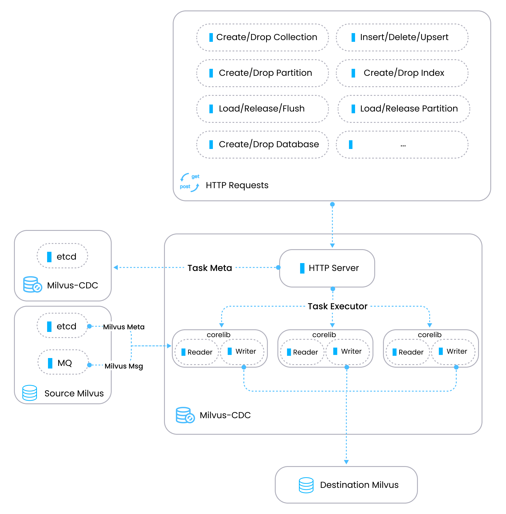
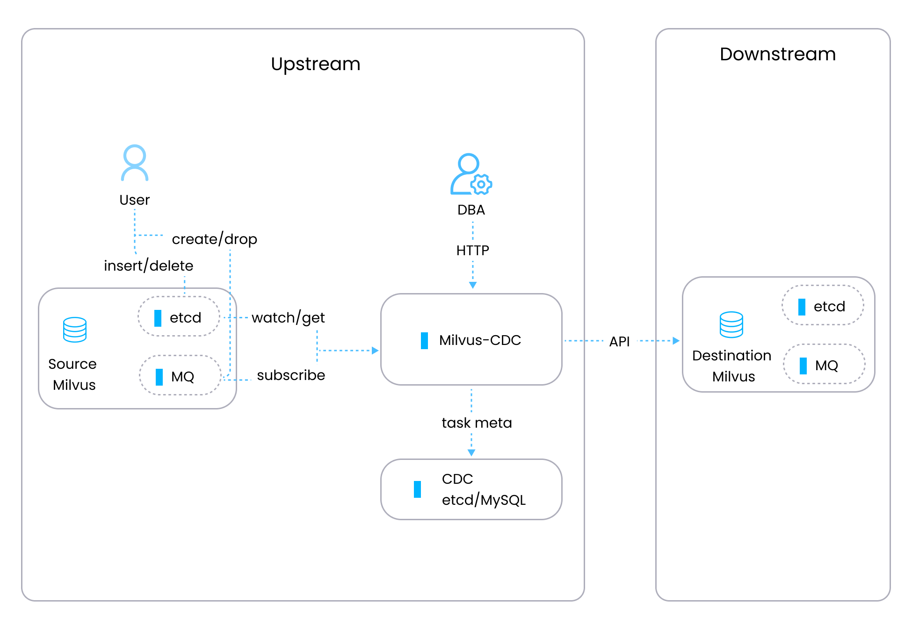

# Overview

Milvus-CDC is a user-friendly tool that can capture and synchronize incremental data in Milvus instances. It ensures the reliability of business data by seamlessly transferring it between source and target instances, allowing for easy incremental backup and disaster recovery.

## Key capabilities

- __Sequential Data Synchronization__: Ensures data integrity and consistency by synchronizing data changes sequentially between Milvus instances.

- __Incremental Data Replication__: Replicates incremental data, including insertions and deletions, from source Milvus to target Milvus, offering persistent storage.

- __CDC Task Management__: Allows for the management of CDC tasks through OpenAPI requests, including creating, querying status, and deleting CDC tasks.

Additionally, we are planning to expand our capabilities to include support for integration with stream processing systems in the future.

## Architecture

Milvus-CDC adopts an architecture with two main components - an HTTP server that manages tasks and metadata, and __corelib__ that synchronizes task execution with a reader that obtains data from the source Milvus instance and a writer that sends processed data to the target Milvus instance.

In the preceding diagram,

- __HTTP server__: Handles user requests, executes tasks, and maintains metadata. It serves as the control plane for task orchestration within the Milvus-CDC system.

- __Corelib__: Responsible for the actual synchronization of tasks. It includes a reader component that retrieves information from the source Milvus's etcd and message queue (MQ), and a writer component that translates messages from the MQ into API parameters for the Milvus system and sends these requests to the target Milvus to complete the synchronization process.

## Workflow

The Milvus-CDC data processing flow involves the following steps:

1. __Task creation__: Users initiate a CDC task via HTTP requests.

1. __Metadata retrieval__: The system fetches collection-specific metadata from the source Milvus's etcd, including channel and checkpoint information for the collection.

1. __MQ connection__: With the metadata at hand, the system connects to the MQ to begin subscribing to the data stream.

1. __Data processing__: Data from MQ is read, parsed, and either passed on using the Go SDK or processed to replicate operations performed in the source Milvus.

## Limits

- __Incremental Data Synchronization__: As of now, Milvus-CDC is designed to synchronize only incremental data. If your business requires a full data backup, please [reach out to us](https://milvus.io/community) for assistance.

- __Synchronization Scope__: Currently, Milvus-CDC can synchronize data at the cluster level. We are working on adding support for collection-level data synchronization in upcoming releases.

- __Supported API Requests__: Milvus-CDC currently supports the following API requests. We plan to extend support to additional requests in future releases:

    - Create/Drop Collection

    - Insert/Delete/Upsert

    - Create/Drop Partition

    - Create/Drop Index

    - Load/Release/Flush

    - Load/Release Partition

    - Create/Drop Database

