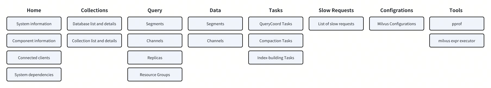
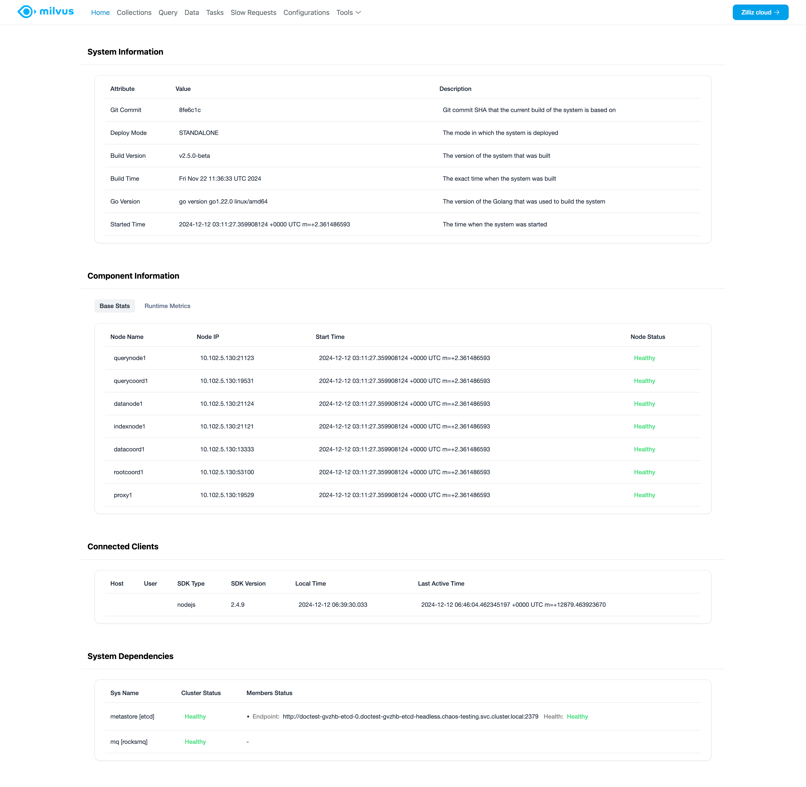
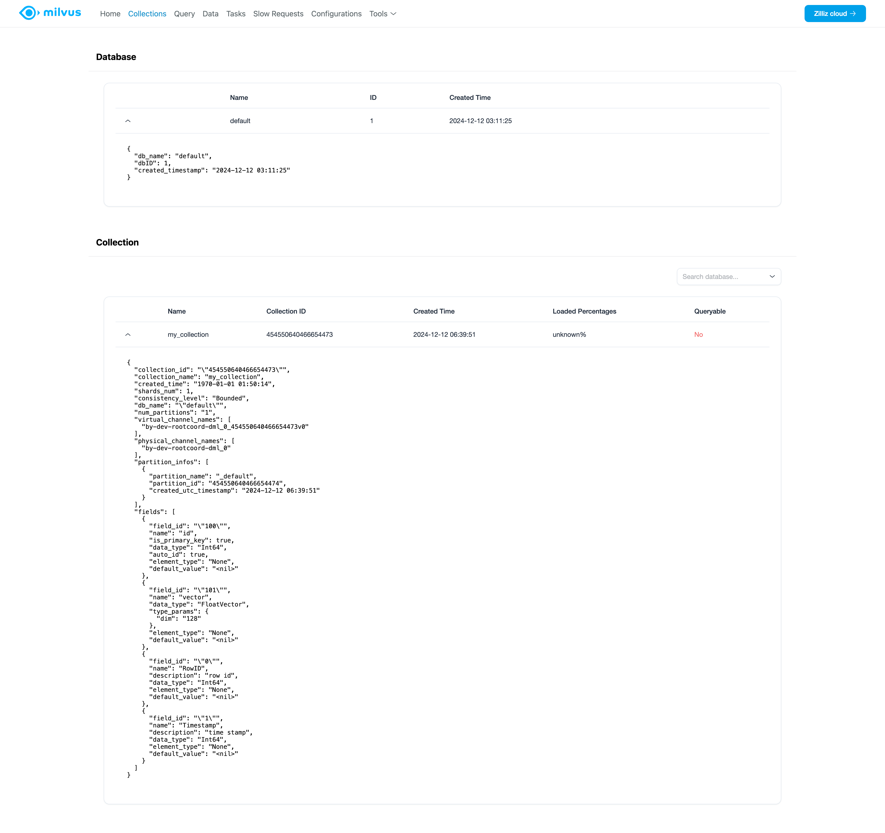
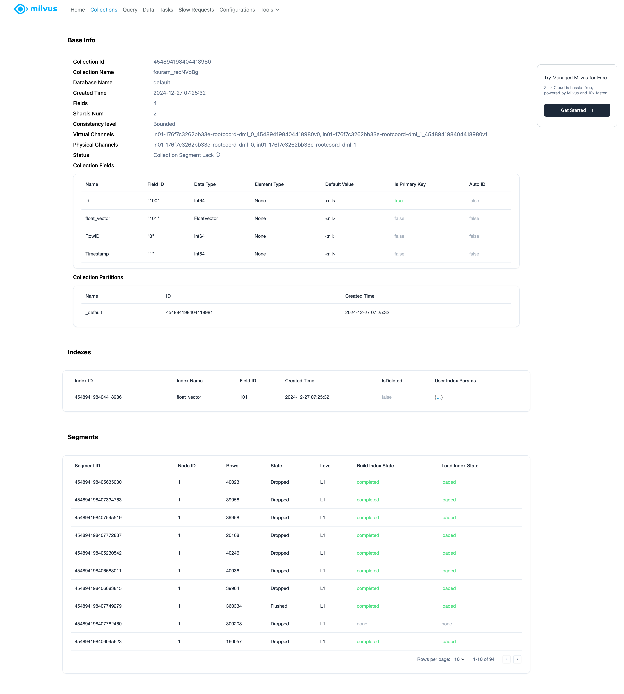
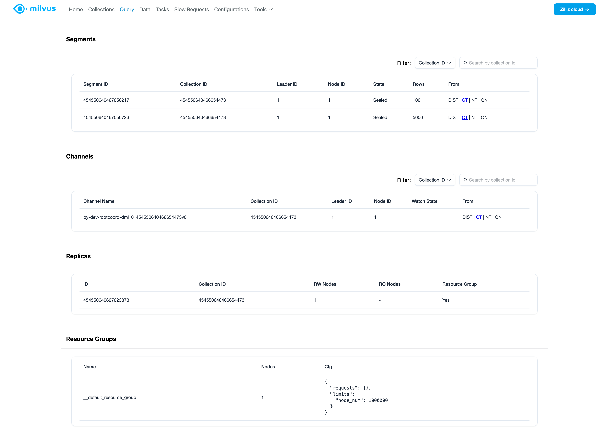
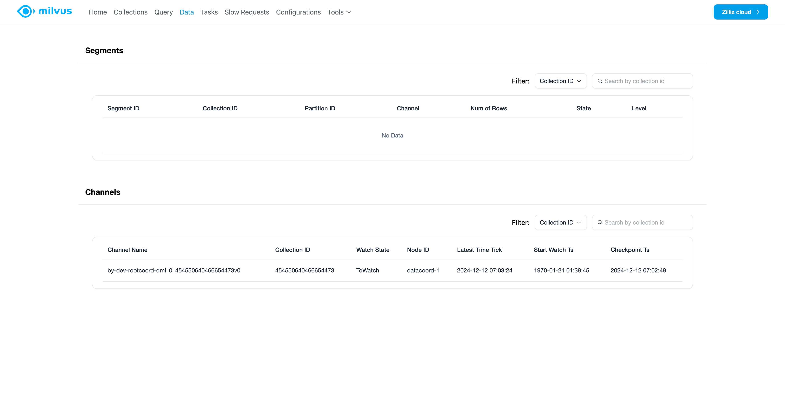
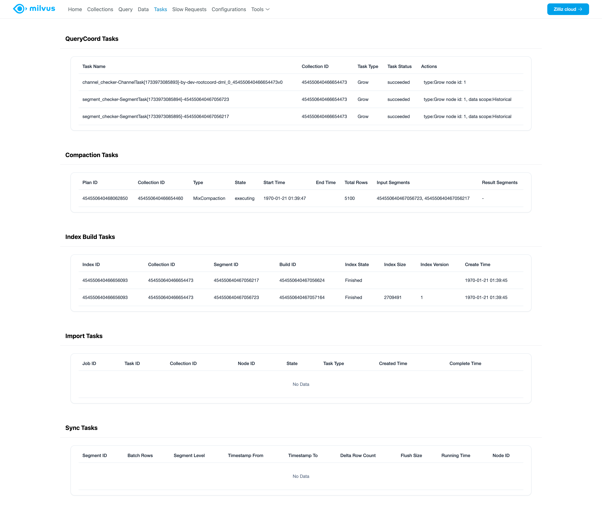
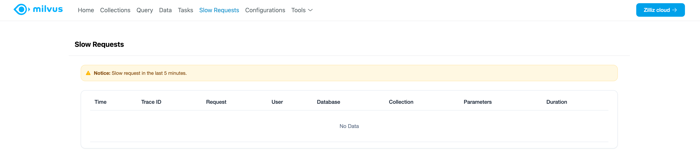
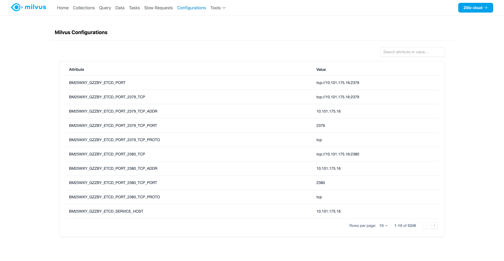

# Milvus WebUI

Milvus Web UI is a graphical management tool for Milvus. It enhances system observability with a simple and intuitive interface. You can use Milvus Web UI to observe the statistics and metrics of the components and dependencies of Milvus, check database and collection details, and list detailed Milvus configurations.

## Overview

Milvus Web UI differs from Birdwatcher and Attu in that it is a built-in tool to provide overall system observability with a simple and intuitive interface.

The following table compares the features of Milvus Web UI and Birdwatcher/Attu:

| Feature | Milvus Web UI | Birdwatcher | Attu |
| --- | --- | --- | --- |
| Operational form | GUI | CLI | GUI |
| Target users | Maintainers, developers | Maintainers | Developers |
| Installation | Built-in | Standalone tool | Standalone tool |
| Dependencies | Milvus | Milvus / etcd | Milvus |
| Primary Functionalities | Runtime environment, database/collection details, segments, channles, tasks, and slow query requests | Metadata inspection and Milvus API execution | Database management and operational tasks |
| Available since | v2.5.0 | v2.0.0 | v0.1.8 |

As of v2.5.0, you can access Milvus Web UI using the following URL on a running Milvus instance:

```
http://${MILVUS_PROXY_IP}:9091/webui
```


## Features

Milvus Web UI provides the following features:



- [Home](#Home)

    You can find information about the current running Milvus instance, its components, connected clients, and dependencies.

- [Collections](#Collections)

    You can view the list of databases and collections currently in Milvus and check their details.

- [Query](#Query)

    You can view the collected statistics of the query nodes and query coordinators in terms of segments, channels, replicas, and resource groups.

- [Data](#Data)

    You can view the collected statistics of the data nodes in terms of segments and channels.

- [Tasks](#Tasks)

    You can view the list of tasks running in Milvus, including Querycoord scheduler tasks, compaction tasks, index-building tasks, import tasks, and data synchronization tasks.

- [Slow requests](#Slow-requests)

    You can view the list of slow requests in Milvus, including the request type, request duration, and request parameters.

- [Configurations](#Configurations)

    You can view the list of Milvus configurations and their values.

- [Tools](#Tools)

    You can access the two built-in tools, pprof and Milvus data visualzation tool, from the Web UI.

## Home

On the Home page, you can find the following information:



- **System information**: View system information, including information about the deployment mode, image used in the deployment, and related information.

- **Component Information**: View the status and metrics of the components in Milvus, including the status and metrics of the query nodes, data nodes, index nodes, coordinators, and proxies.

- **Connected clients**: View the connected clients and their information, including the SDK type and version, user name, and their access history.

- **System dependencies**: View the status and metrics of the dependencies of Milvus, including the status and metrics of the meta store, message queue, and object storage.

## Collections

On the Collections page, you can view the list of databases and collections currently in Milvus and check their details.



- **Database**: View the list of databases currently in Milvus and their details.

- **Collection**: View the list of collections in each database and their details.

    You can click on a collection to view its details, including the number of fields, partitions, indexes, and other information in detail.   

    

## Query



- **Segments**: View the list of segments and their details, including the segment ID, corresponding collection, state, size, etc.

- **Channels**: View the list of channels and their details, including the channel name, corresponding collections, etc.

- **Replicas**: View the list of replicas and their details, including the replica ID, corresponding collection, etc.

- **Resource groups**: View the list of resource groups and their details, including the resource group name, number of query nodes in the group, and its configurations, etc.

## Data



- **Segments**: View the list of segments from the data nodes/coordinators and their details, including the segment ID, corresponding collection, state, size, etc.

- **Channels**: View the list of channels from the data nodes/coordinators and their details, including the channel name, corresponding collections, etc.

## Tasks



- **Tasks**: View the list of tasks running in Milvus, including the task type, state, and actions.

    - **QueryCoord Tasks**: View all QueryCoord scheduler tasks, including balancer, index/segment/channel/leader checkers in the last 15 minutes.

    - **Compaction Tasks**: View all compaction tasks from the data coordinators in the last 15 minutes.

    - **Index-Building Tasks**: View all index-building tasks from the data coordinators in the last 30 minutes.

    - **Import Tasks**: View all import tasks from the data coordinators in the last 30 minutes.

    - **Data Synchronization Tasks**: View all data synchronization tasks from the data nodes in the last 15 minutes.

## Slow requests



- **Slow requests**: A slow request is a search or a query that has a latency longer than the value of `proxy.slowQuerySpanInSeconds` specified in the configuration. The list of slow requests displays all slow requests in the last 15 minutes.

## Configurations



- **Configurations**: View the list of Milvus runtime configurations and their values.

## Tools

- **pprof**: Access the pprof tool for profiling and debugging Milvus.

- **Milvus data visualization tool**: Access the Milvus data visualization tool for visualizing the data in Milvus.
