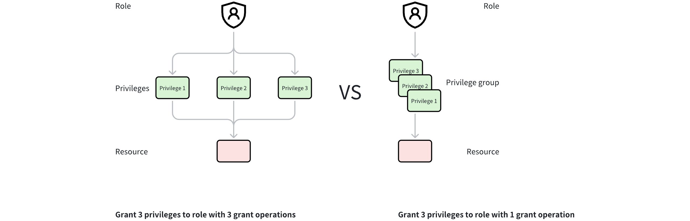

# Create Privilege Group

To streamline the process of granting privileges, it is recommended that you combine multiple privileges into a privilege group.

## Privilege group vs. privileges

A privilege group consists of multiple privileges.



As shown in the figure above, suppose you need to grant three different privileges to a role.

- If you do not use a privilege group, you need to grant the privileges three times.

- If you use a privilege group, you only need to create a privilege group and add the three privileges to this privilege group and grant the privilege group to Role A.

By using a privilege group, you can grant multiple privileges in bulk to a role.

## Built-in privilege groups

For ease-of-use, Milvus provides a total of 9 built-in privileges on the collection, database, and instance level: COLL_RO, COLL_RW, COLL_ADMIN, DB_RO, DB_RW, DB_Admin, Cluster_RO, Cluster_RW and Cluster_Admin.

<div class="alert note">

The three levels of built-in privilege groups do not have a cascading relationship. Setting a privilege group at the instance level does not automatically set permissions for all databases and collections under that instance. Privileges at the database and collection levels need to be set manually.

</div>

The following tables explains the privileges includes in each of the built-in privilege group.

### Collection level

- **CollectionReadOnly (COLL_RO)**: includes privileges to read collection data

- **CollectionReadWrite (COLL_RW)**: includes privileges to read and write collection data

- **CollectionAdmin (COLL_ADMIN)**: includes privileges to read and write collection data and manage collections.

The table below lists the specific privileges included in the three built-in privilege groups at the collection level:

<table>
   <tr>
     <th><p><strong>Privilege</strong></p></th>
     <th><p><strong>CollectionReadOnly</strong></p></th>
     <th><p><strong>CollectionReadWrite</strong></p></th>
     <th><p><strong>CollectionAdmin</strong></p></th>
   </tr>
   <tr>
     <td><p>Query</p></td>
     <td><p>✔️</p></td>
     <td><p>✔️</p></td>
     <td><p>✔️</p></td>
   </tr>
   <tr>
     <td><p>Search</p></td>
     <td><p>✔️</p></td>
     <td><p>✔️</p></td>
     <td><p>✔️</p></td>
   </tr>
   <tr>
     <td><p>IndexDetail</p></td>
     <td><p>✔️</p></td>
     <td><p>✔️</p></td>
     <td><p>✔️</p></td>
   </tr>
   <tr>
     <td><p>GetFlushState</p></td>
     <td><p>✔️</p></td>
     <td><p>✔️</p></td>
     <td><p>✔️</p></td>
   </tr>
   <tr>
     <td><p>GetLoadState</p></td>
     <td><p>✔️</p></td>
     <td><p>✔️</p></td>
     <td><p>✔️</p></td>
   </tr>
   <tr>
     <td><p>GetLoadingProgress</p></td>
     <td><p>✔️</p></td>
     <td><p>✔️</p></td>
     <td><p>✔️</p></td>
   </tr>
   <tr>
     <td><p>HasPartition</p></td>
     <td><p>✔️</p></td>
     <td><p>✔️</p></td>
     <td><p>✔️</p></td>
   </tr>
   <tr>
     <td><p>ShowPartitions</p></td>
     <td><p>✔️</p></td>
     <td><p>✔️</p></td>
     <td><p>✔️</p></td>
   </tr>
   <tr>
     <td><p>ListAliases</p></td>
     <td><p>✔️</p></td>
     <td><p>✔️</p></td>
     <td><p>✔️</p></td>
   </tr>
   <tr>
     <td><p>DescribeCollection</p></td>
     <td><p>✔️</p></td>
     <td><p>✔️</p></td>
     <td><p>✔️</p></td>
   </tr>
   <tr>
     <td><p>DescribeAlias</p></td>
     <td><p>✔️</p></td>
     <td><p>✔️</p></td>
     <td><p>✔️</p></td>
   </tr>
   <tr>
     <td><p>GetStatistics</p></td>
     <td><p>✔️</p></td>
     <td><p>✔️</p></td>
     <td><p>✔️</p></td>
   </tr>
   <tr>
     <td><p>CreateIndex</p></td>
     <td><p>❌</p></td>
     <td><p>✔️</p></td>
     <td><p>✔️</p></td>
   </tr>
   <tr>
     <td><p>DropIndex</p></td>
     <td><p>❌</p></td>
     <td><p>✔️</p></td>
     <td><p>✔️</p></td>
   </tr>
   <tr>
     <td><p>CreatePartition</p></td>
     <td><p>❌</p></td>
     <td><p>✔️</p></td>
     <td><p>✔️</p></td>
   </tr>
   <tr>
     <td><p>DropPartition</p></td>
     <td><p>❌</p></td>
     <td><p>✔️</p></td>
     <td><p>✔️</p></td>
   </tr>
   <tr>
     <td><p>Load</p></td>
     <td><p>❌</p></td>
     <td><p>✔️</p></td>
     <td><p>✔️</p></td>
   </tr>
   <tr>
     <td><p>Release</p></td>
     <td><p>❌</p></td>
     <td><p>✔️</p></td>
     <td><p>✔️</p></td>
   </tr>
   <tr>
     <td><p>Insert</p></td>
     <td><p>❌</p></td>
     <td><p>✔️</p></td>
     <td><p>✔️</p></td>
   </tr>
   <tr>
     <td><p>Delete</p></td>
     <td><p>❌</p></td>
     <td><p>✔️</p></td>
     <td><p>✔️</p></td>
   </tr>
   <tr>
     <td><p>Upsert</p></td>
     <td><p>❌</p></td>
     <td><p>✔️</p></td>
     <td><p>✔️</p></td>
   </tr>
   <tr>
     <td><p>Import</p></td>
     <td><p>❌</p></td>
     <td><p>✔️</p></td>
     <td><p>✔️</p></td>
   </tr>
   <tr>
     <td><p>Flush</p></td>
     <td><p>❌</p></td>
     <td><p>✔️</p></td>
     <td><p>✔️</p></td>
   </tr>
   <tr>
     <td><p>Compaction</p></td>
     <td><p>❌</p></td>
     <td><p>✔️</p></td>
     <td><p>✔️</p></td>
   </tr>
   <tr>
     <td><p>LoadBalance</p></td>
     <td><p>❌</p></td>
     <td><p>✔️</p></td>
     <td><p>✔️</p></td>
   </tr>
   <tr>
     <td><p>CreateAlias</p></td>
     <td><p>❌</p></td>
     <td><p>❌</p></td>
     <td><p>✔️</p></td>
   </tr>
   <tr>
     <td><p>DropAlias</p></td>
     <td><p>❌</p></td>
     <td><p>❌</p></td>
     <td><p>✔️</p></td>
   </tr>
</table>

### Database level

- **DatabaseReadOnly (DB_RO)**: includes privileges to read database data

- **DatabaseReadWrite (DB_RW)**: includes privileges to read and write database data

- **DatabaseAdmin (DB_Admin)**: includes privileges to read and write database data and manage databases.

The table below lists the specific privileges included in the three built-in privilege groups at the database level:

<table>
   <tr>
     <th><p><strong>Privilege</strong></p></th>
     <th><p><strong>DatabaseReadOnly</strong></p></th>
     <th><p><strong>DatabaseReadWrite</strong></p></th>
     <th><p><strong>DatabaseAdmin</strong></p></th>
   </tr>
   <tr>
     <td><p>ShowCollections</p></td>
     <td><p>✔️</p></td>
     <td><p>✔️</p></td>
     <td><p>✔️</p></td>
   </tr>
   <tr>
     <td><p>DescribeDatabase</p></td>
     <td><p>✔️</p></td>
     <td><p>✔️</p></td>
     <td><p>✔️</p></td>
   </tr>
   <tr>
     <td><p>CreateCollection</p></td>
     <td><p>❌</p></td>
     <td><p>❌</p></td>
     <td><p>✔️</p></td>
   </tr>
   <tr>
     <td><p>DropCollection</p></td>
     <td><p>❌</p></td>
     <td><p>❌</p></td>
     <td><p>✔️</p></td>
   </tr>
   <tr>
     <td><p>AlterDatabase</p></td>
     <td><p>❌</p></td>
     <td><p>✔️</p></td>
     <td><p>✔️</p></td>
   </tr>
</table>

### Cluster level

- **ClusterReadOnly (Cluster_RO)**: includes privileges to read instance data

- **ClusterReadWrite (Cluster_RW)**: includes privileges to read and write instance data

- **ClusterAdmin (Cluster_Admin)**: includes privileges to read and write instance data and manage instances.

The table below lists the specific privileges included in the three built-in privilege groups at the instance level:

<table>
   <tr>
     <th><p><strong>Privilege</strong></p></th>
     <th><p><strong>ClusterReadOnly</strong></p></th>
     <th><p><strong>ClusterReadWrite</strong></p></th>
     <th><p><strong>ClusterAdmin</strong></p></th>
   </tr>
   <tr>
     <td><p>ListDatabases</p></td>
     <td><p>✔️</p></td>
     <td><p>✔️</p></td>
     <td><p>✔️</p></td>
   </tr>
   <tr>
     <td><p>RenameCollection</p></td>
     <td><p>❌</p></td>
     <td><p>❌</p></td>
     <td><p>✔️</p></td>
   </tr>
   <tr>
     <td><p>CreateOwnership</p></td>
     <td><p>❌</p></td>
     <td><p>❌</p></td>
     <td><p>✔️</p></td>
   </tr>
   <tr>
     <td><p>UpdateUser</p></td>
     <td><p>❌</p></td>
     <td><p>❌</p></td>
     <td><p>✔️</p></td>
   </tr>
   <tr>
     <td><p>DropOwnership</p></td>
     <td><p>❌</p></td>
     <td><p>❌</p></td>
     <td><p>✔️</p></td>
   </tr>
   <tr>
     <td><p>SelectOwnership</p></td>
     <td><p>✔️</p></td>
     <td><p>✔️</p></td>
     <td><p>✔️</p></td>
   </tr>
   <tr>
     <td><p>ManageOwnership</p></td>
     <td><p>❌</p></td>
     <td><p>❌</p></td>
     <td><p>✔️</p></td>
   </tr>
   <tr>
     <td><p>SelectUser</p></td>
     <td><p>✔️</p></td>
     <td><p>✔️</p></td>
     <td><p>✔️</p></td>
   </tr>
   <tr>
     <td><p>BackupRBAC</p></td>
     <td><p>❌</p></td>
     <td><p>❌</p></td>
     <td><p>✔️</p></td>
   </tr>
   <tr>
     <td><p>RestoreRBAC</p></td>
     <td><p>❌</p></td>
     <td><p>❌</p></td>
     <td><p>✔️</p></td>
   </tr>
   <tr>
     <td><p>CreateResourceGroup</p></td>
     <td><p>❌</p></td>
     <td><p>❌</p></td>
     <td><p>✔️</p></td>
   </tr>
   <tr>
     <td><p>DropResourceGroup</p></td>
     <td><p>❌</p></td>
     <td><p>❌</p></td>
     <td><p>✔️</p></td>
   </tr>
   <tr>
     <td><p>UpdateResourceGroups</p></td>
     <td><p>❌</p></td>
     <td><p>✔️</p></td>
     <td><p>✔️</p></td>
   </tr>
   <tr>
     <td><p>DescribeResourceGroup</p></td>
     <td><p>✔️</p></td>
     <td><p>✔️</p></td>
     <td><p>✔️</p></td>
   </tr>
   <tr>
     <td><p>ListResourceGroups</p></td>
     <td><p>✔️</p></td>
     <td><p>✔️</p></td>
     <td><p>✔️</p></td>
   </tr>
   <tr>
     <td><p>TransferNode</p></td>
     <td><p>❌</p></td>
     <td><p>✔️</p></td>
     <td><p>✔️</p></td>
   </tr>
   <tr>
     <td><p>TransferReplica</p></td>
     <td><p>❌</p></td>
     <td><p>✔️</p></td>
     <td><p>✔️</p></td>
   </tr>
   <tr>
     <td><p>CreateDatabase</p></td>
     <td><p>❌</p></td>
     <td><p>❌</p></td>
     <td><p>✔️</p></td>
   </tr>
   <tr>
     <td><p>DropDatabase</p></td>
     <td><p>❌</p></td>
     <td><p>❌</p></td>
     <td><p>✔️</p></td>
   </tr>
   <tr>
     <td><p>FlushAll</p></td>
     <td><p>❌</p></td>
     <td><p>✔️</p></td>
     <td><p>✔️</p></td>
   </tr>
   <tr>
     <td><p>CreatePrivilegeGroup</p></td>
     <td><p>❌</p></td>
     <td><p>❌</p></td>
     <td><p>✔️</p></td>
   </tr>
   <tr>
     <td><p>DropPrivilegeGroup</p></td>
     <td><p>❌</p></td>
     <td><p>❌</p></td>
     <td><p>✔️</p></td>
   </tr>
   <tr>
     <td><p>ListPrivilegeGroups</p></td>
     <td><p>❌</p></td>
     <td><p>❌</p></td>
     <td><p>✔️</p></td>
   </tr>
   <tr>
     <td><p>OperatePrivilegeGroup</p></td>
     <td><p>❌</p></td>
     <td><p>❌</p></td>
     <td><p>✔️</p></td>
   </tr>
</table>

## Procedures

You can create a privilege group and then add privileges to the privilege group. 

### Create a privilege group

The following example demonstrates how to create a privilege group named `privilege_group_1`.

<div class="multipleCode">
    <a href="#python">Python</a>
    <a href="#go">Go</a>
    <a href="#java">Java</a>
    <a href="#javascript">NodeJS</a>
    <a href="#bash">cURL</a>
</div>

```python
from pymilvus import MilvusClient
client.create_privilege_group(group_name='privilege_group_1'）
```

```go
import "github.com/milvus-io/milvus/client/v2/milvusclient"

err = client.CreatePrivilegeGroup(ctx, milvusclient.NewCreatePrivilegeGroupOption("privilege_group_1"))
if err != nil {
    fmt.Println(err.Error())
    // handle error
}
```

```java
import io.milvus.v2.service.rbac.request.CreatePrivilegeGroupReq;

client.createPrivilegeGroup(CreatePrivilegeGroupReq.builder()
        .groupName("privilege_group_1")
        .build());
```

```javascript
await client.createPrivilegeGroup({
  group_name: 'privilege_group_1',
});
```

```bash
curl --request POST \
--url "${CLUSTER_ENDPOINT}/v2/vectordb/privilege_groups/create" \
--header "Authorization: Bearer ${TOKEN}" \
--header "Content-Type: application/json" \
-d '{
    "privilegeGroupName":"privilege_group_1"
}'
```

### Add privileges to a privilege group

The following example demonstrates how to add privileges `PrivilegeBackupRBAC` and `PrivilegeRestoreRBAC` to the privilege group `privilege_group_1` that is just created.

<div class="multipleCode">
    <a href="#python">Python</a>
    <a href="#go">Go</a>
    <a href="#java">Java</a>
    <a href="#javascript">NodeJS</a>
    <a href="#bash">cURL</a>
</div>

```python
from pymilvus import MilvusClient
client.add_privileges_to_group(group_name='privilege_group_1', privileges=['Query', 'Search'])
```

```go
import "github.com/milvus-io/milvus/client/v2/milvusclient"

privileges := []string{"Query", "Search"}
err = client.AddPrivilegesToGroup(ctx, milvusclient.NewAddPrivilegesToGroupOption("privilege_group_1", privileges...))
if err != nil {
    fmt.Println(err.Error())
    // handle error
}
```

```java
import io.milvus.v2.service.rbac.request.AddPrivilegesToGroupReq;

client.addPrivilegesToGroup(AddPrivilegesToGroupReq.builder()
        .groupName("privilege_group_1")
        .privileges(Arrays.asList("Query", "Search"))
        .build());
```

```javascript
await client.addPrivilegesToGroup({
  group_name: privilege_group_1,
  privileges: ['Query', 'Search'],
});

```

```bash
curl --request POST \
--url "${CLUSTER_ENDPOINT}/v2/vectordb/privilege_groups/add_privileges_to_group" \
--header "Authorization: Bearer ${TOKEN}" \
--header "Content-Type: application/json" \
-d '{
    "privilegeGroupName":"privilege_group_1",
    "privileges":["Query", "Search"]
}'
```

### Remove privileges from a privilege group

The following example demonstrates how to remove the privilege `PrivilegeRestoreRBAC` from the privilege group `privilege_group_1`.

<div class="multipleCode">
    <a href="#python">Python</a>
    <a href="#go">Go</a>
    <a href="#java">Java</a>
    <a href="#javascript">NodeJS</a>
    <a href="#bash">cURL</a>
</div>

```python
from pymilvus import MilvusClient
client.remove_privileges_from_group(group_name='privilege_group_1', privileges='Search')
```

```go
import "github.com/milvus-io/milvus/client/v2/milvusclient"

err = client.RemovePrivilegesFromGroup(ctx, milvusclient.NewRemovePrivilegesFromGroupOption("privilege_group_1", []string{"Search"}...))
if err != nil {
    fmt.Println(err.Error())
    // handle error
}
```

```java
import io.milvus.v2.service.rbac.request.RemovePrivilegesFromGroupReq;

client.removePrivilegesFromGroup(RemovePrivilegesFromGroupReq.builder()
        .groupName("privilege_group_1")
        .privileges(Collections.singletonList("Search"))
        .build());
```

```javascript
await client.removePrivilegesFromGroup({
  group_name: "privilege_group_1",
  privileges: ["Search"],
});
```

```bash
curl --request POST \
--url "${CLUSTER_ENDPOINT}/v2/vectordb/privilege_groups/remove_privileges_from_group" \
--header "Authorization: Bearer ${TOKEN}" \
--header "Content-Type: application/json" \
-d '{
    "privilegeGroupName":"privilege_group_1",
    "privileges":["Search"]
}'
```

### List privilege groups

The following example demonstrates how to list all existing privilege groups.

<div class="multipleCode">
    <a href="#python">Python</a>
    <a href="#go">Go</a>
    <a href="#java">Java</a>
    <a href="#javascript">NodeJS</a>
    <a href="#bash">cURL</a>
</div>

```python
from pymilvus import MilvusClient
client.list_privilege_groups()
```

```go
import "github.com/milvus-io/milvus/client/v2/milvusclient"

groups, err := client.ListPrivilegeGroups(ctx, milvusclient.NewListPrivilegeGroupsOption())
if err != nil {
    fmt.Println(err.Error())
    // handle error
}
```

```java
import io.milvus.v2.service.rbac.PrivilegeGroup;
import io.milvus.v2.service.rbac.request.ListPrivilegeGroupsReq;
import io.milvus.v2.service.rbac.response.ListPrivilegeGroupsResp;

ListPrivilegeGroupsResp resp = client.listPrivilegeGroups(ListPrivilegeGroupsReq.builder()
        .build());
List<PrivilegeGroup> groups = resp.getPrivilegeGroups();
```

```javascript
await client.listPrivilegeGroups();
```

```bash
curl --request POST \
--url "${CLUSTER_ENDPOINT}/v2/vectordb/privilege_groups/list" \
--header "Authorization: Bearer ${TOKEN}" \
--header "Content-Type: application/json" \
-d '{}'
```

Below is an example output.

```bash
PrivilegeGroupItem: <privilege_group:privilege_group_1>, <privileges:('Search', 'Query')>
```

### Drop a privilege group

The following example demonstrates how to drop the privilege group `privilege_group_1`.

<div class="multipleCode">
    <a href="#python">Python</a>
    <a href="#go">Go</a>
    <a href="#java">Java</a>
    <a href="#javascript">NodeJS</a>
    <a href="#bash">cURL</a>
</div>

```python
from pymilvus import MilvusClient
client.drop_privilege_group(group_name='privilege_group_1')
```

```go
import "github.com/milvus-io/milvus/client/v2/milvusclient"

err = client.DropPrivilegeGroup(ctx, milvusclient.NewDropPrivilegeGroupOption("privilege_group_1"))
if err != nil {
    fmt.Println(err.Error())
    // handle error
}
```

```java
import io.milvus.v2.service.rbac.request.DropPrivilegeGroupReq;

client.dropPrivilegeGroup(DropPrivilegeGroupReq.builder()
        .groupName("privilege_group_1")
        .build());
```

```javascript
await client.dropPrivilegeGroup({group_name: 'privilege_group_1'});
```

```bash
curl --request POST \
--url "${CLUSTER_ENDPOINT}/v2/vectordb/privilege_groups/drop" \
--header "Authorization: Bearer ${TOKEN}" \
--header "Content-Type: application/json" \
-d '{
    "privilegeGroupName":"privilege_group_1"
}'
```

