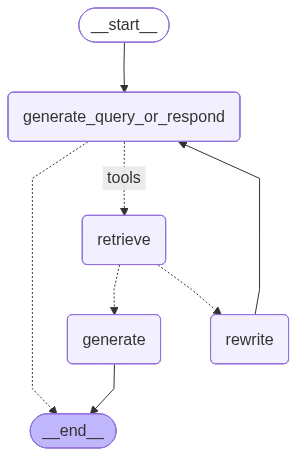

<a href="https://colab.research.google.com/github/milvus-io/bootcamp/blob/master/integration/langchain/agentic_rag_with_milvus_and_langgraph.ipynb" target="_parent">
    
</a>
<a href="https://github.com/milvus-io/bootcamp/blob/master/integration/langchain/agentic_rag_with_milvus_and_langgraph.ipynb" target="_blank">
    
</a>

# Agentic RAG with Milvus and LangGraph

This guide demonstrates how to build an advanced Retrieval-Augmented Generation (RAG) system using LangGraph and Milvus. Unlike traditional RAG systems that simply retrieve and generate, agentic RAG systems can make intelligent decisions about when to retrieve information, how to handle irrelevant documents, and when to rewrite queries for better results.


[LangGraph](https://langchain-ai.github.io/langgraph/) is a library for building stateful, multi-actor applications with LLMs, built on top of LangChain. [Milvus](https://milvus.io/) is the world's most advanced open-source vector database, built to power embedding similarity search and AI applications.

In this tutorial, we will build an agentic RAG system that can:
- Decide whether to retrieve documents or respond directly to simple queries
- Grade retrieved documents for relevance
- Rewrite questions when retrieved documents are not relevant
- Generate high-quality answers based on relevant context

## Prerequisites

Before running this notebook, make sure you have the following dependencies installed:


```shell
$ pip install --upgrade langchain langchain-core langchain-community langchain-text-splitters langgraph langchain-milvus milvus-lite langchain-openai bs4
```

> If you are using Google Colab, to enable dependencies just installed, you may need to **restart the runtime** (click on the "Runtime" menu at the top of the screen, and select "Restart session" from the dropdown menu).

We will use the models from OpenAI. You should prepare the [api key](https://platform.openai.com/docs/quickstart) `OPENAI_API_KEY` as an environment variable.


```python
import os

os.environ["OPENAI_API_KEY"] = "sk-***********"
```

## Prepare the data

We use the Langchain [WebBaseLoader](https://python.langchain.com/docs/integrations/document_loaders/web_base/) to load documents from [Lilian Weng's blog posts](https://lilianweng.github.io/) and split them into chunks using the [RecursiveCharacterTextSplitter](https://python.langchain.com/docs/how_to/recursive_text_splitter/).


```python
from langchain_community.document_loaders import WebBaseLoader
from langchain_text_splitters import RecursiveCharacterTextSplitter

# Load blog posts about AI topics
urls = [
    "https://lilianweng.github.io/posts/2023-06-23-agent/",
    "https://lilianweng.github.io/posts/2023-03-15-prompt-engineering/",
    "https://lilianweng.github.io/posts/2023-10-25-adv-attack-llm/",
]

# Load documents
docs = [WebBaseLoader(url).load() for url in urls]
docs_list = [item for sublist in docs for item in sublist]

# Split documents into chunks
text_splitter = RecursiveCharacterTextSplitter.from_tiktoken_encoder(
    chunk_size=1000, chunk_overlap=200
)
doc_splits = text_splitter.split_documents(docs_list)

# Let's see how many document chunks we have
print(f"Total document chunks: {len(doc_splits)}")
```

    USER_AGENT environment variable not set, consider setting it to identify your requests.


    Total document chunks: 47


## Create a retriever tool with Milvus

Now we'll create a vector store using Milvus to index our document chunks and create a retriever tool that our agent can use.


```python
from langchain_milvus import Milvus
from langchain_openai import OpenAIEmbeddings
from langchain.tools.retriever import create_retriever_tool

# Initialize embeddings
embeddings = OpenAIEmbeddings()

# Create Milvus vector store
vectorstore = Milvus.from_documents(
    documents=doc_splits,
    embedding=embeddings,
    connection_args={
        "uri": "./milvus_agentic_rag.db",
    },
    drop_old=True,
)

# Create retriever
retriever = vectorstore.as_retriever(search_kwargs={"k": 3})

# Create retriever tool
retriever_tool = create_retriever_tool(
    retriever,
    "retrieve_blog_posts",
    "Search and return information about AI agents, prompt engineering, and adversarial attacks on LLMs from Lilian Weng's blog posts.",
)

# Test the retriever tool
print(retriever_tool.invoke({"query": "What is Tree of Thought strategy?"})[:1000])
```

    2025-10-23 15:03:26,670 [DEBUG][_create_connection]: Created new connection using: 0591f8d30be84e7e9b12ad3fc2a63650 (async_milvus_client.py:599)


    How Self-Ask works with external search queries.(Image source: Press et al. 2022).
    
    
    Tree of Thoughts (Yao et al. 2023) extends CoT by exploring multiple reasoning possibilities at each step. It first decomposes the problem into multiple thought steps and generates multiple thoughts per step, essentially creating a tree structure. The search process can be BFS or DFS while each state is evaluated by a classifier (via a prompt) or majority vote.
    
    
    
    How Self-Ask works with external search queries.(Image source: Yao et al. 2022).
    
    Automatic Prompt Design#
    Prompt is a sequence of prefix tokens that increase the probability of getting  desired output given input. Therefore we can treat them as trainable parameters and optimize them directly on the embedding space via gradient descent, such as AutoPrompt (Shin et al., 2020, Prefix-Tuning (Li & Liang (2021)), P-tuning (Liu et al. 2021) and Prompt-Tuning (Lester et al. 2021). This section in my “Controllable Neural Text Generation” post has a 


> For the `connection_args`:
> - Setting the `uri` as a local file, e.g.`./milvus_agentic_rag.db`, is the most convenient method, as it automatically utilizes [Milvus Lite](https://milvus.io/docs/milvus_lite.md) to store all data in this file.
> - If you have large scale of data, you can set up a more performant Milvus server on [docker or kubernetes](https://milvus.io/docs/quickstart.md). In this setup, please use the server uri, e.g.`http://localhost:19530`, as your `uri`.
> - If you want to use [Zilliz Cloud](https://zilliz.com/cloud), the fully managed cloud service for Milvus, adjust the `uri` and `token`, which correspond to the [Public Endpoint and Api key](https://docs.zilliz.com/docs/on-zilliz-cloud-console#free-cluster-details) in Zilliz Cloud.

## Build the agentic RAG graph

### Define the graph state

We'll use LangGraph's `MessagesState` which maintains a list of messages in the conversation.


```python
from langgraph.graph import MessagesState
from langchain_openai import ChatOpenAI

# Initialize the language model
llm = ChatOpenAI(model="gpt-4o-mini", temperature=0)
```

### Node 1: Generate query or respond

This node decides whether to use the retriever tool to search for information or respond directly to the user.


```python
def generate_query_or_respond(state: MessagesState):
    """
    Decide whether to retrieve information or respond directly.

    Args:
        state: Current graph state with messages

    Returns:
        Updated state with the model's response
    """
    response = llm.bind_tools([retriever_tool]).invoke(state["messages"])
    return {"messages": [response]}


# Test with a simple greeting
test_state = {"messages": [{"role": "user", "content": "Hello!"}]}
result = generate_query_or_respond(test_state)
print("Response to greeting:", result["messages"][-1].content)

# Test with a question that needs retrieval
test_state = {
    "messages": [
        {
            "role": "user",
            "content": "What is Chain of Thought prompting and how does it work?",
        }
    ]
}
result = generate_query_or_respond(test_state)
if hasattr(result["messages"][-1], "tool_calls") and result["messages"][-1].tool_calls:
    print("Model decided to use retrieval tool")
    print("Tool call:", result["messages"][-1].tool_calls[0])
```

    Response to greeting: Hello! How can I assist you today?
    Model decided to use retrieval tool
    Tool call: {'name': 'retrieve_blog_posts', 'args': {'query': 'Chain of Thought prompting'}, 'id': 'call_UI804LXgqZ3Y7qFvdsWFuKZH', 'type': 'tool_call'}


### Node 2: Grade documents

This node evaluates whether the retrieved documents are relevant to the user's question.


```python
from pydantic import BaseModel, Field
from typing import Literal


class GradeDocuments(BaseModel):
    """Binary score for relevance check on retrieved documents."""

    binary_score: str = Field(
        description="Documents are relevant to the question, 'yes' or 'no'"
    )


def grade_documents(state: MessagesState) -> Literal["generate", "rewrite"]:
    """
    Determines whether the retrieved documents are relevant to the question.

    Args:
        state: Current graph state with messages

    Returns:
        Decision to generate answer or rewrite question
    """
    print("---CHECK DOCUMENT RELEVANCE TO QUESTION---")

    # Get the question and retrieved documents
    question = state["messages"][0].content
    docs = state["messages"][-1].content

    # Create structured LLM grader
    structured_llm_grader = llm.with_structured_output(GradeDocuments)

    # Grade prompt
    grade_prompt = f"""You are a grader assessing relevance of a retrieved document to a user question.
    
    Retrieved document:
    {docs}
    
    User question:
    {question}
    
    If the document contains keyword(s) or semantic meaning related to the user question, grade it as relevant.
    Give a binary score 'yes' or 'no' to indicate whether the document is relevant to the question."""

    score = structured_llm_grader.invoke(
        [{"role": "user", "content": grade_prompt}]
    ).binary_score

    if score == "yes":
        print("---DECISION: DOCS RELEVANT---")
        return "generate"
    else:
        print("---DECISION: DOCS NOT RELEVANT---")
        return "rewrite"
```

### Node 3: Rewrite question

If documents are not relevant, this node rewrites the question to improve retrieval results.


```python
def rewrite_question(state: MessagesState):
    """
    Transform the query to produce a better question.

    Args:
        state: Current graph state with messages

    Returns:
        Updated state with rewritten question
    """
    print("---TRANSFORM QUERY---")

    question = state["messages"][0].content

    rewrite_prompt = f"""You are an expert at query expansion and transformation.
    
    Look at the input question and try to reason about the underlying semantic intent / meaning.
    
    Here is the initial question:
    {question}
    
    Formulate an improved question that will retrieve better documents from a vector database:"""

    response = llm.invoke([{"role": "user", "content": rewrite_prompt}])

    return {"messages": [{"role": "user", "content": response.content}]}
```

### Node 4: Generate answer

This node generates the final answer based on the retrieved relevant documents.


```python
def generate(state: MessagesState):
    """
    Generate answer based on retrieved documents.

    Args:
        state: Current graph state with messages

    Returns:
        Updated state with generated answer
    """
    print("---GENERATE ANSWER---")

    question = state["messages"][0].content
    docs = state["messages"][-1].content

    # RAG generation prompt
    rag_prompt = f"""You are an assistant for question-answering tasks.
    
    Use the following pieces of retrieved context to answer the question.
    
    If you don't know the answer, just say that you don't know.
    
    Use three sentences maximum and keep the answer concise.
    
    Question: {question}
    
    Context: {docs}
    
    Answer:"""

    response = llm.invoke([{"role": "user", "content": rag_prompt}])

    return {"messages": [response]}
```

### Assemble the graph

Now we'll connect all the nodes together to create our agentic RAG workflow.


```python
from langgraph.graph import StateGraph, START, END
from langgraph.prebuilt import ToolNode, tools_condition

# Create the graph
workflow = StateGraph(MessagesState)

# Add nodes
workflow.add_node("generate_query_or_respond", generate_query_or_respond)
workflow.add_node("retrieve", ToolNode([retriever_tool]))
workflow.add_node("rewrite", rewrite_question)
workflow.add_node("generate", generate)

# Add edges
workflow.add_edge(START, "generate_query_or_respond")

# Conditional edge: decide whether to retrieve or end
workflow.add_conditional_edges(
    "generate_query_or_respond",
    tools_condition,
    {
        "tools": "retrieve",  # If tool call, go to retrieve
        END: END,  # If no tool call, end (direct response)
    },
)

# Conditional edge: grade documents
workflow.add_conditional_edges(
    "retrieve",
    grade_documents,
    {
        "generate": "generate",  # If relevant, generate answer
        "rewrite": "rewrite",  # If not relevant, rewrite question
    },
)

# After rewriting, try to generate query again
workflow.add_edge("rewrite", "generate_query_or_respond")

# After generating answer, end
workflow.add_edge("generate", END)

# Compile the graph
graph = workflow.compile()
```

Let's visualize the graph structure to understand the workflow:


```python
from IPython.display import Image, display

# Visualize the graph
display(Image(graph.get_graph().draw_mermaid_png()))
```


    

    


## Run the agentic RAG system

Now let's test our agentic RAG system with different types of queries.

### Test 1: Simple greeting (no retrieval needed)


```python
inputs = {"messages": [{"role": "user", "content": "Hello! How are you?"}]}

print("=" * 50)
print("Test 1: Simple greeting")
print("=" * 50)

for output in graph.stream(inputs):
    for key, value in output.items():
        print(f"Node '{key}':")
        if "messages" in value:
            value["messages"][-1].pretty_print()
    print("\n")
```

    ==================================================
    Test 1: Simple greeting
    ==================================================
    Node 'generate_query_or_respond':
    ================================== Ai Message ==================================
    
    Hello! I'm just a program, so I don't have feelings, but I'm here and ready to help you. How can I assist you today?
    
    


### Test 2: Question requiring retrieval


```python
inputs = {
    "messages": [
        {
            "role": "user",
            "content": "What are the main components and building blocks of an AI agent system?",
        }
    ]
}

print("=" * 50)
print("Test 2: Question requiring retrieval")
print("=" * 50)

for output in graph.stream(inputs):
    for key, value in output.items():
        print(f"Node '{key}':")
        if "messages" in value:
            print(value["messages"][-1])
    print("-" * 50)
```

    ==================================================
    Test 2: Question requiring retrieval
    ==================================================
    Node 'generate_query_or_respond':
    content='' additional_kwargs={'tool_calls': [{'id': 'call_HJXekNMWmnlgp9EcJlD5Tpvk', 'function': {'arguments': '{"query":"AI agent system components building blocks"}', 'name': 'retrieve_blog_posts'}, 'type': 'function'}], 'refusal': None} response_metadata={'token_usage': {'completion_tokens': 20, 'prompt_tokens': 89, 'total_tokens': 109, 'completion_tokens_details': {'accepted_prediction_tokens': 0, 'audio_tokens': 0, 'reasoning_tokens': 0, 'rejected_prediction_tokens': 0}, 'prompt_tokens_details': {'audio_tokens': 0, 'cached_tokens': 0}}, 'model_name': 'gpt-4o-mini-2024-07-18', 'system_fingerprint': 'fp_560af6e559', 'id': 'chatcmpl-CTjEx6R7mmeyEBX9EnOSlUGtvPL9L', 'service_tier': 'default', 'finish_reason': 'tool_calls', 'logprobs': None} id='run--954ed7ac-d780-4c7d-925f-3ffe959804b9-0' tool_calls=[{'name': 'retrieve_blog_posts', 'args': {'query': 'AI agent system components building blocks'}, 'id': 'call_HJXekNMWmnlgp9EcJlD5Tpvk', 'type': 'tool_call'}] usage_metadata={'input_tokens': 89, 'output_tokens': 20, 'total_tokens': 109, 'input_token_details': {'audio': 0, 'cache_read': 0}, 'output_token_details': {'audio': 0, 'reasoning': 0}}
    --------------------------------------------------
    ---CHECK DOCUMENT RELEVANCE TO QUESTION---
    ---DECISION: DOCS RELEVANT---
    Node 'retrieve':
    content='LLM Powered Autonomous Agents | Lil\'Log\n\n\n\n\n\n\n\n\n\n\n\n\n\n\n\n\n\n\n\n\n\n\n\n\n\n\n\n\n\n\n\n\n\n\n\n\n\n\n\nLil\'Log\n\n\n\n\n\n\n\n\n\n\n\n\n\n\n\n\n\n|\n\n\n\n\n\n\nPosts\n\n\n\n\nArchive\n\n\n\n\nSearch\n\n\n\n\nTags\n\n\n\n\nFAQ\n\n\n\n\n\n\n\n\n\n      LLM Powered Autonomous Agents\n    \nDate: June 23, 2023  |  Estimated Reading Time: 31 min  |  Author: Lilian Weng\n\n\n \n\n\nTable of Contents\n\n\n\nAgent System Overview\n\nComponent One: Planning\n\nTask Decomposition\n\nSelf-Reflection\n\n\nComponent Two: Memory\n\nTypes of Memory\n\nMaximum Inner Product Search (MIPS)\n\n\nComponent Three: Tool Use\n\nCase Studies\n\nScientific Discovery Agent\n\nGenerative Agents Simulation\n\nProof-of-Concept Examples\n\n\nChallenges\n\nCitation\n\nReferences\n\n\n\n\n\nBuilding agents with LLM (large language model) as its core controller is a cool concept. Several proof-of-concepts demos, such as AutoGPT, GPT-Engineer and BabyAGI, serve as inspiring examples. The potentiality of LLM extends beyond generating well-written copies, stories, essays and programs; it can be framed as a powerful general problem solver.\nAgent System Overview#\nIn a LLM-powered autonomous agent system, LLM functions as the agent’s brain, complemented by several key components:\n\nPlanning\n\nSubgoal and decomposition: The agent breaks down large tasks into smaller, manageable subgoals, enabling efficient handling of complex tasks.\nReflection and refinement: The agent can do self-criticism and self-reflection over past actions, learn from mistakes and refine them for future steps, thereby improving the quality of final results.\n\n\nMemory\n\nShort-term memory: I would consider all the in-context learning (See Prompt Engineering) as utilizing short-term memory of the model to learn.\nLong-term memory: This provides the agent with the capability to retain and recall (infinite) information over extended periods, often by leveraging an external vector store and fast retrieval.\n\n\nTool use\n\nThe agent learns to call external APIs for extra information that is missing from the model weights (often hard to change after pre-training), including current information, code execution capability, access to proprietary information sources and more.\n\n\n\n\n\nOverview of a LLM-powered autonomous agent system.\n\n}\n]\nChallenges#\nAfter going through key ideas and demos of building LLM-centered agents, I start to see a couple common limitations:\n\nMemory\n\nShort-term memory: I would consider all the in-context learning (See Prompt Engineering) as utilizing short-term memory of the model to learn.\nLong-term memory: This provides the agent with the capability to retain and recall (infinite) information over extended periods, often by leveraging an external vector store and fast retrieval.\n\n\nTool use\n\nThe agent learns to call external APIs for extra information that is missing from the model weights (often hard to change after pre-training), including current information, code execution capability, access to proprietary information sources and more.\n\n\n\n\n\nOverview of a LLM-powered autonomous agent system.\n\nComponent One: Planning#\nA complicated task usually involves many steps. An agent needs to know what they are and plan ahead.\nTask Decomposition#\nChain of thought (CoT; Wei et al. 2022) has become a standard prompting technique for enhancing model performance on complex tasks. The model is instructed to “think step by step” to utilize more test-time computation to decompose hard tasks into smaller and simpler steps. CoT transforms big tasks into multiple manageable tasks and shed lights into an interpretation of the model’s thinking process.\nTree of Thoughts (Yao et al. 2023) extends CoT by exploring multiple reasoning possibilities at each step. It first decomposes the problem into multiple thought steps and generates multiple thoughts per step, creating a tree structure. The search process can be BFS (breadth-first search) or DFS (depth-first search) with each state evaluated by a classifier (via a prompt) or majority vote.\nTask decomposition can be done (1) by LLM with simple prompting like "Steps for XYZ.\\n1.", "What are the subgoals for achieving XYZ?", (2) by using task-specific instructions; e.g. "Write a story outline." for writing a novel, or (3) with human inputs.\nAnother quite distinct approach, LLM+P (Liu et al. 2023), involves relying on an external classical planner to do long-horizon planning. This approach utilizes the Planning Domain Definition Language (PDDL) as an intermediate interface to describe the planning problem. In this process, LLM (1) translates the problem into “Problem PDDL”, then (2) requests a classical planner to generate a PDDL plan based on an existing “Domain PDDL”, and finally (3) translates the PDDL plan back into natural language. Essentially, the planning step is outsourced to an external tool, assuming the availability of domain-specific PDDL and a suitable planner which is common in certain robotic setups but not in many other domains.\nSelf-Reflection#\nSelf-reflection is a vital aspect that allows autonomous agents to improve iteratively by refining past action decisions and correcting previous mistakes. It plays a crucial role in real-world tasks where trial and error are inevitable.\nReAct (Yao et al. 2023) integrates reasoning and acting within LLM by extending the action space to be a combination of task-specific discrete actions and the language space. The former enables LLM to interact with the environment (e.g. use Wikipedia search API), while the latter prompting LLM to generate reasoning traces in natural language.\nThe ReAct prompt template incorporates explicit steps for LLM to think, roughly formatted as:\nThought: ...\nAction: ...\nObservation: ...\n... (Repeated many times)\n\n\nExamples of reasoning trajectories for knowledge-intensive tasks (e.g. HotpotQA, FEVER) and decision-making tasks (e.g. AlfWorld Env, WebShop). (Image source: Yao et al. 2023).\n\nIn both experiments on knowledge-intensive tasks and decision-making tasks, ReAct works better than the Act-only baseline where Thought: … step is removed.\nReflexion (Shinn & Labash 2023) is a framework to equip agents with dynamic memory and self-reflection capabilities to improve reasoning skills. Reflexion has a standard RL setup, in which the reward model provides a simple binary reward and the action space follows the setup in ReAct where the task-specific action space is augmented with language to enable complex reasoning steps. After each action $a_t$, the agent computes a heuristic $h_t$ and optionally may decide to reset the environment to start a new trial depending on the self-reflection results.\n\n\nIllustration of the Reflexion framework. (Image source: Shinn & Labash, 2023)' name='retrieve_blog_posts' id='4c4669e8-334d-4e53-ae76-e5d09ab2ac2e' tool_call_id='call_HJXekNMWmnlgp9EcJlD5Tpvk'
    --------------------------------------------------
    ---GENERATE ANSWER---
    Node 'generate':
    content='The main components of an AI agent system include planning, memory, and tool use. Planning involves task decomposition and self-reflection to manage complex tasks effectively. Memory encompasses both short-term and long-term capabilities, while tool use allows the agent to access external APIs for additional information and functionalities.' additional_kwargs={'refusal': None} response_metadata={'token_usage': {'completion_tokens': 57, 'prompt_tokens': 1418, 'total_tokens': 1475, 'completion_tokens_details': {'accepted_prediction_tokens': 0, 'audio_tokens': 0, 'reasoning_tokens': 0, 'rejected_prediction_tokens': 0}, 'prompt_tokens_details': {'audio_tokens': 0, 'cached_tokens': 0}}, 'model_name': 'gpt-4o-mini-2024-07-18', 'system_fingerprint': 'fp_560af6e559', 'id': 'chatcmpl-CTjF1AqlJii7yqnIC3TcL41gM3elg', 'service_tier': 'default', 'finish_reason': 'stop', 'logprobs': None} id='run--10e8cfc1-5671-49a5-8b6c-b6b6ebc68492-0' usage_metadata={'input_tokens': 1418, 'output_tokens': 57, 'total_tokens': 1475, 'input_token_details': {'audio': 0, 'cache_read': 0}, 'output_token_details': {'audio': 0, 'reasoning': 0}}
    --------------------------------------------------


### Test 3: Question that might trigger rewrite


```python
inputs = {
    "messages": [
        {
            "role": "user",
            "content": "How do we defend against potential risks in AI systems?",
        }
    ]
}

print("=" * 50)
print("Test 3: Question that might need rewriting")
print("=" * 50)

for output in graph.stream(inputs):
    for key, value in output.items():
        print(f"Node '{key}':")
        if "messages" in value:
            print(value["messages"][-1])
    print("-" * 50)
```

    ==================================================
    Test 3: Question that might need rewriting
    ==================================================
    Node 'generate_query_or_respond':
    content='' additional_kwargs={'tool_calls': [{'id': 'call_9N22LV1M3IGDR8t3DaWplR0n', 'function': {'arguments': '{"query":"defend against risks in AI systems"}', 'name': 'retrieve_blog_posts'}, 'type': 'function'}], 'refusal': None} response_metadata={'token_usage': {'completion_tokens': 21, 'prompt_tokens': 86, 'total_tokens': 107, 'completion_tokens_details': {'accepted_prediction_tokens': 0, 'audio_tokens': 0, 'reasoning_tokens': 0, 'rejected_prediction_tokens': 0}, 'prompt_tokens_details': {'audio_tokens': 0, 'cached_tokens': 0}}, 'model_name': 'gpt-4o-mini-2024-07-18', 'system_fingerprint': 'fp_560af6e559', 'id': 'chatcmpl-CTjF3askTBa5upgmWx2ftdwogs6JU', 'service_tier': 'default', 'finish_reason': 'tool_calls', 'logprobs': None} id='run--1dcefc0d-acb2-4771-8b27-484a56ab32be-0' tool_calls=[{'name': 'retrieve_blog_posts', 'args': {'query': 'defend against risks in AI systems'}, 'id': 'call_9N22LV1M3IGDR8t3DaWplR0n', 'type': 'tool_call'}] usage_metadata={'input_tokens': 86, 'output_tokens': 21, 'total_tokens': 107, 'input_token_details': {'audio': 0, 'cache_read': 0}, 'output_token_details': {'audio': 0, 'reasoning': 0}}
    --------------------------------------------------
    ---CHECK DOCUMENT RELEVANCE TO QUESTION---
    ---DECISION: DOCS NOT RELEVANT---
    Node 'retrieve':
    content="Nlp\nLanguage-Model\nSafety\nAdversarial Attacks\nRobustness\nRedteam\n\n\n\n« \n\nThinking about High-Quality Human Data\n\n\n »\n\nLLM Powered Autonomous Agents\n\n\n\n\n\n\n\n\n\n\n\n\n\n\n\n\n\n\n\n\n\n\n\n\n\n\n\n\n\n\n\n\n\n\n\n\n\n\n© 2025 Lil'Log\n\n        Powered by\n        Hugo &\n        PaperMod\n\nThe adversarial writing interface, composed of (Top Left) a list of top five predictions by the model, (Bottom Right) User questions with words highlighted according to word importance. (Image source: Wallace et al. 2019)\n\nIn an experiment where human trainers are instructed to find failure cases for a safety classifier on violent content, Ziegler et al. (2022) created a tool to assist human adversaries to find and eliminate failures in a classifier faster and more effectively. Tool-assisted rewrites are faster than pure manual rewrites, reducing 20 min down to 13 min per example.\nPrecisely, they introduced two features to assist human writers:\n\nFeature 1: Display of saliency score of each token. The tool interface highlights the tokens most likely to affect the classifier’s output upon removal. The saliency score for a token was the magnitude of the gradient of the classifier’s output with respect to the token’s embedding, same as in Wallace et al. (2019)\nFeature 2: Token substitution and insertion. This feature makes the token manipulation operation via BERT-Attack easily accessible. The token updates then get reviewed by human writers. Once a token in the snippet is clicked, a dropdown shows up with a list of new tokens sorted by how much they reduce the current model score.\n\n\n\nUI for humans to do tool-assisted adversarial attack on a classifier. Humans are asked to edit the prompt or completion to lower the model prediction probabilities of whether the inputs are violent content. (Image source: Ziegler et al. 2022)\n\nBot-Adversarial Dialogue (BAD; Xu et al. 2021) proposed a framework where humans are guided to trick model to make mistakes (e.g. output unsafe content). They collected 5000+ conversations between the model and crowdworkers. Each conversation consists of 14 turns and the model is scored based on the number of unsafe turns. Their work resulted in a BAD dataset (Tensorflow dataset), containing ~2500 dialogues labeled with offensiveness. The red-teaming dataset from Anthropic contains close to 40k adversarial attacks, collected from human red teamers having conversations with LLMs (Ganguli, et al. 2022). They found RLHF models are harder to be attacked as they scale up. Human expert red-teaming is commonly used for all safety preparedness work for big model releases at OpenAI, such as GPT-4 and DALL-E 3.\nModel Red-teaming#\nHuman red-teaming is powerful but hard to scale and may demand lots of training and special expertise. Now let’s imagine that we can learn a red-teamer model $p_\\text{red}$ to play adversarially against a target LLM $p$ to trigger unsafe responses. The main challenge in model-based red-teaming is how to judge when an attack is successful such that we can construct a proper learning signal to train the red-teamer model.\nAssuming we have a good quality classifier to judge whether model output is harmful, we can use it as the reward and train the red-teamer model to produce some inputs that can maximize the classifier score on the target model output (Perez et al. 2022). Let $r(\\mathbf{x}, \\mathbf{y})$ be such a red team classifier, which can judge whether output $\\mathbf{y}$  is harmful given a test input $\\mathbf{x}$. Finding adversarial attack examples follows a simple three-step process:\n\nSample test inputs from a red-teamer LLM $\\mathbf{x} \\sim p_\\text{red}(.)$.\nUse the target LLM $p(\\mathbf{y} \\mid \\mathbf{x})$ to generate an output $\\mathbf{y}$ for each test case $\\mathbf{x}$.\nIdentify a subset of test cases leading to harmful output according to the classifier $r(\\mathbf{x}, \\mathbf{y})$.\n\nThey experimented with several ways for sampling from the red team model or further training the red team model to be more effective,\n\nNlp\nLanguage-Model\nAgent\nSteerability\nPrompting\n\n\n\n« \n\nAdversarial Attacks on LLMs\n\n\n »\n\nPrompt Engineering\n\n\n\n\n\n\n\n\n\n\n\n\n\n\n\n\n\n\n\n\n\n\n\n\n\n\n\n\n\n\n\n\n\n\n\n\n\n\n© 2025 Lil'Log\n\n        Powered by\n        Hugo &\n        PaperMod" name='retrieve_blog_posts' id='e6f8b6e2-45c7-4103-bb1d-9a404658ab3b' tool_call_id='call_9N22LV1M3IGDR8t3DaWplR0n'
    --------------------------------------------------
    ---TRANSFORM QUERY---
    Node 'rewrite':
    {'role': 'user', 'content': 'To improve the question for better retrieval of relevant documents from a vector database, we can expand on the specific aspects of defending against risks in AI systems. This includes identifying types of risks, strategies for mitigation, and best practices. \n\nAn improved question could be:\n\n"What are the best practices and strategies for mitigating risks associated with AI systems, including ethical concerns, security vulnerabilities, and operational challenges?" \n\nThis formulation is more specific and likely to yield documents that address various dimensions of risk management in AI.'}
    --------------------------------------------------
    Node 'generate_query_or_respond':
    content='' additional_kwargs={'tool_calls': [{'id': 'call_RUetsoG9a1qkxBf3MOqV37Nx', 'function': {'arguments': '{"query":"best practices strategies mitigating risks AI systems ethical concerns security vulnerabilities operational challenges"}', 'name': 'retrieve_blog_posts'}, 'type': 'function'}], 'refusal': None} response_metadata={'token_usage': {'completion_tokens': 27, 'prompt_tokens': 1150, 'total_tokens': 1177, 'completion_tokens_details': {'accepted_prediction_tokens': 0, 'audio_tokens': 0, 'reasoning_tokens': 0, 'rejected_prediction_tokens': 0}, 'prompt_tokens_details': {'audio_tokens': 0, 'cached_tokens': 0}}, 'model_name': 'gpt-4o-mini-2024-07-18', 'system_fingerprint': 'fp_560af6e559', 'id': 'chatcmpl-CTjF8a9gSsBmV5v0ckOoaqQzgXnPe', 'service_tier': 'default', 'finish_reason': 'tool_calls', 'logprobs': None} id='run--091b7992-a65c-4659-9c12-68e5bed8dd25-0' tool_calls=[{'name': 'retrieve_blog_posts', 'args': {'query': 'best practices strategies mitigating risks AI systems ethical concerns security vulnerabilities operational challenges'}, 'id': 'call_RUetsoG9a1qkxBf3MOqV37Nx', 'type': 'tool_call'}] usage_metadata={'input_tokens': 1150, 'output_tokens': 27, 'total_tokens': 1177, 'input_token_details': {'audio': 0, 'cache_read': 0}, 'output_token_details': {'audio': 0, 'reasoning': 0}}
    --------------------------------------------------
    ---CHECK DOCUMENT RELEVANCE TO QUESTION---
    ---DECISION: DOCS RELEVANT---
    Node 'retrieve':
    content="}\n]\nChallenges#\nAfter going through key ideas and demos of building LLM-centered agents, I start to see a couple common limitations:\n\nNlp\nLanguage-Model\nSafety\nAdversarial Attacks\nRobustness\nRedteam\n\n\n\n« \n\nThinking about High-Quality Human Data\n\n\n »\n\nLLM Powered Autonomous Agents\n\n\n\n\n\n\n\n\n\n\n\n\n\n\n\n\n\n\n\n\n\n\n\n\n\n\n\n\n\n\n\n\n\n\n\n\n\n\n© 2025 Lil'Log\n\n        Powered by\n        Hugo &\n        PaperMod\n\nThe adversarial writing interface, composed of (Top Left) a list of top five predictions by the model, (Bottom Right) User questions with words highlighted according to word importance. (Image source: Wallace et al. 2019)\n\nIn an experiment where human trainers are instructed to find failure cases for a safety classifier on violent content, Ziegler et al. (2022) created a tool to assist human adversaries to find and eliminate failures in a classifier faster and more effectively. Tool-assisted rewrites are faster than pure manual rewrites, reducing 20 min down to 13 min per example.\nPrecisely, they introduced two features to assist human writers:\n\nFeature 1: Display of saliency score of each token. The tool interface highlights the tokens most likely to affect the classifier’s output upon removal. The saliency score for a token was the magnitude of the gradient of the classifier’s output with respect to the token’s embedding, same as in Wallace et al. (2019)\nFeature 2: Token substitution and insertion. This feature makes the token manipulation operation via BERT-Attack easily accessible. The token updates then get reviewed by human writers. Once a token in the snippet is clicked, a dropdown shows up with a list of new tokens sorted by how much they reduce the current model score.\n\n\n\nUI for humans to do tool-assisted adversarial attack on a classifier. Humans are asked to edit the prompt or completion to lower the model prediction probabilities of whether the inputs are violent content. (Image source: Ziegler et al. 2022)\n\nBot-Adversarial Dialogue (BAD; Xu et al. 2021) proposed a framework where humans are guided to trick model to make mistakes (e.g. output unsafe content). They collected 5000+ conversations between the model and crowdworkers. Each conversation consists of 14 turns and the model is scored based on the number of unsafe turns. Their work resulted in a BAD dataset (Tensorflow dataset), containing ~2500 dialogues labeled with offensiveness. The red-teaming dataset from Anthropic contains close to 40k adversarial attacks, collected from human red teamers having conversations with LLMs (Ganguli, et al. 2022). They found RLHF models are harder to be attacked as they scale up. Human expert red-teaming is commonly used for all safety preparedness work for big model releases at OpenAI, such as GPT-4 and DALL-E 3.\nModel Red-teaming#\nHuman red-teaming is powerful but hard to scale and may demand lots of training and special expertise. Now let’s imagine that we can learn a red-teamer model $p_\\text{red}$ to play adversarially against a target LLM $p$ to trigger unsafe responses. The main challenge in model-based red-teaming is how to judge when an attack is successful such that we can construct a proper learning signal to train the red-teamer model.\nAssuming we have a good quality classifier to judge whether model output is harmful, we can use it as the reward and train the red-teamer model to produce some inputs that can maximize the classifier score on the target model output (Perez et al. 2022). Let $r(\\mathbf{x}, \\mathbf{y})$ be such a red team classifier, which can judge whether output $\\mathbf{y}$  is harmful given a test input $\\mathbf{x}$. Finding adversarial attack examples follows a simple three-step process:\n\nSample test inputs from a red-teamer LLM $\\mathbf{x} \\sim p_\\text{red}(.)$.\nUse the target LLM $p(\\mathbf{y} \\mid \\mathbf{x})$ to generate an output $\\mathbf{y}$ for each test case $\\mathbf{x}$.\nIdentify a subset of test cases leading to harmful output according to the classifier $r(\\mathbf{x}, \\mathbf{y})$.\n\nThey experimented with several ways for sampling from the red team model or further training the red team model to be more effective," name='retrieve_blog_posts' id='837e68db-243a-4124-b68f-f00dab8473d6' tool_call_id='call_RUetsoG9a1qkxBf3MOqV37Nx'
    --------------------------------------------------
    ---GENERATE ANSWER---
    Node 'generate':
    content='To defend against potential risks in AI systems, we can employ human red-teaming to identify and mitigate unsafe outputs through adversarial testing. This involves using tools that assist human trainers in finding failure cases and employing classifiers to judge harmful outputs. Additionally, training red-teamer models can help automate the process of generating adversarial inputs to improve system robustness.' additional_kwargs={'refusal': None} response_metadata={'token_usage': {'completion_tokens': 69, 'prompt_tokens': 988, 'total_tokens': 1057, 'completion_tokens_details': {'accepted_prediction_tokens': 0, 'audio_tokens': 0, 'reasoning_tokens': 0, 'rejected_prediction_tokens': 0}, 'prompt_tokens_details': {'audio_tokens': 0, 'cached_tokens': 0}}, 'model_name': 'gpt-4o-mini-2024-07-18', 'system_fingerprint': 'fp_560af6e559', 'id': 'chatcmpl-CTjFAhtrJfiBetBCYUeDD1llfGRoG', 'service_tier': 'default', 'finish_reason': 'stop', 'logprobs': None} id='run--7da130b2-fe12-47ce-9daa-9209d2f18a8e-0' usage_metadata={'input_tokens': 988, 'output_tokens': 69, 'total_tokens': 1057, 'input_token_details': {'audio': 0, 'cache_read': 0}, 'output_token_details': {'audio': 0, 'reasoning': 0}}
    --------------------------------------------------


## Summary

In this tutorial, we built an agentic RAG system using LangGraph and Milvus that can intelligently decide when to retrieve information, evaluate document relevance, and rewrite queries for better results. This approach provides significant advantages over traditional RAG systems, including better user experience through intelligent routing, higher quality answers with document grading, and improved retrieval through query rewriting. You can extend this system further by adding more sophisticated grading logic, implementing multiple retrieval strategies, or incorporating additional tools and data sources.
