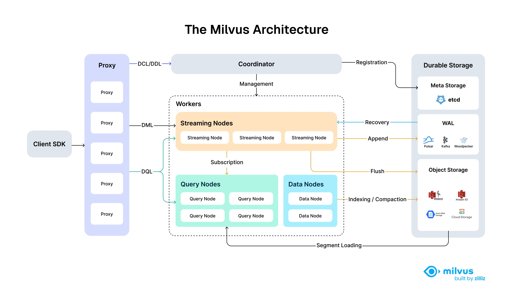

# Milvus Architecture Overview

Milvus is an **open-source**, **cloud-native** vector database designed for high-performance similarity search on massive vector datasets. Built on top of popular vector search libraries including Faiss, HNSW, DiskANN, and SCANN, it empowers AI applications and unstructured data retrieval scenarios. Before proceeding, familiarize yourself with the [basic principles](glossary.md) of embedding retrieval.

## Architecture Diagram

The following diagram illustrates Milvus's high-level architecture, showcasing its modular, scalable, and cloud-native design with fully disaggregated storage and compute layers.

## Architectural Principles

Milvus follows the principle of data plane and control plane disaggregation, comprising four main layers that are mutually independent in terms of scalability and disaster recovery. This shared-storage architecture with fully disaggregated storage and compute layers enables horizontal scaling of compute nodes while implementing Woodpecker as a zero-disk WAL layer for increased elasticity and reduced operational overhead.

By separating stream processing into Streaming Node and batch processing into Query Node and Data Node, Milvus achieves high performance while meeting real-time processing requirements simultaneously.

## Detailed Layer Architecture

### Layer 1: Access Layer

Composed of a group of stateless proxies, the access layer is the front layer of the system and endpoint to users. It validates client requests and reduces the returned results: 

- Proxy is in itself stateless. It provides a unified service address using load balancing components such as Nginx, Kubernetes Ingress, NodePort, and LVS. 
- As Milvus employs a massively parallel processing (MPP) architecture, the proxy aggregates and post-process the intermediate results before returning the final results to the client.  

### Layer 2: Coordinator

The Coordinator serves as the brain of Milvus. At any moment, exactly one Coordinator is active across the entire cluster, responsible for maintaining the cluster topology, scheduling all task types, and promising cluster-level consistency.

The following are some of the tasks handled by the **Coordinator**:

- **DDL/DCL/TSO Management**: Handles data definition language (DDL) and data control language (DCL) requests, such as creating or deleting collections, partitions, or indexes, as well as managing timestamp Oracle (TSO) and time ticker issuing.
- **Streaming Service Management**: Binds the Write-Ahead Log (WAL) with Streaming Nodes and provides service discovery for the streaming service.
- **Query Management**: Manages topology and load balancing for the Query Nodes, and provides and manages the serving query views to guide the query routing.
- **Historical Data Management**: Distributes offline tasks such as compaction and index-building to Data Nodes, and manages the topology of segments and data views. 

### Layer 3: Worker Nodes

The arms and legs. Worker nodes are dumb executors that follow instructions from the coordinator. Worker nodes are stateless thanks to separation of storage and computation, and can facilitate system scale-out and disaster recovery when deployed on Kubernetes. There are three types of worker nodes: 

### Streaming node

Streaming Node serves as the shard-level "mini-brain", providing shard-level consistency guarantees and fault recovery based on underlying WAL Storage. Meanwhile, Streaming Node is also responsible for growing data querying and generating query plans. Additionally, it also handles the conversion of growing data into sealed (historical) data.

### Query node

Query node loads the historical data from object storage, and provides the historical data querying.

### Data node

Data node is responsible for offline processing of historical data, such as compaction and index building.

### Layer 4: Storage

Storage is the bone of the system, responsible for data persistence. It comprises meta storage, log broker, and object storage.

### Meta storage

Meta storage stores snapshots of metadata such as collection schema, and message consumption checkpoints. Storing metadata demands extremely high availability, strong consistency, and transaction support, so Milvus chose etcd for meta store. Milvus also uses etcd for service registration and health check. 

### Object storage

Object storage stores snapshot files of logs, index files for scalar and vector data, and intermediate query results. Milvus uses MinIO as object storage and can be readily deployed on AWS S3 and Azure Blob, two of the world's most popular, cost-effective storage services. However, object storage has high access latency and charges by the number of queries. To improve its performance and lower the costs, Milvus plans to implement cold-hot data separation on a memory- or SSD-based cache pool.

### WAL storage

Write-Ahead Log (WAL) storage is the foundation of data durability and consistency in distributed systems. Before any change is committed, it’s first recorded in a log—ensuring that, in the event of a failure, you can recover exactly where you left off.

Common WAL implementations include Kafka, Pulsar, and Woodpecker. Unlike traditional disk-based solutions, Woodpecker adopts a cloud-native, zero-disk design that writes directly to object storage. This approach scales effortlessly with your needs and simplifies operations by removing the overhead of managing local disks.

By logging every write operation ahead of time, the WAL layer guarantees a reliable, system-wide mechanism for recovery and consistency—no matter how complex your distributed environment grows.

## Data Flow and API Categories

Milvus APIs are categorized by their function and follow specific paths through the architecture:

| API Category | Operations | Example APIs | Architecture Flow |
|--------------|------------|--------------|-------------------|
| **DDL/DCL** | Schema & Access Control | `createCollection`, `dropCollection`, `hasCollection`, `createPartition` | Access Layer → Coordinator |
| **DML** | Data Manipulation | `insert`, `delete`, `upsert` | Access Layer → Streaming Worker Node |
| **DQL** | Data Query | `search`, `query` | Access Layer → Batch Worker Node (Query Nodes) |

### Example Data Flow: Search Operation

1. Client sends a search request via SDK/RESTful API
2. Load Balancer routes request to available Proxy in Access Layer
3. Proxy uses routing cache to determine target nodes; contacts Coordinator only if cache is unavailable
4. Proxy forwards request to appropriate Streaming Nodes, which then coordinate with Query Nodes for sealed data search while executing growing data search locally
5. Query Nodes load sealed segments from Object Storage as needed and perform segment-level search
6. Search results undergo multi-level reduction: Query Nodes reduce results across multiple segments, Streaming Nodes reduce results from Query Nodes, and Proxy reduces results from all Streaming Nodes before returning to client

### Example Data Flow: Data Insertion

1. Client sends an insert request with vector data
2. Access Layer validates and forwards request to Streaming Node
3. Streaming Node logs operation to WAL Storage for durability
4. Data is processed in real-time and made available for queries
5. When segments reach capacity, Streaming Node triggers conversion to sealed segments
6. Data Node handles compaction and builds indexes on top of the sealed segments, storing results in Object Storage
7. Query Nodes load the newly built indexes and replace the corresponding growing data

## What's Next

- Explore the [Main Components](main_components.md) for detailed implementation specifics
- Learn about [Data Processing](data_processing.md) workflows and optimization strategies
- Understand the [Consistency Model](consistency.md) and transaction guarantees in Milvus