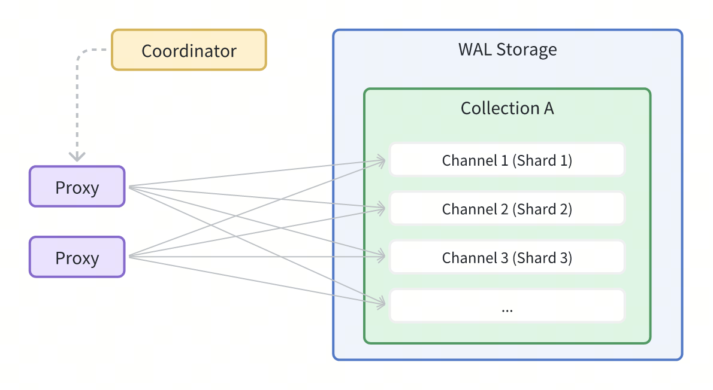
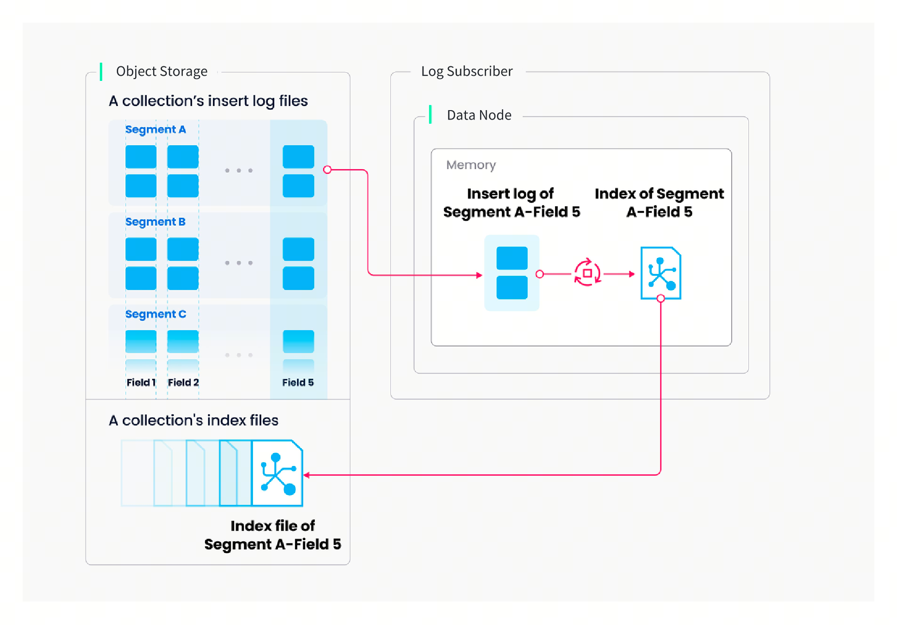
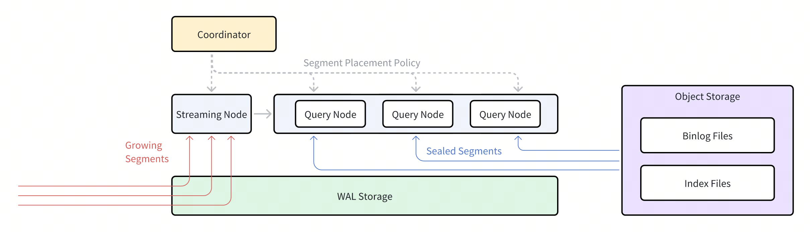

# Data Processing

This article provides a detailed description of the implementation of data insertion, index building, and data query in Milvus.

## Data insertion

You can specify a number of shards for each collection in Milvus, each shard corresponding to a virtual channel (*vchannel*). As the following figure shows, Milvus assigns each vchannel in the log broker a physical channel (*pchannel*). Any incoming insert/delete request is routed to shards based on the hash value of primary key.

Validation of DML requests is moved forward to proxy because Milvus does not have complicated transactions. Proxy would request a timestamp for each insert/delete request from TSO (Timestamp Oracle), which is the timing module that colocates with the root coordinator. With the older timestamp being overwritten by the newer one, timestamps are used to determine the sequence of data requests being processed. Proxy retrieves information in batches from data coord including entities' segments and primary keys to increase overall throughput and avoid overburdening the central node. 

Both DML (data manipulation language) operations and DDL (data definition language) operations are written to the log sequence, but DDL operations are only assigned one channel because of their low frequency of occurrence. 

*Vchannels* are maintained in the underlying log broker nodes. Each channel is physically indivisible and available for any but only one node. When data ingestion rate reaches bottleneck, consider two things: Whether the log broker node is overloaded and needs to be scaled, and whether there are sufficient shards to ensure load balance for each node. 

The above diagram encapsulates four components involved in the process of writing log sequence: proxy, log broker, data node, and object storage. The process involves four tasks: validation of DML requests, publication-subscription of log sequence, conversion from streaming log to log snapshots, and persistence of log snapshots. The four tasks are decoupled from each other to make sure each task is handled by its corresponding node type. Nodes of the same type are made equal and can be scaled elastically and independently to accommodate various data loads, massive and highly fluctuating streaming data in particular.

## Index building

Index building is performed by index node. To avoid frequent index building for data updates, a collection in Milvus is divided further into segments, each with its own index.

Milvus supports building index for each vector field, scalar field and primary field. Both the input and output of index building engage with object storage: The index node loads the log snapshots to index from a segment (which is in object storage) to memory, deserializes the corresponding data and metadata to build index, serializes the index when index building completes, and writes it back to object storage.

Index building mainly involves vector and matrix operations and hence is computation- and memory-intensive. Vectors cannot be efficiently indexed with traditional tree-based indexes due to their high-dimensional nature, but can be indexed with techniques that are more mature in this subject, such as cluster- or graph-based indexes. Regardless its type, building index involves massive iterative calculations for large-scale vectors, such as Kmeans or graph traverse.

Unlike indexing for scalar data, building vector index has to take full advantage of SIMD (single instruction, multiple data) acceleration. Milvus has innate support for SIMD instruction sets, e.g., SSE, AVX2, and AVX512. Given the "hiccup" and resource-intensive nature of vector index building, elasticity becomes crucially important to Milvus in economical terms. Future Milvus releases will further explorations in heterogeneous computing and serverless computation to bring down the related costs. 

Besides, Milvus also supports scalar filtering and primary field query. It has inbuilt indexes to improve query efficiency, e.g., Bloom filter indexes, hash indexes, tree-based indexes, and inverted indexes, and plans to introduce more external indexes, e.g., bitmap indexes and rough indexes. 

## Data query

Data query refers to the process of searching a specified collection for *k* number of vectors nearest to a target vector or for *all* vectors within a specified distance range to the vector. Vectors are returned together with their corresponding primary key and fields. 

A collection in Milvus is split into multiple segments, and the query nodes loads indexes by segment. When a search request arrives, it is broadcast to all query nodes for a concurrent search. Each node then prunes the local segments, searches for vectors meeting the criteria, and reduces and returns the search results. 

Query nodes are independent from each other in a data query. Each node is responsible only for two tasks: Load or release segments following the instructions from query coord; conduct a search within the local segments. And proxy is responsible for reducing search results from each query node and returning the final results to the client. 

There are two types of segments, growing segments (for incremental data), and sealed segments (for historical data). Query nodes subscribe to vchannel to receive recent updates (incremental data) as growing segments. When a growing segment reaches a predefined threshold, data coord seals it and index building begins. Then a *handoff* operation initiated by query coord turns incremental data to historical data. Query coord will distribute sealed segments evenly among all query nodes according to memory usage, CPU overhead, and segment number.

## What's next

- Learn about how to [use the Milvus vector database for real-time query](https://milvus.io/blog/deep-dive-5-real-time-query.md).
- Learn about [data insertion and data persistence in Milvus](https://milvus.io/blog/deep-dive-4-data-insertion-and-data-persistence.md).
- Learn how [data is processed in Milvus](https://milvus.io/blog/deep-dive-3-data-processing.md).

