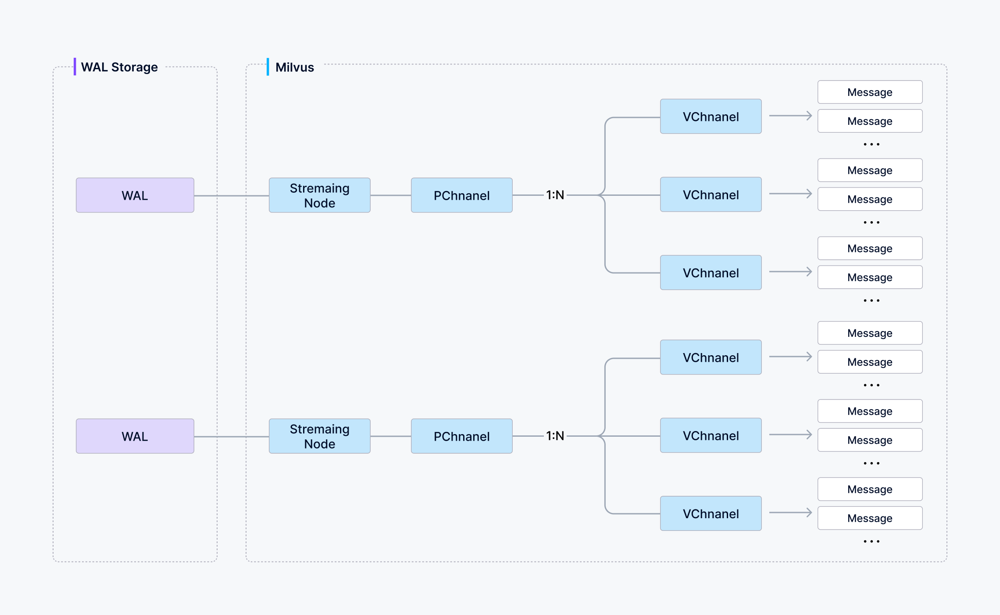
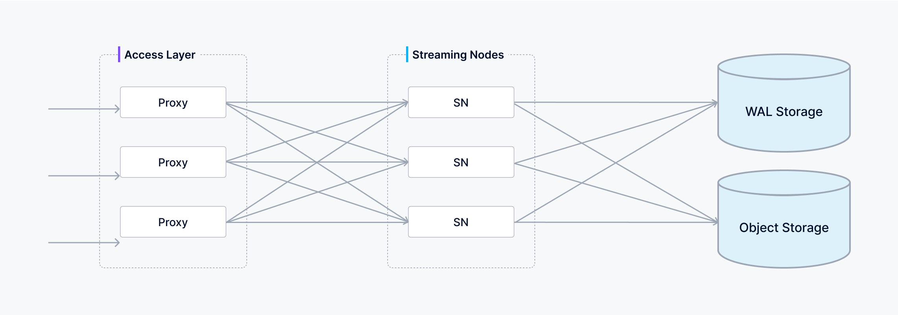

# Data Processing

This article provides a detailed description of the implementation of data insertion, index building, and data query in Milvus.

## Data insertion

You can choose how many shards a collection uses in Milvus—each shard maps to a virtual channel (*vchannel*). As illustrated below, Milvus then assigns every *vchannel* to a physical channel (*pchannel*), and each *pchannel* is bound to a specific Streaming Node.

After data verification, the proxy will split the written message into various data package of shards according to the specified shard routing rules. 

Then the written data of one shard (*vchannel*) is sent to the corresponding Streaming Node of *pchannel*.

The Streaming Node assigns a Timestamp Oracle (TSO) to each data packet to establish a total ordering of operations. It performs consistency checks on the payload before writing it into the underlying write-ahead log (WAL). Once data is durably committed to the WAL, it’s guaranteed not to be lost—even in the event of a crash, the Streaming Node can replay the WAL to fully recover all pending operations.

Meanwhile, the StreamingNode also asynchronously chops the committed WAL entries into discrete segments. There are two segment types:

- **Growing segment**: any data that has not been presisted into the object storage.
- **Sealed segment**: all data has been persisted into the object storage, the data of sealed segment is immutable.

The transition of a growing segment into a sealed segment is called a flush. The Streaming Node triggers a flush as soon as it has ingested and written all available WAL entries for that segment—i.e., when there are no more pending records in the underlying write-ahead log—at which point the segment is finalized and made read-optimized.

## Index building

Index building is performed by data node. To avoid frequent index building for data updates, a collection in Milvus is divided further into segments, each with its own index.

Milvus supports building index for each vector field, scalar field and primary field. Both the input and output of index building engage with object storage: The data node loads the log snapshots to index from a segment (which is in object storage) to memory, deserializes the corresponding data and metadata to build index, serializes the index when index building completes, and writes it back to object storage.

Index building mainly involves vector and matrix operations and hence is computation- and memory-intensive. Vectors cannot be efficiently indexed with traditional tree-based indexes due to their high-dimensional nature, but can be indexed with techniques that are more mature in this subject, such as cluster- or graph-based indexes. Regardless its type, building index involves massive iterative calculations for large-scale vectors, such as Kmeans or graph traverse.

Unlike indexing for scalar data, building vector index has to take full advantage of SIMD (single instruction, multiple data) acceleration. Milvus has innate support for SIMD instruction sets, e.g., SSE, AVX2, and AVX512. Given the "hiccup" and resource-intensive nature of vector index building, elasticity becomes crucially important to Milvus in economical terms. Future Milvus releases will further explorations in heterogeneous computing and serverless computation to bring down the related costs. 

Besides, Milvus also supports scalar filtering and primary field query. It has inbuilt indexes to improve query efficiency, e.g., Bloom filter indexes, hash indexes, tree-based indexes, and inverted indexes, and plans to introduce more external indexes, e.g., bitmap indexes and rough indexes. 

## Data query

Data query refers to the process of searching a specified collection for *k* number of vectors nearest to a target vector or for *all* vectors within a specified distance range to the vector. Vectors are returned together with their corresponding primary key and fields. 

A collection in Milvus is split into multiple segments; the Streaming Node loads growing segments and maintains real-time data, while the Query Nodes load sealed segments.

When a query/search request arrives, the proxy broadcasts the request to all Streaming Nodes responsible for the related shards for concurrent search.

When a query request arrives, the proxy concurrently requests the Streaming Nodes that hold the corresponding shards to execute the search.

Each Streaming Node generates a query plan, searches its local growing data, and simultaneously contacts remote Query Nodes to retrieve historical results, then aggregates these into a single shard result.

Finally, the proxy collects all shard results, merges them into the final outcome, and returns it to the client.

When the growing segment on a Streaming Node is flushed into a sealed segment—or when a Data Node completes a compaction—the Coordinator initiates a handoff operation to convert that growing data into historical data. The Coordinator then evenly distributes the sealed segments across all Query Nodes, balancing memory usage, CPU overhead, and segment count, and releases any redundant segment.

## What's next

- Learn about how to [use the Milvus vector database for real-time query](https://milvus.io/blog/deep-dive-5-real-time-query.md).
- Learn about [data insertion and data persistence in Milvus](https://milvus.io/blog/deep-dive-4-data-insertion-and-data-persistence.md).
- Learn how [data is processed in Milvus](https://milvus.io/blog/deep-dive-3-data-processing.md).

