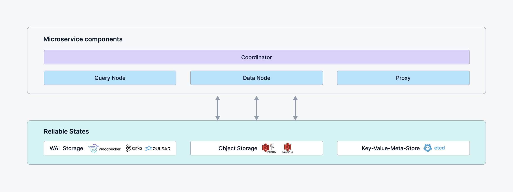

# Main Components

A Milvus cluster comprises five core components and three third-party dependencies. Each component can be deployed independently on Kubernetes: 

## Milvus components

- Coordinator: master-slave mode can be enabled to provide high availability.
- Proxy: one or more per cluster
- Streaming Node: one or more per cluster
- Query Node: one or more per cluster
- Data Node: one or more per cluster

## Third-party dependencies

- **Meta Store:** Stores metadata for various components in the milvus, e.g. etcd.
- **Object Storage:**  Responsible for data persistence of large files in the milvus, such as index and binary log files, e.g. S3
- **WAL Storage:** Provides Write-Ahead Log (WAL) service for the milvus, e.g. woodpecker. 
    - Under the woodpecker zero-disk mode, **WAL** directly use object storage and meta storage without other deployment, reducing third-party dependencies.

## Milvus deployment modes

There are two modes for running Milvus: 

### Standalone 

A single instance of Milvus that runs all components in one process, which is suitable for small datasets and low workload.
Additionally, in standalone mode, simpler WAL implementation, such as woodpecker and rocksmq, can be chosen to eliminate the requirement for third-party WAL Storage dependencies.

Currently, you cannot perform an online upgrade from a standalone Milvus instance to a Milvus cluster, even if the WAL storage backend supports cluster mode.

### Cluster

A distributed deployment mode of Milvus where each component runs independently and can be scaled out for elasticity. This setup is suitable for large datasets and high-load scenarios.

## What's next

- Read [Computing/Storage Disaggregation](four_layers.md) to understand the mechanism and design principle of Milvus.
