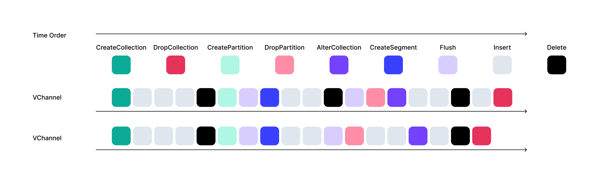
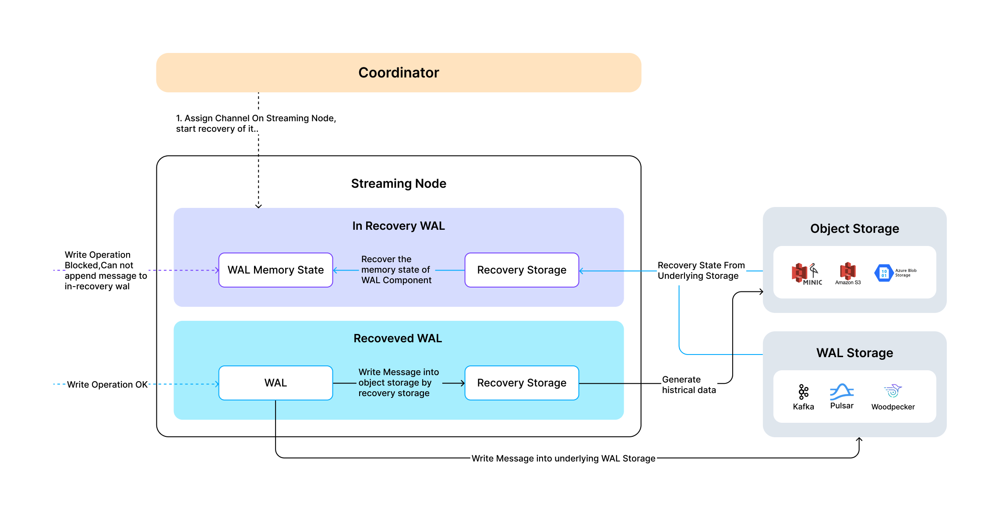
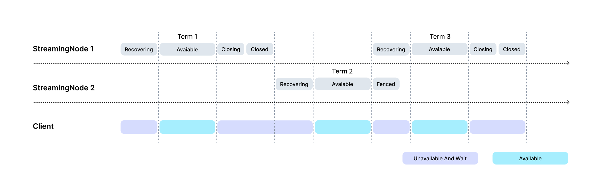

# Streaming Service

The **Streaming Service** is a concept for Milvus internal streaming system module, built around the Write-Ahead Log (WAL) to support various streaming-related function. These include streaming data ingestion/subscription, fault recovery of cluster state, conversion of streaming data into historical data, and growing data queries. Architecturally, the Streaming Service is composed of three main components:

- **Streaming Coordinator**: A logical component in the coordinator node. It uses Etcd for service discovery to locate available streaming nodes and is responsible for binding WAL to the corresponding streaming nodes. It also registers service to expose the WAL distribution topology, allowing streaming clients to know the appropriate streaming node for a given WAL.

- **Streaming Node Cluster**: A cluster of streaming worker nodes responsible for all streaming-processing tasks, such as wal appending, state recovering, growing data querying.

- **Streaming Client**: An internally developed Milvus client that encapsulates basic functionalities such as service discovery and readiness checks. It is used to initiate operations such as message writing and subscription.

## Message

The Streaming Service is a log-driven streaming system, so all write operations in Milvus (such as DML and DDL) are abstracted as **Messages**.

* Every Message is assigned a **Timestamp Oracle (TSO)** field by the Streaming Service, which indicates the message’s order in the WAL. The ordering of messages determines the order of write operations in Milvus. This makes it possible to reconstruct the latest cluster state from the logs.

* Each Message belongs to a specific **VChannel** (Virtual Channel) and maintains certain invariant properties within that channel to ensure operation consistency. For example, an Insert operation must always occur before a DropCollection operation on the same channel.

The message order in Milvus may resemble the following:

## WAL Component

To support large-scale horizontal scalability, Milvus's WAL is not a single log file, but a composite of multiple logs. Each log can independently support streaming functionality for multiple VChannels. At any given time, a WAL component is allowed to operate on **exactly one streaming node**, these constraint is promised by both a fencing mechanism of underlying wal storage and the streaming coordinator.

Additional features of the WAL component include:

- **Segment Lifecycle Management**: Based on the policy such as memory conditions/ segment size/ segment idle time, the WAL manages the lifecycle of every segments.

- **Basic Transaction Support**: Since each message has a size limit, the WAL component supports simple transaction-level to promise atomic writes at the VChannel level.

- **High-Concurrency Remote Log Writing**: Milvus supports third-party remote message queues as WAL storage. For mitigating the round-trip latency (RTT) between streaming node and remote WAL storage to improve write throughput, the streaming service supports concurrent log writes. It maintains message order by TSO and TSO synchronization, and the messages in WAL are read in TSO order.

- **Write-Ahead Buffer**: After messages are written to the WAL, they are temporarily stored in a Write-Ahead Buffer. This enables tail reads of logs without fetching messages from remote WAL storage.

- **Multiple WAL Storage supports**: Woodpecker, Pulsar, Kafka. Use woodpecker with zero-disk mode, we can remove the remote WAL storage dependency.

## Recovery Storage

The **Recovery Storage** component always runs on the streaming node that corresponding WAL component located.

- It is responsible for converting streaming data into persisted historical data and storing it in object storage.

- It also handles in-memory state recovery for the WAL component on the streaming node.

## Query Delegator

The **Query Delegator** runs on each streaming node and is responsible for executing **incremental queries** on a single shard. It generates query plans, forwards them to the relevant Query Nodes, and aggregates the results.

In addition, the Query Delegator is responsible for broadcasting **Delete operations** to other Query Nodes.

The Query Delegator always coexists with the WAL component on the same streaming node. But if the collection is configured with multi-replica, then **N-1** Delegators will be deployed on the other streaming nodes.

## WAL Lifetime and Wait for Ready

By separating computing nodes from storage, Milvus can easily transfer WAL from one streaming node to another, achieving high availability in streaming service.

## Wait for Ready

When wal is going to move to new streaming node, the client will find that old streaming node reject some requests. Meanwhile, the WAL will be recovered at new streaming node, the client will wait for the wal on new streaming node ready to serve.

