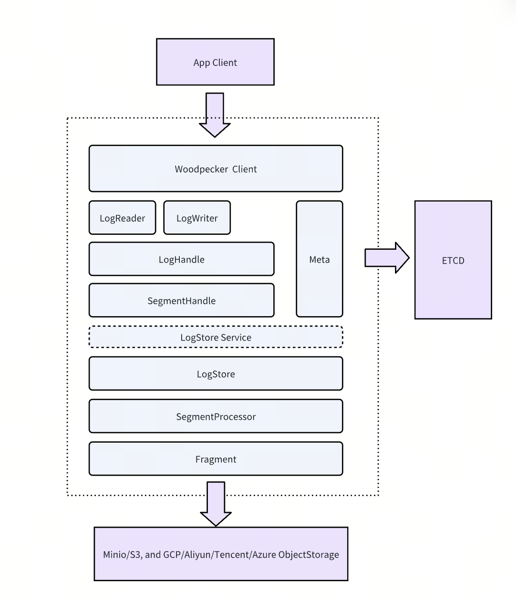
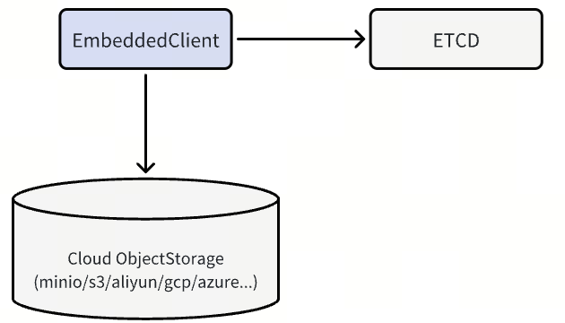
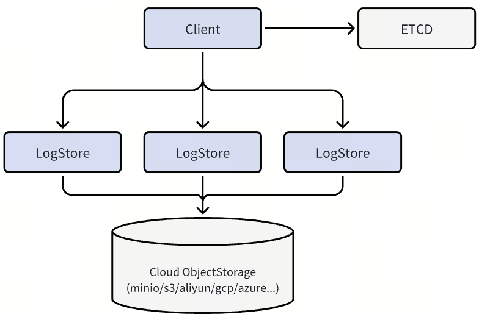

# Woodpecker

In Milvus 2.6, Woodpecker replaces Kafka and Pulsar with a purpose-built, cloud-native write-ahead log (WAL) system. Engineered for object storage, Woodpecker simplifies operations, maximizes throughput, and scales effortlessly.

Woodpecker's design goals:

- Highest throughput in cloud environments

- Durable, append-only logging for reliable recovery

- Minimal operational overhead with no local disks or external brokers

## Zero-disk architecture

Woodpecker's core innovation is its zero-disk architecture:

- All log data stored in cloud object storage (such as Amazon S3, Google Cloud Storage, or Alibaba OS)
- Metadata managed through distributed key-value stores like **etcd**
- No local disk dependencies for core operations

## Architecture components

A standard Woodpecker deployment includes the following components:

- **Client**: Interface layer for issuing read and write requests
- **LogStore**: Manages high-speed write buffering, asynchronous uploads to storage, and log compaction
- **Storage backend**: Supports scalable, low-cost storage services such as S3, GCS, and file systems like EFS
- **Etcd**: Stores metadata and coordinates log state across distributed nodes

## Deployment modes

Woodpecker offers two deployment modes to match your specific needs:

### MemoryBuffer - Lightweight and maintenance-free

MemoryBuffer mode provides a simple and lightweight deployment option where Woodpecker's embedded client temporarily buffers incoming writes in memory and periodically flushes them to a cloud object storage service. In this mode, the memory buffer is embedded directly into the client, enabling efficient batching before flushing to S3. Metadata is managed using **etcd** to ensure consistency and coordination. This mode is best suited for batch-heavy workloads in smaller-scale deployments or production environments that prioritize simplicity over performance, especially when low write latency is not critical. The write latency in this mode is generally between 200-500 ms.

### QuorumBuffer - Optimized for low-latency, high-durability

QuorumBuffer mode is designed for latency-sensitive, high-frequency read/write workloads requiring both real-time responsiveness and strong fault tolerance. In this mode, Woodpecker's client interacts with a three-replica quorum system to provide high-speed write buffering, ensuring strong consistency and high availability through distributed consensus.

A write is considered successful once the client successfully replicates data to at least two of the three quorum nodes, typically completing within single-digit milliseconds, after which the data is asynchronously flushed to cloud object storage for long-term durability. This architecture minimizes on-node state, eliminates the need for large local disk volumes, and avoids complex anti-entropy repairs often required in traditional quorum-based systems.

The result is a streamlined, robust WAL layer ideal for mission-critical production environments where consistency, availability, and fast recovery are essential.

## Performance benchmarks

We ran comprehensive benchmarks to evaluate Woodpecker's performance in a single-node, single-client, single-log-stream setup. The results were impressive when compared to Kafka and Pulsar:

| System     | Kafka      | Pulsar  | WP Minio | WP Local | WP S3   |
| ---------- | ---------- | ------- | -------- | -------- | ------- |
| Throughput | 129.96MB/s | 107MB/s | 71MB/s   | 450MB/s  | 750MB/s |
| latency    | 58ms       | 35ms    | 184ms    | 1.8ms    | 166ms   |

For context, we measured the theoretical throughput limits of different storage backends on our test machine:

- MinIO: ~110 MB/s
- Local file system: 600–750 MB/s
- Amazon S3 (single EC2 instance): up to 1.1 GB/s

Remarkably, Woodpecker consistently achieved 60-80% of the maximum possible throughput for each backend—an exceptional efficiency level for middleware.

### Key performance insights

- Local File System Mode: Woodpecker achieved 450 MB/s—3.5× faster than Kafka and 4.2× faster than Pulsar—with ultra-low latency at just 1.8 ms, making it ideal for high-performance single-node deployments.
- Cloud Storage Mode (S3): When writing directly to S3, Woodpecker reached 750 MB/s (about 68% of S3's theoretical limit), 5.8× higher than Kafka and 7× higher than Pulsar. While latency is higher (166 ms), this setup provides exceptional throughput for batch-oriented workloads.
- Object Storage Mode (MinIO): Even with MinIO, Woodpecker achieved 71 MB/s—around 65% of MinIO's capacity. This performance is comparable to Kafka and Pulsar but with significantly lower resource requirements.

Woodpecker is particularly optimized for concurrent, high-volume writes where maintaining order is critical. And these results only reflect the early stages of development—ongoing optimizations in I/O merging, intelligent buffering, and prefetching are expected to push performance even closer to theoretical limits.

## Operational benefits

Woodpecker's cloud-native architecture delivers significant operational advantages:

- **Zero local storage management**: Eliminates disk volume management, RAID configuration, and hardware failures
- **Automatic scaling**: Storage scales with cloud object storage without capacity planning
- **Cost efficiency**: Pay-as-you-go storage with automatic tiering and compression
- **High availability**: Leverages cloud providers' 11-nines durability with fast recovery
- **Simplified deployment**: Two deployment modes (MemoryBuffer/QuorumBuffer) match different operational needs
- **Developer-friendly**: Faster environment setup and consistent architecture across all environments

These advantages make Woodpecker particularly valuable for mission-critical RAG, AI agents, and low-latency search workloads where operational simplicity is as important as performance.
