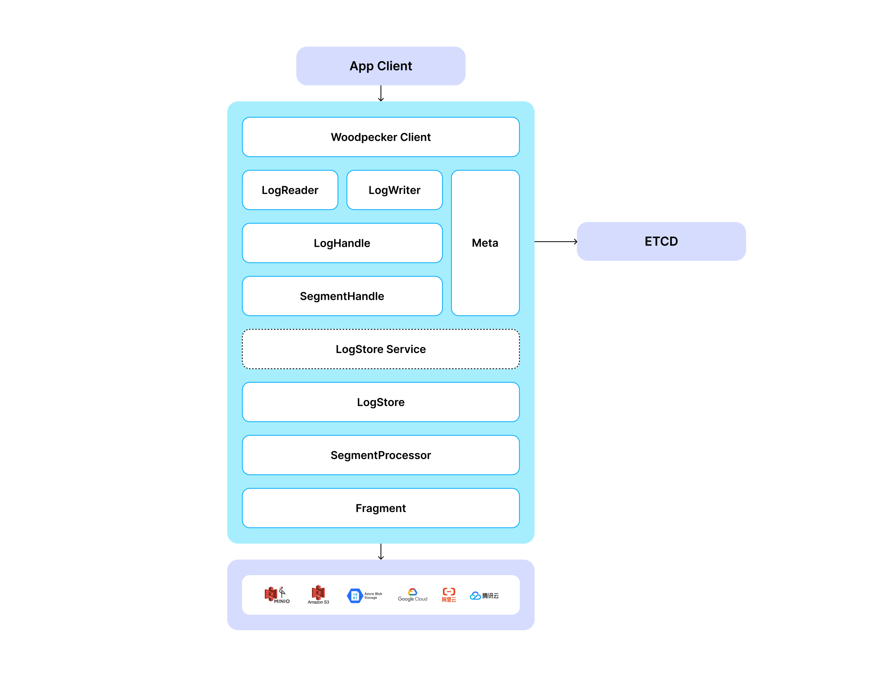

# Woodpecker

In Milvus 2.6, Woodpecker replaces Kafka and Pulsar with a purpose-built, cloud-native write-ahead log (WAL) system. Engineered for object storage, Woodpecker simplifies operations, maximizes throughput, and scales effortlessly.

Woodpecker’s design goals:

- Highest throughput in cloud environments

- Durable, append-only logging for reliable recovery

- Minimal operational overhead with no local disks or external brokers

## Zero-disk architecture

Woodpecker's core innovation is its zero-disk architecture:

- All log data stored in cloud object storage (such as Amazon S3, Google Cloud Storage, or Alibaba OS)
- Metadata managed through distributed key-value stores like **etcd**
- No local disk dependencies for core operations

## Architecture components

A standard Woodpecker deployment includes the following components:

- **Client**: Interface layer for issuing read and write requests
- **LogStore**: Manages high-speed write buffering, asynchronous uploads to storage, and log compaction
- **Storage backend**: Supports scalable, low-cost storage services such as S3, GCS, and file systems like EFS
- **Etcd**: Stores metadata and coordinates log state across distributed nodes

## Deployment modes

Woodpecker offers two deployment modes to match your specific needs:

### MemoryBuffer - Lightweight and maintenance-free

MemoryBuffer mode provides a simple and lightweight deployment option where Woodpecker temporarily buffers incoming writes in memory and periodically flushes them to a cloud object storage service. Metadata is managed using **etcd** to ensure consistency and coordination. This mode is best suited for batch-heavy workloads in smaller-scale deployments or production environments that prioritize simplicity over performance, especially when low write latency is not critical.

### QuorumBuffer - Optimized for low-latency, high-durability

QuorumBuffer mode is designed for latency-sensitive, high-frequency read/write workloads requiring both real-time responsiveness and strong fault tolerance. In this mode, Woodpecker functions as a high-speed write buffer with three-replica quorum writes, ensuring strong consistency and high availability.

A write is considered successful once it's replicated to at least two of the three nodes, typically completing within single-digit milliseconds, after which the data is asynchronously flushed to cloud object storage for long-term durability. This architecture minimizes on-node state, eliminates the need for large local disk volumes, and avoids complex anti-entropy repairs often required in traditional quorum-based systems.

The result is a streamlined, robust WAL layer ideal for mission-critical production environments where consistency, availability, and fast recovery are essential.

## Performance benchmarks

We ran comprehensive benchmarks to evaluate Woodpecker's performance in a single-node, single-client, single-log-stream setup. The results were impressive when compared to Kafka and Pulsar:

| System     | Kafka      | Pulsar  | WP Minio | WP Local | WP S3   |
| ---------- | ---------- | ------- | -------- | -------- | ------- |
| Throughput | 129.96MB/s | 107MB/s | 71MB/s   | 450MB/s  | 750MB/s |
| latency    | 58ms       | 35ms    | 184ms    | 1.8ms    | 166ms   |

For context, we measured the theoretical throughput limits of different storage backends on our test machine:

- MinIO: ~110 MB/s
- Local file system: 600–750 MB/s
- Amazon S3 (single EC2 instance): up to 1.1 GB/s

Remarkably, Woodpecker consistently achieved 60-80% of the maximum possible throughput for each backend—an exceptional efficiency level for middleware.

### Key performance insights

- Local File System Mode: Woodpecker achieved 450 MB/s—3.5× faster than Kafka and 4.2× faster than Pulsar—with ultra-low latency at just 1.8 ms, making it ideal for high-performance single-node deployments.
- Cloud Storage Mode (S3): When writing directly to S3, Woodpecker reached 750 MB/s (about 68% of S3's theoretical limit), 5.8× higher than Kafka and 7× higher than Pulsar. While latency is higher (166 ms), this setup provides exceptional throughput for batch-oriented workloads.
- Object Storage Mode (MinIO): Even with MinIO, Woodpecker achieved 71 MB/s—around 65% of MinIO's capacity. This performance is comparable to Kafka and Pulsar but with significantly lower resource requirements.

Woodpecker is particularly optimized for concurrent, high-volume writes where maintaining order is critical. And these results only reflect the early stages of development—ongoing optimizations in I/O merging, intelligent buffering, and prefetching are expected to push performance even closer to theoretical limits.

## Operational benefits

Woodpecker’s cloud-native architecture streamlines deployment, reduces maintenance, and improves reliability.

### Simplified infrastructure management

- **No local storage management:** Removes the need to manage disk volumes, RAID, or disk failures.
- **Reduced hardware dependency:** Eliminates hardware configuration and monitoring; durability and availability are handled by cloud object storage.
- **Simplified capacity planning:** Storage scales automatically with cloud object storage, removing the need for manual forecasting.

### Simplified deployment

- **MemoryBuffer mode:** Uses minimal resources and integrates with cloud storage, ideal for development and small-scale production.
- **QuorumBuffer mode:** Provides enterprise-grade reliability without the complexity of traditional distributed storage.

## Cost efficiency and resource optimization

- **Lower memory usage:** Efficient buffering reduces memory requirements compared to traditional brokers.
- **Elastic scaling:** Pay-as-you-go cloud storage eliminates over-provisioning.
- **Reduced infrastructure overhead:** Fewer components mean lower deployment and maintenance costs.

### Storage cost advantages

- **Tiered storage:** Automatically migrates data to cost-effective cloud storage tiers for long-term retention.
- **Compression and deduplication:** Built-in features reduce storage costs without extra operational effort.
- **No replication overhead:** Durability is managed by cloud storage, removing the need for manual replica management.

## High availability and disaster recovery

### Simplified fault tolerance

- **Cloud-native durability:** Leverages cloud providers’ 11-nines (99.999999999%) durability guarantees.
- **Fast recovery:** Minimal local state enables rapid node replacement and cluster recovery.
- **Cross-region resilience:** Supports cross-region replication using cloud storage features.

### Operational resilience

- **Fewer single points of failure:** Reduced component count lowers failure risk.
- **Automatic failover:** Cloud storage redundancy simplifies failover.
- **Simplified backup:** Integrated cloud storage provides automatic backup and versioning.

## Development and operational experience

### Improved development workflow

- **Faster environment setup:** Minimal dependencies speed up development and testing.
- **Consistent architecture:** Uniform design across development, staging, and production.
- **Cloud-native integration:** Seamless compatibility with cloud services and container orchestration.

### Enhanced production operations

- **Predictable performance:** Consistent results across deployment scales and configurations.
- **Simplified upgrades:** Stateless design enables minimal-downtime rolling updates.
- **Resource predictability:** More stable resource usage compared to traditional message brokers.

For vector databases supporting mission-critical RAG, AI agents, and low-latency search workloads, these operational advantages are revolutionary. Transitioning from complex message broker stacks to Woodpecker's simplified architecture not only boosts performance but also significantly reduces the operational burden on development and infrastructure teams.

As cloud infrastructure continues to evolve with innovations like S3 Express One Zone, Woodpecker's architecture enables organizations to automatically benefit from these advancements without requiring major operational changes or system redesigns.
