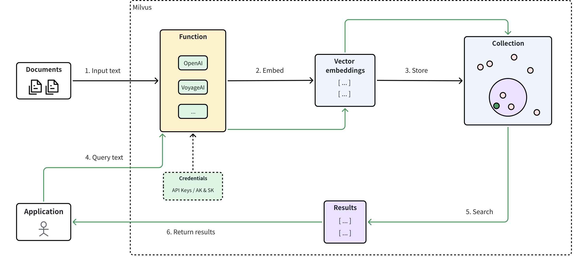
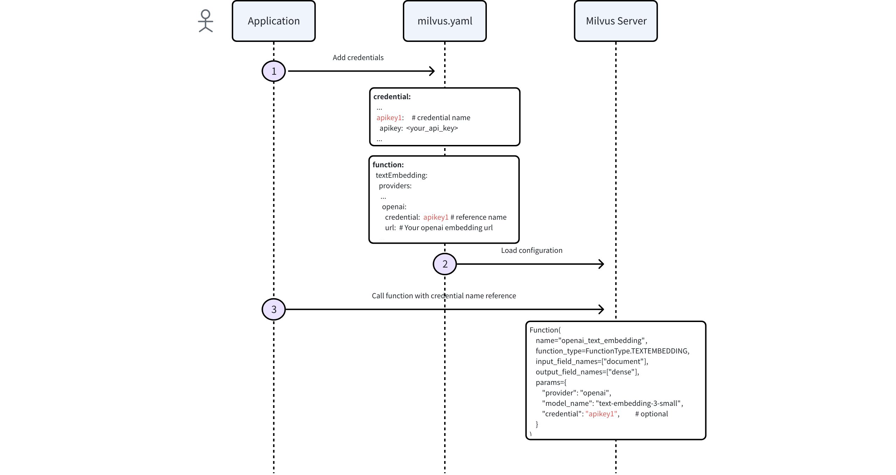

# Embedding Function Overview

The Function module in Milvus allows you to transform raw text data into vector embeddings by automatically calling external embedding service providers (like OpenAI, AWS Bedrock, Google Vertex AI, etc.). With the Function module, you no longer need to manually interface with embedding APIs—Milvus handles the entire process of sending requests to providers, receiving embeddings, and storing them in your collections. For semantic search, you need to provide only raw query data, not a query vector. Milvus generates the query vector with the same model you used for ingestion, compares it to the stored vectors, and returns the most relevant results.

## Limits

- Any input field that the Function module embeds must always contain a value; if a null is supplied, the module will throw an error.

- The Function module processes only fields that are explicitly defined in the collection schema; it does not generate embeddings for dynamic fields.

- Input fields to be embedded must be of the `VARCHAR` type.

- The Function module can embed an input field to:

    - `FLOAT_VECTOR`

    - `INT8_VECTOR`

    Conversions to `BINARY_VECTOR`, `FLOAT16_VECTOR`, or `BFLOAT16_VECTOR` are not supported.

## Supported embedding service providers

<table>
   <tr>
     <th><p>Provider</p></th>
     <th><p>Typical Models</p></th>
     <th><p>Embedding Type</p></th>
     <th><p>Authentication Method</p></th>
   </tr>
   <tr>
     <td><p><a href="openai.md">OpenAI</a></p></td>
     <td><p>text-embedding-3-*</p></td>
     <td><p><code>FLOAT_VECTOR</code></p></td>
     <td><p>API key</p></td>
   </tr>
   <tr>
     <td><p><a href="azure-openai.md">Azure OpenAI</a></p></td>
     <td><p>Deployment-based</p></td>
     <td><p><code>FLOAT_VECTOR</code></p></td>
     <td><p>API key</p></td>
   </tr>
   <tr>
     <td><p><a href="dashscope.md">DashScope</a></p></td>
     <td><p>text-embedding-v3</p></td>
     <td><p><code>FLOAT_VECTOR</code></p></td>
     <td><p>API key</p></td>
   </tr>
   <tr>
     <td><p><a href="bedrock.md">Bedrock</a></p></td>
     <td><p>amazon.titan-embed-text-v2</p></td>
     <td><p><code>FLOAT_VECTOR</code></p></td>
     <td><p>AK/SK pair</p></td>
   </tr>
   <tr>
     <td><p><a href="vertex-ai.md">Vertex AI</a></p></td>
     <td><p>text-embedding-005</p></td>
     <td><p><code>FLOAT_VECTOR</code></p></td>
     <td><p>GCP service account JSON credential</p></td>
   </tr>
   <tr>
     <td><p><a href="voyage-ai.md">Voyage AI</a></p></td>
     <td><p>voyage-3, voyage-lite-02</p></td>
     <td><p><code>FLOAT_VECTOR</code> / <code>INT8_VECTOR</code></p></td>
     <td><p>API key</p></td>
   </tr>
   <tr>
     <td><p><a href="cohere.md">Cohere</a></p></td>
     <td><p>embed-english-v3.0</p></td>
     <td><p><code>FLOAT_VECTOR</code> / <code>INT8_VECTOR</code></p></td>
     <td><p>API key</p></td>
   </tr>
   <tr>
     <td><p><a href="siliconflow.md">SiliconFlow</a></p></td>
     <td><p>BAAI/bge-large-zh-v1.5</p></td>
     <td><p><code>FLOAT_VECTOR</code></p></td>
     <td><p>API key</p></td>
   </tr>
   <tr>
     <td><p><a href="hugging-face-tei.md">Hugging Face</a></p></td>
     <td><p>Any TEI-served model</p></td>
     <td><p><code>FLOAT_VECTOR</code></p></td>
     <td><p>Optional API key</p></td>
   </tr>
</table>

## How it works

The following diagram shows how the Function works in Milvus.

1. **Input text**: Users insert raw data (e.g. documents) into Milvus.

1. **Generate embeddings**: The Function module within Milvus automatically calls the configured model provider to convert raw data into vector embeddings.

1. **Store embeddings**: The resulting embeddings are stored in explicitly defined vector fields within Milvus collections.

1. **Query text**: Users submit text queries to Milvus.

1. **Semantic search**: Milvus internally converts queries to vector embeddings, conducts similarity searches against stored embeddings, and retrieves relevant results.

1. **Return results**: Milvus returns top-matching results to the application.



## Configure credentials

Before using an embedding function with Milvus, configure embedding service credentials for Milvus access.

Milvus lets you supply embedding service credentials in two ways:

- **Configuration file** (`milvus.yaml`):

    The example in this topic demonstrates the **recommended setup** using `milvus.yaml`.

- **Environment variables**:

    For details on configuring credentials via environment variables, see the embedding service provider’s documentation (for example, [OpenAI](openai.md) or [Azure OpenAI](azure-openai.md)).

The following diagram shows the process of configuring credentials via Milvus configuration file (`milvus.yaml`) and then calling the Function within Milvus.



### Step 1: Add credentials to Milvus configuration file

In your `milvus.yaml` file, edit the `credential` block with entries for each provider you need to access:

```yaml
# milvus.yaml credential store section
# This section defines all your authentication credentials for external embedding providers
# Each credential gets a unique name (e.g., aksk1, apikey1) that you'll reference elsewhere
credential:
  # For AWS Bedrock or services using access/secret key pairs
  # 'aksk1' is just an example name - you can choose any meaningful identifier
  aksk1:                       
    access_key_id: <YOUR_AK>      
    secret_access_key: <YOUR_SK>  
  
  # For OpenAI, Voyage AI, or other API key-based services
  # 'apikey1' is a custom name you choose to identify this credential  
  apikey1:                     
    apikey: <YOUR_API_KEY>        
  
  # For Google Vertex AI using service account credentials
  # 'gcp1' is an example name for your Google Cloud credentials
  gcp1:                        
    credential_json: <BASE64_OF_JSON>
```

### Step 2: Configure provider settings

In the same configuration file (`milvus.yaml`), edit the `function` block to tell Milvus which key to use for embedding service calls:

```yaml
function:
  textEmbedding:
    providers:
      openai:                         # calls OpenAI
        credential: apikey1           # Reference to the credential label
        # url:                        # (optional) custom url

      bedrock:                        # calls AWS Bedrock
        credential: aksk1             # Reference to the credential label
        region: us-east-2

      vertexai:                       # calls Google Vertex AI
        credential: gcp1              # Reference to the credential label
        # url:                        # (optional) custom url

      tei:                            # Built-in Tiny Embedding model
        enable: true                  # Whether to enable TEI model service
```

For more information on how to apply Milvus configuration, refer to [Configure Milvus on the Fly](dynamic_config.md).

## Use embedding function

Once credentials are configured in your Milvus configuration file, follow these steps to define and use embedding functions.

### Step 1: Define schema fields

To use an embedding function, create a collection with a specific schema. This schema must include at least three necessary fields:

- The **primary field** that uniquely identifies each entity in a collection.

- A **scalar field** that stores raw data to be embedded.

- A **vector field** reserved to store vector embeddings that the function will generate for the scalar field.

The following example defines a schema with one scalar field `"document"` for storing textual data and one vector field `"dense"` for storing embeddings to be generated by the Function module. Remember to set the vector dimension (`dim`) to match the output of your chosen embedding model.

<div class="multipleCode">
    <a href="#python">Python</a>
    <a href="#java">Java</a>
    <a href="#javascript">NodeJS</a>
    <a href="#go">Go</a>
    <a href="#bash">cURL</a>
</div>

```python
from pymilvus import MilvusClient, DataType, Function, FunctionType

# Initialize Milvus client
client = MilvusClient(
    uri="http://localhost:19530",
)

# Create a new schema for the collection
schema = client.create_schema()

# Add primary field "id"
schema.add_field("id", DataType.INT64, is_primary=True, auto_id=False)

# Add scalar field "document" for storing textual data
schema.add_field("document", DataType.VARCHAR, max_length=9000)

# Add vector field "dense" for storing embeddings.
# IMPORTANT: Set dim to match the exact output dimension of the embedding model.
# For instance, OpenAI's text-embedding-3-small model outputs 1536-dimensional vectors.
# For dense vector, data type can be FLOAT_VECTOR or INT8_VECTOR
schema.add_field("dense", DataType.FLOAT_VECTOR, dim=1536)
```

```java
// java
```

```javascript
// nodejs
```

```go
// go
```

```bash
# restful
```

### Step 2: Add embedding function to schema

The Function module in Milvus automatically converts raw data stored in a scalar field into embeddings and stores them into the explicitly defined vector field.

The example below adds a Function module (`openai_embedding`) that converts the scalar field `"document"` into embeddings, storing the resulting vectors in the `"dense"` vector field defined earlier.

<div class="multipleCode">
    <a href="#python">Python</a>
    <a href="#java">Java</a>
    <a href="#javascript">NodeJS</a>
    <a href="#go">Go</a>
    <a href="#bash">cURL</a>
</div>

```python
# Define embedding function (example: OpenAI provider)
text_embedding_function = Function(
    name="openai_embedding",                  # Unique identifier for this embedding function
    function_type=FunctionType.TEXTEMBEDDING, # Type of embedding function
    input_field_names=["document"],           # Scalar field to embed
    output_field_names=["dense"],             # Vector field to store embeddings
    params={                                  # Provider-specific configuration (highest priority)
        "provider": "openai",                 # Embedding model provider
        "model_name": "text-embedding-3-small",     # Embedding model
        # "credential": "apikey1",            # Optional: Credential label
        # Optional parameters:
        # "dim": "1536",       # Optionally shorten the vector dimension
        # "user": "user123"    # Optional: identifier for API tracking
    }
)

# Add the embedding function to your schema
schema.add_function(text_embedding_function)
```

```java
// java
```

```javascript
// nodejs
```

```go
// go
```

```bash
# restful
```

<table>
   <tr>
     <th><p>Parameter</p></th>
     <th><p>Description</p></th>
     <th><p>Example Value</p></th>
   </tr>
   <tr>
     <td><p><code>name</code></p></td>
     <td><p>Unique identifier for the embedding function within Milvus.</p></td>
     <td><p><code>"openai_embedding"</code></p></td>
   </tr>
   <tr>
     <td><p><code>function_type</code></p></td>
     <td><p>Type of function used. For text embedding, set the value to <code>FunctionType.TEXTEMBEDDING</code>.</p><p><strong>Note</strong>: Milvus accepts <code>FunctionType.BM25</code> (for sparse-embedding transformation) and <code>FunctionType.RERANK</code> (for reranking) for this parameter. Refer to <a href="full-text-search.md">Full Text Search</a> and <a href="decay-ranker-overview.md">Decay Ranker Overview</a> for details.</p></td>
     <td><p><code>FunctionType.TEXTEMBEDDING</code></p></td>
   </tr>
   <tr>
     <td><p><code>input_field_names</code></p></td>
     <td><p>Scalar field containing raw data to be embedded. Currently, this parameter accepts only one field name.</p></td>
     <td><p><code>["document"]</code></p></td>
   </tr>
   <tr>
     <td><p><code>output_field_names</code></p></td>
     <td><p>Vector field for storing generated embeddings. Currently, this parameter accepts only one field name.</p></td>
     <td><p><code>["dense"]</code></p></td>
   </tr>
   <tr>
     <td><p><code>params</code></p></td>
     <td><p>Dictionary containing embedding configurations. Note: Parameters within <code>params</code> vary depending on the embedding model providers.</p></td>
     <td><p><code>{...}</code></p></td>
   </tr>
   <tr>
     <td><p><code>provider</code></p></td>
     <td><p>The embedding model provider.</p></td>
     <td><p><code>"openai"</code></p></td>
   </tr>
   <tr>
     <td><p><code>model_name</code></p></td>
     <td><p>Specifies which embedding model to use.</p></td>
     <td><p><code>"text-embedding-3-small"</code></p></td>
   </tr>
   <tr>
     <td><p><code>credential</code></p></td>
     <td><p>The label of a credential defined in the top-level <code>credential:</code> section of <code>milvus.yaml</code>. </p><ul><li><p>When provided, Milvus retrieves the matching key pair or API token and signs the request on the server side.</p></li><li><p>When omitted (<code>None</code>), Milvus falls back to the credential explicitly configured for the target model provider in <code>milvus.yaml</code>.</p></li><li><p>If the label is unknown or the referenced key is missing, the call fails.</p></li></ul></td>
     <td><p><code>"apikey1"</code></p></td>
   </tr>
   <tr>
     <td><p><code>dim</code></p></td>
     <td><p>The number of dimensions for the output embeddings. For OpenAI's third-generation models, you can shorten the full vector to reduce cost and latency without a significant loss of semantic information. For more information, refer to <a href="https://openai.com/blog/new-embedding-models-and-api-updates">OpenAI announcement blog post</a>.</p><p><strong>Note:</strong> If you shorten the vector dimension, ensure the <code>dim</code> value specified in the schema's <code>add_field</code> method for the vector field matches the final output dimension of your embedding function.</p></td>
     <td><p><code>"1536"</code></p></td>
   </tr>
   <tr>
     <td><p><code>user</code></p></td>
     <td><p>A user-level identifier for tracking API usage.</p></td>
     <td><p><code>"user123"</code></p></td>
   </tr>
</table>

<div class="alert note">

For collections with multiple scalar fields requiring text-to-vector conversion, add separate functions to the collection schema, ensuring each function has a unique name and `output_field_names` value.

</div>

### Step 3: Configure index

After defining the schema with necessary fields and the built-in function, set up the index for your collection. To simplify this process, use `AUTOINDEX` as the `index_type`, an option that allows Milvus to choose and configure the most suitable index type based on the structure of your data.

<div class="multipleCode">
    <a href="#python">Python</a>
    <a href="#java">Java</a>
    <a href="#javascript">NodeJS</a>
    <a href="#go">Go</a>
    <a href="#bash">cURL</a>
</div>

```python
# Prepare index parameters
index_params = client.prepare_index_params()

# Add AUTOINDEX to automatically select optimal indexing method
index_params.add_index(
    field_name="dense",
    index_type="AUTOINDEX",
    metric_type="COSINE" 
)
```

```java
// java
```

```javascript
// nodejs
```

```go
// go
```

```bash
# restful
```

### Step 4: Create collection

Now create the collection using the schema and index parameters defined.

<div class="multipleCode">
    <a href="#python">Python</a>
    <a href="#java">Java</a>
    <a href="#javascript">NodeJS</a>
    <a href="#go">Go</a>
    <a href="#bash">cURL</a>
</div>

```python
# Create collection named "demo"
client.create_collection(
    collection_name='demo', 
    schema=schema, 
    index_params=index_params
)
```

```java
// java
```

```javascript
// nodejs
```

```go
// go
```

```bash
# restful
```

### Step 5: Insert data

After setting up your collection and index, you're ready to insert your raw data. In this process, you need only to provide the raw text. The Function module we defined earlier automatically generates the corresponding sparse vector for each text entry.

<div class="multipleCode">
    <a href="#python">Python</a>
    <a href="#java">Java</a>
    <a href="#javascript">NodeJS</a>
    <a href="#go">Go</a>
    <a href="#bash">cURL</a>
</div>

```python
# Insert sample documents
client.insert('demo', [
    {'id': 1, 'document': 'Milvus simplifies semantic search through embeddings.'},
    {'id': 2, 'document': 'Vector embeddings convert text into searchable numeric data.'},
    {'id': 3, 'document': 'Semantic search helps users find relevant information quickly.'},
])
```

```java
// java
```

```javascript
// nodejs
```

```go
// go
```

```bash
# restful
```

### Step 6: Perform vector search

After data insertion, perform a semantic search using raw query text. Milvus automatically converts your query into an embedding vector, retrieves relevant documents based on similarity, and returns the top-matching results.

<div class="multipleCode">
    <a href="#python">Python</a>
    <a href="#java">Java</a>
    <a href="#javascript">NodeJS</a>
    <a href="#go">Go</a>
    <a href="#bash">cURL</a>
</div>

```python
# Perform semantic search
results = client.search(
    collection_name='demo', 
    data=['How does Milvus handle semantic search?'], # Use text query rather than query vector
    anns_field='dense',   # Use the vector field that stores embeddings
    limit=1,
    output_fields=['document'],
)

print(results)

# Example output:
# data: ["[{'id': 1, 'distance': 0.8821347951889038, 'entity': {'document': 'Milvus simplifies semantic search through embeddings.'}}]"]
```

```java
// java
```

```javascript
// nodejs
```

```go
// go
```

```bash
# restful
```

For more information about search and query operations, refer to [Basic Vector Search](single-vector-search.md) and [Query](get-and-scalar-query.md).

## FAQ

### What's the difference between configuring credentials in milvus.yaml vs environment variables?

Both methods work, but using `milvus.yaml` is the recommended approach as it provides centralized credential management and consistent credential naming across all providers. When using environment variables, the variable names vary depending on the embedding service provider, so refer to each provider's dedicated page to understand the specific environment variable names required (for example, [OpenAI](openai.md) or [Azure OpenAI](azure-openai.md)).

### What happens if I don't specify a credential parameter in the function definition?

Milvus follows this credential resolution order:

1. First, it looks for the default credential configured for that provider in the `milvus.yaml` file
2. If no default credential exists in milvus.yaml, it falls back to environment variables (if configured)
3. If neither `milvus.yaml` credentials nor environment variables are configured, Milvus will throw an error

### How can I verify that embeddings are being generated correctly?

You can check by:

1. Querying your collection after insertion to see if the vector field contains data
2. Checking the vector field length matches your expected dimensions
3. Performing a simple similarity search to verify the embeddings produce meaningful results

### When I perform a similarity search, can I use a query vector rather than raw text?

Yes, you can use pre-computed query vectors instead of raw text for similarity search. While the Function module automatically converts raw text queries to embeddings, you can also directly provide vector data to the `data` parameter in your search operation. **Note**: The dimension size of your provided query vector must be consistent with the dimension size of the vector embeddings generated by your Function module.

**Example**:

<div class="multipleCode">
    <a href="#python">Python</a>
    <a href="#java">Java</a>
    <a href="#javascript">NodeJS</a>
    <a href="#go">Go</a>
    <a href="#bash">cURL</a>
</div>

```python
# Using raw text (Function module converts automatically)
results = client.search(
    collection_name='demo', 
    data=['How does Milvus handle semantic search?'],
    anns_field='dense',
    limit=1
)

# Using pre-computed query vector (must match stored vector dimensions)
query_vector = [0.1, 0.2, 0.3, ...]  # Must be same dimension as stored embeddings
results = client.search(
    collection_name='demo', 
    data=[query_vector],
    anns_field='dense',
    limit=1
)
```

```java
// java
```

```javascript
// nodejs
```

```go
// go
```

```bash
# restful
```