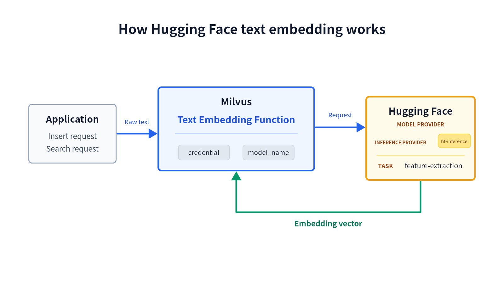

# Hugging Face

Using a Hugging Face embedding model normally requires your application to manage credentials, call the model separately, and generate embeddings consistently for inserted data and search queries. With a Text Embedding Function, Milvus calls hosted [Hugging Face Inference Providers](https://huggingface.co/docs/inference-providers/index) to convert raw text into vectors during insert and search.

This integration uses the hosted Hugging Face router. To connect Milvus to a separately deployed Text Embeddings Inference (TEI) service, see [Hugging Face TEI](hugging-face-tei.md).

## Limits

- The Function output field must use the `FLOAT_VECTOR` data type. Hugging Face embedding in Milvus does not support `INT8_VECTOR`, `BINARY_VECTOR`, `FLOAT16_VECTOR`, or `BFLOAT16_VECTOR` output fields.
- The Function output field dimension must match the selected model's output dimension.

## How it works



The workflow has three stages:

1. **Send raw text.** Your application provides raw text in an insert or search request.
1. **Generate an embedding.** The Text Embedding Function sends the text through `hf-inference` to the Hugging Face `feature-extraction` pipeline. The Function uses `model_name` to select the model and can pass supported inference options such as normalization and truncation.
1. **Use the embedding.** Hugging Face returns one floating-point embedding per input text. During insert, Milvus stores the vector in the Function output field. During search, Milvus uses the vector as the query vector.

The same Function configuration handles insert and search, keeping the model and inference parameters consistent across both operations.

## Before you start

Before using hosted Hugging Face text embedding, ensure that you have:

- Milvus 2.6.20 or later in the 2.6 release line.
- PyMilvus 2.6.16 or later.
- A Hugging Face User Access Token that can call Inference Providers.
- A model currently served by `hf-inference` for the [`feature-extraction`](https://huggingface.co/docs/inference-providers/en/tasks/feature-extraction) task.

<div class="alert note">

Milvus does not control whether a Hugging Face model remains available through `hf-inference`, or whether the model meets your stability, latency, and output-quality requirements. Verify the model on Hugging Face and evaluate it for your workload before using it in production.

</div>

The examples use [`sentence-transformers/all-MiniLM-L6-v2`](https://huggingface.co/sentence-transformers/all-MiniLM-L6-v2), which produces 384-dimensional embeddings. The model is used only to demonstrate the configuration and is not a Milvus recommendation or certification.

## Configure credentials

Milvus requires a Hugging Face User Access Token to call the hosted router. You can configure the token in `milvus.yaml` or through an environment variable.

Credential precedence is:

```text
Function credential label -> provider credential label in milvus.yaml -> environment variable
```

### Option 1: Configuration file

Define the token under the top-level `credential` section of `milvus.yaml`, then point the Hugging Face embedding provider to that credential label:

```yaml
# milvus.yaml
credential:
  huggingface_apikey:
    apikey: <YOUR_HUGGING_FACE_TOKEN>

function:
  textEmbedding:
    providers:
      huggingface:
        credential: huggingface_apikey
        # url: https://router.huggingface.co
```

You can also set `credential` in the Function parameters. The value must be the label defined in the top-level `credential` section, not the token itself. A Function-level credential label takes precedence over the provider-level label.

### Option 2: Environment variable

If neither the Function nor the provider configuration specifies a credential label, Milvus reads the token from `MILVUS_HUGGINGFACE_API_KEY`.

For Docker Compose, set the variable in the Milvus standalone service:

```yaml
# docker-compose.yaml
standalone:
  environment:
    MILVUS_HUGGINGFACE_API_KEY: <YOUR_HUGGING_FACE_TOKEN>
```

For details on applying Docker Compose settings, see [Configure Milvus with Docker Compose](configure-docker.md).

## Use Hugging Face text embedding

### Step 1: Create a collection with a Text Embedding Function

Create a schema with a primary field, a `VARCHAR` input field, and a `FLOAT_VECTOR` output field. The output dimension must match the selected model.

```python
from pymilvus import DataType, Function, FunctionType, MilvusClient

client = MilvusClient(uri="http://localhost:19530")

collection_name = "hugging_face_embedding_demo"
schema = client.create_schema()

schema.add_field(
    field_name="id",
    datatype=DataType.INT64,
    is_primary=True,
    auto_id=False,
)
schema.add_field(
    field_name="document",
    datatype=DataType.VARCHAR,
    max_length=9000,
)
schema.add_field(
    field_name="dense",
    datatype=DataType.FLOAT_VECTOR,
    # highlight-next-line
    dim=384,
)
```

Define a `TEXTEMBEDDING` Function that writes embeddings from `document` to `dense`:

```python
text_embedding_function = Function(
    name="hugging_face_embedding",
    input_field_names=["document"],
    output_field_names=["dense"],
    function_type=FunctionType.TEXTEMBEDDING,
    # highlight-start
    params={
        "provider": "huggingface",
        "model_name": "sentence-transformers/all-MiniLM-L6-v2",
        "hf_provider": "hf-inference",
        "credential": "huggingface_apikey",
        "normalize": "true",
        "truncate": "true",
        "max_client_batch_size": 128,
    },
    # highlight-end
)

schema.add_function(text_embedding_function)
```

If you use only the provider-level credential or environment variable, omit `credential` from the Function parameters.

Configure an index for the output field, then create the collection:

```python
index_params = client.prepare_index_params()
index_params.add_index(
    field_name="dense",
    index_type="AUTOINDEX",
    metric_type="COSINE",
)

client.create_collection(
    collection_name=collection_name,
    schema=schema,
    index_params=index_params,
)
```

The following table describes the Hugging Face-specific Function parameters:

| Parameter | Required? | Description |
|-|-|-|
| `provider` | Yes | The embedding model provider. Set this value to `huggingface`. |
| `model_name` | Yes | The Hugging Face model ID for a model served through `hf-inference` for the `feature-extraction` task. |
| `hf_provider` | No | The Hugging Face Inference Provider route. The default and only supported value in Milvus 2.6.20 is `hf-inference`. |
| `credential` | No | The label of a credential defined in the top-level `credential` section of `milvus.yaml`. This value is not the token itself. |
| `normalize` | No | Whether Hugging Face should return normalized embeddings. Supported values are `true` and `false`. If omitted, Milvus does not set this option in the request. |
| `prompt_name` | No | The name of a prompt defined in the selected model's Sentence Transformers configuration. |
| `truncate` | No | Whether Hugging Face should truncate an input that exceeds the model's supported length. Supported values are `true` and `false`. |
| `truncation_direction` | No | The direction from which Hugging Face truncates an input. Supported values are `left` and `right`. |
| `max_client_batch_size` | No | The maximum number of input texts sent in one Hugging Face request. The default value is `128`, and the value must be greater than `0`. |

### Step 2: Insert raw text

Insert text without providing vectors. Milvus calls Hugging Face and writes the generated embeddings to `dense`.

```python
client.insert(
    collection_name=collection_name,
    data=[
        {
            "id": 1,
            "document": "Milvus simplifies semantic search through embeddings.",
        },
        {
            "id": 2,
            "document": "Vector embeddings convert text into searchable numeric data.",
        },
        {
            "id": 3,
            "document": "Semantic search helps users find relevant information quickly.",
        },
    ],
)
```

### Step 3: Search with raw text

Search with a text query. Milvus applies the same Function configuration to create the query vector before running vector search.

```python
results = client.search(
    collection_name=collection_name,
    data=["How does Milvus handle semantic search?"],
    anns_field="dense",
    limit=3,
    output_fields=["document"],
    consistency_level="Strong",
)

print(results)
```

The result contains the documents most relevant to the query text, ordered by cosine similarity.

## Troubleshooting

### The model is unavailable for feature extraction

Open the model page on Hugging Face and check the **Inference Providers** section. Confirm that `hf-inference` serves the model for `feature-extraction`. If not, select another model and update the vector field dimension if necessary.

### The returned vector dimension does not match the field

Check the model output dimension and compare it with `dim` on the Function output field. Milvus rejects a response whose vector dimension differs from the `FLOAT_VECTOR` field dimension.

### Milvus reports missing Hugging Face credentials

Confirm that the Function credential label exists in the top-level `credential` section, that the provider-level label is valid, or that `MILVUS_HUGGINGFACE_API_KEY` is present in the Milvus service environment.

## Next steps

- For general Function concepts and insert/search behavior, see [Embedding Function Overview](embedding-function-overview.md).
- To rerank vector-search candidates with hosted Hugging Face sentence-similarity scores, see [Hugging Face Ranker](hugging-face-ranker.md).
