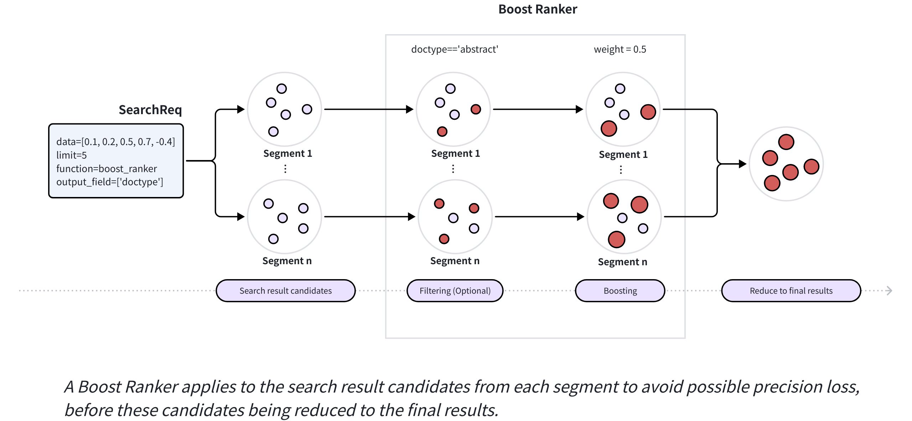

# Boost Ranker

Instead of relying solely on semantic similarity calculated based on vector distances, Boost Rankers allow you to influence search results in a meaningful way. It is ideal for quickly adjusting search results using metadata filtering.

When a search request includes a Boost Ranker function, Milvus uses the optional filtering condition within the function to find matches among search result candidates and boosts the scores of those matches by applying the specified weight, helping promote or demote the rankings of the matched entities in the final result. 

## When to use Boost Ranker

Unlike other rankers that rely on cross-encoder models or fusion algorithms, a Boost Ranker directly injects optional metadata-driven rules into the ranking process, which makes it more suitable in the following scenarios.

<table>
   <tr>
     <th><p>Use Case</p></th>
     <th><p>Examples</p></th>
     <th><p>Why Boost Ranker Works Well</p></th>
   </tr>
   <tr>
     <td><p>Business-driven content prioritization</p></td>
     <td><ul><li><p>Highlight premium products in e-commerce search results</p></li><li><p>Increase visibility of content with high user engagement metrics (such as views, likes, and shares)</p></li><li><p>Elevating recent content in time-sensitive search applications</p></li><li><p>Prioritizing content from verified or trusted sources</p></li><li><p>Boosting results that match exact phrases or high-relevance keywords</p></li></ul></td>
     <td rowspan="2"><p>Without the need to rebuild indexes or modify vector embedding models—operations that can be time-consuming—you can instantly promote or demote specific items in search results by applying optional metadata filters in real time. This mechanism enables flexible, dynamic search rankings that easily adapt to evolving business requirements.</p></td>
   </tr>
   <tr>
     <td><p>Strategic content downranking</p></td>
     <td><ul><li><p>Reducing the prominence of items with low inventory without removing them completely</p></li><li><p>Lowering the rank of content with potentially objectionable terms without censorship</p></li><li><p>Demoting older documentation while keeping it accessible in technical searches</p></li><li><p>Subtly reducing the visibility of competitor products in marketplace searches</p></li><li><p>Decreasing relevance of content with lower quality indications (such as formatting issues, shorter length, etc.)</p></li></ul></td>
   </tr>
</table>

You can also combine multiple Boost Rankers to implement a more dynamic and robust weight-based ranking strategy.

## Mechanism of Boost Ranker

The following diagram illustrates the main workflow of Boost Rankers.



When you insert data, Milvus distributes it across segments. During a search, each segment returns a set of candidates, and Milvus ranks these candidates from all segments to produce the final results. When a search request includes a Boost Ranker, Milvus applies it to the candidate results from each segment to prevent potential precision loss and improve recall. 

Before finalizing the results, Milvus processes these candidates with the Boost Ranker as follows:

1. Applies the optional filtering expression specified in the Boost Ranker to identify the entities that match the expression.

1. Applies the weight specified in the Boost Ranker to boost the scores of the identified entities.

<div class="alert note">

You cannot use Boost Ranker as the ranker in a multi-vector hybrid search. However, you can use it as the ranker in any of its sub-requests (`AnnSearchRequest`).

</div>

## Examples of Boost Ranker

The following example illustrates the use of a Boost Ranker in a single-vector search that requires returning the top five most relevant entities and adding weights to the scores of entities with the abstract doc type.

1. **Collect search result candidates in segments.** 

    The following table assumes Milvus distributes entities into two segments (**0001** and **0002**), with each segment returning five candidates.

    <table>
       <tr>
         <th><p>ID</p></th>
         <th><p>DocType</p></th>
         <th><p>Score</p></th>
         <th><p>Rank</p></th>
         <th><p>segment</p></th>
       </tr>
       <tr>
         <td><p>117</p></td>
         <td><p>abstract</p></td>
         <td><p>0.344</p></td>
         <td><p>1</p></td>
         <td><p>0001</p></td>
       </tr>
       <tr>
         <td><p>89</p></td>
         <td><p>abstract</p></td>
         <td><p>0.456</p></td>
         <td><p>2</p></td>
         <td><p>0001</p></td>
       </tr>
       <tr>
         <td><p>257</p></td>
         <td><p>body</p></td>
         <td><p>0.578</p></td>
         <td><p>3</p></td>
         <td><p>0001</p></td>
       </tr>
       <tr>
         <td><p>358</p></td>
         <td><p>title</p></td>
         <td><p>0.788</p></td>
         <td><p>4</p></td>
         <td><p>0001</p></td>
       </tr>
       <tr>
         <td><p>168</p></td>
         <td><p>body</p></td>
         <td><p>0.899</p></td>
         <td><p>5</p></td>
         <td><p>0001</p></td>
       </tr>
       <tr>
         <td><p>46</p></td>
         <td><p>body</p></td>
         <td><p>0.189</p></td>
         <td><p>1</p></td>
         <td><p>0002</p></td>
       </tr>
       <tr>
         <td><p>48</p></td>
         <td><p>body</p></td>
         <td><p>0265</p></td>
         <td><p>2</p></td>
         <td><p>0002</p></td>
       </tr>
       <tr>
         <td><p>561</p></td>
         <td><p>abstract</p></td>
         <td><p>0.366</p></td>
         <td><p>3</p></td>
         <td><p>0002</p></td>
       </tr>
       <tr>
         <td><p>344</p></td>
         <td><p>abstract</p></td>
         <td><p>0.444</p></td>
         <td><p>4</p></td>
         <td><p>0002</p></td>
       </tr>
       <tr>
         <td><p>276</p></td>
         <td><p>abstract</p></td>
         <td><p>0.845</p></td>
         <td><p>5</p></td>
         <td><p>0002</p></td>
       </tr>
    </table>

1. **Apply the filtering expression specified in the Boost Ranker** (`doctype='abstract'`).

    As denoted by the `DocType` field in the following table, Milvus will mark all entities with their `doctype` set to `abstract` for further processing.

    <table>
       <tr>
         <th><p>ID</p></th>
         <th><p>DocType</p></th>
         <th><p>Score</p></th>
         <th><p>Rank</p></th>
         <th><p>segment</p></th>
       </tr>
       <tr>
         <td><p><strong>117</strong></p></td>
         <td><p><strong>abstract</strong></p></td>
         <td><p><strong>0.344</strong></p></td>
         <td><p><strong>1</strong></p></td>
         <td><p><strong>0001</strong></p></td>
       </tr>
       <tr>
         <td><p><strong>89</strong></p></td>
         <td><p><strong>abstract</strong></p></td>
         <td><p><strong>0.456</strong></p></td>
         <td><p><strong>2</strong></p></td>
         <td><p><strong>0001</strong></p></td>
       </tr>
       <tr>
         <td><p>257</p></td>
         <td><p>body</p></td>
         <td><p>0.578</p></td>
         <td><p>3</p></td>
         <td><p>0001</p></td>
       </tr>
       <tr>
         <td><p>358</p></td>
         <td><p>title</p></td>
         <td><p>0.788</p></td>
         <td><p>4</p></td>
         <td><p>0001</p></td>
       </tr>
       <tr>
         <td><p>168</p></td>
         <td><p>body</p></td>
         <td><p>0.899</p></td>
         <td><p>5</p></td>
         <td><p>0001</p></td>
       </tr>
       <tr>
         <td><p>46</p></td>
         <td><p>body</p></td>
         <td><p>0.189</p></td>
         <td><p>1</p></td>
         <td><p>0002</p></td>
       </tr>
       <tr>
         <td><p>48</p></td>
         <td><p>body</p></td>
         <td><p>0265</p></td>
         <td><p>2</p></td>
         <td><p>0002</p></td>
       </tr>
       <tr>
         <td><p><strong>561</strong></p></td>
         <td><p><strong>abstract</strong></p></td>
         <td><p><strong>0.366</strong></p></td>
         <td><p><strong>3</strong></p></td>
         <td><p><strong>0002</strong></p></td>
       </tr>
       <tr>
         <td><p><strong>344</strong></p></td>
         <td><p><strong>abstract</strong></p></td>
         <td><p><strong>0.444</strong></p></td>
         <td><p><strong>4</strong></p></td>
         <td><p><strong>0002</strong></p></td>
       </tr>
       <tr>
         <td><p><strong>276</strong></p></td>
         <td><p><strong>abstract</strong></p></td>
         <td><p><strong>0.845</strong></p></td>
         <td><p><strong>5</strong></p></td>
         <td><p><strong>0002</strong></p></td>
       </tr>
    </table>

1. **Apply the weight specified in the Boost Ranker** (`weight=0.5`).

    All identified entities in the previous step will be multiplied by the weight specified in the Boost Ranker, resulting in changes in their ranks. 

    <table>
       <tr>
         <th><p>ID</p></th>
         <th><p>DocType</p></th>
         <th><p>Score</p></th>
         <th><p>Weighted Score </p><p>(= score x weight)</p></th>
         <th><p>Rank</p></th>
         <th><p>segment</p></th>
       </tr>
       <tr>
         <td><p><strong>117</strong></p></td>
         <td><p><strong>abstract</strong></p></td>
         <td><p><strong>0.344</strong></p></td>
         <td><p><strong>0.172</strong></p></td>
         <td><p><strong>1</strong></p></td>
         <td><p><strong>0001</strong></p></td>
       </tr>
       <tr>
         <td><p><strong>89</strong></p></td>
         <td><p><strong>abstract</strong></p></td>
         <td><p><strong>0.456</strong></p></td>
         <td><p><strong>0.228</strong></p></td>
         <td><p><strong>2</strong></p></td>
         <td><p><strong>0001</strong></p></td>
       </tr>
       <tr>
         <td><p>257</p></td>
         <td><p>body</p></td>
         <td><p>0.578</p></td>
         <td><p>0.578</p></td>
         <td><p>3</p></td>
         <td><p>0001</p></td>
       </tr>
       <tr>
         <td><p>358</p></td>
         <td><p>title</p></td>
         <td><p>0.788</p></td>
         <td><p>0.788</p></td>
         <td><p>4</p></td>
         <td><p>0001</p></td>
       </tr>
       <tr>
         <td><p>168</p></td>
         <td><p>body</p></td>
         <td><p>0.899</p></td>
         <td><p>0.899</p></td>
         <td><p>5</p></td>
         <td><p>0001</p></td>
       </tr>
       <tr>
         <td><p><strong>561</strong></p></td>
         <td><p><strong>abstract</strong></p></td>
         <td><p><strong>0.366</strong></p></td>
         <td><p><strong>0.183</strong></p></td>
         <td><p><strong>1</strong></p></td>
         <td><p><strong>0002</strong></p></td>
       </tr>
       <tr>
         <td><p>46</p></td>
         <td><p>body</p></td>
         <td><p>0.189</p></td>
         <td><p>0.189</p></td>
         <td><p>2</p></td>
         <td><p>0002</p></td>
       </tr>
       <tr>
         <td><p><strong>344</strong></p></td>
         <td><p><strong>abstract</strong></p></td>
         <td><p><strong>0.444</strong></p></td>
         <td><p><strong>0.222</strong></p></td>
         <td><p><strong>3</strong></p></td>
         <td><p><strong>0002</strong></p></td>
       </tr>
       <tr>
         <td><p>48</p></td>
         <td><p>body</p></td>
         <td><p>0.265</p></td>
         <td><p>0.265</p></td>
         <td><p>4</p></td>
         <td><p>0002</p></td>
       </tr>
       <tr>
         <td><p><strong>276</strong></p></td>
         <td><p><strong>abstract</strong></p></td>
         <td><p><strong>0.845</strong></p></td>
         <td><p><strong>0.423</strong></p></td>
         <td><p><strong>5</strong></p></td>
         <td><p><strong>0002</strong></p></td>
       </tr>
    </table>

    <div class="alert note">
    
    The weight must be a floating-point number that you choose. In cases like the above example, where a smaller score indicates greater relevance, use a weight less than **1**. Otherwise, use a weight greater than **1**.

    </div>

1. **Aggregate the candidates from all segments based on the weighted scores to finalize the results.**

    <table>
       <tr>
         <th><p>ID</p></th>
         <th><p>DocType</p></th>
         <th><p>Score</p></th>
         <th><p>Weighted Score</p></th>
         <th><p>Rank</p></th>
         <th><p>segment</p></th>
       </tr>
       <tr>
         <td><p><strong>117</strong></p></td>
         <td><p><strong>abstract</strong></p></td>
         <td><p><strong>0.344</strong></p></td>
         <td><p><strong>0.172</strong></p></td>
         <td><p><strong>1</strong></p></td>
         <td><p><strong>0001</strong></p></td>
       </tr>
       <tr>
         <td><p><strong>561</strong></p></td>
         <td><p><strong>abstract</strong></p></td>
         <td><p><strong>0.366</strong></p></td>
         <td><p><strong>0.183</strong></p></td>
         <td><p><strong>2</strong></p></td>
         <td><p><strong>0002</strong></p></td>
       </tr>
       <tr>
         <td><p>46</p></td>
         <td><p>body</p></td>
         <td><p>0.189</p></td>
         <td><p>0.189</p></td>
         <td><p>3</p></td>
         <td><p>0002</p></td>
       </tr>
       <tr>
         <td><p><strong>344</strong></p></td>
         <td><p><strong>abstract</strong></p></td>
         <td><p><strong>0.444</strong></p></td>
         <td><p><strong>0.222</strong></p></td>
         <td><p><strong>4</strong></p></td>
         <td><p><strong>0002</strong></p></td>
       </tr>
       <tr>
         <td><p><strong>89</strong></p></td>
         <td><p><strong>abstract</strong></p></td>
         <td><p><strong>0.456</strong></p></td>
         <td><p><strong>0.228</strong></p></td>
         <td><p><strong>5</strong></p></td>
         <td><p><strong>0001</strong></p></td>
       </tr>
    </table>

## Usage of Boost Ranker

In this section, you will see examples of how to use Boost Ranker to influence the results of a single-vector search.

### Create a Boost Ranker

Before passing a Boost Ranker as the reranker of a search request, you should properly define the Boost Ranker as a reranking function as follows:

<div class="multipleCode">
    <a href="#python">Python</a>
    <a href="#java">Java</a>
    <a href="#go">Go</a>
    <a href="#javascript">NodeJS</a>
    <a href="#bash">cURL</a>
</div>

```python
from pymilvus import Function, FunctionType

ranker = Function(
    name="boost",
    input_field_names=[], # Must be an empty list
    function_type=FunctionType.RERANK,
    params={
        "reranker": "boost",
        "filter": "doctype == 'abstract'",
        "random_score": { 
            "seed": 126,
            "field": "id"
        },
        "weight": 0.5
    }
)
```

```java
import io.milvus.v2.service.vector.request.ranker.BoostRanker;

BoostRanker ranker = BoostRanker.builder()
        .name("boost")
        .filter("doctype == \"abstract\"")
        .weight(5.0f)
        .randomScoreField("id")
        .randomScoreSeed(126)
        .build();
```

```go
// go
```

```javascript
import {FunctionType} from '@zilliz/milvus2-sdk-node';

const ranker = {
  name: "boost",
  input_field_names: [],
  type: FunctionType.RERANK,
  params: {
    reranker: "boost",
    filter: "doctype == 'abstract'",
    random_score: {
      seed: 126,
      field: "id",
    },
    weight: 0.5,
  },
};

```

```bash
# restful
```

<table>
   <tr>
     <th><p>Parameter</p></th>
     <th><p>Required?</p></th>
     <th><p>Description</p></th>
     <th><p>Value/Example</p></th>
   </tr>
   <tr>
     <td><p><code>name</code></p></td>
     <td><p>Yes</p></td>
     <td><p>Unique identifier for this Function</p></td>
     <td><p><code>"boost"</code></p></td>
   </tr>
   <tr>
     <td><p><code>input_field_names</code></p></td>
     <td><p>Yes</p></td>
     <td><p>List of vector fields to apply the function to (must be empty for Boost Ranker)</p></td>
     <td><p><code>[]</code></p></td>
   </tr>
   <tr>
     <td><p><code>function_type</code></p></td>
     <td><p>Yes</p></td>
     <td><p>The type of Function to invoke; use <code>RERANK</code> to specify a reranking strategy</p></td>
     <td><p><code>FunctionType.RERANK</code></p></td>
   </tr>
   <tr>
     <td><p><code>params.reranker</code></p></td>
     <td><p>Yes</p></td>
     <td><p>Specifies the type of the reranker.</p><p>Must be set to <code>boost</code> to use Boost Ranker.</p></td>
     <td><p><code>"boost"</code></p></td>
   </tr>
   <tr>
     <td><p><code>params.weight</code></p></td>
     <td><p>Yes</p></td>
     <td><p>Specifies the weight that will be multiplied by the scores of any matching entities in the raw search results.</p><p>The value should be a floating-point number. </p><ul><li><p>To emphasize the importance of matching entities, set it to a value that boosts the scores.</p></li><li><p>To demote matching entities, assign this parameter a value that lowers their scores.</p></li></ul></td>
     <td><p><code>1</code></p></td>
   </tr>
   <tr>
     <td><p><code>params.filter</code></p></td>
     <td><p>No</p></td>
     <td><p>Specifies the filter expression that will be used to match entities among search result entities. It can be any valid basic filter expression mentioned in <a href="boolean.md">Filtering Explained</a>.</p><p><strong>Note</strong>: Only use basic operators, such as <code>==</code>, <code>&gt;</code>, or <code>&lt;</code>. Using advanced operators, such as <code>text_match</code> or <code>phrase_match</code>, will degrade search performance.</p></td>
     <td><p><code>"doctype == 'abstract'"</code></p></td>
   </tr>
   <tr>
     <td><p><code>params.random_score</code></p></td>
     <td><p>No</p></td>
     <td><p>Specifies the random function that generates a value between <code>0</code> and <code>1</code> randomly. It has the following two optional arguments:</p><ul><li><p><code>seed</code> (number) Specifies an initial value used to start a pseudorandom number generator (PRNG).</p></li><li><p><code>field</code> (string) Specifies the name of a field whose value will be used as a random factor in generating the random number. A field with unique values will suffice.</p><p>You are advised to set both <code>seed</code> and <code>field</code> to ensure consistency across generations by using the same seed and field values.</p></li></ul></td>
     <td><p><code>{"seed": 126, "field": "id"}</code></p></td>
   </tr>
</table>

### Search with a single Boost Ranker

Once the Boost Ranker function is ready, you can reference it in a search request. The following example assumes that you have already created a collection that has the following fields: **id**, **vector**, and **doctype**.

<div class="multipleCode">
    <a href="#python">Python</a>
    <a href="#java">Java</a>
    <a href="#go">Go</a>
    <a href="#javascript">NodeJS</a>
    <a href="#bash">cURL</a>
</div>

```python
from pymilvus import MilvusClient

# Connect to the Milvus server
client = MilvusClient(
    uri="http://localhost:19530",
    token="root:Milvus"
)

# Assume you have a collection set up

# Conduct a similarity search using the created ranker
client.search(
    collection_name="my_collection",
    data=[[-0.619954382375778, 0.4479436794798608, -0.17493894838751745, -0.4248030059917294, -0.8648452746018911]],
    anns_field="vector",
    params={},
    output_field=["doctype"],
    ranker=ranker
)
```

```java
import io.milvus.v2.client.ConnectConfig;
import io.milvus.v2.client.MilvusClientV2;
import io.milvus.v2.service.vector.request.SearchReq;
import io.milvus.v2.service.vector.response.SearchResp;
import io.milvus.v2.service.vector.request.data.FloatVec;

MilvusClientV2 client = new MilvusClientV2(ConnectConfig.builder()
        .uri("http://localhost:19530")
        .token("root:Milvus")
        .build());
        
SearchResp searchReq = client.search(SearchReq.builder()
        .collectionName("my_collection")
        .data(Collections.singletonList(new FloatVec(new float[]{-0.619954f, 0.447943f, -0.174938f, -0.424803f, -0.864845f})))
        .annsField("vector")
        .outputFields(Collections.singletonList("doctype"))
        .functionScore(FunctionScore.builder()
                .addFunction(ranker)
                .build())
        .build());
SearchResp searchResp = client.search(searchReq);
```

```go
// go
```

```javascript
import { MilvusClient } from '@zilliz/milvus2-sdk-node';

// Connect to the Milvus server
const client = new MilvusClient({
  address: 'localhost:19530',
  token: 'root:Milvus'
});

// Assume you have a collection set up

// Conduct a similarity search
const searchResults = await client.search({
  collection_name: 'my_collection',
  data: [-0.619954382375778, 0.4479436794798608, -0.17493894838751745, -0.4248030059917294, -0.8648452746018911],
  anns_field: 'vector',
  output_fields: ['doctype'],
  rerank: ranker,
});

console.log('Search results:', searchResults);
```

```bash
# restful
```

### Search with multiple Boost Rankers

You can combine multiple Boost Rankers in a single search to influence the search results. To do so, create several Boost Rankers, reference them in a **FunctionScore** instance, and use the **FunctionScore** instance as the ranker in the search request.

The following example shows how to modify the scores of all identified entities by applying a weight between **0.8** and **1.2**. 

<div class="multipleCode">
    <a href="#python">Python</a>
    <a href="#java">Java</a>
    <a href="#go">Go</a>
    <a href="#javascript">NodeJS</a>
    <a href="#bash">cURL</a>
</div>

```python
from pymilvus import MilvusClient, Function, FunctionType, FunctionScore

# Create a Boost Ranker with a fixed weight
fix_weight_ranker = Function(
    name="boost",
    input_field_names=[], # Must be an empty list
    function_type=FunctionType.RERANK,
    params={
        "reranker": "boost",
        "weight": 0.8
    }
)

# Create a Boost Ranker with a randomly generated weight between 0 and 0.4
random_weight_ranker = Function(
    name="boost",
    input_field_names=[], # Must be an empty list
    function_type=FunctionType.RERANK,
    params={
        "reranker": "boost",
        "random_score": {
            "seed": 126,
        },
        "weight": 0.4
    }
)

# Create a Function Score
ranker = FunctionScore(
    functions=[
        fix_weight_ranker, 
        random_weight_ranker
    ],
    params={
        "boost_mode": "Multiply",
        "function_mode": "Sum"
    }
)

# Conduct a similarity search using the created Function Score
client.search(
    collection_name="my_collection",
    data=[[-0.619954382375778, 0.4479436794798608, -0.17493894838751745, -0.4248030059917294, -0.8648452746018911]],
    anns_field="vector",
    params={},
    output_field=["doctype"],
    ranker=ranker
)
```

```java
import io.milvus.common.clientenum.FunctionType;
import io.milvus.v2.service.collection.request.CreateCollectionReq;

CreateCollectionReq.Function fixWeightRanker = CreateCollectionReq.Function.builder()
                 .functionType(FunctionType.RERANK)
                 .name("boost")
                 .param("reranker", "boost")
                 .param("weight", "0.8")
                 .build();
                 
CreateCollectionReq.Function randomWeightRanker = CreateCollectionReq.Function.builder()
                 .functionType(FunctionType.RERANK)
                 .name("boost")
                 .param("reranker", "boost")
                 .param("weight", "0.4")
                 .param("random_score", "{\"seed\": 126}")
                 .build();

Map<String, String> params = new HashMap<>();
params.put("boost_mode","Multiply");
params.put("function_mode","Sum");     
FunctionScore ranker = FunctionScore.builder()
                 .addFunction(fixWeightRanker)
                 .addFunction(randomWeightRanker)
                 .params(params)
                 .build()

SearchResp searchReq = client.search(SearchReq.builder()
                 .collectionName("my_collection")
                 .data(Collections.singletonList(new FloatVec(new float[]{-0.619954f, 0.447943f, -0.174938f, -0.424803f, -0.864845f})))
                 .annsField("vector")
                 .outputFields(Collections.singletonList("doctype"))
                 .addFunction(ranker)
                 .build());
SearchResp searchResp = client.search(searchReq);
```

```go
// go
```

```javascript
import {FunctionType} from '@zilliz/milvus2-sdk-node';

const fix_weight_ranker = {
  name: "boost",
  input_field_names: [],
  type: FunctionType.RERANK,
  params: {
    reranker: "boost",
    weight: 0.8,
  },
};

const random_weight_ranker = {
  name: "boost",
  input_field_names: [],
  type: FunctionType.RERANK,
  params: {
    reranker: "boost",
    random_score: {
      seed: 126,
    },
    weight: 0.4,
  },
};

const ranker = {
  functions: [fix_weight_ranker, random_weight_ranker],
  params: {
    boost_mode: "Multiply",
    function_mode: "Sum",
  },
};

await client.search({
  collection_name: "my_collection",
  data: [[-0.619954382375778, 0.4479436794798608, -0.17493894838751745, -0.4248030059917294, -0.8648452746018911]],
  anns_field: "vector",
  params: {},
  output_field: ["doctype"],
  ranker: ranker
});

```

```bash
# restful
```

Specifically, there are two Boost Rankers: one applies a fixed weight to all found entities, while the other assigns a random weight to them. Then, we reference these two rankers in a **FunctionScore**, which also defines how the weights influence the scores of the found entities. 

The following table lists the parameters required to create a **FunctionScore** instance.

<table>
   <tr>
     <th><p>Parameter</p></th>
     <th><p>Required?</p></th>
     <th><p>Description</p></th>
     <th><p>Value/Example</p></th>
   </tr>
   <tr>
     <td><p><code>functions</code></p></td>
     <td><p>Yes</p></td>
     <td><p>Specifies the names of the target rankers in a list.</p></td>
     <td><p><code>["fix_weight_ranker", "random_weight_ranker"]</code></p></td>
   </tr>
   <tr>
     <td><p><code>params.boost_mode</code></p></td>
     <td><p>No</p></td>
     <td><p>Specifies how the specified weights influence the scores of any matching entities.</p><p>Possible values are:</p><ul><li><p><code>Multiply</code></p><p>Indicates that the weighted value is equal to the original score of a matching entity multiplied by the specified weight. </p><p>This is the default value.</p></li><li><p><code>Sum</code></p><p>Indicates that the weighted value is equal to the sum of the original score of a matching entity and the specified weight</p></li></ul></td>
     <td><p><code>"Sum"</code></p></td>
   </tr>
   <tr>
     <td><p><code>params.function_mode</code></p></td>
     <td><p>No</p></td>
     <td><p>Specifies how the weighted values from various Boost Rankers are processed.</p><p>Possible values are:</p><ul><li><p><code>Multiply</code></p><p>Indicates that the final score of a matching entity is equal to the product of the weighted values from all Boost Rankers.</p><p>This is the default value.</p></li><li><p><code>Sum</code></p><p>Indicates that the final score of a matching entity is equal to the sum of the weighted values from all Boost Rankers.</p></li></ul></td>
     <td><p><code>"Sum"</code></p></td>
   </tr>
</table>

