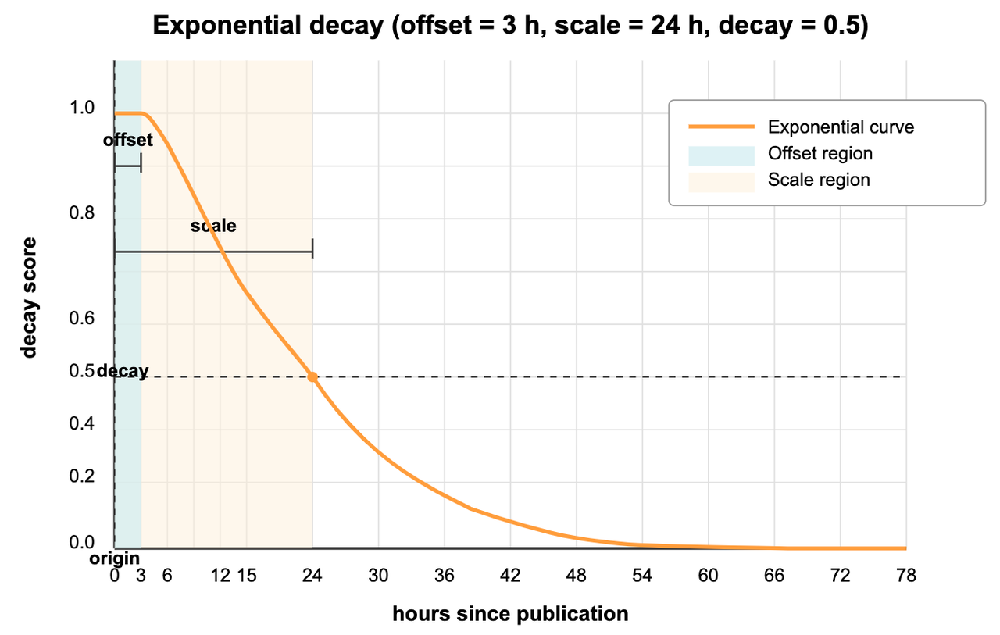

# Exponential Decay

Exponential decay creates a steep initial drop followed by a long tail in your search results. Like a breaking news cycle where relevance diminishes rapidly at first but some stories retain importance over time, exponential decay applies a sharp penalty to items just beyond your ideal range while still keeping distant items discoverable. This approach is ideal when you want to heavily prioritize proximity or recency but don't want to completely eliminate more distant options.

Unlike other decay functions:

- Gaussian decay creates a more gradual, bell-shaped decline

- Linear decay decreases at a constant rate until reaching exactly zero

Exponential decay uniquely "frontloads" the penalty, applying most of the relevance reduction early while maintaining a long tail of minimal but non-zero relevance.

## When to use exponential decay

Exponential decay is particularly effective for:

<table>
   <tr>
     <th><p>Use Case</p></th>
     <th><p>Example</p></th>
     <th><p>Why Exponential Works Well</p></th>
   </tr>
   <tr>
     <td><p>News feeds</p></td>
     <td><p>Breaking news portals</p></td>
     <td><p>Quickly reduces relevance of older news while still showing important stories from days ago</p></td>
   </tr>
   <tr>
     <td><p>Social media timelines</p></td>
     <td><p>Activity feeds, status updates</p></td>
     <td><p>Emphasizes fresh content but allows viral older content to surface</p></td>
   </tr>
   <tr>
     <td><p>Notification systems</p></td>
     <td><p>Alert prioritization</p></td>
     <td><p>Creates urgency for recent alerts while maintaining visibility for important ones</p></td>
   </tr>
   <tr>
     <td><p>Flash sales</p></td>
     <td><p>Limited-time offers</p></td>
     <td><p>Rapidly decreases visibility as deadline approaches</p></td>
   </tr>
</table>

Choose exponential decay when:

- Users expect very recent or nearby items to strongly dominate results

- Older or more distant items should still be discoverable if they're exceptionally relevant

- The relevance drop-off should be front-loaded (steeper at the beginning, more gradual later)

## Sharp drop-off principle

Exponential decay creates a curve that drops quickly at first, then gradually flattens into a long tail that approaches but never reaches zero. This mathematical pattern appears frequently in natural phenomena like radioactive decay, population decline, and information relevance over time.

<div class="alert note">

All time parameters (`origin`, `offset`, `scale`) must use the same unit as the collection data. If your collection stores timestamps in a different unit (milliseconds, microseconds), adjust all parameters accordingly.

</div>



The graph above shows how exponential decay would affect news article rankings in a digital news platform:

- `origin` (current time): The present moment, where relevance is at its maximum (1.0).

- `offset` (3 hours): The "breaking news window"—all stories published within the last 3 hours maintain full relevance scores (1.0), ensuring that very recent news isn't needlessly penalized for minor time differences.

- `decay` (0.5): The score at the scale distance—this parameter controls how dramatically scores diminish with time.

- `scale` (24 hours): The time period at which relevance drops to the decay value—news articles exactly 24 hours old have their relevance scores halved (0.5).

As you can see from the curve, news articles older than 24 hours continue to decrease in relevance but never quite reach zero. Even stories from several days ago retain some minimal relevance, allowing important but older news to still appear in your feed (albeit ranked lower).

This behavior mimics how news relevance typically works—very recent stories strongly dominate, but significant older stories can still break through if they're exceptionally relevant to the user's interests.

## Formula

The mathematical formula for calculating an exponential decay score is:

$$
S(doc) = \exp\left( \lambda \cdot \max\left(0, \left|fieldvalue_{doc} - origin\right| - offset \right) \right)
$$

Where:

$$
\lambda = \frac{\ln(decay)}{scale}
$$

Breaking this down in plain language:

1. Calculate how far the field value is from the origin: $|fieldvalue_{doc} - origin|$.

2. Subtract the offset (if any) but never go below zero: $\max(0, distance - offset)$.

3. Multiply by $\lambda$, which is calculated from your scale and decay parameters.

4. Take the exponent, which gives you a value between 0 and 1: $\exp(\lambda \cdot value)$.

The $\lambda$ calculation converts your scale and decay parameters into the rate parameter for the exponential function. A more negative $\lambda$ creates a steeper initial drop.

## Use exponential decay

Exponential decay can be applied to both standard vector search and hybrid search operations in Milvus. Below are the key code snippets for implementing this feature.

<div class="alert note">

Before using decay functions, you must first create a collection with appropriate numeric fields (like timestamps, distances, etc.) that will be used for decay calculations. For complete working examples including collection setup, schema definition, and data insertion, refer to [Decay Ranker Tutorial](tutorial-implement-a-time-based-ranking-in-milvus.md).

</div>

### Create a decay ranker

After your collection is set up with a numeric field (in this example, `publish_time`), create an exponential decay ranker:

<div class="alert note">

**Time unit consistency**: When using time-based decay, ensure that `origin`, `scale`, and `offset` parameters use the same time unit as your collection data. If your collection stores timestamps in seconds, use seconds for all parameters. If it uses milliseconds, use milliseconds for all parameters.

</div>

<div class="multipleCode">
    <a href="#python">Python</a>
    <a href="#java">Java</a>
    <a href="#javascript">NodeJS</a>
    <a href="#go">Go</a>
    <a href="#bash">cURL</a>
</div>

```python
from pymilvus import Function, FunctionType
import datetime

# Create an exponential decay ranker for news recency
# Note: All time parameters must use the same unit as your collection data
ranker = Function(
    name="news_recency",                  # Function identifier
    input_field_names=["publish_time"],   # Numeric field to use
    function_type=FunctionType.RERANK,    # Function type. Must be RERANK
    params={
        "reranker": "decay",              # Specify decay reranker
        "function": "exp",                # Choose exponential decay
        "origin": int(datetime.datetime.now().timestamp()),  # Current time (seconds, matching collection data)
        "offset": 3 * 60 * 60,            # 3 hour breaking news window (seconds)
        "decay": 0.5,                     # Half score at scale distance
        "scale": 24 * 60 * 60             # 24 hours (in seconds, matching collection data)
    }
)
```

```java
import io.milvus.v2.service.vector.request.ranker.DecayRanker;

DecayRanker ranker = DecayRanker.builder()
        .name("news_recency")
        .inputFieldNames(Collections.singletonList("publish_time"))
        .function("exp")
        .origin(System.currentTimeMillis())
        .offset(3 * 60 * 60)
        .decay(0.5)
        .scale(24 * 60 * 60)
        .build();

```

```javascript

import { FunctionType } from "@zilliz/milvus2-sdk-node";

const ranker = {
  name: "news_recency",
  input_field_names: ["publish_time"],
  type: FunctionType.RERANK,
  params: {
    reranker: "decay",
    function: "exp",
    origin: new Date(2025, 1, 15).getTime(),
    offset: 3 * 60 * 60,
    decay: 0.5,
    scale: 24 * 60 * 60,
  },
};

```

```go
// go
```

```bash
# restful
```

### Apply to standard vector search

After defining your decay ranker, you can apply it during search operations by passing it to the `ranker` parameter:

<div class="multipleCode">
    <a href="#python">Python</a>
    <a href="#java">Java</a>
    <a href="#javascript">NodeJS</a>
    <a href="#go">Go</a>
    <a href="#bash">cURL</a>
</div>

```python
# Apply decay ranker to vector search
result = milvus_client.search(
    collection_name,
    data=[your_query_vector],             # Replace with your query vector
    anns_field="dense",                   # Vector field to search
    limit=10,                             # Number of results
    output_fields=["title", "publish_time"], # Fields to return
    #  highlight-next-line
    ranker=ranker,                        # Apply the decay ranker
    consistency_level="Strong"
)
```

```java
import io.milvus.v2.common.ConsistencyLevel;
import io.milvus.v2.service.vector.request.SearchReq;
import io.milvus.v2.service.vector.response.SearchResp;
import io.milvus.v2.service.vector.request.data.EmbeddedText;

SearchReq searchReq = SearchReq.builder()
        .collectionName(COLLECTION_NAME)
        .data(Collections.singletonList(new EmbeddedText("market analysis")))
        .annsField("vector_field")
        .limit(10)
        .outputFields(Arrays.asList("title", "publish_time"))
        .functionScore(FunctionScore.builder()
                .addFunction(ranker)
                .build())
        .consistencyLevel(ConsistencyLevel.STRONG)
        .build();
SearchResp searchResp = client.search(searchReq);
```

```javascript
import { FunctionType MilvusClient } from "@zilliz/milvus2-sdk-node";

const milvusClient = new MilvusClient("http://localhost:19530");

const result = await milvusClient.search({
  collection_name: "collection_name",
  data: [your_query_vector], // Replace with your query vector
  anns_field: "dense",
  limit: 10,
  output_fields: ["title", "publish_time"],
  rerank: ranker,
  consistency_level: "Strong",
});

```

```go
// go
```

```bash
# restful
```

### Apply to hybrid search

Decay rankers can also be applied to hybrid search operations that combine multiple vector fields:

<div class="multipleCode">
    <a href="#python">Python</a>
    <a href="#java">Java</a>
    <a href="#javascript">NodeJS</a>
    <a href="#go">Go</a>
    <a href="#bash">cURL</a>
</div>

```python
from pymilvus import AnnSearchRequest

# Define dense vector search request
dense = AnnSearchRequest(
    data=[your_query_vector_1], # Replace with your query vector
    anns_field="dense",
    param={},
    limit=10
)

# Define sparse vector search request
sparse = AnnSearchRequest(
    data=[your_query_vector_2], # Replace with your query vector
    anns_field="sparse_vector",
    param={},
    limit=10
)

# Apply decay ranker to hybrid search
hybrid_results = milvus_client.hybrid_search(
    collection_name,
    [dense, sparse],                      # Multiple search requests
    #  highlight-next-line
    ranker=ranker,                        # Same decay ranker
    limit=10,
    output_fields=["title", "publish_time"]
)
```

```java
import io.milvus.v2.service.vector.request.AnnSearchReq;
import io.milvus.v2.service.vector.request.HybridSearchReq;
import io.milvus.v2.service.vector.request.data.EmbeddedText;
import io.milvus.v2.service.vector.request.data.FloatVec;
        
List<AnnSearchReq> searchRequests = new ArrayList<>();
searchRequests.add(AnnSearchReq.builder()
        .vectorFieldName("dense_vector")
        .vectors(Collections.singletonList(new FloatVec(embedding)))
        .limit(10)
        .build());
searchRequests.add(AnnSearchReq.builder()
        .vectorFieldName("sparse_vector")
        .vectors(Collections.singletonList(new EmbeddedText("market analysis")))
        .limit(10)
        .build());

HybridSearchReq hybridSearchReq = HybridSearchReq.builder()
                .collectionName(COLLECTION_NAME)
                .searchRequests(searchRequests)
                .ranker(ranker)
                .limit(10)
                .outputFields(Arrays.asList("title", "publish_time"))
                .build();
SearchResp searchResp = client.hybridSearch(hybridSearchReq);
```

```javascript
const dense = {
    data: [your_query_vector_1], // Replace with your query vector
    anns_field: "dense",
    limit: 10,
    param: {}
};

const sparse = {
    data: [your_query_vector_2], // Replace with your query vector
    anns_field: "sparse_vector",
    limit: 10,
    params: {}
};

const hybrid = await milvusClient.search({
    collection_name: "collection_name",
    data: [dense, sparse],
    rerank: ranker,
    limit: 10,
    output_fields: ["title", "publish_time"],
    consistency_level: "Strong",
});
```

```go
// go
```

```bash
# restful
```

For more information on hybrid search operations, refer to [Multi-Vector Hybrid Search](multi-vector-search.md).