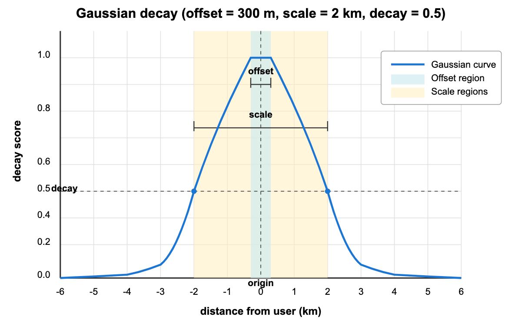

# Gaussian Decay

Gaussian decay, also known as normal decay, creates the most natural-feeling adjustment to your search results. Like human vision that gradually blurs with distance, Gaussian decay creates a smooth, bell-shaped curve that gently reduces relevance as items move away from your ideal point. This approach is ideal when you want a balanced decay that doesn't harshly penalize items just outside your preferred range but still significantly reduces the relevance of distant items.

Unlike other decay rankers:

- Exponential decay drops sharply at first, creating a stronger initial penalty

- Linear decay decreases at a constant rate until reaching zero, creating a clear cutoff

Gaussian decay provides a more balanced, intuitive approach that feels natural to users.

## When to use Gaussian decay

Gaussian decay is particularly effective for:

<table>
   <tr>
     <th><p>Use Case</p></th>
     <th><p>Example</p></th>
     <th><p>Why Gaussian Works Well</p></th>
   </tr>
   <tr>
     <td><p>Location-based searches</p></td>
     <td><p>Restaurant finders, store locators</p></td>
     <td><p>Mimics natural human perception of distance relevance</p></td>
   </tr>
   <tr>
     <td><p>Content recommendations</p></td>
     <td><p>Article suggestions based on publication date</p></td>
     <td><p>Gradual decline in relevance as content ages</p></td>
   </tr>
   <tr>
     <td><p>Product listings</p></td>
     <td><p>Items priced near a target</p></td>
     <td><p>Smooth relevance decline as prices deviate from target</p></td>
   </tr>
   <tr>
     <td><p>Expertise matching</p></td>
     <td><p>Finding professionals with relevant experience</p></td>
     <td><p>Balanced assessment of experience relevance</p></td>
   </tr>
</table>

If your application requires a natural feeling of declining relevance without harsh penalties or strict cutoffs, Gaussian decay is likely your best choice.

## Bell curve principle

Gaussian decay creates a smooth, bell-shaped curve that gradually reduces relevance as distance increases from an ideal point. Named after mathematician Carl Friedrich Gauss, this distribution appears frequently in nature and statistics, which explains why it feels so intuitive to human perception.



The graph above shows how Gaussian decay would affect restaurant rankings in a mobile search app:

- `origin` (0 km): Your current location, where relevance is at its maximum (1.0).

- `offset` (±300 m): The "perfect score zone" around you—all restaurants within 300 meters maintain full relevance scores (1.0), ensuring that very nearby options aren't needlessly penalized for tiny distance differences.

- `scale` (±2 km): The distance at which relevance drops to the decay value—restaurants exactly 2 kilometers away have their relevance scores halved (0.5).

- `decay` (0.5): The score at the scale distance—this parameter essentially controls how quickly scores diminish with distance.

As you can see from the curve, restaurants beyond 2 km continue to decrease in relevance but never quite reach zero. Even restaurants 4-5 kilometers away retain some minimal relevance, allowing excellent but distant restaurants to still appear in your results (albeit ranked lower).

This behavior mimics how people naturally think about distance relevance—nearby places are preferred, but we're willing to travel farther for exceptional options.

## Formula

The mathematical formula for calculating a Gaussian decay score is:

$$
S(doc) = \exp\left( -\frac{\left( \max\left(0, \left|fieldvalue_{doc} - origin\right| - offset \right) \right)^2}{2\sigma^2} \right)
$$

Where:

$$
\sigma^2 = -\frac{scale^2}{2 \cdot \ln(decay)}
$$

Breaking this down in plain language:

1. Calculate how far the field value is from the origin: $|fieldvalue_{doc} - origin|$

2. Subtract the offset (if any) but never go below zero: $\max(0, distance - offset)$

3. Square this adjusted distance: $(adjusted\_distance)^2$

4. Divide by $2\sigma^2$, which is calculated from your scale and decay parameters

5. Take the negative exponent, which gives you a value between 0 and 1: $\exp(-value)$

The $\sigma^{2}$ calculation converts your scale and decay parameters into the standard deviation squared for the Gaussian distribution. This is what gives the function its characteristic bell shape.

## Use Gaussian decay

Gaussian decay can be applied to both standard vector search and hybrid search operations in Milvus. Below are the key code snippets for implementing this feature.

<div class="alert note">

Before using decay functions, you must first create a collection with appropriate numeric fields (like timestamps, distances, etc.) that will be used for decay calculations. For complete working examples including collection setup, schema definition, and data insertion, refer to [Tutorial: Implement Time-based Ranking in Milvus](tutorial-implement-a-time-based-ranking-in-milvus.md).

</div>

### Create a decay ranker

After your collection is set up with a numeric field (in this example, `distance` in meters from the user), create a Gaussian decay ranker:

<div class="multipleCode">
    <a href="#python">Python</a>
    <a href="#java">Java</a>
    <a href="#javascript">NodeJS</a>
    <a href="#go">Go</a>
    <a href="#bash">cURL</a>
</div>

```python
from pymilvus import Function, FunctionType

# Create a Gaussian decay ranker for location-based restaurant search
ranker = Function(
    name="restaurant_distance_decay",     # Function identifier
    input_field_names=["distance"],       # Numeric field for distance in meters
    function_type=FunctionType.RERANK,    # Function type. Must be RERANK
    params={
        "reranker": "decay",              # Specify decay reranker
        "function": "gauss",              # Choose Gaussian decay
        "origin": 0,                      # Your current location (0 meters)
        "offset": 300,                    # 300m no-decay zone
        "decay": 0.5,                     # Half score at scale distance
        "scale": 2000                     # 2 km scale (2000 meters)
    }
)
```

```java
import io.milvus.v2.service.vector.request.ranker.DecayRanker;

DecayRanker ranker = DecayRanker.builder()
        .name("restaurant_distance_decay")
        .inputFieldNames(Collections.singletonList("distance"))
        .function("gauss")
        .origin(0)
        .offset(300)
        .decay(0.5)
        .scale(2000)
        .build();
```

```javascript
import { FunctionType } from "@zilliz/milvus2-sdk-node";

const ranker = {
  name: "restaurant_distance_decay",
  input_field_names: ["distance"],
  function_type: FunctionType.RERANK,
  params: {
    reranker: "decay",
    function: "gauss",
    origin: 0,
    offset: 300,
    decay: 0.5,
    scale: 2000,
  },
};

```

```go
// go
```

```bash
# restful
```

### Apply to standard vector search

After defining your decay ranker, you can apply it during search operations by passing it to the `ranker` parameter:

<div class="multipleCode">
    <a href="#python">Python</a>
    <a href="#java">Java</a>
    <a href="#javascript">NodeJS</a>
    <a href="#go">Go</a>
    <a href="#bash">cURL</a>
</div>

```python
# Apply decay ranker to restaurant vector search
result = milvus_client.search(
    collection_name,
    data=[your_query_vector],         # Replace with your query vector
    anns_field="dense",                   # Vector field to search
    limit=10,                             # Number of results
    output_fields=["name", "cuisine", "distance"],  # Fields to return
    #  highlight-next-line
    ranker=ranker,                        # Apply the decay ranker
    consistency_level="Strong"
)
```

```java
import io.milvus.v2.common.ConsistencyLevel;
import io.milvus.v2.service.vector.request.SearchReq;
import io.milvus.v2.service.vector.response.SearchResp;
import io.milvus.v2.service.vector.request.data.EmbeddedText;

SearchReq searchReq = SearchReq.builder()
        .collectionName(COLLECTION_NAME)
        .data(Collections.singletonList(new EmbeddedText("italian restaurants")))
        .annsField("vector_field")
        .limit(10)
        .outputFields(Arrays.asList("name", "cuisine", "distance"))
        .functionScore(FunctionScore.builder()
                .addFunction(ranker)
                .build())
        .consistencyLevel(ConsistencyLevel.STRONG)
        .build();
SearchResp searchResp = client.search(searchReq);
```

```javascript
const result = await milvusClient.search({
  collection_name: "collection_name",
  data: [your_query_vector], // Replace with your query vector
  anns_field: "dense",
  limit: 10,
  output_fields: ["name", "cuisine", "distance"],
  rerank: ranker,
  consistency_level: "Strong",
});
```

```go
// go
```

```bash
# restful
```

### Apply to hybrid search

Decay rankers can also be applied to hybrid search operations that combine multiple vector fields:

<div class="multipleCode">
    <a href="#python">Python</a>
    <a href="#java">Java</a>
    <a href="#javascript">NodeJS</a>
    <a href="#go">Go</a>
    <a href="#bash">cURL</a>
</div>

```python
from pymilvus import AnnSearchRequest

# Define dense vector search request
dense = AnnSearchRequest(
    data=[your_query_vector_1], # Replace with your query vector
    anns_field="dense",
    param={},
    limit=10
)

# Define sparse vector search request
sparse = AnnSearchRequest(
    data=[your_query_vector_2], # Replace with your query vector
    anns_field="sparse_vector",
    param={},
    limit=10
)

# Apply decay ranker to restaurant hybrid search
hybrid_results = milvus_client.hybrid_search(
    collection_name,
    [dense, sparse],                      # Multiple search requests
    #  highlight-next-line
    ranker=ranker,                        # Same decay ranker
    limit=10,
    output_fields=["name", "cuisine", "distance"]
)
```

```java
import io.milvus.v2.service.vector.request.AnnSearchReq;
import io.milvus.v2.service.vector.request.HybridSearchReq;
import io.milvus.v2.service.vector.request.data.EmbeddedText;
import io.milvus.v2.service.vector.request.data.FloatVec;
        
List<AnnSearchReq> searchRequests = new ArrayList<>();
searchRequests.add(AnnSearchReq.builder()
        .vectorFieldName("dense_vector")
        .vectors(Collections.singletonList(new FloatVec(embedding)))
        .limit(10)
        .build());
searchRequests.add(AnnSearchReq.builder()
        .vectorFieldName("sparse_vector")
        .vectors(Collections.singletonList(new EmbeddedText("italian restaurants")))
        .limit(10)
        .build());

HybridSearchReq hybridSearchReq = HybridSearchReq.builder()
                .collectionName(COLLECTION_NAME)
                .searchRequests(searchRequests)
                .ranker(ranker)
                .limit(10)
                .outputFields(Arrays.asList("name", "cuisine", "distance"))
                .build();
SearchResp searchResp = client.hybridSearch(hybridSearchReq);
```

```javascript
const denseRequest = {
  data: [your_query_vector_1], // Replace with your query vector
  anns_field: "dense",
  param: {},
  limit: 10,
};

const sparseRequest = {
  data: [your_query_vector_2], // Replace with your query vector
  anns_field: "sparse_vector",
  param: {},
  limit: 10,
};

const hybridResults = await milvusClient.search({
  collection_name: "collection_name",
  data: [denseRequest, sparseRequest],
  rerank: ranker,
  limit: 10,
  output_fields: ["name", "cuisine", "distance"],
});

```

```go
// go
```

```bash
# restful
```

For more information on hybrid search operations, refer to [Multi-Vector Hybrid Search](multi-vector-search.md).