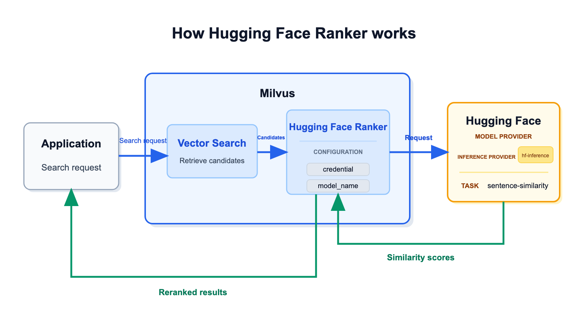
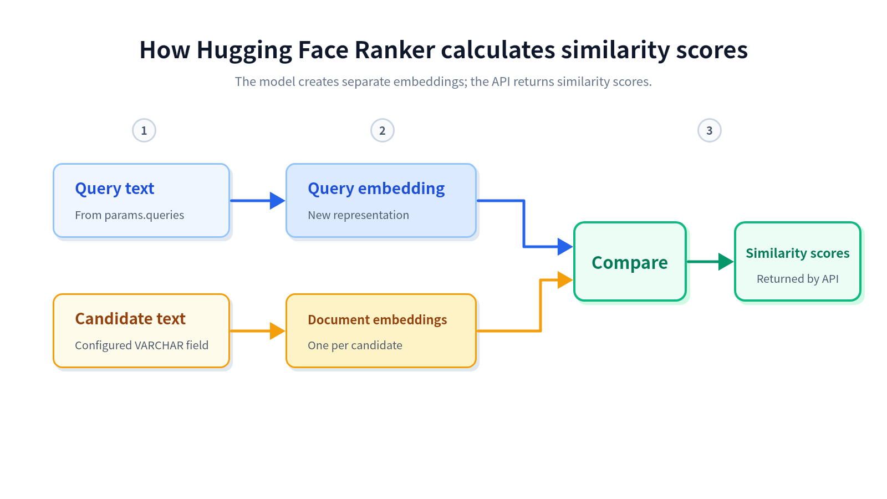

# Hugging Face Ranker

Vector search orders results by vector distance, but the initial order may not reflect how well each candidate's text answers the query. Hugging Face Ranker sends query and candidate text to hosted [Hugging Face Inference Providers](https://huggingface.co/docs/inference-providers/index) and uses `sentence-similarity` scores to reorder the candidates returned by Milvus.

This integration uses the hosted Hugging Face router. To rerank with a separately deployed Text Embeddings Inference (TEI) service, see [TEI Ranker](tei-ranker.md).

## Limits

- The Function must reference exactly one non-nullable `VARCHAR` field in `input_field_names`.
- The number of strings in `queries` must equal the number of search queries (`nq`).

## How it works



Hugging Face Ranker runs after the initial vector search:

1. **Retrieve candidate entities.** Milvus searches the configured vector field and collects candidate entities.
1. **Prepare text for reranking.** The Function reads query text from `params.queries` and candidate text from the `VARCHAR` field specified in `input_field_names`.
1. **Request similarity scores.** Milvus sends the query as `source_sentence` and the candidate texts as `sentences` through `hf-inference` to the Hugging Face `sentence-similarity` pipeline.
1. **Rerank the candidates.** Hugging Face returns one score per candidate. Milvus orders candidates from highest to lowest score and returns the reranked results.

**How similarity scores are calculated**



The Hugging Face model calculates the scores in three stages:

1. **Prepare the text inputs.** The Ranker reads the query text from `params.queries` and candidate text from the configured `VARCHAR` field.
1. **Create separate model representations.** Milvus sends the query as `source_sentence` and candidate texts as `sentences`. The model internally encodes the query and each candidate separately.
1. **Compare and return scores.** The model compares the query representation with each candidate representation and returns one similarity score per candidate.

The embeddings or representations used by the Hugging Face model are intermediate model processing. Hugging Face returns scores, not vectors. Initial vector retrieval and model reranking therefore use separate representations and may use different models.

## Before you start

Before using Hugging Face Ranker, ensure that you have:

- Milvus 2.6.20 or later in the 2.6 release line.
- PyMilvus 2.6.16 or later.
- A Hugging Face User Access Token that can call Inference Providers.
- A model currently served by `hf-inference` for the [`sentence-similarity`](https://huggingface.co/tasks/sentence-similarity) task.
- A collection that stores candidate text in a non-nullable `VARCHAR` field.

<div class="alert note">

Milvus does not control whether a Hugging Face model remains available through `hf-inference`, or whether the model meets your stability, latency, and output-quality requirements. Verify the model on Hugging Face and evaluate it for your workload before using it in production.

</div>

The examples use [`sentence-transformers/all-MiniLM-L6-v2`](https://huggingface.co/sentence-transformers/all-MiniLM-L6-v2) only to demonstrate the configuration. The model is not a Milvus recommendation or certification.

## Configure credentials

You can configure the Hugging Face User Access Token in `milvus.yaml` or through an environment variable.

Credential precedence is:

```text
Function credential label -> provider credential label in milvus.yaml -> environment variable
```

### Option 1: Configuration file

Define the token under the top-level `credential` section, then point the Hugging Face ranker provider to the credential label:

```yaml
# milvus.yaml
credential:
  huggingface_apikey:
    apikey: <YOUR_HUGGING_FACE_TOKEN>

function:
  rerank:
    model:
      providers:
        huggingface:
          credential: huggingface_apikey
          # url: https://router.huggingface.co
```

A Function-level `credential` parameter can override the provider-level label. Its value must be a credential label defined in `milvus.yaml`, not the token itself.

### Option 2: Environment variable

If neither the Function nor the provider configuration specifies a credential label, set `MILVUS_HUGGINGFACE_API_KEY` in the Milvus service environment:

```yaml
# docker-compose.yaml
standalone:
  environment:
    MILVUS_HUGGINGFACE_API_KEY: <YOUR_HUGGING_FACE_TOKEN>
```

## Use Hugging Face Ranker

Hugging Face Ranker is defined and applied at search time. You can change or omit the ranker for each search without changing the collection schema.

### Step 1: Prepare a collection

The following example creates a collection with a text field for reranking and a vector field for initial retrieval:

```python
from pymilvus import DataType, Function, FunctionType, MilvusClient

client = MilvusClient(uri="http://localhost:19530")

collection_name = "hugging_face_rerank_demo"
schema = client.create_schema()
schema.add_field("id", DataType.INT64, is_primary=True, auto_id=False)
schema.add_field("document", DataType.VARCHAR, max_length=1000)
schema.add_field("dense", DataType.FLOAT_VECTOR, dim=4)

index_params = client.prepare_index_params()
index_params.add_index(
    field_name="dense",
    index_type="AUTOINDEX",
    metric_type="COSINE",
)

client.create_collection(
    collection_name=collection_name,
    schema=schema,
    index_params=index_params,
)

client.insert(
    collection_name=collection_name,
    data=[
        {
            "id": 1,
            "document": "Recent renewable energy developments include improved solar efficiency.",
            "dense": [0.10, 0.20, 0.30, 0.40],
        },
        {
            "id": 2,
            "document": "Climate policy and carbon markets have evolved rapidly in recent years.",
            "dense": [0.11, 0.19, 0.28, 0.39],
        },
        {
            "id": 3,
            "document": "New battery technology helps stabilize wind and solar power generation.",
            "dense": [0.90, 0.10, 0.05, 0.02],
        },
        {
            "id": 4,
            "document": "Vector databases support similarity search for machine learning applications.",
            "dense": [0.01, 0.02, 0.03, 0.04],
        },
    ],
)
```

### Step 2: Define the rerank Function

Define a `RERANK` Function that reads candidate text from `document` and uses the query text in `queries`:

```python
hugging_face_ranker = Function(
    name="hugging_face_semantic_ranker",
    input_field_names=["document"],
    function_type=FunctionType.RERANK,
    # highlight-start
    params={
        "reranker": "model",
        "provider": "huggingface",
        "model_name": "sentence-transformers/all-MiniLM-L6-v2",
        "hf_provider": "hf-inference",
        "queries": ["renewable energy developments"],
        "credential": "huggingface_apikey",
        "max_client_batch_size": 32,
    },
    # highlight-end
)
```

If you use only the provider-level credential or environment variable, omit `credential` from the Function parameters.

The following table describes the Hugging Face Ranker parameters:

| Parameter | Required? | Description |
|-|-|-|
| `reranker` | Yes | The reranking implementation. Set this value to `model`. |
| `provider` | Yes | The model provider. Set this value to `huggingface`. |
| `model_name` | Yes | The Hugging Face model ID for a model served through `hf-inference` for the `sentence-similarity` task. |
| `queries` | Yes | Query strings used for reranking. Provide exactly one string per search query, even when initial retrieval uses query vectors. |
| `hf_provider` | No | The Hugging Face Inference Provider route. The default and only supported value in Milvus 2.6.20 is `hf-inference`. |
| `credential` | No | The label of a credential defined in the top-level `credential` section of `milvus.yaml`. This value is not the token itself. |
| `max_client_batch_size` | No | The maximum number of candidate texts sent in one Hugging Face request. The default value is `32`, and the value must be greater than `0`. |

### Step 3: Search with the ranker

Pass the Function through the `ranker` parameter of `search()`:

```python
query_vector = [0.12, 0.21, 0.29, 0.41]

results = client.search(
    collection_name=collection_name,
    data=[query_vector],
    anns_field="dense",
    limit=3,
    output_fields=["document"],
    # highlight-next-line
    ranker=hugging_face_ranker,
    consistency_level="Strong",
)

print(results)
```

Milvus first retrieves candidates from `dense`, then uses the query text in `queries` and the candidate text in `document` to calculate sentence-similarity scores. The returned candidates are ordered by the Hugging Face scores.

## Troubleshooting

### The model is unavailable for sentence similarity

Open the model page on Hugging Face and check the **Inference Providers** section. Confirm that `hf-inference` serves the model for `sentence-similarity`. If not, select another model that supports the task.

### The number of query strings does not match the search request

The number of strings in `queries` must equal the number of search queries (`nq`). For a search with one query vector, provide exactly one query string.

### Candidate text is missing or nullable

Ensure that `input_field_names` contains exactly one non-nullable `VARCHAR` field and that every candidate entity contains text in that field.

### Milvus reports missing Hugging Face credentials

Confirm that the Function credential label exists in `milvus.yaml`, that the provider-level label is valid, or that `MILVUS_HUGGINGFACE_API_KEY` is present in the Milvus service environment.

## Next steps

- For shared model-ranker behavior and limits, see [Model Ranker Overview](model-ranker-overview.md).
- To generate embeddings through hosted Hugging Face Inference Providers, see [Hugging Face](hugging-face.md).
- To apply the ranker to hybrid search, see [Multi-Vector Hybrid Search](multi-vector-search.md).
