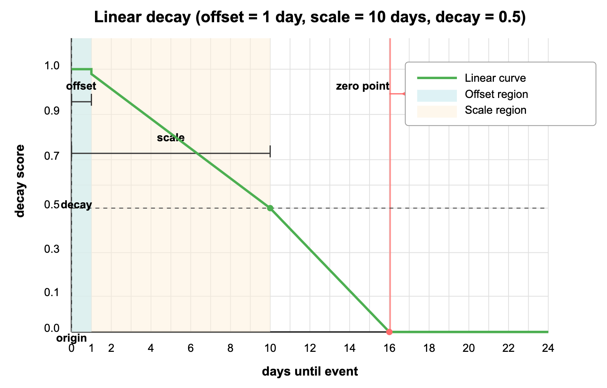

# Linear Decay

Linear decay creates a straight-line decline that terminates at an absolute zero point in your search results. Like an upcoming event countdown where relevance gradually fades until the event has passed, linear decay applies a predictable, steady reduction in relevance as items move away from your ideal point until they completely disappear. This approach is ideal when you want a consistent decay rate with a clear cutoff, ensuring that items beyond a certain boundary are completely excluded from results.

Unlike other decay functions:

- Gaussian decay follows a bell curve that gradually approaches but never reaches zero

- Exponential decay maintains a long tail of minimal relevance that extends indefinitely

Linear decay uniquely creates a definitive endpoint, making it particularly effective for applications with natural boundaries or deadlines.

## When to use linear decay

Linear decay is particularly effective for:

<table>
   <tr>
     <th><p>Use Case</p></th>
     <th><p>Example</p></th>
     <th><p>Why Linear Works Well</p></th>
   </tr>
   <tr>
     <td><p>Event listings</p></td>
     <td><p>Concert ticket platforms</p></td>
     <td><p>Creates a clear cutoff for events too far in the future</p></td>
   </tr>
   <tr>
     <td><p>Limited-time offers</p></td>
     <td><p>Flash sales, promotions</p></td>
     <td><p>Ensures expired or soon-to-expire offers don't appear</p></td>
   </tr>
   <tr>
     <td><p>Delivery radius</p></td>
     <td><p>Food delivery, courier services</p></td>
     <td><p>Enforces hard geographical boundaries</p></td>
   </tr>
   <tr>
     <td><p>Age-restricted content</p></td>
     <td><p>Dating platforms, media services</p></td>
     <td><p>Establishes firm age thresholds</p></td>
   </tr>
</table>

Choose linear decay when:

- Your application has a natural boundary, deadline, or threshold

- Items beyond a certain point should be completely excluded from results

- You need a predictable, consistent rate of decline in relevance

- Users should see a clear demarcation between relevant and irrelevant items

## Steady decline principle

Linear decay creates a straight-line drop that decreases at a constant rate until reaching exactly zero. This pattern appears in many everyday scenarios like countdown timers, inventory depletion, and deadline approaches where relevance has a clear expiration point.



The graph above shows how linear decay would affect event listings on a ticketing platform:

- `origin` (current date): The present moment, where relevance is at its maximum (1.0).

- `offset` (1 day): The "immediate events window"—all events happening within the next day maintain full relevance scores (1.0), ensuring that very imminent events aren't penalized for slight time differences.

- `decay` (0.5): The score at the scale distance—this parameter controls the rate of decline in relevance.

- `scale` (10 days): The time period at which relevance drops to the decay value—events 10 days away have their relevance scores halved (0.5).

As you can see from the straight-line curve, events beyond approximately 16 days away have exactly zero relevance and won't appear in search results at all. This creates a clear boundary that ensures users only see relevant upcoming events within a defined time window.

This behavior mirrors how event planning typically works—imminent events are most relevant, events in the coming weeks have diminishing importance, and events too far in the future (or already past) shouldn't appear at all.

## Formula

The mathematical formula for calculating a linear decay score is:

$$
S(\text{doc}) = \max\left( \frac{s - \max(0, |\text{fieldvalue}_{\text{doc}} - \text{origin}| - \text{offset})}{s}, 0 \right)
$$

Where:

$$
s = \frac{\text{scale}}{(1.0 - \text{decay})}
$$

Breaking this down in plain language:

1. Calculate how far the field value is from the origin: $|\text{fieldvalue}_{\text{doc}} - \text{origin}|$

1. Subtract the offset (if any) but never go below zero: $\max(0, \text{distance} - \text{offset})$

1. Determine the parameter $s$ from your scale and decay values.

1. Subtract the adjusted distance from $s$ and divide by $s$

1. Ensure the result never goes below zero: $\max(\text{result}, 0)$

The $s$ calculation transforms your scale and decay parameters into the point where the score reaches zero. For example, with decay=0.5 and scale=7, the score will reach exactly zero at distance=14 (twice the scale value).

## Use linear decay

Linear decay can be applied to both standard vector search and hybrid search operations in Milvus. Below are the key code snippets for implementing this feature.

<div class="alert note">

Before using decay functions, you must first create a collection with appropriate numeric fields (like timestamps, distances, etc.) that will be used for decay calculations. For complete working examples including collection setup, schema definition, and data insertion, refer to [Decay Ranker Tutorial](tutorial-implement-a-time-based-ranking-in-milvus.md).

</div>

### Create a decay ranker

After your collection is set up with a numeric field (in this example, `event_date` as seconds from now), create a linear decay ranker:

```python
from pymilvus import Function, FunctionType
import time

# Calculate current time
current_time = int(time.time())

# Create a linear decay ranker for event listings
ranker = Function(
    name="event_relevance",               # Function identifier
    input_field_names=["event_date"],     # Numeric field to use
    function_type=FunctionType.RERANK,    # Function type. Must be RERANK
    params={
        "reranker": "decay",              # Specify decay reranker
        "function": "linear",             # Choose linear decay
        "origin": current_time,           # Current time
        "offset": 12 * 60 * 60,           # 12 hour immediate events window
        "decay": 0.5,                     # Half score at scale distance
        "scale": 7 * 24 * 60 * 60         # 7 days (in seconds)
    }
)
```

### Apply to standard vector search

After defining your decay ranker, you can apply it during search operations by passing it to the `ranker` parameter:

```python
# Apply decay ranker to vector search
result = milvus_client.search(
    collection_name,
    data=["music concerts"],              # Query text
    anns_field="dense",                   # Vector field to search
    limit=10,                             # Number of results
    output_fields=["title", "venue", "event_date"], # Fields to return
    #  highlight-next-line
    ranker=ranker,                        # Apply the decay ranker
    consistency_level="Strong"
)
```

### Apply to hybrid search

Decay rankers can also be applied to hybrid search operations that combine multiple vector fields:

```python
from pymilvus import AnnSearchRequest

# Define dense vector search request
dense = AnnSearchRequest(
    data=["music concerts"],
    anns_field="dense",
    param={},
    limit=10
)

# Define sparse vector search request
sparse = AnnSearchRequest(
    data=["music concerts"],
    anns_field="sparse_vector",
    param={},
    limit=10
)

# Apply decay ranker to hybrid search
hybrid_results = milvus_client.hybrid_search(
    collection_name,
    [dense, sparse],                      # Multiple search requests
    ranker=ranker,                        # Same decay ranker
    #  highlight-next-line
    limit=10,
    output_fields=["title", "venue", "event_date"]
)
```

For more information on hybrid search operations, refer to [Multi-Vector Hybrid Search](multi-vector-search.md).