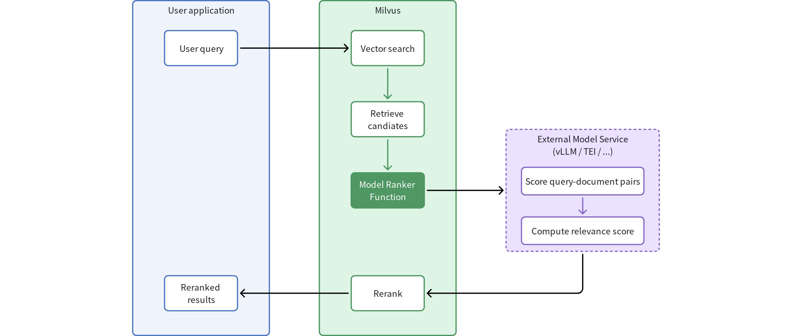

# Model Ranker Overview

Traditional vector search ranks results purely by mathematical similarity—how closely vectors match in high-dimensional space. While efficient, this approach often misses true semantic relevance. Consider searching for **"best practices for database optimization"**: you might receive documents with high vector similarity that mention these terms frequently, but don't actually provide actionable optimization strategies.

Model Ranker transforms Milvus search by integrating advanced language models that understand semantic relationships between queries and documents. Instead of relying solely on vector similarity, it evaluates content meaning and context to deliver more intelligent, relevant results.

## Limits

- Model rankers cannot be used with grouping searches.

- Fields used for model reranking must be text type (`VARCHAR`).

- Each model ranker can use only one `VARCHAR` field at a time for evaluation.

## How it works

Model rankers integrate language model understanding capabilities into the Milvus search process through a well-defined workflow:



1. **Initial query**: Your application sends a query to Milvus

1. **Vector search**: Milvus performs standard vector search to identify candidate documents

1. **Candidate retrieval**: The system identifies the initial set of candidate documents based on vector similarity

1. **Model evaluation**: The Model Ranker Function processes query-document pairs: 

    - Sends the original query and candidate documents to an external model service

    - The language model evaluates semantic relevance between query and each document

    - Each document receives a relevance score based on semantic understanding

1. **Intelligent reranking**: Documents are reordered based on model-generated relevance scores

1. **Enhanced results**: Your application receives results ranked by semantic relevance rather than just vector similarity

## Choose a model provider for your needs

Milvus supports the following model service providers for reranking, each with distinct characteristics:

<table>
   <tr>
     <th><p>Provider</p></th>
     <th><p>Best For</p></th>
     <th><p>Characteristics</p></th>
     <th><p>Example Use Case</p></th>
   </tr>
   <tr>
     <td><p>vLLM</p></td>
     <td><p>Complex applications requiring deep semantic understanding and customization</p></td>
     <td><ul>
<li><p>Supports various large language models</p></li>
<li><p>Flexible deployment options</p></li>
<li><p>Higher computational requirements</p></li>
<li><p>Greater customization potential</p></li>
</ul></td>
     <td><p>Legal research platform deploying domain-specific models that understand legal terminology and case law relationships</p></td>
   </tr>
   <tr>
     <td><p>TEI</p></td>
     <td><p>Quick implementation with efficient resource usage</p></td>
     <td><ul>
<li><p>Lightweight service optimized for text operations</p></li>
<li><p>Easier deployment with lower resource requirements</p></li>
<li><p>Pre-optimized reranking models</p></li>
<li><p>Minimal infrastructure overhead</p></li>
</ul></td>
     <td><p>Content management system needing efficient reranking capabilities with standard requirements</p></td>
   </tr>
</table>

For detailed information about implementation of each model service, refer to the dedicated documentation:

- [vLLM Ranker](vllm-ranker.md)

- [TEI Ranker](tei-ranker.md)

## Implementation

Before implementing Model Ranker, ensure you have:

- A Milvus collection with a `VARCHAR` field containing the text to be reranked

- A running external model service (vLLM or TEI) accessible to your Milvus instance

- Appropriate network connectivity between Milvus and your chosen model service

Model rankers integrate seamlessly with both standard vector search and hybrid search operations. The implementation involves creating a Function object that defines your reranking configuration and passing it to search operations.

### Create a model ranker

To implement model reranking, first define a Function object with the appropriate configuration:

```python
from pymilvus import MilvusClient, Function, FunctionType

# Connect to your Milvus server
client = MilvusClient(
    uri="http://localhost:19530"  # Replace with your Milvus server URI
)

# Create a model ranker function
model_ranker = Function(
    name="semantic_ranker",  # Function identifier
    input_field_names=["document"],  # VARCHAR field to use for reranking
    function_type=FunctionType.RERANK,  # Must be set to RERANK
    params={
        "reranker": "model",  # Specify model reranker. Must be "model"
        "provider": "tei",  # Choose provider: "tei" or "vllm"
        "queries": ["machine learning for time series"],  # Query text
        "endpoint": "http://model-service:8080",  # Model service endpoint
        # "maxBatch": 32  # Optional: batch size for processing
    }
)
```

<table>
   <tr>
     <th><p>Parameter</p></th>
     <th><p>Required?</p></th>
     <th><p>Description</p></th>
     <th><p>Value / Example</p></th>
   </tr>
   <tr>
     <td><p><code>name</code></p></td>
     <td><p>Yes</p></td>
     <td><p>Identifier for your function used when executing searches.</p></td>
     <td><p><code>"semantic_ranker"</code></p></td>
   </tr>
   <tr>
     <td><p><code>input_field_names</code></p></td>
     <td><p>Yes</p></td>
     <td><p>Name of the text field to use for reranking.
 Must be a <code>VARCHAR</code> type field.</p></td>
     <td><p><code>["document"]</code></p></td>
   </tr>
   <tr>
     <td><p><code>function_type</code></p></td>
     <td><p>Yes</p></td>
     <td><p>Specifies the type of function being created.
 Must be set to <code>RERANK</code> for all model rankers.</p></td>
     <td><p><code>FunctionType.RERANK</code></p></td>
   </tr>
   <tr>
     <td><p><code>params</code></p></td>
     <td><p>Yes</p></td>
     <td><p>A dictionary containing configuration for the model-based reranking function. The available parameters (keys) vary depending on the provider (<code>tei</code> or <code>vllm</code>). Refer to <a href="vllm-ranker.md">vLLM Ranker</a> or <a href="tei-ranker.md">TEI Ranker</a> for more details.</p></td>
     <td><p>{…}</p></td>
   </tr>
   <tr>
     <td><p><code>params.reranker</code></p></td>
     <td><p>Yes</p></td>
     <td><p>Must be set to <code>"model"</code> to enable model reranking.</p></td>
     <td><p><code>"model"</code></p></td>
   </tr>
   <tr>
     <td><p><code>params.provider</code></p></td>
     <td><p>Yes</p></td>
     <td><p>The model service provider to use for reranking.</p></td>
     <td><p><code>"tei"</code> or <code>"vllm"</code></p></td>
   </tr>
   <tr>
     <td><p><code>params.queries</code></p></td>
     <td><p>Yes</p></td>
     <td><p>List of query strings used by the reranking model to calculate relevance scores.
 The number of query strings must match exactly the number of queries in your search operation (even when using query vectors instead of text), otherwise an error will be reported.</p></td>
     <td><p><code>["search query"]</code></p></td>
   </tr>
   <tr>
     <td><p><code>params.endpoint</code></p></td>
     <td><p>Yes</p></td>
     <td><p>URL of the model service.</p></td>
     <td><p><code>"http://localhost:8080"</code></p></td>
   </tr>
   <tr>
     <td><p><code>maxBatch</code></p></td>
     <td><p>No</p></td>
     <td><p>Maximum number of documents to process in a single batch. Larger values increase throughput but require more memory.</p></td>
     <td><p><code>32</code> (default)</p></td>
   </tr>
</table>

### Apply to standard vector search

After defining your model ranker, you can apply it during search operations by passing it to the ranker parameter:

```bash
# Use the model ranker in standard vector search
results = client.search(
    collection_name,
    data=["machine learning for time series"], # Number of queries must match that specified in model_ranker.params["queries"] 
    anns_field="vector_field",
    limit=10,
    output_fields=["document"],  # Include the text field in outputs
    #  highlight-next-line
    ranker=model_ranker,  # Apply the model ranker here
    consistency_level="Strong"
)
```

### Apply to hybrid search

Model rankers can also be applied to hybrid search operations that combine multiple vector fields:

```python
from pymilvus import AnnSearchRequest

# Define search requests for different vector fields
dense_request = AnnSearchRequest(
    data=["machine learning for time series"],
    anns_field="dense_vector",
    param={},
    limit=20
)

sparse_request = AnnSearchRequest(
    data=["machine learning for time series"],
    anns_field="sparse_vector",
    param={},
    limit=20
)

# Apply model ranker to hybrid search
hybrid_results = client.hybrid_search(
    collection_name,
    [dense_request, sparse_request],
    #  highlight-next-line
    ranker=model_ranker,  # Same model ranker works with hybrid search
    limit=10,
    output_fields=["document"]
)
```

